---
layout:
  title:
    visible: true
  description:
    visible: false
  tableOfContents:
    visible: true
  outline:
    visible: true
  pagination:
    visible: true
---

# LEGACY

## Enumeration

Host is located at `192.168.X.249`:

```
Nmap scan report for 192.168.200.249 (LEGACY)
Host is up (0.052s latency).
Not shown: 65521 closed tcp ports (reset)
PORT      STATE SERVICE       VERSION
80/tcp    open  http          Microsoft IIS httpd 10.0
| http-methods: 
|_  Potentially risky methods: TRACE
|_http-server-header: Microsoft-IIS/10.0
|_http-title: IIS Windows Server
135/tcp   open  msrpc         Microsoft Windows RPC
139/tcp   open  netbios-ssn   Microsoft Windows netbios-ssn
445/tcp   open  microsoft-ds?
3389/tcp  open  ms-wbt-server Microsoft Terminal Services
| ssl-cert: Subject: commonName=LEGACY
| Not valid before: 2024-04-08T08:51:46
|_Not valid after:  2024-10-08T08:51:46
|_ssl-date: 2024-07-28T19:45:21+00:00; 0s from scanner time.
| rdp-ntlm-info: 
|   Target_Name: LEGACY
|   NetBIOS_Domain_Name: LEGACY
|   NetBIOS_Computer_Name: LEGACY
|   DNS_Domain_Name: LEGACY
|   DNS_Computer_Name: LEGACY
|   Product_Version: 10.0.20348
|_  System_Time: 2024-07-28T19:44:58+00:00
5985/tcp  open  http          Microsoft HTTPAPI httpd 2.0 (SSDP/UPnP)
|_http-server-header: Microsoft-HTTPAPI/2.0
|_http-title: Not Found
8000/tcp  open  http          Apache httpd 2.4.54 ((Win64) OpenSSL/1.1.1p PHP/7.4.30)
| http-title: Welcome to XAMPP
|_Requested resource was http://192.168.200.249:8000/dashboard/
|_http-server-header: Apache/2.4.54 (Win64) OpenSSL/1.1.1p PHP/7.4.30
|_http-open-proxy: Proxy might be redirecting requests
47001/tcp open  http          Microsoft HTTPAPI httpd 2.0 (SSDP/UPnP)
|_http-server-header: Microsoft-HTTPAPI/2.0
|_http-title: Not Found
49664/tcp open  msrpc         Microsoft Windows RPC
49665/tcp open  msrpc         Microsoft Windows RPC
49666/tcp open  msrpc         Microsoft Windows RPC
49667/tcp open  msrpc         Microsoft Windows RPC
49668/tcp open  msrpc         Microsoft Windows RPC
49669/tcp open  msrpc         Microsoft Windows RPC
No exact OS matches for host (If you know what OS is running on it, see https://nmap.org/submit/ ).
TCP/IP fingerprint:
OS:SCAN(V=7.94SVN%E=4%D=7/28%OT=80%CT=1%CU=42896%PV=Y%DS=4%DC=T%G=Y%TM=66A6
OS:9FD3%P=x86_64-pc-linux-gnu)SEQ(SP=106%GCD=1%ISR=10E%TI=I%TS=A)OPS(O1=M55
OS:1NW8ST11%O2=M551NW8ST11%O3=M551NW8NNT11%O4=M551NW8ST11%O5=M551NW8ST11%O6
OS:=M551ST11)WIN(W1=FFFF%W2=FFFF%W3=FFFF%W4=FFFF%W5=FFFF%W6=FFDC)ECN(R=Y%DF
OS:=Y%T=80%W=FFFF%O=M551NW8NNS%CC=Y%Q=)T1(R=Y%DF=Y%T=80%S=O%A=S+%F=AS%RD=0%
OS:Q=)T2(R=N)T3(R=N)T4(R=N)T5(R=Y%DF=Y%T=80%W=0%S=Z%A=S+%F=AR%O=%RD=0%Q=)T6
OS:(R=N)T7(R=N)U1(R=Y%DF=N%T=80%IPL=164%UN=0%RIPL=G%RID=G%RIPCK=G%RUCK=75BF
OS:%RUD=G)IE(R=N)

Network Distance: 4 hops
Service Info: OS: Windows; CPE: cpe:/o:microsoft:windows

Host script results:
| smb2-security-mode: 
|   3:1:1: 
|_    Message signing enabled but not required
| smb2-time: 
|   date: 2024-07-28T19:45:12
|_  start_date: N/A

TRACEROUTE (using port 8888/tcp)
HOP RTT      ADDRESS
-   Hops 1-3 are the same as for 192.168.200.189
4   52.07 ms 192.168.200.249
```

### Anonymous Services

<figure>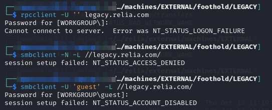<figcaption><p>Anonymous disabled</p></figcaption></figure>

I cannot access the services anonymously.

### Web Server (80)

Just a default IIS landing page.

### Web Server (8000)

This is just a default XAMPP install:

<figure>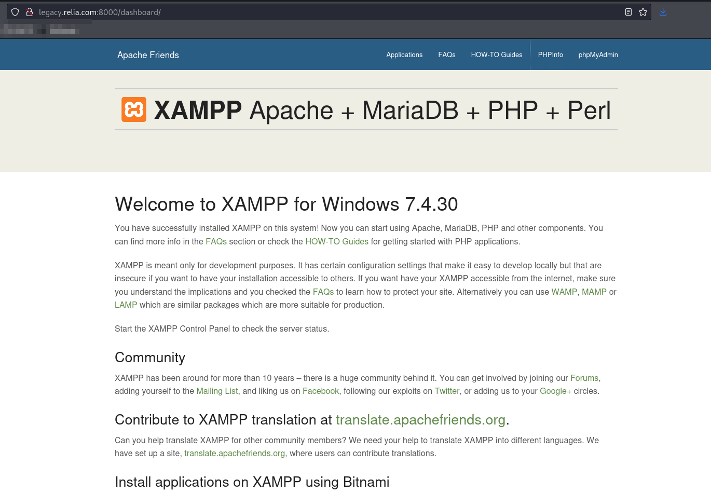<figcaption><p>Landing page on 8000</p></figcaption></figure>

The `PHPInfo` page reveals the install location of `C:/xampp/apache` but not much else. `phpMyAdmin` 403'd.

#### Directory Enumeration

I decide to run feroxbuster to be sure. I just copy the Seclists directory-2.3-medium.txt as dir\_enum.txt and run the command:


```bash
feroxbuster -L 20 -k -C 404 -C 400 -r --thorough -n -w dir_enum.txt -u http://legacy.relia.com:8000 -o p8000_directory.feroxbuster
```


The output is immediately helpful in finding another location:

<figure>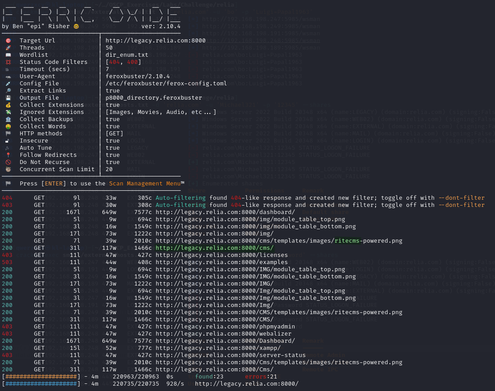<figcaption></figcaption></figure>

It mentions a CMS and hints it might be RiteCMS.

## Foothold

### RiteCMS

At the `/cms` page I find mention of [RiteCMS](https://github.com/handylulu/RiteCMS) which is a CMS based on PHP & SQLite:

<figure>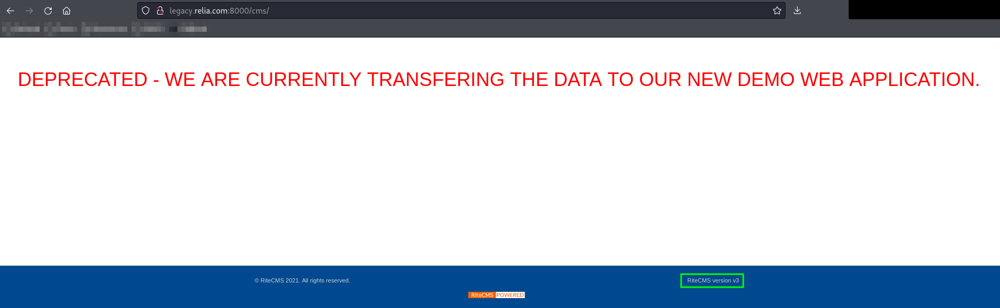<figcaption><p>RiteCMS landing page</p></figcaption></figure>

#### Admin Panel

Looking at the GitHub it seems like the admin panel is just located at `/admin.php`.

I do indeed find it there:

<figure>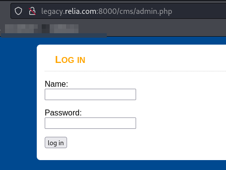<figcaption></figcaption></figure>

The default credentials of `admin:admin` log me in.

#### RCE

I quickly find this exploit on Exploit-DB. I use the Method 2:

<figure>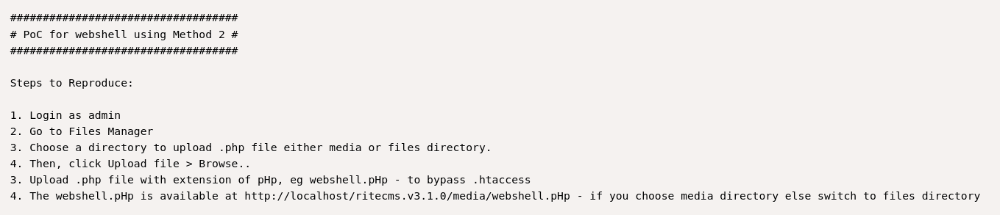<figcaption><p>EDB Description</p></figcaption></figure>

I upload the shell to `/media` as `rs.pHp`:

<figure>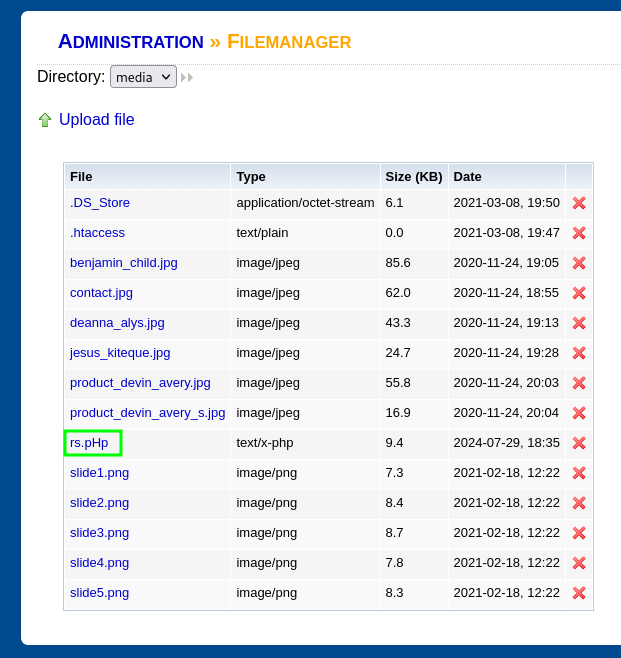<figcaption><p>Uploaded shell</p></figcaption></figure>

* The link cannot just be clicked because RiteCMS expects to be at the web root so it does not add the `/cms` to the link

I navigate to `http://legacy.relia.com:8000/cms/media/rs.pHp` and the shell launches:

<figure>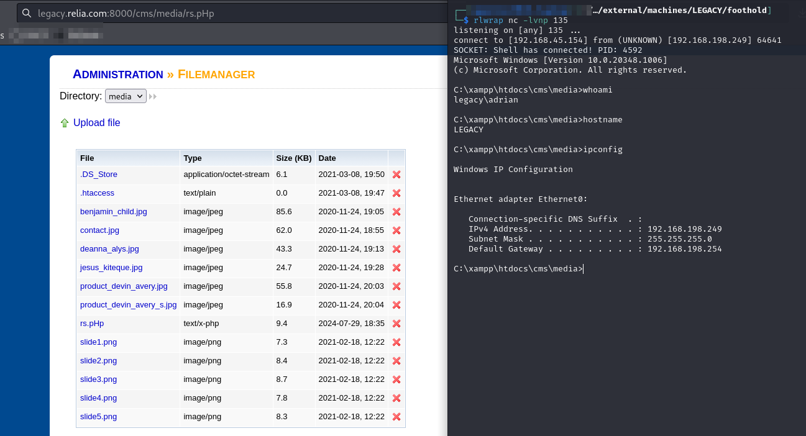<figcaption><p>Shell launched</p></figcaption></figure>

User access achieved as `adrian`.

## Privilege Escalation


<figure>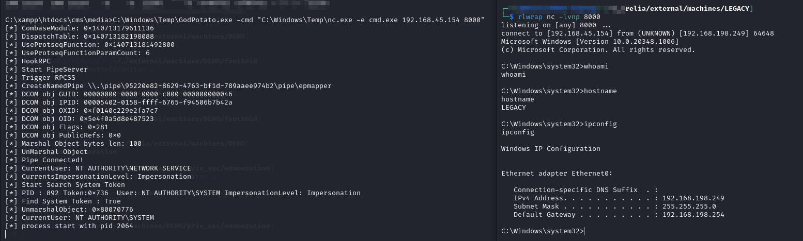<figcaption><p>Elevated shell</p></figcaption></figure>

I realize the whoami command did not work but I can do everything with elevated privileges so I must be `Administrator`.

## Post-Exploit

Mimikatz does not run on this machine unfortunately.

### Git Examination

I start looking around manually. I find mention of git in the `damon` user's home directory:

<figure>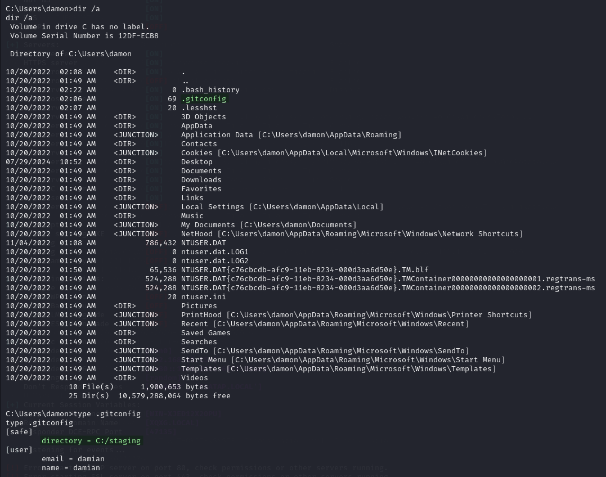<figcaption><p>Damon's git</p></figcaption></figure>

I compress the whole `C:\staging` drive by navigating to it and using the command:

```
tar -cvzf C:\staging.zip *
```

Then I copy `staging.zip` back to my machine, decompress it, and use the [`git` commands](https://www.atlassian.com/git/glossary#commands) below to enumerate it:

```bash
git status
git log
git show
```

I quickly find some potential credentials:

<figure>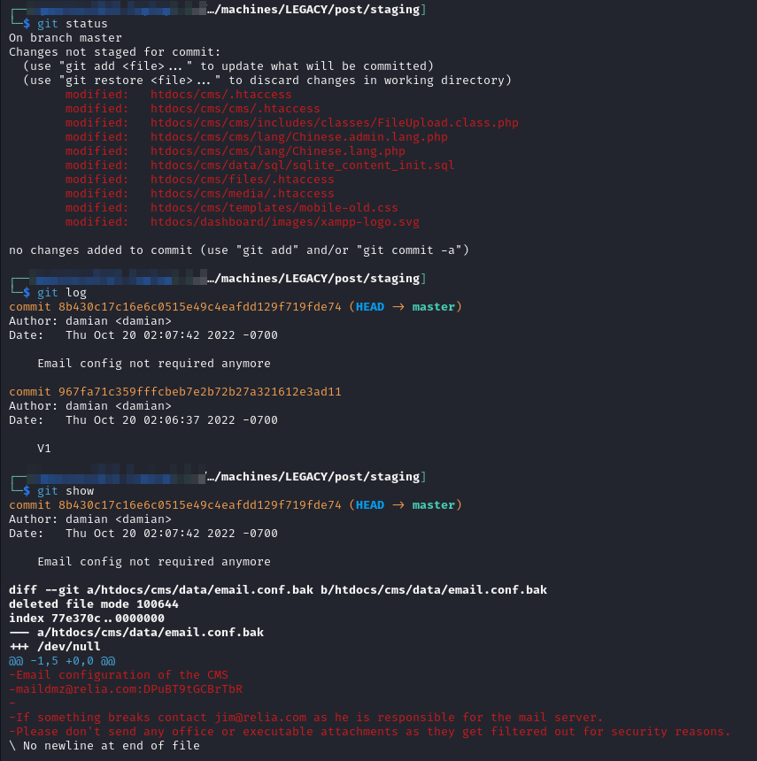<figcaption><p>Git Command Enumeration</p></figcaption></figure>

#### Validating Credentials

I validate `maildmz` with CME:

<figure>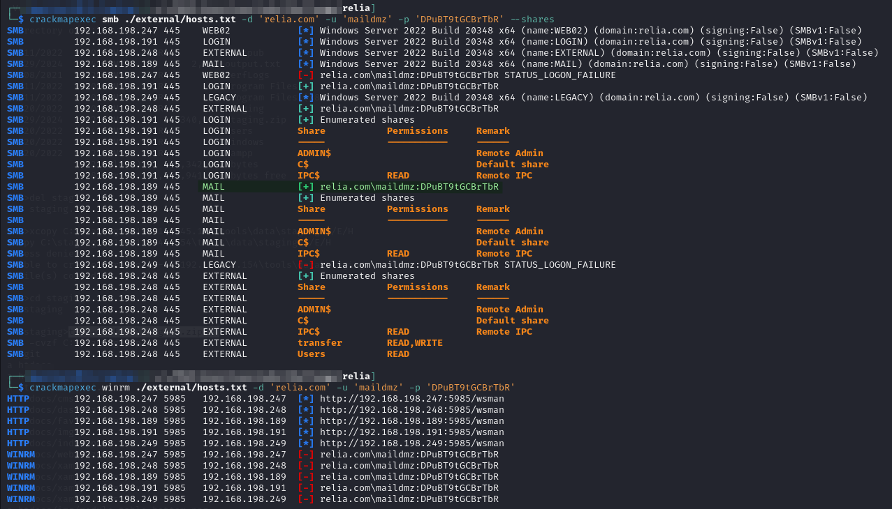<figcaption><p>Validating maildmz</p></figcaption></figure>

The most interesting part is this user has some access to `MAIL`. Unfortunately not WinRM, but perhaps I can finally phish with this user. I add this to my `creds.txt` and continue on my way.
