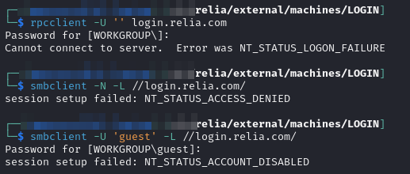
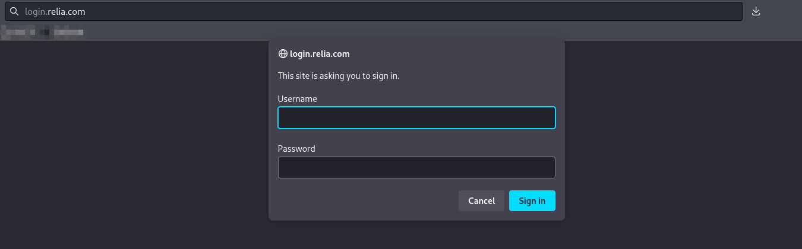
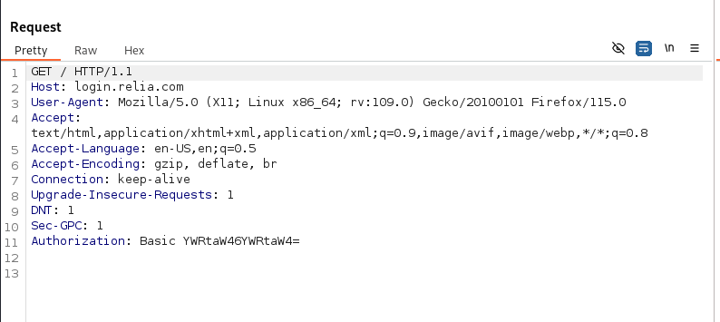

---
layout:
  title:
    visible: true
  description:
    visible: false
  tableOfContents:
    visible: true
  outline:
    visible: true
  pagination:
    visible: true
---

# LOGIN

## Enumeration

Host located at `192.168.X.191`:

```
Nmap scan report for 192.168.200.191
Host is up (0.052s latency).
Not shown: 65495 closed tcp ports (reset)
PORT      STATE    SERVICE       VERSION
80/tcp    open     http          Microsoft IIS httpd 10.0
|_http-title: 401 - Unauthorized: Access is denied due to invalid credentials.
|_http-server-header: Microsoft-IIS/10.0
| http-auth: 
| HTTP/1.1 401 Unauthorized\x0D
|_  Basic realm=192.168.200.191
135/tcp   open     msrpc         Microsoft Windows RPC
139/tcp   open     netbios-ssn   Microsoft Windows netbios-ssn
445/tcp   open     microsoft-ds?
3389/tcp  open     ms-wbt-server Microsoft Terminal Services
| ssl-cert: Subject: commonName=login.relia.com
| Not valid before: 2024-05-15T12:01:56
|_Not valid after:  2024-11-14T12:01:56
| rdp-ntlm-info: 
|   Target_Name: RELIA
|   NetBIOS_Domain_Name: RELIA
|   NetBIOS_Computer_Name: LOGIN
|   DNS_Domain_Name: relia.com
|   DNS_Computer_Name: login.relia.com
|   DNS_Tree_Name: relia.com
|   Product_Version: 10.0.20348
|_  System_Time: 2024-07-28T19:40:30+00:00
|_ssl-date: 2024-07-28T19:40:44+00:00; 0s from scanner time.
4865/tcp  filtered unknown
5718/tcp  filtered dpm
5985/tcp  open     http          Microsoft HTTPAPI httpd 2.0 (SSDP/UPnP)
|_http-server-header: Microsoft-HTTPAPI/2.0
|_http-title: Not Found
9639/tcp  filtered unknown
9740/tcp  filtered unknown
12205/tcp filtered unknown
13599/tcp filtered unknown
14789/tcp filtered unknown
18483/tcp filtered unknown
21729/tcp filtered unknown
23300/tcp filtered unknown
26710/tcp filtered unknown
27566/tcp filtered unknown
29058/tcp filtered unknown
31750/tcp filtered unknown
34194/tcp filtered unknown
35484/tcp filtered unknown
39513/tcp filtered unknown
42833/tcp filtered unknown
47001/tcp open     http          Microsoft HTTPAPI httpd 2.0 (SSDP/UPnP)
|_http-server-header: Microsoft-HTTPAPI/2.0
|_http-title: Not Found
47840/tcp filtered unknown
49664/tcp open     msrpc         Microsoft Windows RPC
49665/tcp open     msrpc         Microsoft Windows RPC
49666/tcp open     msrpc         Microsoft Windows RPC
49667/tcp open     msrpc         Microsoft Windows RPC
49668/tcp open     msrpc         Microsoft Windows RPC
49669/tcp open     msrpc         Microsoft Windows RPC
49670/tcp open     msrpc         Microsoft Windows RPC
49671/tcp open     msrpc         Microsoft Windows RPC
54346/tcp filtered unknown
60382/tcp filtered unknown
60600/tcp filtered unknown
62622/tcp filtered unknown
64840/tcp filtered unknown
65441/tcp filtered unknown
No exact OS matches for host (If you know what OS is running on it, see https://nmap.org/submit/ ).
TCP/IP fingerprint:
OS:SCAN(V=7.94SVN%E=4%D=7/28%OT=80%CT=1%CU=36179%PV=Y%DS=4%DC=T%G=Y%TM=66A6
OS:9EC1%P=x86_64-pc-linux-gnu)SEQ(SP=104%GCD=1%ISR=10B%TI=I%TS=A)OPS(O1=M55
OS:1NW8ST11%O2=M551NW8ST11%O3=M551NW8NNT11%O4=M551NW8ST11%O5=M551NW8ST11%O6
OS:=M551ST11)WIN(W1=FFFF%W2=FFFF%W3=FFFF%W4=FFFF%W5=FFFF%W6=FFDC)ECN(R=Y%DF
OS:=Y%T=80%W=FFFF%O=M551NW8NNS%CC=Y%Q=)T1(R=Y%DF=Y%T=80%S=O%A=S+%F=AS%RD=0%
OS:Q=)T2(R=N)T3(R=N)T4(R=N)T5(R=Y%DF=Y%T=80%W=0%S=Z%A=S+%F=AR%O=%RD=0%Q=)T6
OS:(R=N)T7(R=N)U1(R=Y%DF=N%T=80%IPL=164%UN=0%RIPL=G%RID=G%RIPCK=G%RUCK=8F59
OS:%RUD=G)IE(R=N)
```

### Anonymous Services

I attempt anonymous authentication with RDP and SMB but have no success:

<figure><figcaption><p>Anonymous login failures</p></figcaption></figure>

### HTTP Server

Navigating lands on a login screen:

<figure><figcaption><p>Login screen on 80</p></figcaption></figure>

I make some attempt at admin:admin-type things but no luck. I check the requests in Burp and find that it is using basic authentication and simply base64 encoding the values submitted:

<figure><figcaption><p>Request</p></figcaption></figure>

`YWRtaW46YWRtaW4=` is just `admin:admin` base64-ed.

Other than this there was not a lot here. I run a feroxbuster directory scan to be sure:


```bash
feroxbuster -L 20 -k -C 404 -C 400 -r --thorough -n -w dir_enum.txt -u http://login.relia.com -o p80_directory.feroxbuster
```


It turns up nothing helpful.

