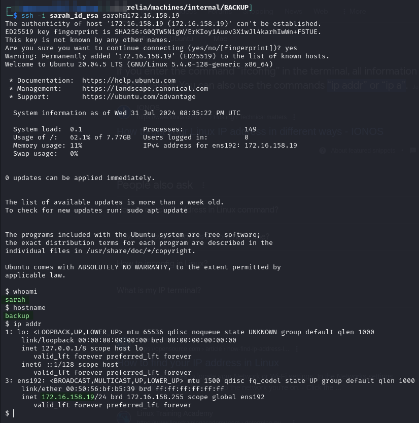
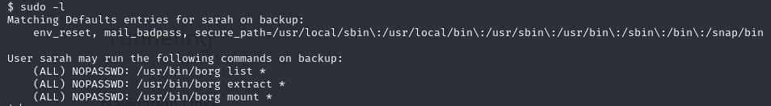
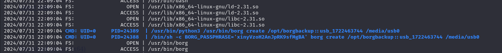
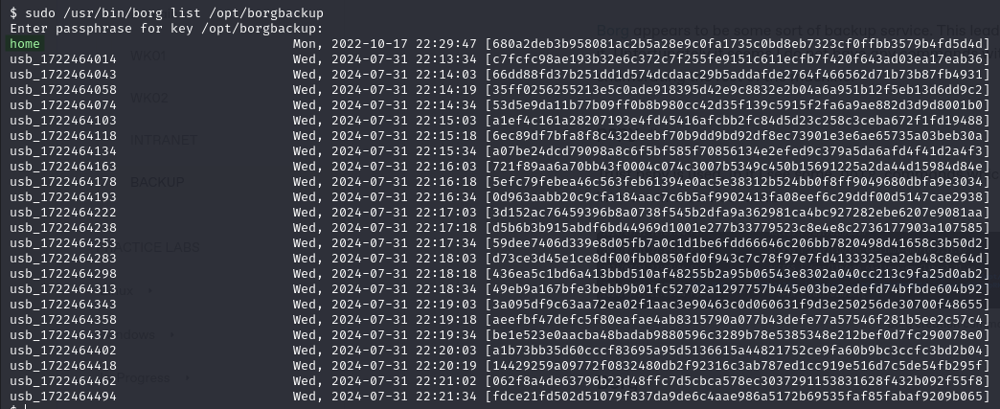
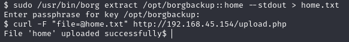
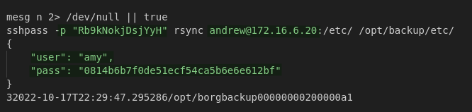

---
layout:
  title:
    visible: true
  description:
    visible: false
  tableOfContents:
    visible: true
  outline:
    visible: true
  pagination:
    visible: true
---

# BACKUP

## Enumeration

```
Nmap scan report for 172.16.159.19
Host is up (0.038s latency).
Not shown: 999 filtered tcp ports (no-response)
PORT   STATE SERVICE VERSION
22/tcp open  ssh     OpenSSH 8.2p1 Ubuntu 4ubuntu0.5 (Ubuntu Linux; protocol 2.0)
| ssh-hostkey: 
|_  256 f2:94:b5:71:88:a1:f8:c5:d9:47:77:6b:07:ae:27:a0 (ED25519)
Warning: OSScan results may be unreliable because we could not find at least 1 open and 1 closed port
Device type: general purpose
Running (JUST GUESSING): IBM z/OS 1.11.X|2.1.X (85%)
OS CPE: cpe:/o:ibm:zos:1.11 cpe:/o:ibm:zos:2.1
Aggressive OS guesses: IBM z/OS 1.11 (85%), IBM z/OS 2.1 (85%)
No exact OS matches for host (test conditions non-ideal).
Service Info: OS: Linux; CPE: cpe:/o:linux:linux_kernel

TRACEROUTE
HOP RTT      ADDRESS
1   37.95 ms 172.16.159.19
```

## Foothold

Initial access is provided via SSH as `sarah`. Key was found in KeePass vault [on `WK02` machine](wk02.md#keepass):

<figure><figcaption><p>Initial SSH access</p></figcaption></figure>

## Privilege Escalation

Start with `sudo -l` and see:

<figure><figcaption></figcaption></figure>

[Borg](https://www.borgbackup.org/) appears to be some sort of backup service. This leads me to think I can do some sort of leak with it. Unfortunately it seems I do not have any commands with which to create a backup. I decide to start enumerating the rest of the machine.

### pspy

Trust pspy is used. In it I see some `borg` commands which both provide a credential and some insight into how the service works:

<figure><figcaption><p>borg creation commands</p></figcaption></figure>

### Borg

With the password in hand I head back to borg and try creating a backup mimicking that command structure. I run the command with no errors but then when I try to mount it with the name I chose it says it does not exist.&#x20;

#### List Backups

At this point I try listing which I determine is done with:

```bash
sudo /usr/bin/borg list /opt/borgbackup
```

<figure><figcaption><p>Listing of borg backups</p></figcaption></figure>

#### Reading the Backup

I try to `borg mount` the backup to a directory I created but that did something weird so I started over.

I then try to extract the home backup:

```bash
sudo /usr/bin/borg extract /opt/borgbackup::home
```

This works but it extracts into a directory called `root` which is only readable by the `root` user so it does not help.

Finally I find the `--stdout` flag which writes all data to stdout. I validate this works and then capture the output into a file for easier parsing:

```bash
sudo /usr/bin/borg extract /opt/borgbackup::home --stdout
```

<figure><figcaption></figcaption></figure>

The output appears to be a `.bashrc` file that contains some credentials:

<figure><figcaption><p>Credentials in output</p></figcaption></figure>

