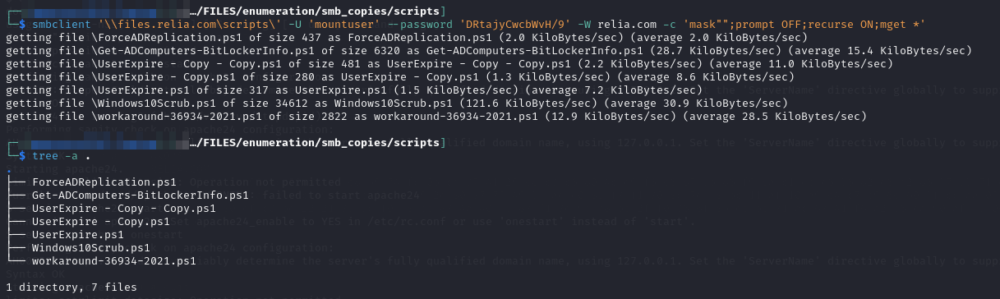
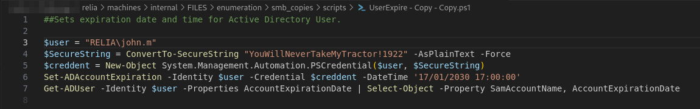
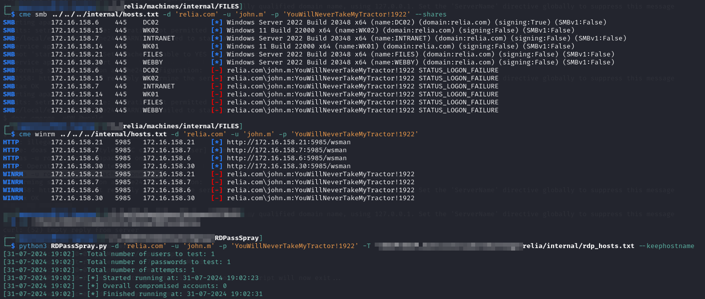
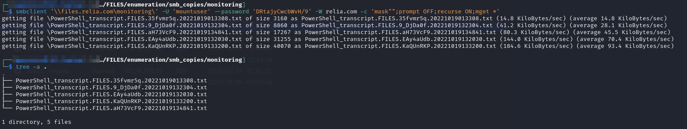
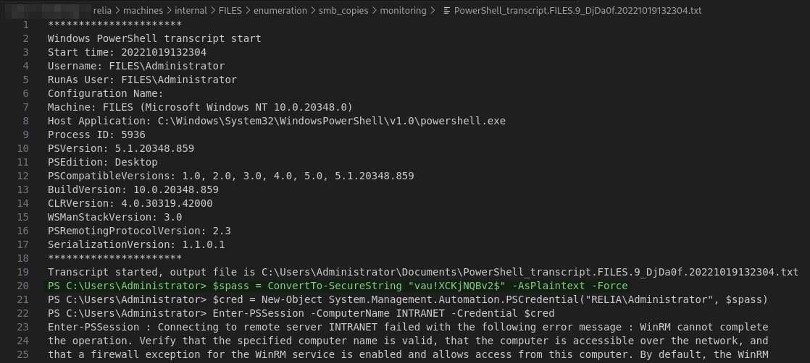
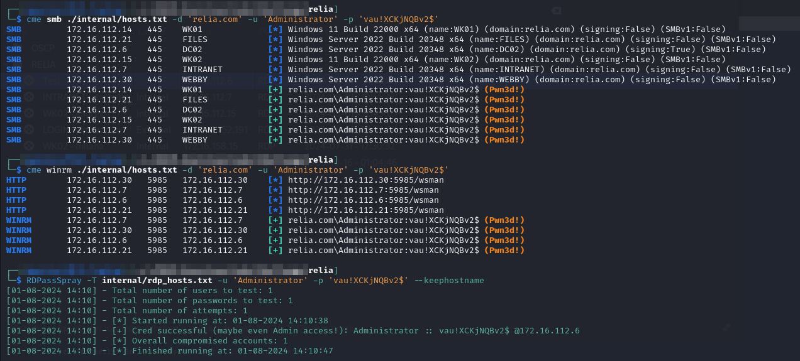

---
layout:
  title:
    visible: true
  description:
    visible: false
  tableOfContents:
    visible: true
  outline:
    visible: true
  pagination:
    visible: true
---

# FILES

## Enumeration


### SMB

#### Apps

This appears to contain a bunch of executables and PowerShell modules. A lot of stuff but not anything of value to my eye

#### Scripts

I finally gain access to this share as `mountuser` with the credentials found on [`PRODUCTION`](production.md#post-exploit). I grab everything from the share with:


```bash
smbclient '\\files.relia.com\scripts\' -U 'mountuser' --password 'DRtajyCwcbWvH/9' -W relia.com -c 'mask"";prompt OFF;recurse ON;mget *'
```


<figure><figcaption><p>Copying scripts share</p></figcaption></figure>

The file  has some credentials:

<figure><figcaption><p>Credentials for a john.m</p></figcaption></figure>

I spray them around the domain and they do not really seem to do anything:

<figure><figcaption></figcaption></figure>

Not sure what to make of this yet. I try spraying it across more users as it John does not exist. Still nothing. I give up for now.

#### Monitoring

I grab this one last using the same type of `smbclient` command:

<figure><figcaption><p>Inspecting monitoring</p></figcaption></figure>

One of the files has what is likely the `Administrator` credential inside:

<figure><figcaption><p>Potential Administrator cred</p></figcaption></figure>

I hope this is just the domain admin and not a local admin. I spray it with CME and that's exactly what it is:

<figure><figcaption><p>Validating credentials</p></figcaption></figure>

I can now RDP to `DC02` as the `Administrator`.

It is just mop-up operations from here. Time to collect some flags.
