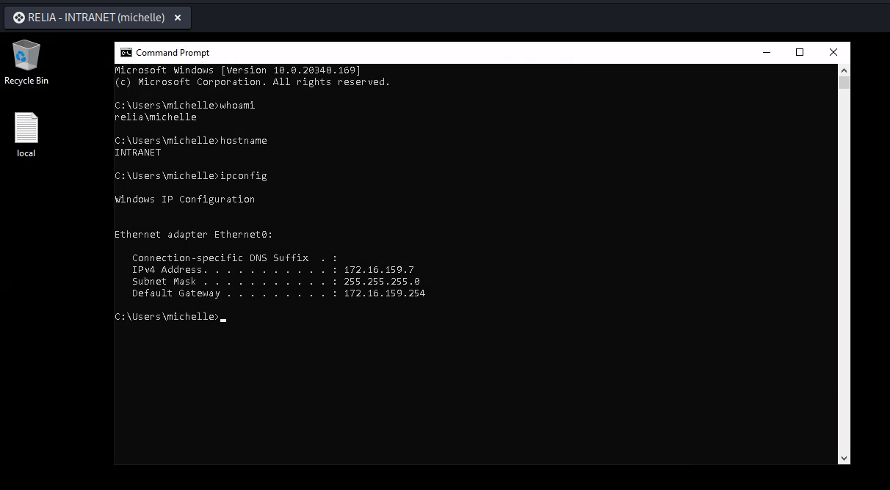
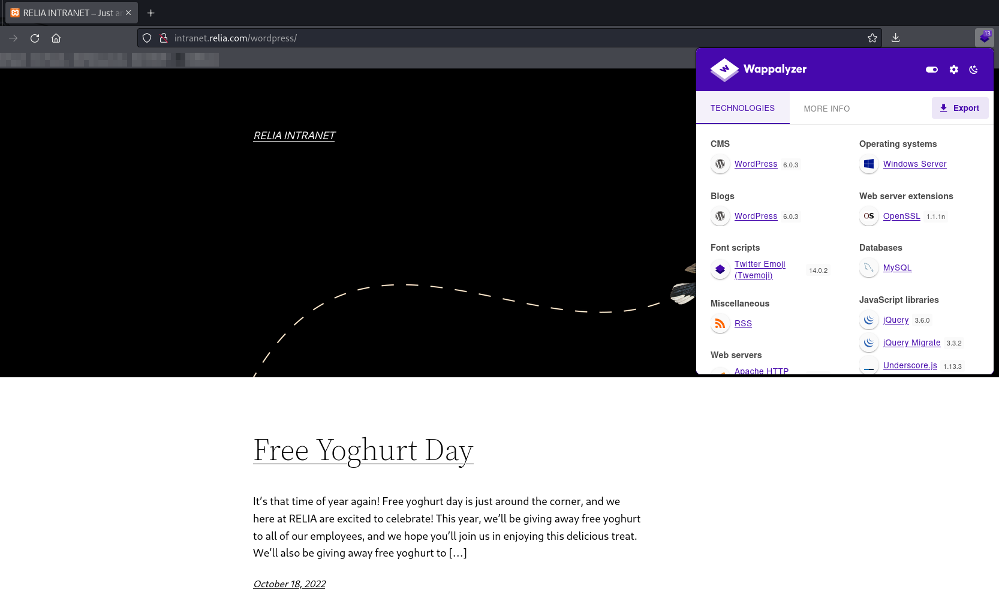
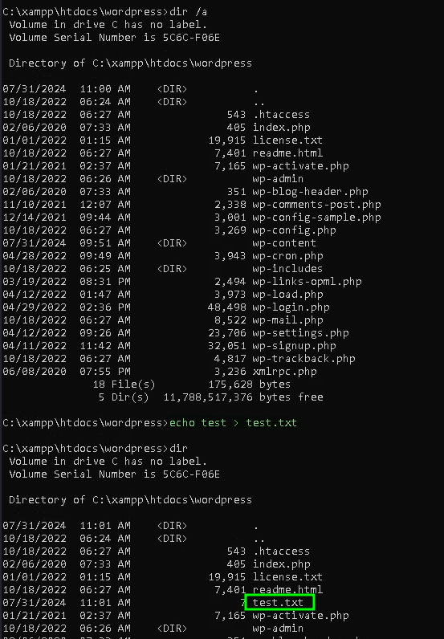
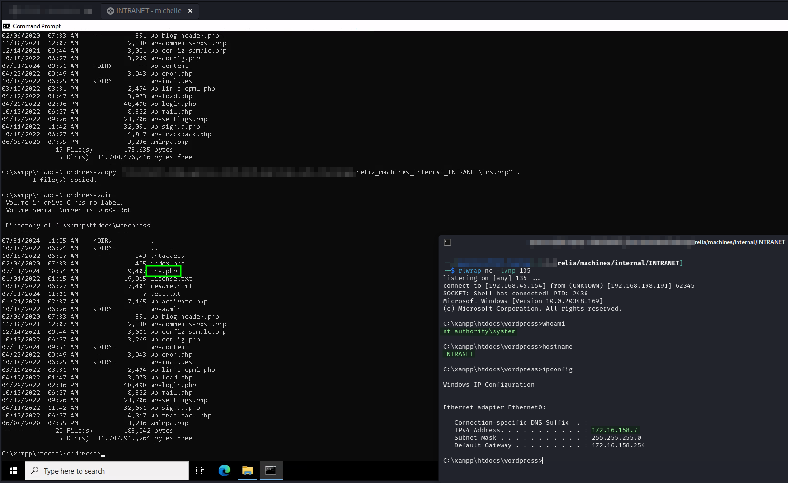
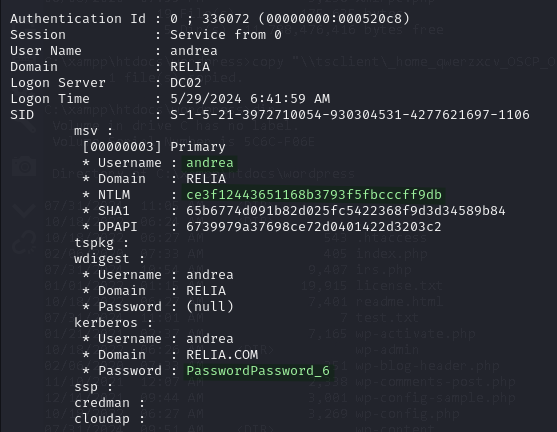
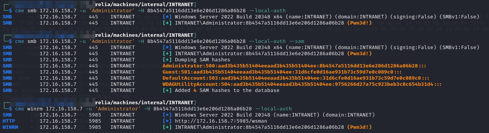
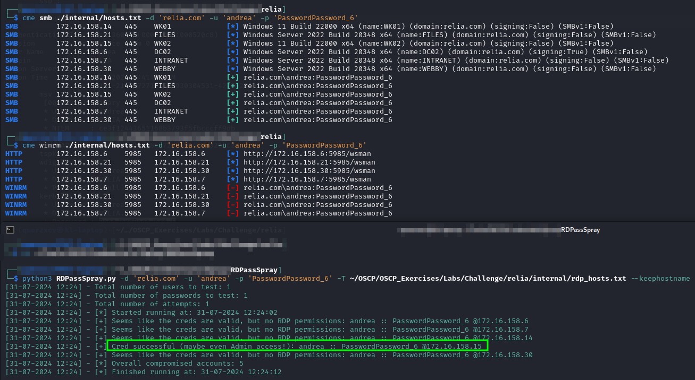

---
layout:
  title:
    visible: true
  description:
    visible: false
  tableOfContents:
    visible: true
  outline:
    visible: true
  pagination:
    visible: true
---

# INTRANET

## Enumeration

```
Nmap scan report for 172.16.159.7
Host is up (0.042s latency).
Not shown: 993 filtered tcp ports (no-response)
PORT     STATE SERVICE       VERSION
80/tcp   open  http          Apache httpd 2.4.53 ((Win64) OpenSSL/1.1.1n PHP/7.4.29)
| http-title: RELIA INTRANET &#8211; Just another WordPress site
|_Requested resource was http://172.16.159.7/wordpress/
|_http-generator: WordPress 6.0.3
|_http-server-header: Apache/2.4.53 (Win64) OpenSSL/1.1.1n PHP/7.4.29
135/tcp  open  msrpc         Microsoft Windows RPC
139/tcp  open  netbios-ssn   Microsoft Windows netbios-ssn
443/tcp  open  ssl/http      Apache httpd 2.4.53 ((Win64) OpenSSL/1.1.1n PHP/7.4.29)
|_ssl-date: TLS randomness does not represent time
| http-title: RELIA INTRANET &#8211; Just another WordPress site
|_Requested resource was https://172.16.159.7/wordpress/
|_http-server-header: Apache/2.4.53 (Win64) OpenSSL/1.1.1n PHP/7.4.29
| ssl-cert: Subject: commonName=localhost
| Not valid before: 2009-11-10T23:48:47
|_Not valid after:  2019-11-08T23:48:47
| tls-alpn: 
|_  http/1.1
|_http-generator: WordPress 6.0.3
445/tcp  open  microsoft-ds?
3306/tcp open  mysql         MariaDB (unauthorized)
3389/tcp open  ms-wbt-server Microsoft Terminal Services
| ssl-cert: Subject: commonName=INTRANET.relia.com
| Not valid before: 2024-05-15T11:50:10
|_Not valid after:  2024-11-14T11:50:10
| rdp-ntlm-info: 
|   Target_Name: RELIA
|   NetBIOS_Domain_Name: RELIA
|   NetBIOS_Computer_Name: INTRANET
|   DNS_Domain_Name: relia.com
|   DNS_Computer_Name: INTRANET.relia.com
|   DNS_Tree_Name: relia.com
|   Product_Version: 10.0.20348
|_  System_Time: 2024-07-30T22:36:36+00:00
|_ssl-date: 2024-07-30T22:37:15+00:00; -1s from scanner time.
Warning: OSScan results may be unreliable because we could not find at least 1 open and 1 closed port
Device type: general purpose
Running (JUST GUESSING): IBM z/OS 1.11.X|2.1.X (85%)
OS CPE: cpe:/o:ibm:zos:1.11 cpe:/o:ibm:zos:2.1
Aggressive OS guesses: IBM z/OS 1.11 (85%), IBM z/OS 2.1 (85%)
No exact OS matches for host (test conditions non-ideal).
Service Info: OS: Windows; CPE: cpe:/o:microsoft:windows
```

## Foothold

Initial access is provided via RDP as michelle whose credentials were [AS-REP roasted](wk01.md#as-rep-roasting):

<figure><figcaption><p>RDP to INTRANET</p></figcaption></figure>

## Privilege Escalation

I do not see any super obvious route up from `michelle` like `SeImpersonatePrivilege` or anything.

### WordPress Site

I decide to take a look at the website hosted at port 80. It appears to be a WordPress site as it redirects to `/wordpress`:

<figure><figcaption><p>Site on INTRANET</p></figcaption></figure>

I run `wpscan`:


```bash
wpscan --url http://intranet.relia.com/wordpress/ -e --plugins-detection aggressive -o intranet.wpscan --api-token ...
```


Before I even get to examining the output I notice something in the C:\ drive. There is a C:\xampp folder and inside the C:\xampp\htdocs directory I find one called wordpress which appears to contain the site pages. Not only that I can write files there:

<figure><figcaption><p>Writing files to WordPress</p></figcaption></figure>

I confirm the file test.txt is accessible from a web browser which it is. I decide to just put a shell here manually. I grab my trusty copy of an Windows-compatible PHP reverse shell and set it up to reach back to my machine at port 135. I copy it into C:\xampp\htdocs\wordpress and navigate there in a browser. I get my shell as `SYSTEM`:

<figure><figcaption></figcaption></figure>

## Post-Exploit

I checked but there are no `.kdbx` files on this machine.

### Mimikatz

I recall that a few domain users had sessions on this machines so I hope to extract their credentials from memory. I find `andrea`'s hash and plaintext password:

<figure><figcaption><p>Andrea credentials</p></figcaption></figure>

I also grab the `Administrator`'s NTLM hash so I can just hop back in with evil-winrm instead of doing the shell upload.

<figure><figcaption><p>Local Admin hash</p></figcaption></figure>

I then validate `andrea` with CME and RDPassSpray:

<figure><figcaption><p>Andrea's credentials</p></figcaption></figure>

She seems to have broad SMB access and RDP access to `WK02`. I add her to my list of AD credentials:


```
relia.com\michelle:NotMyPassword0k?     AS-REP Roasted
relia.com\jim:Castello1!                Found on WK01 in Database.kdbx
relia.com\andrea:PasswordPassword_6     Mimikatz from INTRANET
```

