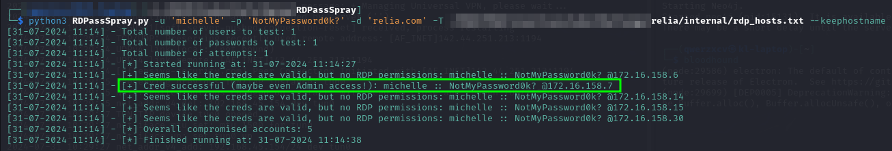

---
layout:
  title:
    visible: true
  description:
    visible: false
  tableOfContents:
    visible: true
  outline:
    visible: true
  pagination:
    visible: true
---

# WK01

This machine becomes my first outpost inside the network after compromising it with a phishing attack as described here.

I am starting off with a user shell as `jim` on this machine.

I note one interesting thing once I start working. I am downloading tools to the victim machine over HTTP but when I am watching the access logs on my server the requests are coming from the machine [`LOGIN`](../external-machines/login.md). It seems like that must be the pivot point between the internal and external networks.

The very first thing I do on this machine is set up a [`ligolo-ng`](../../../attack-vectors/port-forwarding-and-tunneling/ligolo-ng.md) proxy to the internal network.

## Domain Enumeration

Since this is my first foothold inside the domain I do some basic enumeration.

### Account Lockouts

Check for account lockout threshold with `net accounts`:

```
net accounts /domain
```

<figure><figcaption><p>Checking threshold</p></figcaption></figure>

The output I really care about is the one from `/domain`. There is no lockout threshold on either which means I can spray freely. This will make validating any credentials I have easier.

### Checking Known Credentials

I use CME to check all of the credentials and hashes I gathered on the external machines. None of them do anything internally so we are starting from scratch.

## Lateral Movement

I run PEAS and SharpHound. Unfortunately the SharpHound output is pretty useless. Not sure why, but no SIDs are mapped to usernames and the nodes themselves have basically no information. All of the relationships seem captured but no information about the nodes.

### AS-REP Roasting

I decide to try AS-REP roasting since I really do not need any information to give that a go. I use Rubeus [as seen here](../../../windows/active-directory/authentication/attacking-ad-authentication/as-rep-roasting.md#rubeus):

```
Rubeus.exe asreproast /nowrap
```

This outputs a hash for `michelle`:

<figure><figcaption><p>Michelle hash</p></figcaption></figure>

#### Cracking the Hash


```bash
hashcat -m 18200 -o asrep.cracked asrep.hashes /usr/share/wordlists/rockyou.txt
```


It cracks and I add it to a new file of `ad_creds.txt`:


```
relia.com\michelle:NotMyPassword0k?     AS-REP Roasted
```


#### Validating Credential

I check what it has access to with CME:

<figure><figcaption></figcaption></figure>

It seems her credential has a good bit of SMB access (though not many machines have shares it seems) but none for WinRM.

### RDP Password Spraying

I finally found a good RDP password spray tool called [`RDPassSpray`](https://github.com/xFreed0m/RDPassSpray). It is a Python-based tool which can be used with the command structure demonstrated below:


```bash
python3 RDPassSpray.py -u 'michelle' -p 'NotMyPassword0k?' -d 'relia.com' -T ./internal/rdp_hosts.txt --keephostname
```


* `-u` is used to specify one target but `-U` can be used with a file containing one username per-line
* `-P` can be used to specify a password file (one-per-line)
* `-t` can be used to specify a single target or `-T` can be used with a file containing one target per-line
  * `rdp_hosts.txt` is just a list of IPs on which port 3389 was found to be open. The script does not break if a machine is included that does not have RDP but it slows down the scan because the script has a long timeout and waits for a reply that is never coming on machines without RDP
* The script automatically changes the machines hostname before each connection attempt. This is useful in the real world but requires root permissions and does not matter at all for OSCP.
  * `--keephostname` is an optional flag to disable this behavior

When run the script finds michelle can connect to `172.16.xxx.7` which is [`INTRANET`](intranet.md).

<figure><figcaption><p>Spraying michelle's credentials over RDP</p></figcaption></figure>

* I actually did this manually before discovering `RDPassSpray` so I can confirm these results are correct

## Privilege Escalation

I start poking around the machine manually.

### KeePass

I know the organization likely uses KeePass since I found and cracked a database on `EXTERNAL`. I decide to search for any `.kdbx` files and find one:


```powershell
Get-ChildItem -Path C:\ -Filter *.kdbx -Recurse -ErrorAction SilentlyContinue
```


<figure><figcaption><p>Database.kdbx</p></figcaption></figure>

I take it back to my machine and crack it:

```bash
keepass2john Database.kdbx > keepass.hash
```

```bash
john --wordlist=/usr/share/wordlists/rockyou.txt keepass.hash
```

<figure><figcaption><p>Cracked Database.kdbx</p></figcaption></figure>

Once I open up `Database.kdbx` I get 2 more pairs of credentials:

<figure><figcaption></figcaption></figure>

One is for the domain user `jim`. Also I get what appears to be the local Admin account on [`LOGIN`](../external-machines/login.md) which would allow me direct access to the pivot point between the internal and external networks.

I validate `jim`'s credentials with CME:

<figure><figcaption></figcaption></figure>

I also checked all the RDP machines to see if he could access any but got denied each time.
