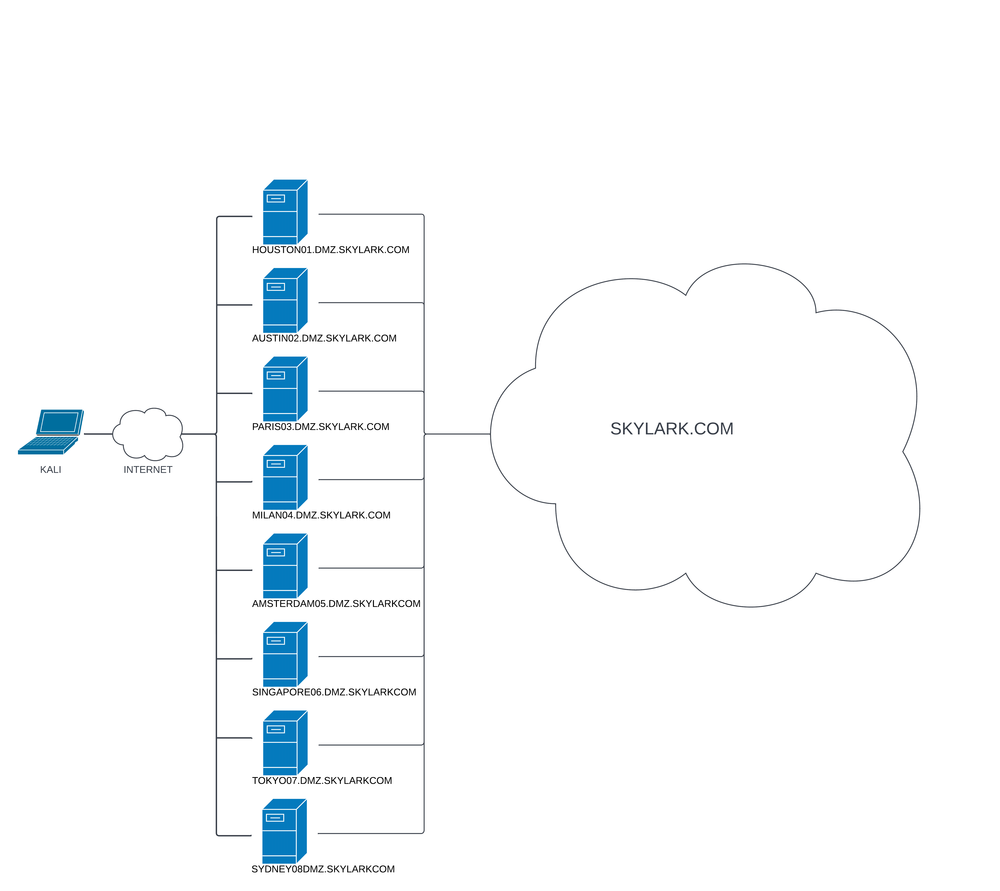

---
layout:
  title:
    visible: true
  description:
    visible: false
  tableOfContents:
    visible: true
  outline:
    visible: true
  pagination:
    visible: true
---

# Lab 3: Skylark

## Scenario

Skylark Industries is an aerospace multinational corporation that performs research & development on cutting-edge aviation technologies. One of their major branch office has been recently targeted by an Advanced Threat Actor (APT) ransomware attack. For this reason, the company CISO is now urging to further shield Skylark Industries' attack surface. We have so been tasked to conduct a preemptive penetration test towards their HQ infrastructure and find any vulnerability that could potentially jeopardize the company's trade secrets.

The organization topology diagram is shown below and the public subnet network resides in the `192.168.xxx.0/24` range.

<figure><figcaption><p>Network diagram provided</p></figcaption></figure>

## Post-Completion Notes

The final list of `/etc/hosts` entries required for the lab. This is provided in case I decide to re-examine the labs later:


```
...

################################################################################
# SKYLARK
################################################################################

##########  TUNNEL PIVOTS  ##########
192.168.xxx.221 austin02.skylark.com
10.10.yyy.13    mail.skylark.com

##########  EXTERNAL  ##########
192.168.xxx.220 houston01.skylark.com
192.168.xxx.222 paris03.skylark.com
192.168.xxx.223 milan04.skylark.com
192.168.xxx.224 amsterdam05.skylark.com
192.168.xxx.225 singapore06.skylark
192.168.xxx.226 tokyo07.skylark.com
192.168.xxx.227 sydney08.skylark.com

##########  ALIASES  ##########
192.168.xxx.223 milan
192.168.xxx.226 skylark.jp


##########  FIRST HOP  ###########
10.10.yyy.10    rd.skylark.com
10.10.yyy.11    lab.skylark.com
10.10.yyy.250   dc.skylark.com
10.10.yyy.12    archive.skylark.com

##########  SECOND HOP  ##########
10.20.yyy.14    cicd.skylark.com
10.20.yyy.15    preprod.skylark.com
10.20.yyy.110   client01.skylark.com
10.20.yyy.111   client02.skylark.com

##########  THIRD SUBNET  ##########
172.16.xxx.30   terminal.skylark.com
172.16.xxx.31   vaxbsd.skylark.com
172.16.xxx.32   pbx.skylark.com
```


* `xxx` and `yyy` represent the 2 options for the third octet
