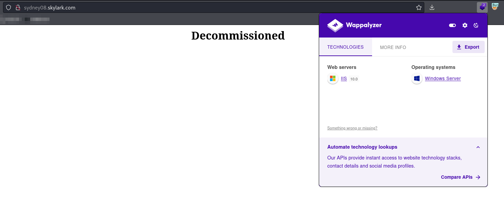
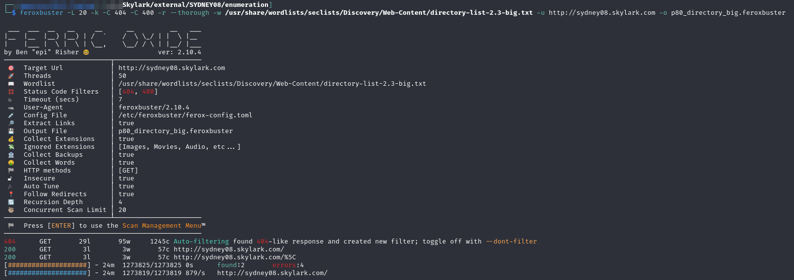
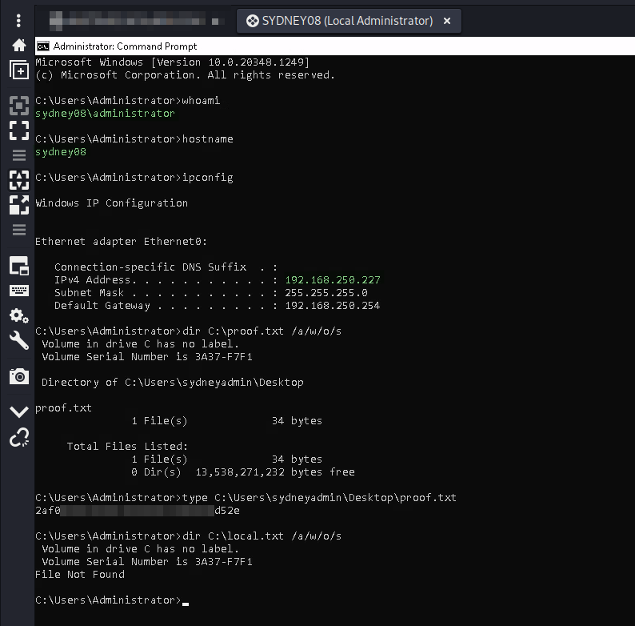

---
layout:
  title:
    visible: true
  description:
    visible: false
  tableOfContents:
    visible: true
  outline:
    visible: true
  pagination:
    visible: true
---

# SYDNEY08

## Enumeration

Host at `192.168.xxx.227`. Output from `nmap` scan report generated [here](./#network-enumeration):

```
Nmap scan report for 192.168.247.227
Host is up (0.053s latency).
Not shown: 65533 filtered tcp ports (no-response)
PORT     STATE SERVICE       VERSION
80/tcp   open  http          Microsoft IIS httpd 10.0
| http-methods: 
|_  Potentially risky methods: TRACE
|_http-server-header: Microsoft-IIS/10.0
|_http-title: Site doesn't have a title (text/html).
3389/tcp open  ms-wbt-server Microsoft Terminal Services
|_ssl-date: 2024-08-14T21:55:19+00:00; 0s from scanner time.
| rdp-ntlm-info: 
|   Target_Name: SYDNEY08
|   NetBIOS_Domain_Name: SYDNEY08
|   NetBIOS_Computer_Name: SYDNEY08
|   DNS_Domain_Name: sydney08
|   DNS_Computer_Name: sydney08
|   Product_Version: 10.0.20348
|_  System_Time: 2024-08-14T21:55:11+00:00
| ssl-cert: Subject: commonName=sydney08
| Not valid before: 2024-07-27T23:45:11
|_Not valid after:  2025-01-26T23:45:11
Warning: OSScan results may be unreliable because we could not find at least 1 open and 1 closed port
OS fingerprint not ideal because: Missing a closed TCP port so results incomplete
No OS matches for host
Network Distance: 4 hops
Service Info: OS: Windows; CPE: cpe:/o:microsoft:windows
```

Machine name discovered in scan. Based on this and [`AUSTIN02`](austin02.md)'s place in the IP range it seems like the image given in the [scenario](../#scenario) may actually be the machines in order but I cannot be 100% sure yet.

### Port 80

the landing page on port 80 is simply a page that says "Decommissioned" with no extra technology stack or anything:

<figure><figcaption><p>Landing page on port 80</p></figcaption></figure>

I decide to run feroxbuster against the port to see if there is something else here. I actually ran a couple scans, working up to using the big directory list, but it turned up nothing. The only hit /%5C  just leads to the same "Decommissioned" page:


```bash
feroxbuster -L 20 -k -C 404 -C 400 -r --thorough -w /usr/share/wordlists/seclists/Discovery/Web-Content/directory-list-2.3-big.txt -u http://sydney08.skylark.com -o p80_directory_big.feroxbuster
```


<figure><figcaption><p>Nothing of use from feroxbuster</p></figcaption></figure>

## Foothold

Initial access is provided with the local Administrator credentials (`Administrator:DowntownAbbey1923`) which I find in the `credentials.txt` file on [`DC.SKYLARK.COM`](../subnet-10.10.xxx.0-24/dc.md#possible-credential-files).

I am able to use these credentials with RDP (via Remmina) to access the machine:

<figure><figcaption><p>Local Administrator Access</p></figcaption></figure>

## Post-Exploit

