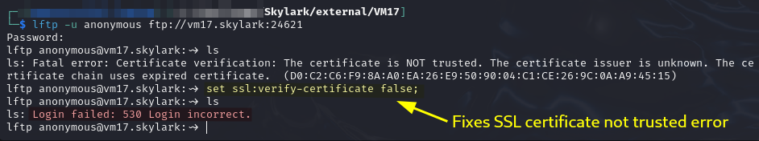
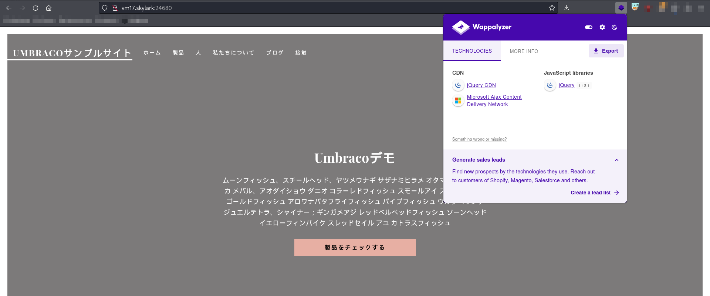
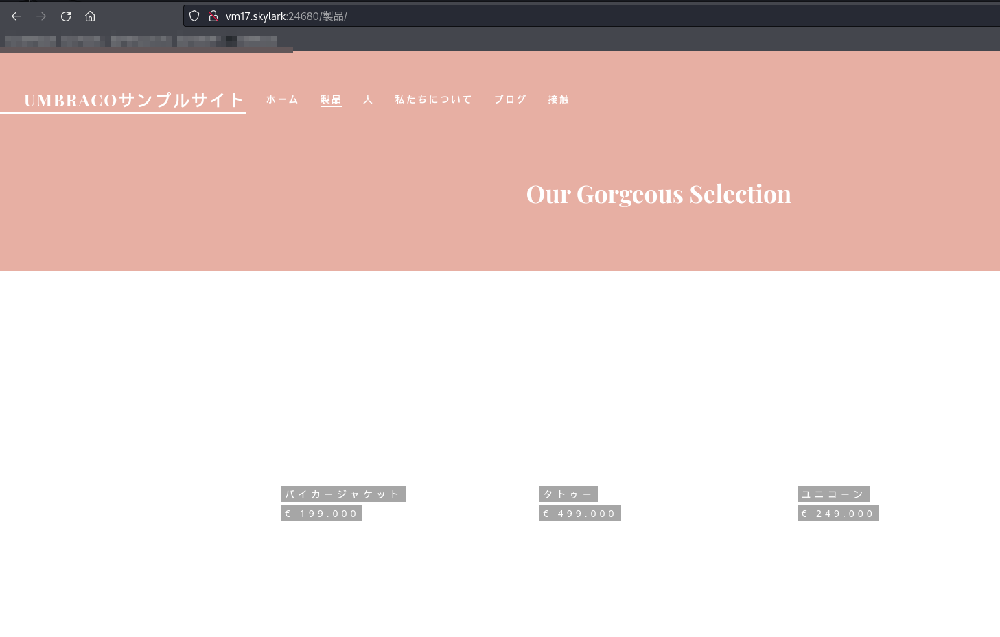
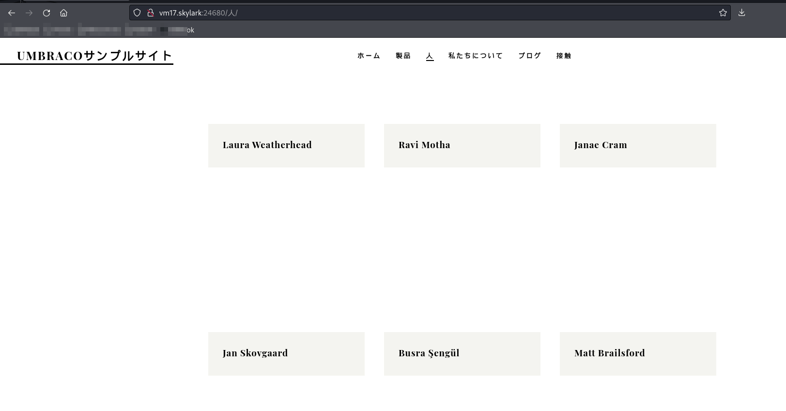
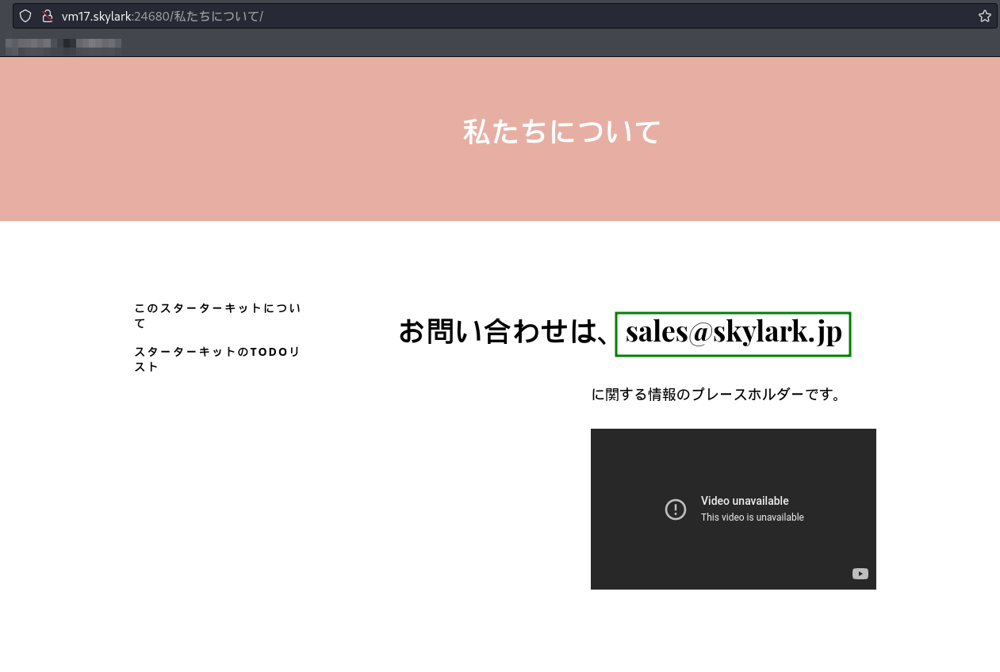
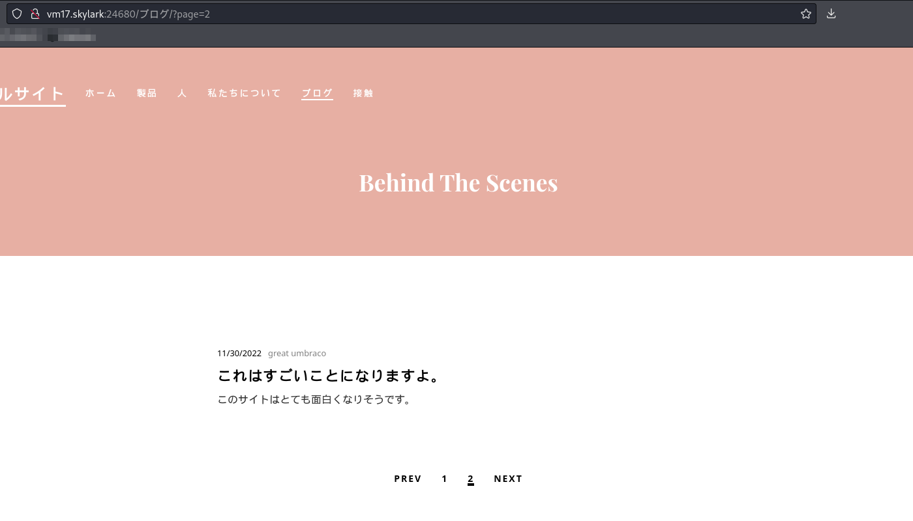
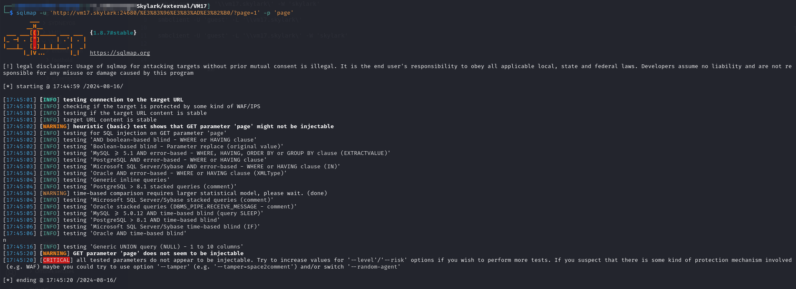

---
layout:
  title:
    visible: true
  description:
    visible: false
  tableOfContents:
    visible: true
  outline:
    visible: true
  pagination:
    visible: true
---

# TOKYO07

## Enumeration

Host at `192.168.xxx.226` and referred to as `VM 17` on the lab startup page. Output from `nmap` scan report generated [here](./#network-enumeration):

```
Nmap scan report for 192.168.247.226
Host is up (0.052s latency).
Not shown: 65521 closed tcp ports (reset)
PORT      STATE SERVICE       VERSION
135/tcp   open  msrpc         Microsoft Windows RPC
139/tcp   open  netbios-ssn   Microsoft Windows netbios-ssn
445/tcp   open  microsoft-ds?
2994/tcp  open  veritas-vis2?
5985/tcp  open  http          Microsoft HTTPAPI httpd 2.0 (SSDP/UPnP)
|_http-title: Not Found
|_http-server-header: Microsoft-HTTPAPI/2.0
24621/tcp open  unknown
| fingerprint-strings: 
|   DNSStatusRequestTCP, DNSVersionBindReqTCP, GenericLines, NULL, RPCCheck, SSLSessionReq, TLSSessionReq, TerminalServerCookie: 
|     220-FileZilla Server 1.5.1
|     Please visit https://filezilla-project.org/
|   GetRequest: 
|     220-FileZilla Server 1.5.1
|     Please visit https://filezilla-project.org/
|     What are you trying to do? Go away.
|   HTTPOptions, RTSPRequest: 
|     220-FileZilla Server 1.5.1
|     Please visit https://filezilla-project.org/
|     Wrong command.
|   Help: 
|     220-FileZilla Server 1.5.1
|     Please visit https://filezilla-project.org/
|     214-The following commands are recognized.
|     USER TYPE SYST SIZE RNTO RNFR RMD REST QUIT
|     HELP XMKD MLST MKD EPSV XCWD NOOP AUTH OPTS DELE
|     CDUP APPE STOR ALLO RETR PWD FEAT CLNT MFMT
|     MODE XRMD PROT ADAT ABOR XPWD MDTM LIST MLSD PBSZ
|     NLST EPRT PASS STRU PASV STAT PORT
|_    Help ok.
24680/tcp open  http          Microsoft IIS httpd 10.0
|_http-server-header: Microsoft-IIS/10.0
|_http-title: &#x30DB;&#x30FC;&#x30E0; - Umbraco&#x30B5;&#x30F3;&#x30D7;&#x3...
47001/tcp open  http          Microsoft HTTPAPI httpd 2.0 (SSDP/UPnP)
|_http-server-header: Microsoft-HTTPAPI/2.0
|_http-title: Not Found
49664/tcp open  msrpc         Microsoft Windows RPC
49665/tcp open  msrpc         Microsoft Windows RPC
49666/tcp open  msrpc         Microsoft Windows RPC
49667/tcp open  msrpc         Microsoft Windows RPC
49668/tcp open  msrpc         Microsoft Windows RPC
49669/tcp open  msrpc         Microsoft Windows RPC
2 services unrecognized despite returning data. If you know the service/version, please submit the following fingerprints at https://nmap.org/cgi-bin/submit.cgi?new-service :
==============NEXT SERVICE FINGERPRINT (SUBMIT INDIVIDUALLY)==============
SF-Port2994-TCP:V=7.94SVN%I=7%D=8/14%Time=66BD2781%P=x86_64-pc-linux-gnu%r
SF:(NULL,16,"\0\x14\x0c\0\0\0\x1d\xda\x03\x18\x20e\xeb\x06\xa1Bv@\0\xc3\xa
SF:bu")%r(GenericLines,16,"\0\x14\x0c\0\0\0\x1d\xda\x03\x18\x20e\xeb\x06\x
SF:a1Bv@\0\xc3\xabu");
==============NEXT SERVICE FINGERPRINT (SUBMIT INDIVIDUALLY)==============
SF-Port24621-TCP:V=7.94SVN%I=7%D=8/14%Time=66BD2781%P=x86_64-pc-linux-gnu%
SF:r(NULL,4D,"220-FileZilla\x20Server\x201\.5\.1\r\n220\x20Please\x20visit
SF:\x20https://filezilla-project\.org/\r\n")%r(GenericLines,4D,"220-FileZi
SF:lla\x20Server\x201\.5\.1\r\n220\x20Please\x20visit\x20https://filezilla
SF:-project\.org/\r\n")%r(GetRequest,76,"220-FileZilla\x20Server\x201\.5\.
SF:1\r\n220\x20Please\x20visit\x20https://filezilla-project\.org/\r\n501\x
SF:20What\x20are\x20you\x20trying\x20to\x20do\?\x20Go\x20away\.\r\n")%r(HT
SF:TPOptions,61,"220-FileZilla\x20Server\x201\.5\.1\r\n220\x20Please\x20vi
SF:sit\x20https://filezilla-project\.org/\r\n500\x20Wrong\x20command\.\r\n
SF:")%r(RTSPRequest,61,"220-FileZilla\x20Server\x201\.5\.1\r\n220\x20Pleas
SF:e\x20visit\x20https://filezilla-project\.org/\r\n500\x20Wrong\x20comman
SF:d\.\r\n")%r(RPCCheck,4D,"220-FileZilla\x20Server\x201\.5\.1\r\n220\x20P
SF:lease\x20visit\x20https://filezilla-project\.org/\r\n")%r(DNSVersionBin
SF:dReqTCP,4D,"220-FileZilla\x20Server\x201\.5\.1\r\n220\x20Please\x20visi
SF:t\x20https://filezilla-project\.org/\r\n")%r(DNSStatusRequestTCP,4D,"22
SF:0-FileZilla\x20Server\x201\.5\.1\r\n220\x20Please\x20visit\x20https://f
SF:ilezilla-project\.org/\r\n")%r(Help,17C,"220-FileZilla\x20Server\x201\.
SF:5\.1\r\n220\x20Please\x20visit\x20https://filezilla-project\.org/\r\n21
SF:4-The\x20following\x20commands\x20are\x20recognized\.\r\n\x20NOP\x20\x2
SF:0USER\x20TYPE\x20SYST\x20SIZE\x20RNTO\x20RNFR\x20RMD\x20\x20REST\x20QUI
SF:T\r\n\x20HELP\x20XMKD\x20MLST\x20MKD\x20\x20EPSV\x20XCWD\x20NOOP\x20AUT
SF:H\x20OPTS\x20DELE\r\n\x20CWD\x20\x20CDUP\x20APPE\x20STOR\x20ALLO\x20RET
SF:R\x20PWD\x20\x20FEAT\x20CLNT\x20MFMT\r\n\x20MODE\x20XRMD\x20PROT\x20ADA
SF:T\x20ABOR\x20XPWD\x20MDTM\x20LIST\x20MLSD\x20PBSZ\r\n\x20NLST\x20EPRT\x
SF:20PASS\x20STRU\x20PASV\x20STAT\x20PORT\r\n214\x20Help\x20ok\.\r\n")%r(S
SF:SLSessionReq,4D,"220-FileZilla\x20Server\x201\.5\.1\r\n220\x20Please\x2
SF:0visit\x20https://filezilla-project\.org/\r\n")%r(TerminalServerCookie,
SF:4D,"220-FileZilla\x20Server\x201\.5\.1\r\n220\x20Please\x20visit\x20htt
SF:ps://filezilla-project\.org/\r\n")%r(TLSSessionReq,4D,"220-FileZilla\x2
SF:0Server\x201\.5\.1\r\n220\x20Please\x20visit\x20https://filezilla-proje
SF:ct\.org/\r\n");
No exact OS matches for host (If you know what OS is running on it, see https://nmap.org/submit/ ).
TCP/IP fingerprint:
OS:SCAN(V=7.94SVN%E=4%D=8/14%OT=135%CT=1%CU=40390%PV=Y%DS=4%DC=T%G=Y%TM=66B
OS:D27C8%P=x86_64-pc-linux-gnu)SEQ(SP=105%GCD=1%ISR=106%TI=I%TS=A)OPS(O1=M5
OS:51NW8ST11%O2=M551NW8ST11%O3=M551NW8NNT11%O4=M551NW8ST11%O5=M551NW8ST11%O
OS:6=M551ST11)WIN(W1=FFFF%W2=FFFF%W3=FFFF%W4=FFFF%W5=FFFF%W6=FFDC)ECN(R=Y%D
OS:F=Y%T=80%W=FFFF%O=M551NW8NNS%CC=Y%Q=)T1(R=Y%DF=Y%T=80%S=O%A=S+%F=AS%RD=0
OS:%Q=)T2(R=N)T3(R=N)T4(R=N)T5(R=Y%DF=Y%T=80%W=0%S=Z%A=S+%F=AR%O=%RD=0%Q=)T
OS:6(R=N)T7(R=N)U1(R=Y%DF=N%T=80%IPL=164%UN=0%RIPL=G%RID=G%RIPCK=G%RUCK=936
OS:D%RUD=G)IE(R=N)

Network Distance: 4 hops
Service Info: OS: Windows; CPE: cpe:/o:microsoft:windows

Host script results:
|_smb2-time: Protocol negotiation failed (SMB2)
```


### Port 24621

According to the scan this seems to be running FileZilla which is an FTP server. I attempt to sign in with `lftp`:

<figure><figcaption><p>Anonymous FTP failed</p></figcaption></figure>

It seems anonymous and no password are insufficient for login.

One note about the attempt, `lftp` does not initiate a connection until it has to. This means the connection to the server was not actually made until I ran my first ls command. Then `lftp` attempts to sign in and run the command on the server. The first attempt failed due to an untrusted SSL certificate being presented by the server. The "`set ssl:verify-certificate false;`" command turns off certificate validation. I can actually run it from the command line with the `-e` flag:

```bash
lftp ftp://anonymous@vm17.skylark:24621 -e "set ssl:verify-certificate false;"
```

This would launch me straight into a session though `ls` would still fail because my credentials are invalid.

### Port 24680

This appears to be a web server but it is all in Japanese

<figure><figcaption><p>Landing page</p></figcaption></figure>

There is some sort of store:

<figure><figcaption><p>Store page</p></figcaption></figure>

Each product has its own page but the buy button does not do anything. On another page, I find a list of potential team members which I save into a text file:

<figure><figcaption><p>Potential team member names</p></figcaption></figure>

I also find potentially valid email address if I need to phish later:

<figure><figcaption><p>Email address</p></figcaption></figure>

At this point I feel safe calling this machine `TOKYO07.dmz.skylark.com` from the [scenario diagram](../#scenario).

I decide to run feroxbuster with Seclists's `directory-2.3-medium.txt` to see what I find:


```bash
feroxbuster -L 20 -k -C 404 -C 400 -r --thorough -w dir_enum.txt -u http://vm17.skylark:24680 -o p24680_directory.feroxbuster
```


A lot turns up. Unfortunately it does not seem to be anything new. Most of what came up were the product pages for the store.

The site seems to be built on the [Umbraco CMS](https://umbraco.com/). I check for exploits. I find an [authenticated RCE](https://www.exploit-db.com/exploits/49488) but I have no credentials and I am unsure what version I am working with so I don't even know that would work if I did.

#### Page Parameter

As I am looking around what appears to be a blog section I find a URL that has a e parameter:

<figure><figcaption><p>Page parameter in URL</p></figcaption></figure>

I test this for SQLi with `sqlmap` but no luck:


```bash
sqlmap -u 'http://vm17.skylark:24680/%E3%83%96%E3%83%AD%E3%82%B0/?page=1' -p 'page'
```


<figure><figcaption><p>Failed to find injection</p></figcaption></figure>

