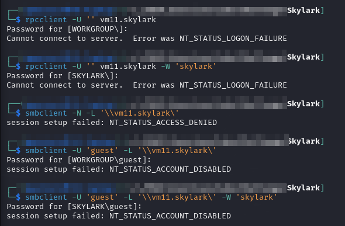
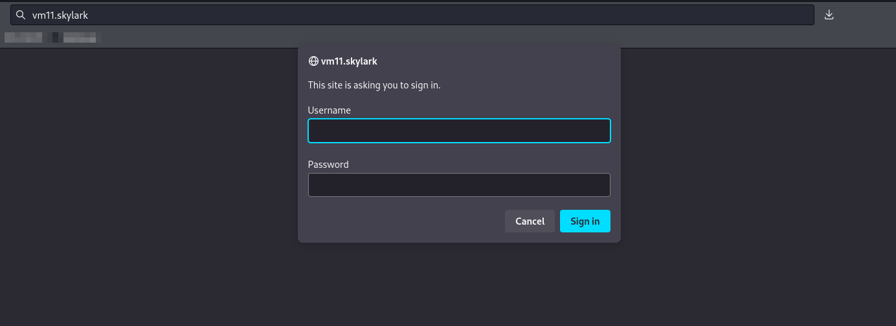
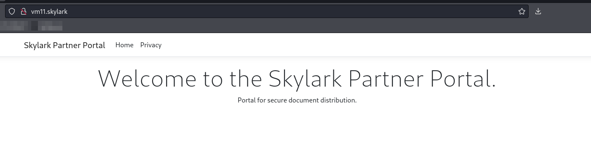
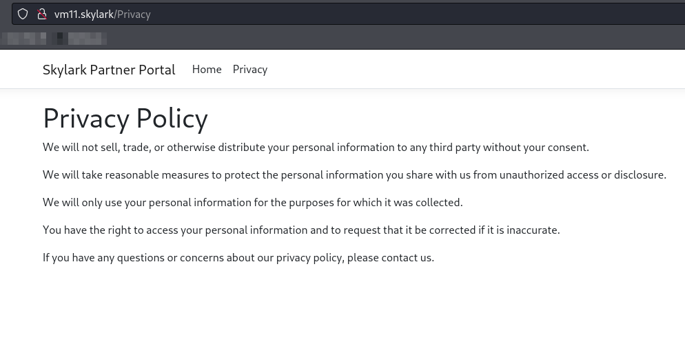
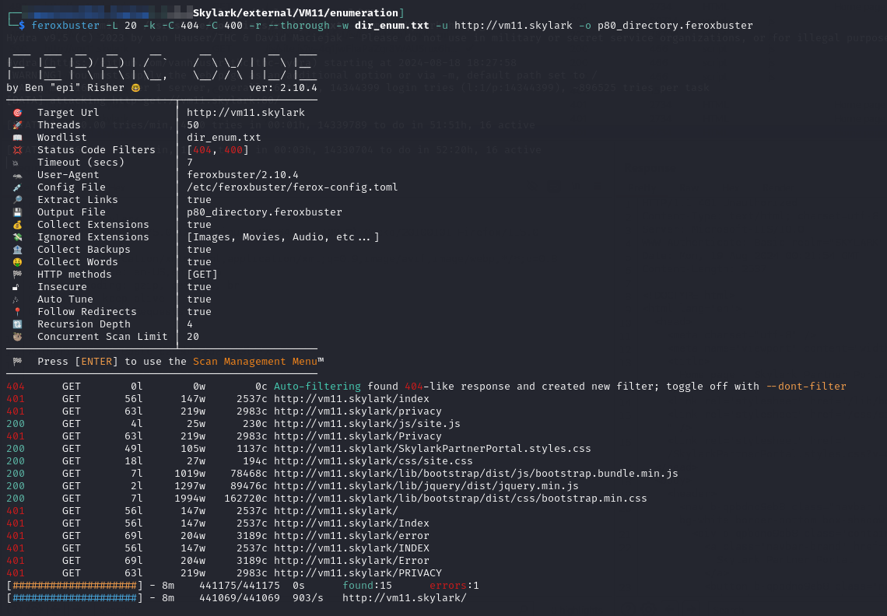
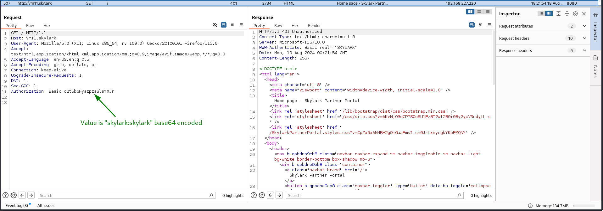
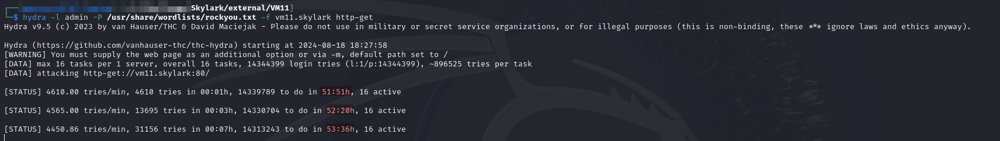
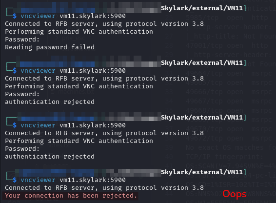

# HOUSTON01

## Enumeration

Host at `192.168.xxx.220`. Output from `nmap` scan report generated [here](./#network-enumeration):

```
Nmap scan report for 192.168.249.220
Host is up (0.053s latency).
Not shown: 65520 closed tcp ports (reset)
PORT      STATE SERVICE       VERSION
80/tcp    open  http          Microsoft IIS httpd 10.0
|_http-server-header: Microsoft-IIS/10.0
| http-auth: 
| HTTP/1.1 401 Unauthorized\x0D
|_  Basic realm=SKYLARK
|_http-title: Home page - Skylark Partner Portal
135/tcp   open  msrpc         Microsoft Windows RPC
139/tcp   open  netbios-ssn   Microsoft Windows netbios-ssn
445/tcp   open  microsoft-ds?
5900/tcp  open  vnc           VNC (protocol 3.8)
| vnc-info: 
|   Protocol version: 3.8
|   Security types: 
|     Ultra (17)
|     Unknown security type (116)
|_    VNC Authentication (2)
5985/tcp  open  http          Microsoft HTTPAPI httpd 2.0 (SSDP/UPnP)
|_http-server-header: Microsoft-HTTPAPI/2.0
|_http-title: Not Found
47001/tcp open  http          Microsoft HTTPAPI httpd 2.0 (SSDP/UPnP)
|_http-server-header: Microsoft-HTTPAPI/2.0
|_http-title: Not Found
49664/tcp open  msrpc         Microsoft Windows RPC
49665/tcp open  msrpc         Microsoft Windows RPC
49666/tcp open  msrpc         Microsoft Windows RPC
49667/tcp open  msrpc         Microsoft Windows RPC
49668/tcp open  msrpc         Microsoft Windows RPC
49669/tcp open  msrpc         Microsoft Windows RPC
49670/tcp open  msrpc         Microsoft Windows RPC
49672/tcp open  msrpc         Microsoft Windows RPC
No exact OS matches for host (If you know what OS is running on it, see https://nmap.org/submit/ ).
TCP/IP fingerprint:
OS:SCAN(V=7.94SVN%E=4%D=8/13%OT=80%CT=1%CU=34421%PV=Y%DS=4%DC=T%G=Y%TM=66BB
OS:FBF1%P=x86_64-pc-linux-gnu)SEQ(SP=FE%GCD=1%ISR=100%TI=I%TS=U)SEQ(SP=FE%G
OS:CD=1%ISR=102%TI=I%TS=U)SEQ(SP=FE%GCD=1%ISR=102%TI=RD%TS=U)OPS(O1=M551NW8
OS:NNS%O2=M551NW8NNS%O3=M551NW8%O4=M551NW8NNS%O5=M551NW8NNS%O6=M551NNS)WIN(
OS:W1=FFFF%W2=FFFF%W3=FFFF%W4=FFFF%W5=FFFF%W6=FF70)ECN(R=N)ECN(R=Y%DF=Y%T=8
OS:0%W=FFFF%O=M551NW8NNS%CC=Y%Q=)T1(R=Y%DF=Y%T=80%S=O%A=S+%F=AS%RD=0%Q=)T2(
OS:R=N)T3(R=N)T4(R=N)T5(R=N)T5(R=Y%DF=Y%T=80%W=0%S=Z%A=O%F=AR%O=%RD=0%Q=)T5
OS:(R=Y%DF=Y%T=80%W=0%S=Z%A=S+%F=AR%O=%RD=0%Q=)T6(R=N)T7(R=N)U1(R=N)U1(R=Y%
OS:DF=N%T=80%IPL=164%UN=0%RIPL=G%RID=G%RIPCK=G%RUCK=8BC7%RUD=G)IE(R=N)

Network Distance: 4 hops
Service Info: OS: Windows; CPE: cpe:/o:microsoft:windows

Host script results:
| smb2-security-mode: 
|   3:1:1: 
|_    Message signing enabled but not required
|_clock-skew: -1s
| smb2-time: 
|   date: 2024-08-14T00:35:27
|_  start_date: N/A
```

I eventually learn the machine's name of `HOUSTON01` while spraying the `SKYLARK\kiosk` credential [found on `SINGAPORE06`](vm16.md#credential-spray).

### Anonymous RPC & SMB

I attempted anonymous (and guest) RPC and SMB access to no avail:

<figure><figcaption></figcaption></figure>

### Web Server (Port 80)

The web server immediately asks for credentials to access:

<figure><figcaption><p>Login popup</p></figcaption></figure>

#### No Login

It is possible to load _a page_ by clicking `Cancel` but I am unsure this is _the same page_ that would be seen if I had a valid sign in:

<figure><figcaption><p>Home page seen with no login</p></figcaption></figure>

<figure><figcaption><p>Privacy policy page as seen with no login</p></figcaption></figure>

At this point I have no credentials so I try a few default guesses but none of them work.

#### Directory Enumeration

I decide to do some basic directory enumeration anyway:


```bash
feroxbuster -L 20 -k -C 404 -C 400 -r --thorough -w dir_enum.txt -u http://vm11.skylark -o p80_directory.feroxbuster
```


There actually are some things though a most of them return a [`401 Unauthorized` response](https://stackoverflow.com/questions/3297048/403-forbidden-vs-401-unauthorized-http-responses):

<figure><figcaption><p>feroxbuster output</p></figcaption></figure>

As I am looking they appear to be the same pages I found manually above. This does confirm they do not look the same as they would if I had a login since they are all 401 responses.

I capture a login request and it seems it is just using basic HTTP authentication:

<figure><figcaption></figcaption></figure>

I decide to attempt some spraying with Hydra but after a bit I realize this is infeasible given the time estimate to make it through a list:


```bash
hydra -l admin -P /usr/share/wordlists/rockyou.txt -f vm11.skylark http-get
```


<figure><figcaption><p>Time estimate on hydra</p></figcaption></figure>

I cancel the attempt at this point.

### Port 5900

Port 5900 appears to be VNC

I attempt connecting to it with `vncviewer` as suggested [by HackTricks](https://book.hacktricks.xyz/network-services-pentesting/pentesting-vnc) but I accidentally lock myself out:

<figure><figcaption></figcaption></figure>

I will have to wait a bit before trying again to see if this is temporary.

I decide to look elsewhere for awhile.

## Foothold

Initial access is provided via the `SKYLARK\backup_service` user which I Kerberoasted from my vantage point on [`AUSTIN02`](austin02.md#kerberoasting). This user had read/write access to the ADMIN$ share and thus I could gain SYSTEM access with Impacket's PsExec:


```bash
impacket-psexec SKYLARK/backup_service:It4Server@houston01.skylark.com
```



Privilege escalation will not be needed.

## Post Exploit

