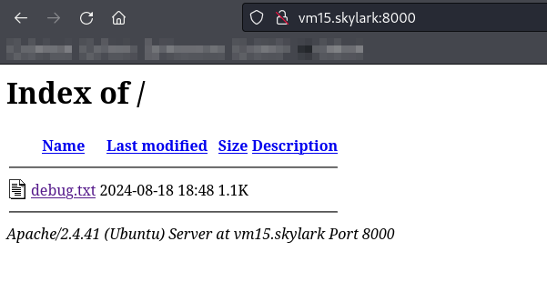
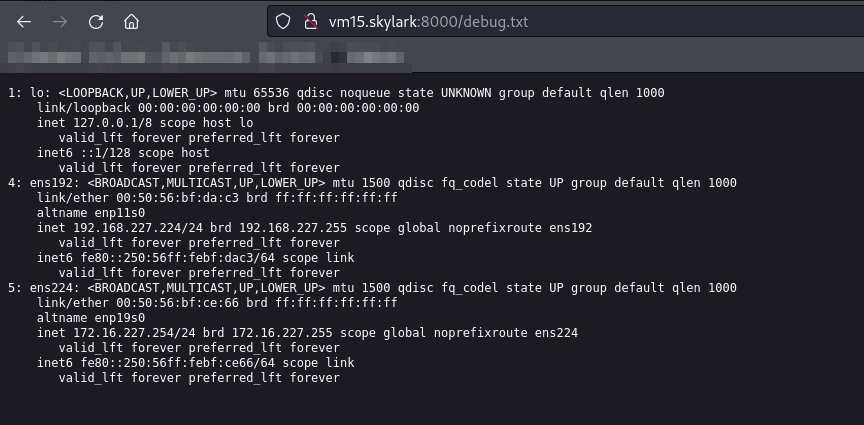
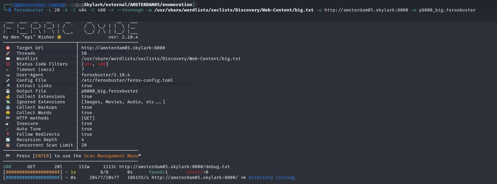
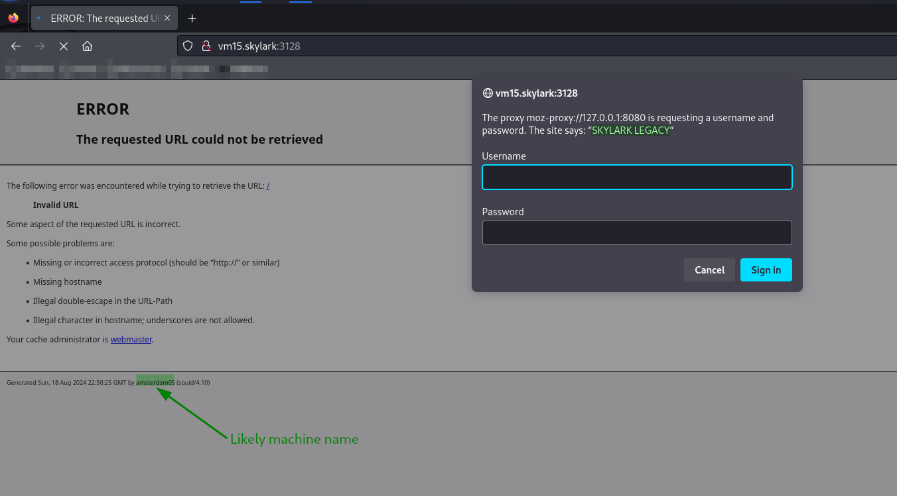
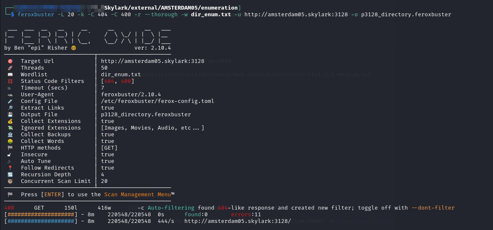
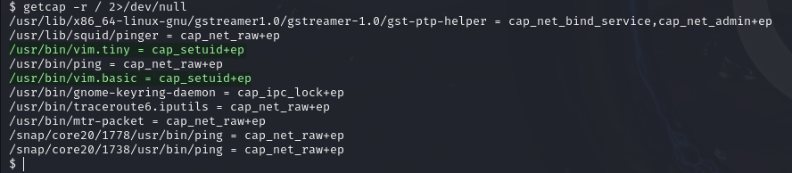
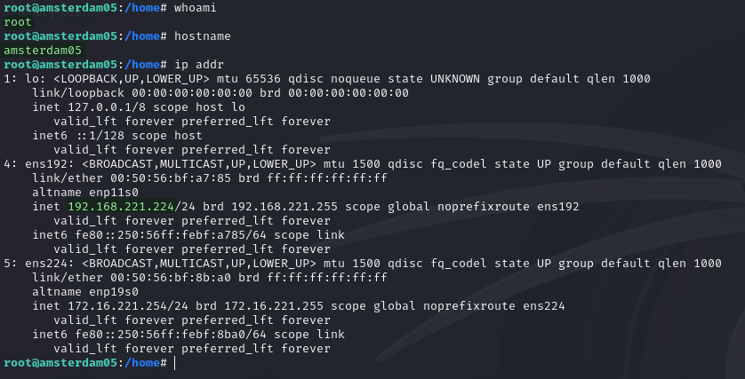
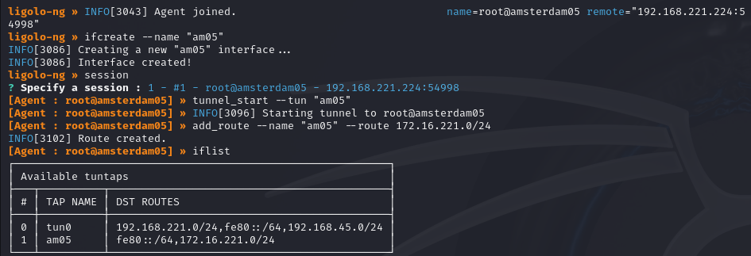

# AMSTERDAM05

## Enumeration

Host at `192.168.xxx.224`. Output from `nmap` scan report generated [here](./#network-enumeration):

```
Nmap scan report for 192.168.247.224
Host is up (0.052s latency).
Not shown: 65532 closed tcp ports (reset)
PORT     STATE SERVICE    VERSION
22/tcp   open  ssh        OpenSSH 8.2p1 Ubuntu 4ubuntu0.5 (Ubuntu Linux; protocol 2.0)
| ssh-hostkey: 
|   3072 3a:86:87:62:d1:b3:e3:74:97:fa:94:4b:31:a8:41:e5 (RSA)
|   256 64:b0:c3:72:98:ec:47:ca:77:01:5d:73:5d:12:4b:69 (ECDSA)
|_  256 de:0c:d1:ed:27:70:b6:9f:1f:99:31:e8:eb:cd:ff:b7 (ED25519)
3128/tcp open  http-proxy Squid http proxy 4.10
|_http-server-header: squid/4.10
|_http-title: ERROR: The requested URL could not be retrieved
8000/tcp open  http       Apache httpd 2.4.41
|_http-title: Index of /
| http-ls: Volume /
| SIZE  TIME              FILENAME
| 1.1K  2024-08-14 17:38  debug.txt
|_
|_http-server-header: Apache/2.4.41 (Ubuntu)
No exact OS matches for host (If you know what OS is running on it, see https://nmap.org/submit/ ).
TCP/IP fingerprint:
OS:SCAN(V=7.94SVN%E=4%D=8/14%OT=22%CT=1%CU=34290%PV=Y%DS=4%DC=T%G=Y%TM=66BD
OS:23CA%P=x86_64-pc-linux-gnu)SEQ(SP=107%GCD=1%ISR=10B%TI=Z%II=I%TS=A)OPS(O
OS:1=M551ST11NW7%O2=M551ST11NW7%O3=M551NNT11NW7%O4=M551ST11NW7%O5=M551ST11N
OS:W7%O6=M551ST11)WIN(W1=FE88%W2=FE88%W3=FE88%W4=FE88%W5=FE88%W6=FE88)ECN(R
OS:=Y%DF=Y%T=40%W=FAF0%O=M551NNSNW7%CC=Y%Q=)T1(R=Y%DF=Y%T=40%S=O%A=S+%F=AS%
OS:RD=0%Q=)T2(R=N)T3(R=N)T4(R=N)T5(R=Y%DF=Y%T=40%W=0%S=Z%A=S+%F=AR%O=%RD=0%
OS:Q=)T6(R=N)T7(R=N)U1(R=Y%DF=N%T=40%IPL=164%UN=0%RIPL=G%RID=G%RIPCK=G%RUCK
OS:=4EB1%RUD=G)IE(R=Y%DFI=N%T=40%CD=S)

Network Distance: 4 hops
Service Info: Host: 127.0.1.1; OS: Linux; CPE: cpe:/o:linux:linux_kernel
```

### Port 8000

There appears to be a web server here. When I navigate to it, it is a directory with only a single file `debug.txt`:

<figure><figcaption><p>Directory list at 8000</p></figcaption></figure>

The file seems to be the output of an `ip addr` command. Assuming that is correct and it is for this machine, it indicates that the machine has access to the internal `172.16.xxx.0/24` network:

<figure><figcaption><p>File on port 8000</p></figcaption></figure>

I run `feroxbuster` to be sure but it exits almost instantly because the port is a directory listing:

<figure><figcaption><p>Scan only took 8 seconds</p></figcaption></figure>

Unfortunately there is really nothing else at this port.&#x20;

### Port 3128

This appears to be a [Squid proxy](https://www.squid-cache.org/). When I am using BurpSuite and attempting to navigate to the site I am prompted for a sign in. The screen behind the prompt seems to indicate the machine's name of `AMSTERDAM05`:

<figure><figcaption><p>Authentication request</p></figcaption></figure>

* I am assuming the prompt was from Burp since it was at port 8080 and I noticed when burp was off I got no authentication prompt it just went straight to the page behind the prompt in the screenshot

First attempts at guessing a password are unsuccessful. Perhaps I can come back later with some credentials and move past the sign in.

I run `feroxbuster` here as well but everything comes back 400:

<figure><figcaption><p>Nothing from feroxbuster</p></figcaption></figure>

I cannot really see any path on this machine right now. I did look for some RCE for either the Apache version at 8000 and the Squid version running here but found nothing helpful.

## Foothold

Initial access is finally provided via SSH with the credentials `legacy:I_Miss_Windows3.1` which were found on the [`TERMINAL` machine](../subnet-172.16.xxx.0-24/terminal.md#bash-history-credentials):

<figure><figcaption><p>SSH access as legacy</p></figcaption></figure>

## Privilege Escalation

I ran PEAS and pspy to start. pspy did not turn up anything super helpful but while doing some manual enumeration as PEAS ran I found the exploit vector.

### Capabilities

While checking sudo, SUID/SGID, and capabilities I found there were some versions of `vim` that had `cap_setuid` set:

<figure><figcaption></figcaption></figure>

`vim` has an exploit vector for [capabilities on GTFOBins](https://gtfobins.github.io/gtfobins/vim/#capabilities) which I assume might be applicable to `vim.basic` or `vim.tiny`. The command was modified slightly to fit binary paths on the machine but when run it launched a `root` shell:


```bash
/usr/bin/vim.basic -c ':py3 import os; os.setuid(0); os.execl("/usr/bin/bash", "bash", "-c", "reset; exec bash")'
```


<figure><figcaption><p>root shell launched with vim</p></figcaption></figure>

## Post-Exploit

### Proxy Setup

At this point I tore down my `ligolo-ng` tunnel to `172.16.XXX.0/24` running an `agent` on [`PBX`](../subnet-172.16.xxx.0-24/pbx.md#proxy-setup) and set it up here instead. The logic is that this machine is serving as the router for `PBX` so the traffic was going through it anyway. I might as well remove a hop to decrease latency.

<figure><figcaption><p>Proxy setup on AMSTERDAM05</p></figcaption></figure>

Once this is set up I can move on to other enumeration.
