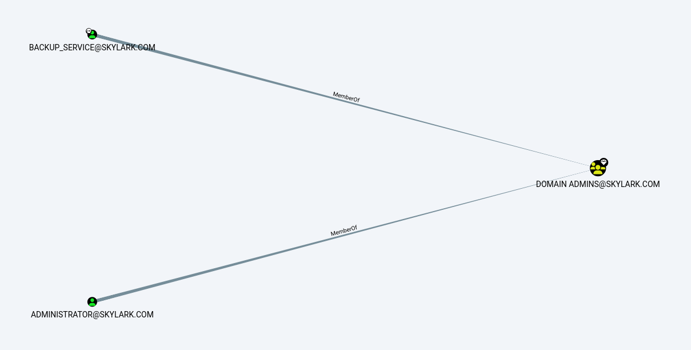
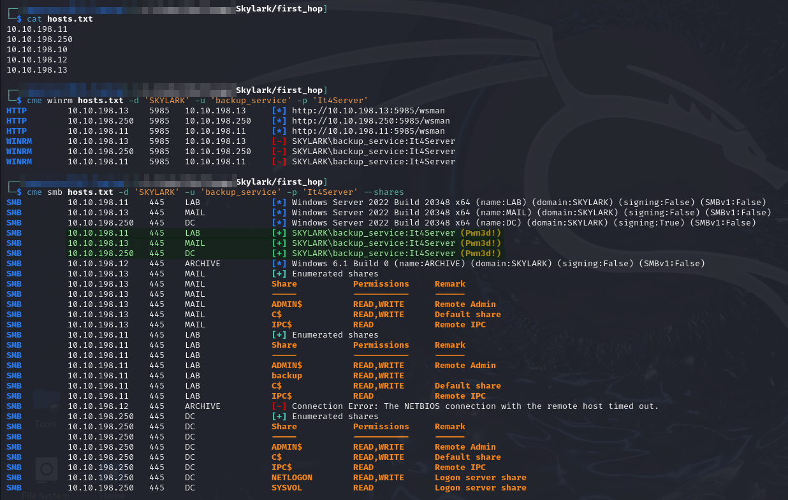

---
layout:
  title:
    visible: true
  description:
    visible: false
  tableOfContents:
    visible: true
  outline:
    visible: true
  pagination:
    visible: true
---

# Subnet 10.10.XXX.0/24

Holds writeups of the machines in `10.10.xxx.0/24` address range.

There are 5 machines listed in the network (names are just taken from machine launch screen in Challenge Labs):


```
10.10.XXX.11    vm0.skylark
10.10.XXX.250   vm1.skylark
10.10.XXX.10    vm2.skylark
10.10.XXX.12    vm3.skylark
10.10.XXX.13    vm4.skylark
```


* For easier scanning I also split by column into 2 files called `hosts.txt` and `hostnames.txt` containing the IP address and hostname columns respectively&#x20;

## Network Enumeration

### Nmap

I start with a standard Nmap scan which is run through a `ligolo-ng` proxy on [`AUSTIN02`](../external/austin02.md#internal-pivot).

```bash
sudo nmap -sT -Pn -A -p- -o ./first_hop_tcp_all.nmap -iL hostnames.txt
```

The output for each machine will be included in its specific page.

### Credential Spray

I learn the name of all but `.10` when spraying `SKYLARK\backup_service`'s credentials through the domain. Recall the credentials were obtained through Kerberoasting which was performed on [`AUSTIN02`](../external/austin02.md#kerberoasting). I wasted a bit of time working on the external machines before I noticed that `SKYLARK\backup_service` is a Domain Admin:

<figure><figcaption><p>BloodHound details of backup_service</p></figcaption></figure>


```bash
cme smb hosts.txt -d 'SKYLARK' -u 'backup_service' -p 'It4Server' --shares
```


<figure><figcaption><p>Results of spraying backup_service</p></figcaption></figure>

The output reveals that I have Administrator access to 3 machines via SMB (PsExec should work). The connection to `ARCHIVE` timed out but there will be another way in. I also learn the hostnames of all machines except for `10.10.XXX.12`. With this knowledge I can update my `machines.txt` file.


```
10.10.XXX.11    LAB.skylark.com
10.10.XXX.250   DC.skylark.com
10.10.XXX.10    vm2.skylark
10.10.XXX.12    ARCHIVE.skylark.com
10.10.XXX.13    MAIL.skylark.com
```


At this point I have a decent foothold so I start heading to individual machines.
