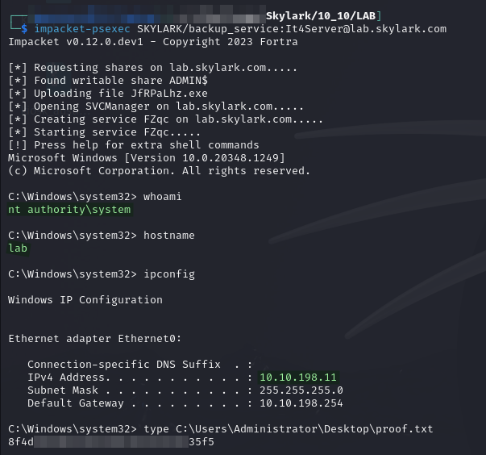
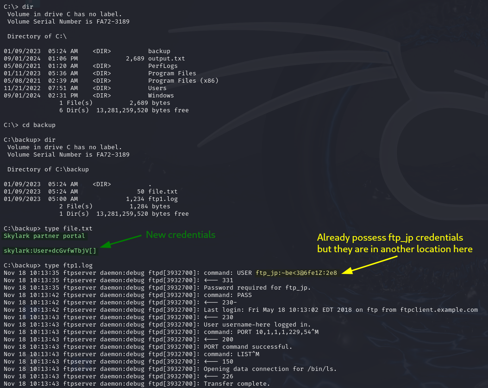
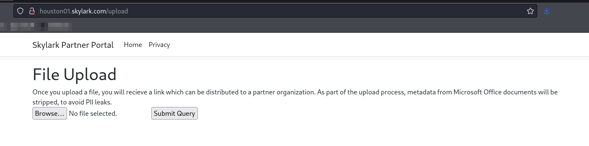

# LAB

## Enumeration

Machine is hosted at `10.10.XXX.11`. Output from Nmap scan run [here](./#nmap):

```
Nmap scan report for LAB.skylark.com (10.10.175.11)
Host is up (0.041s latency).
Not shown: 65522 filtered tcp ports (no-response)
PORT      STATE SERVICE       VERSION
135/tcp   open  msrpc         Microsoft Windows RPC
139/tcp   open  netbios-ssn   Microsoft Windows netbios-ssn
445/tcp   open  microsoft-ds?
5985/tcp  open  http          Microsoft HTTPAPI httpd 2.0 (SSDP/UPnP)
|_http-server-header: Microsoft-HTTPAPI/2.0
|_http-title: Not Found
47001/tcp open  http          Microsoft HTTPAPI httpd 2.0 (SSDP/UPnP)
|_http-server-header: Microsoft-HTTPAPI/2.0
|_http-title: Not Found
49664/tcp open  msrpc         Microsoft Windows RPC
49665/tcp open  msrpc         Microsoft Windows RPC
49666/tcp open  msrpc         Microsoft Windows RPC
49667/tcp open  msrpc         Microsoft Windows RPC
49668/tcp open  msrpc         Microsoft Windows RPC
49669/tcp open  msrpc         Microsoft Windows RPC
49670/tcp open  msrpc         Microsoft Windows RPC
49671/tcp open  msrpc         Microsoft Windows RPC
Warning: OSScan results may be unreliable because we could not find at least 1 open and 1 closed port
Device type: general purpose
Running (JUST GUESSING): IBM z/OS 1.11.X (85%)
OS CPE: cpe:/o:ibm:zos:1.11
Aggressive OS guesses: IBM z/OS 1.11 (85%)
No exact OS matches for host (test conditions non-ideal).
Service Info: OS: Windows; CPE: cpe:/o:microsoft:windows

Host script results:
|_nbstat: NetBIOS name: LAB, NetBIOS user: <unknown>, NetBIOS MAC: 00:50:56:bf:8f:18 (VMware)
| smb2-time: 
|   date: 2024-08-28T00:59:07
|_  start_date: N/A
| smb2-security-mode: 
|   3:1:1: 
|_    Message signing enabled but not required
```

## Foothold

Before machine enumeration is even started, initial access is [provided](./#credential-spray) as Administrator via the `SKYLARK\backup_service` account. I can use Impacket's PsExec to access the machine:


```bash
impacket-psexec SKYLARK/backup_service:It4Server@lab.skylark.com
```


<figure><figcaption><p>SYSTEM access to LAB</p></figcaption></figure>

`SYSTEM` access achieved.

## Post Exploit

### Manual Enumeration

#### Interesting Files

Ran all "important" file searches from my checklist but found nothing.

Started poking around the machine manually and found some credentials in a `C:\backup` directory:

<figure><figcaption><p>Credentials found in files in C:\backup</p></figcaption></figure>

The `ftp_jp` credentials I already had but not the set for the "Partner Portal." I recall that one of the external machines, `HOUSTON01`, had a "Partner Portal" on its web server at port 80. I head there and try the credentials which seem to work. The site looks much the same [as it did unauthenticated](../external/vm11.md#no-login) but I do now have access to an upload page:

<figure><figcaption></figcaption></figure>

I am note sure what this is worth since I already have `SYSTEM`-level access to that machine via the `SKYLARK\backup_service` account and `impacket-psexec`.&#x20;

Regardless of how useful or useless they may be, I add them to my `creds.txt` file:


```
---------------------------------------  DOMAIN CREDENTIALS  ---------------------------------------

SKYLARK\kiosk           XEwUS^9R2Gwt8O914   Found in RDWeb instructions on SINGAPORE06
SKYLARK\backup_service  It4Server           Kerberoasted as kiosk from AUSTIN02
SKYLARK\helpdesk_setup  Tuna6Helper         DCSync to obtain hash and then cracked with hashcat


---------------------------------------  OTHER CREDENTIALS  ----------------------------------------

Administrator   DowntownAbbey1923       SYDNEY08 Local Administrator
Administrator   MusingExtraCounty98     PARIS03 Local Administrator
ftp_jp          ~be<3@6fe1Z:2e8         Honestly not really sure what this is but I found it on PARIS03 in C:\TFTP_SRV\backup.cfg
skylark         User+dcGvfwTbjV[]       Found on LAB in C:\backup\file.txt - Works on web portal on HOUSTON01's port 80
```


### Mimikatz

I did run Mimikatz on this machine but found no hashes of any users I did not already possess.
