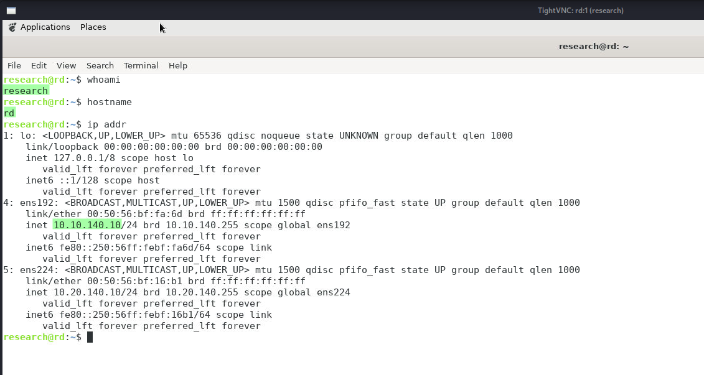
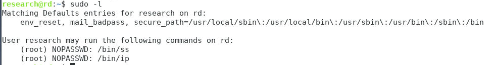
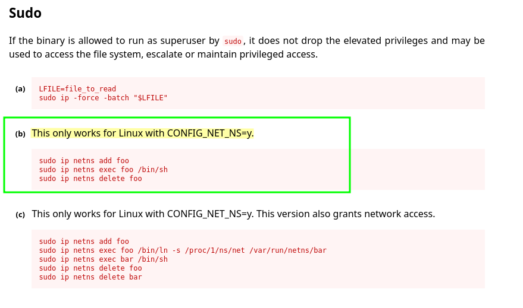
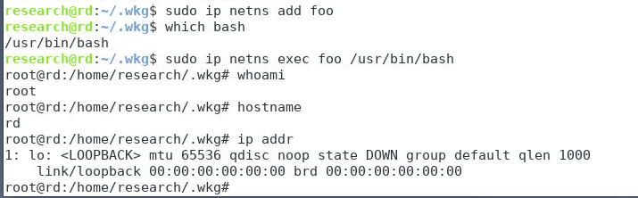
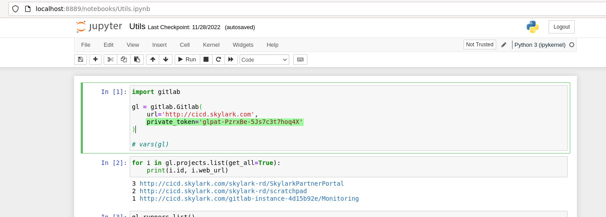
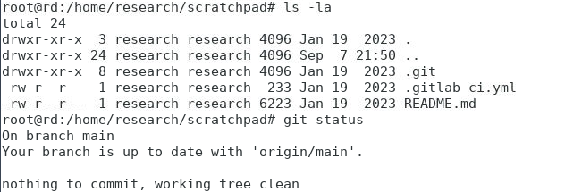
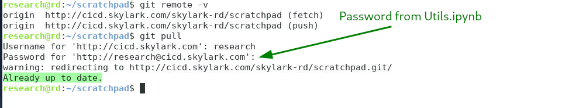
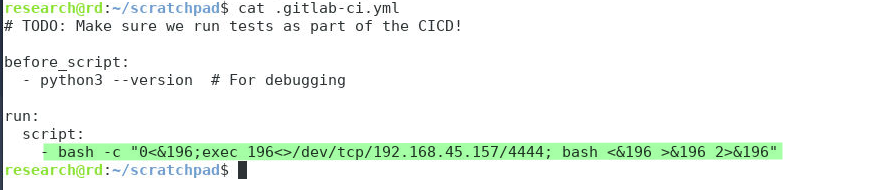
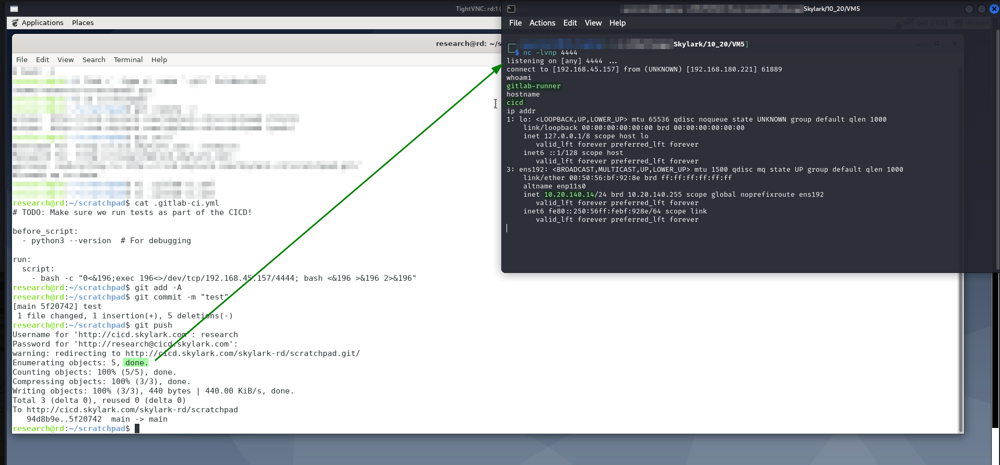

# RD

## Enumeration

Machine is hosted at `10.10.XXX.10`. Output from Nmap scan run [here](./#nmap):

```
Nmap scan report for vm2.skylark (10.10.175.10)
Host is up (0.060s latency).
Not shown: 65533 filtered tcp ports (no-response)
PORT     STATE SERVICE VERSION
22/tcp   open  ssh     OpenSSH 7.9p1 Debian 10+deb10u2 (protocol 2.0)
| ssh-hostkey: 
|   2048 2d:a1:4f:70:8a:b5:2e:c4:5c:3d:63:4f:e9:fc:00:48 (RSA)
|   256 91:e1:f7:c2:3f:81:2a:4f:0d:f4:73:ed:fa:3e:7d:4a (ECDSA)
|_  256 c8:b8:b6:de:87:aa:86:8d:75:a2:6b:ac:7a:95:a3:19 (ED25519)
5901/tcp open  vnc     VNC (protocol 3.8)
| vnc-info: 
|   Protocol version: 3.8
|   Security types: 
|     VeNCrypt (19)
|     VNC Authentication (2)
|   VeNCrypt auth subtypes: 
|     Unknown security type (2)
|_    VNC auth, Anonymous TLS (258)
Warning: OSScan results may be unreliable because we could not find at least 1 open and 1 closed port
Device type: general purpose
Running (JUST GUESSING): IBM z/OS 2.1.X (85%)
OS CPE: cpe:/o:ibm:zos:2.1
Aggressive OS guesses: IBM z/OS 2.1 (85%)
No exact OS matches for host (test conditions non-ideal).
Service Info: OS: Linux; CPE: cpe:/o:linux:linux_kernel
```

## Foothold

Initial access is provided with VNC and the password [found on `HOUSTON01`](../external/vm11.md#ultravnc-password-decryption) (`R3S3+rcH`):

```bash
vncviewer vm5.skylark.com:5901
```

<figure><figcaption><p>Terminal on machine via VNC</p></figcaption></figure>

I learn the machine's name, `RD`, at this point. User access achieved as `research`.

## Privilege Escalation

I start with PEAS but while it is running I do some basic manual enumeration.

### sudo Binaries

I list `sudo` binaries and find `ss` and `ip`:

<figure><figcaption><p>Password-less sudo binaries</p></figcaption></figure>

Both have exploit vectors on [GTFOBins](https://gtfobins.github.io/#+sudo). The one for `ss` only contains a local file read, but the one for [`ip`](https://gtfobins.github.io/gtfobins/ip/#sudo) contains a code execution vector (though it is dependent on a specific configuration):

<figure><figcaption><p>Code execution vector</p></figcaption></figure>

I decide to start with that and it works:

<figure><figcaption><p>Privilege escalation via ip command</p></figcaption></figure>

`root` access achieved.

## Post Exploit

### GitLab

#### Potential Credentials

While I am looking around the machine I stumble across a Jupyter notebook that has some sort of connection to GitLab:

<figure><figcaption><p>Mention of Gitlab and possible credentials</p></figcaption></figure>

I make a note of this as those could be credentials. This is particularly interesting because on VM5 I encountered a GitLab sign in portal on [port 80](../subnet-10.20.xxx.0-24/cicd.md#port-80).

### Git Directories

With this in mind I start looking for `.git` directories on the machine and find one in my research user's home directory:

```bash
find / -type d -name '.git' 2>/dev/null
```

<figure><figcaption><p>Searching for git directories</p></figcaption></figure>

I head there to see what it contains:

<figure><figcaption><p>Contents of git directory</p></figcaption></figure>

I also check the remote status of the repository. I also decide to attempt a pull to see if there is anything new. When doing this I am prompted for credentials. I can use the password I [found earlier](rd.md#potential-credentials). I guessed at the username but it was `research`:

<figure><figcaption><p>Remote status check and pull</p></figcaption></figure>

I learn that the repository is stored on a remote machine called `cicd.skylark.com`. I have not encountered this machine yet but I am hoping it is `10.20.XXX.14` (which I am still calling `VM5`).

I have also now validated the credentials I found. With this understood, I move to the contents of the repo.

#### Repository Contents

The directory contains a [`.gitlab-ci.yml` file](https://docs.gitlab.com/ee/ci/#step-1-create-a-gitlab-ciyml-file). According to GitLab, this is a part of the CI/CD pipeline and it specifies the stages, jobs, and scripts to be executed in the CI/CD pipeline. Since this is in a writable directory to me I decide to try to modify the file to launch a reverse shell from whatever machine `cicd.skylark.com` is.

### Reverse Shell

After a bit of research I learn how to modify the file. Under the `run:` section I include a `script:` with a call to create a `bash` reverse shell:

<figure><figcaption><p>Modifications to file</p></figcaption></figure>

This command will be executed automatically when a new commit is pushed to the repo. I use my credentials from above to do this and push my altered script (after starting a listener):

<figure><figcaption><p>Creating a reverse shell to CICD (formerly VM5)</p></figcaption></figure>

At this point [`CICD`](../subnet-10.20.xxx.0-24/cicd.md) was my last machine so I just head there and start wrapping up.
