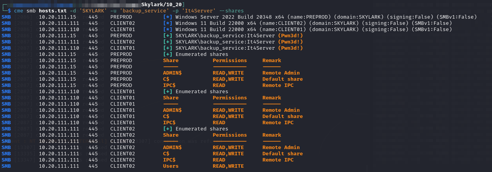

# Subnet 10.20.XXX.0/24

Holds writeups of the machines in `10.10.xxx.0/24` address range.

There are 4 machines listed in the network (names are just taken from machine launch screen in Challenge Labs):


```
10.20.XXX.14    vm5.skylark
10.20.XXX.15    vm6.skylark
10.20.XXX.110   vm7.skylark
10.20.XXX.111   vm8.skylark
```


* For easier scanning I also split this file by column into 2 files called `hosts.txt` and `hostnames.txt` containing the IP address and hostname columns respectively
* Machine names will be updated as new information is discovered

## Network Access

Access to this subnet is provided via a double-hop with `ligolo-ng` through agents on `AUSTIN02` and `MAIL`. The double-hop setup was described in the [Post-Exploit section](../subnet-10.10.xxx.0-24/mail.md#double-pivot-with-ligolo-ng) of the `MAIL` writeup.

## Network Enumeration

### Nmap

Once the proxy is set up I simply use a standard `nmap` command to enumerate the internal network:


```bash
sudo nmap -sT -Pn -p- -A -o ./10_20-tcp_connect-all.nmap -iL hostnames.txt
```


* Output from this command will be provided in each machine's writeup

### CrackMapExec

As I start my enumeration it seems some of these machines are also domain-connected. Given that DC was fully compromised this means I likely already have a way in here. I start with what worked before, spraying `SKYLARK\backup_service`'s credentials across the hosts:

```bash
cme smb hosts.txt -d 'SKYLARK' -u 'backup_service' -p 'It4Server' --shares
```

<figure><figcaption><p>Results of spraying backup_service's credentials</p></figcaption></figure>

Given that I have `READ/WRITE` on ADMIN$ for all 3 machines I can probably just use `impacket-psexec` for full `SYSTEM` access.
