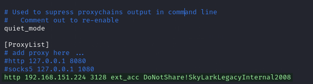

---
layout:
  title:
    visible: true
  description:
    visible: false
  tableOfContents:
    visible: true
  outline:
    visible: true
  pagination:
    visible: true
---

# Subnet 172.16.XXX.0/24

Section will hold writeups of machines in the `172.16.XXX.0/24` subnet. There are 3 machines in this subnet (names as provided on lab's launch page):


```
172.16.XXX.30   vm9.skylark.com
172.16.XXX.31   vm10.skylark.com
172.16.XXX.32   vm19.skylark.com
```


* For easier scanning I also split by column into 2 files called `hosts.txt` and `hostnames.txt` containing the IP address and hostname columns respectively&#x20;

The pivot seems to be through `AMSTERDAM05` based on a text file found on the web server.

While performing post-exploit enumeration on [`TOKYO07`](../external/tokyo07.md#vault-contents) I found credentials for the Squid proxy on [port 3128](../external/vm15.md#port-3128) of `AMSTERDAM05`. This allows me to perform basic enumeration of the `172.16.XXX.0/24` network (albeit slowly) with `proxychains` and `nmap`.

## Network Enumeration

Initial enumeration is done after the completion of `TOKYO07` via the Squid proxy on `AMSTERDAM05`.

### Squid Proxy

It is possible to [scan with `nmap`](https://book.hacktricks.xyz/network-services-pentesting/3128-pentesting-squid#nmap-proxified) over a Squid proxy but it is very slow.

#### Proxychains Configuration

In order to facilitate this the following line is added to the  file:

```
http 192.168.XXX.224 3128 ext_acc DoNotShare!SkyLarkLegacyInternal2008
```

<figure><figcaption><p>End of proxychains configuration file</p></figcaption></figure>

#### Nmap Scan

Once proxychains is configured I can just run nmap with the command:


```bash
sudo proxychains nmap -Pn -sT -A --top-ports 1000 -o squid_proxychains_top1000_all.nmap -iL hostnames.txt
```


* Normally I would do all ports but chose the top 1,000 because of how slow this is. Even limiting it to 1,000 ports this took 4.5 hours.

Results of the scan will be included in the machine writeups.
