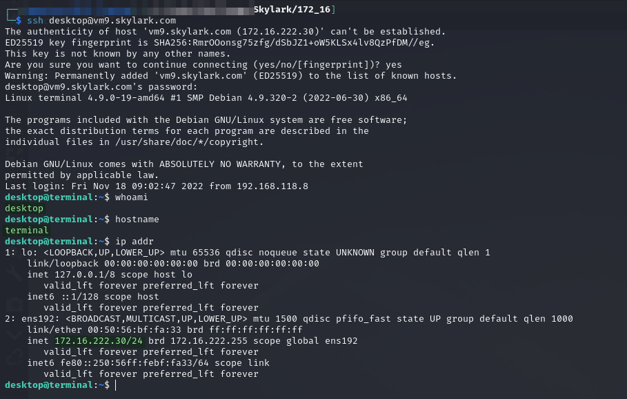
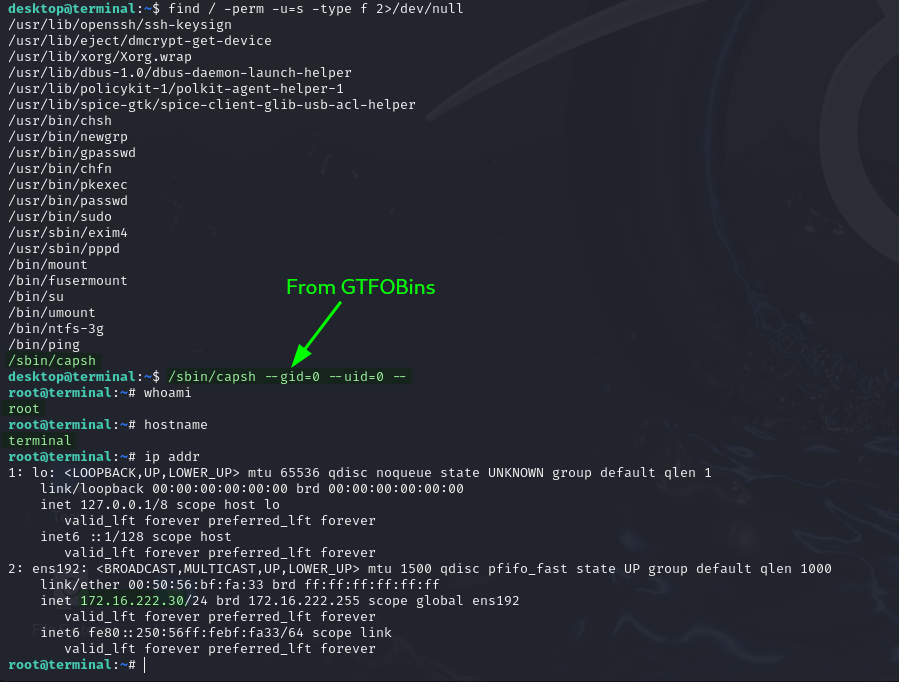
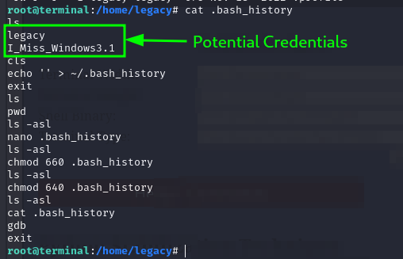
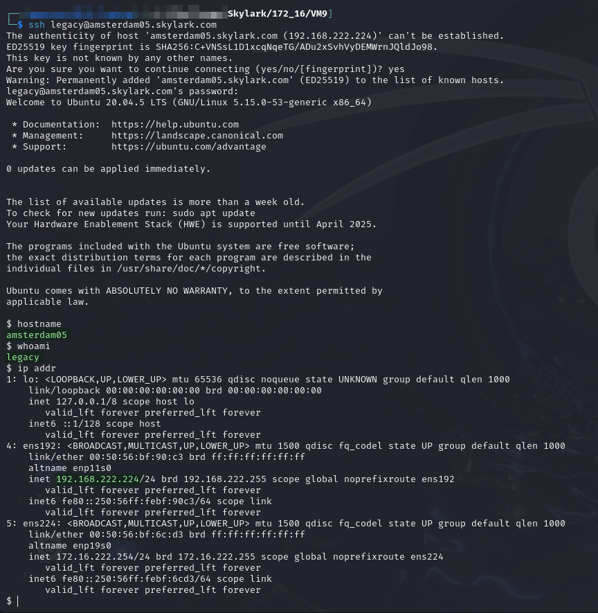

# TERMINAL

## Enumeration

Host at `172.16.XXX.30`. Output from nmap command run [here](./#nmap-scan):

```
Nmap scan report for vm9.skylark.com (172.16.151.30)
Host is up (0.11s latency).
Not shown: 998 closed tcp ports (conn-refused)
PORT     STATE SERVICE       VERSION
22/tcp   open  ssh           OpenSSH 7.4p1 Debian 10+deb9u7 (protocol 2.0)
| ssh-hostkey: 
|   2048 6a:a9:ed:5f:86:93:7f:3b:32:bc:4f:b4:c9:a7:69:08 (RSA)
|   256 90:f4:42:50:ad:84:51:a7:d3:63:ba:79:9a:70:f5:6e (ECDSA)
|_  256 ba:20:37:38:37:ea:09:60:5c:db:b4:a7:e5:5e:24:29 (ED25519)
3390/tcp open  ms-wbt-server xrdp
OS fingerprint not ideal because: Didn't receive UDP response. Please try again with -sSU
No OS matches for host
Service Info: OS: Linux; CPE: cpe:/o:linux:linux_kernel
```


## Foothold

Initial access is provided via SSH as the `desktop` user. The credentials for this account were found during post-exploit enumeration on the [`PBX` machine](pbx.md#tcpdump-credential-leak):

<figure><figcaption><p>SSH access as desktop</p></figcaption></figure>

## Privilege Escalation

I started with PEAS but while it was running I did some manual enumeration and found the exploit vector.

### Manual Enumeration

#### SUID Binaries

While listing SUID binaries I found `/sbin/capsh` which has a [GTFOBins exploit](https://gtfobins.github.io/gtfobins/capsh/#suid):

```bash
/sbin/capsh --gid=0 --uid=0 --
```

This elevates my privileges:

<figure><figcaption><p>Privilege escalation on TERMINAL</p></figcaption></figure>

## Post-Exploit

### Manual Enumeration

#### Bash History Credentials

While poking around the machine I find what look like some credentials in the `.bash_history` for the user `legacy`:

<figure><figcaption><p>Credentials in the bash history</p></figcaption></figure>

After trying these a few different places I eventually find they provide SSH access to `AMSTERDAM05`:

<figure><figcaption><p>SSH access to AMSTERDAM05</p></figcaption></figure>

More on that in the [`AMSTERDAM05` writeup](../external/vm15.md).
