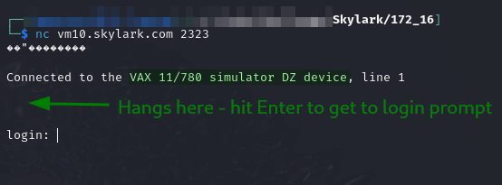
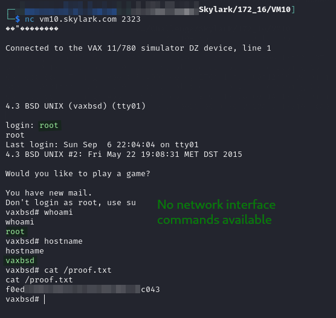

---
layout:
  title:
    visible: true
  description:
    visible: false
  tableOfContents:
    visible: true
  outline:
    visible: true
  pagination:
    visible: true
---

# VAXBSD

## Enumeration

Host at `172.16.XXX.31`. Output from `nmap` command run [here](./#nmap-scan):

```
Nmap scan report for vm10.skylark.com (172.16.151.31)
Host is up (0.11s latency).
Not shown: 996 closed tcp ports (conn-refused)
PORT     STATE SERVICE VERSION
22/tcp   open  ssh     OpenSSH 8.9p1 Ubuntu 3 (Ubuntu Linux; protocol 2.0)
| ssh-hostkey: 
|   256 63:9d:aa:c7:b7:f7:23:2f:ed:5d:d1:58:f8:ed:fc:82 (ECDSA)
|_  256 c2:a0:26:fc:98:80:cf:9d:57:64:4a:0a:04:f9:8d:3e (ED25519)
25/tcp   open  smtp    Sendmail 5.51/5.17
|_smtp-commands: SMTP: EHLO 500 Command unrecognized\x0D
79/tcp   open  finger  SGI IRIX or NeXTSTEP fingerd
|_finger: No one logged on\x0D
2323/tcp open  telnet
| fingerprint-strings: 
|   GenericLines: 
|     Connected to the VAX 11/780 simulator DZ device, line 0
|     PASSWORD:
|   GetRequest: 
|     Connected to the VAX 11/780 simulator DZ device, line 0
|     LOGIN INCORRECT
|     LOGIN:
|   Help: 
|     Connected to the VAX 11/780 simulator DZ device, line 0
|     HELP
|     LOGIN: 
|     LOGIN:
|   NCP, NULL: 
|     Connected to the VAX 11/780 simulator DZ device, line 0
|   RPCCheck: 
|     Connected to the VAX 11/780 simulator DZ device, line 0
|     (R\^
|   SIPOptions: 
|     Connected to the VAX 11/780 simulator DZ device, line 0
|     OPTIONS SIP:NM SIP/2.0
|     VIA: SIP/2.0/TCP NM;BRANCH=FOO
|     FROM: <SIP:NM@NM>;TAG=ROOT
|     <SIP:NM2@NM2>
|     CALL-ID: 50000
|     CSEQ: 42 OPTIONS
|     MAX-FORWARDS: 70
|     CONTENT-LENGTH: 0
|     CONTPASSWORD:
|     LOGIN INCORRECT
|     LOGIN: 
|     ACLOGIN: CEPT: APPLICATION/SDP
|     PASSWORD:
|     LOGIN INCORRECT
|     LOGIN:
|   tn3270: 
|     Connected to the VAX 11/780 simulator DZ device, line 0
|     UNIX (vaxbsd) (tty00)
|_    login: -E
1 service unrecognized despite returning data. If you know the service/version, please submit the following fingerprint at https://nmap.org/cgi-bin/submit.cgi?new-service :
SF-Port2323-TCP:V=7.94SVN%I=7%D=9/3%Time=66D792DD%P=x86_64-pc-linux-gnu%r(
SF:NULL,4C,"\xff\xfb\"\xff\xfb\x03\xff\xfb\x01\xff\xfb\0\xff\xfd\0\n\r\nCo
SF:nnected\x20to\x20the\x20VAX\x2011/780\x20simulator\x20DZ\x20device,\x20
...
SF:RECT\r\nLOGIN:\x20")%r(NCP,4C,"\xff\xfb\"\xff\xfb\x03\xff\xfb\x01\xff\x
SF:fb\0\xff\xfd\0\n\r\nConnected\x20to\x20the\x20VAX\x2011/780\x20simulato
SF:r\x20DZ\x20device,\x20line\x200\r\n\n");
OS fingerprint not ideal because: Didn't receive UDP response. Please try again with -sSU
No OS matches for host
Service Info: Host: vaxbsd; OSs: Linux, Unix; CPE: cpe:/o:linux:linux_kernel
```

I try spraying some of my credentials at SSH to see if anything sticks but nothing does.

### Port 2323

I cannot figure out what this is so I start with a simple Netcat connection to the port:

```bash
nc vm10.skylark.com
```

This brings up a login prompt of some kind:

<figure><figcaption></figcaption></figure>

I Google the text in the banner to figure out what I have here. It seems to be a simulator of a [VAX-11/780](https://gunkies.org/wiki/VAX-11/780) created by [SimH](http://simh.trailing-edge.com/) which is a project to simulate historical computers.

## Foothold

Port 2323 really seems to be the only path forward. I start trying to guess the login. Eventually I am trying to login with `root:root` or the like. As soon as I type the username I am logged in (no password requested):

<figure><figcaption><p>Root shell on machine</p></figcaption></figure>

I learn the hostname for the machine (`vaxbsd`) here. The simulator does not have an `ip addr` or equivalent but I am running as `root` so privilege escalation is not needed. I find it unlikely that any post-exploitation enumeration will be needed either. I am calling this machine complete.
