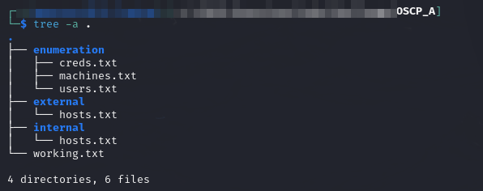

---
layout:
  title:
    visible: true
  description:
    visible: false
  tableOfContents:
    visible: true
  outline:
    visible: true
  pagination:
    visible: true
---

# Lab 4: OSCP A

This is a fairly straightforward lab. It contains 6 total machines with IP addresses:

```
10.10.XXX.140       DC01
10.10.XXX.142       MS02

192.168.XXX.141     MS01
192.168.XXX.143     AERO
192.168.XXX.144     CRYSTAL
192.168.XXX.145     HERMES
```

I set my project directory up like this and start work:

<figure><figcaption></figcaption></figure>
