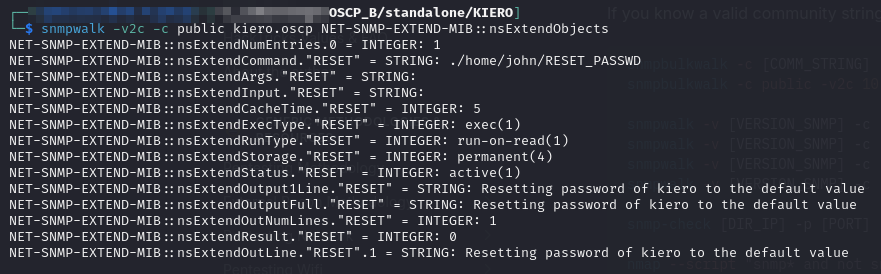
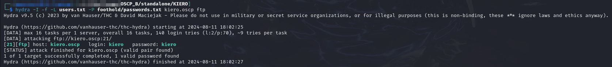
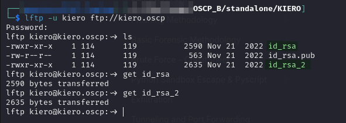
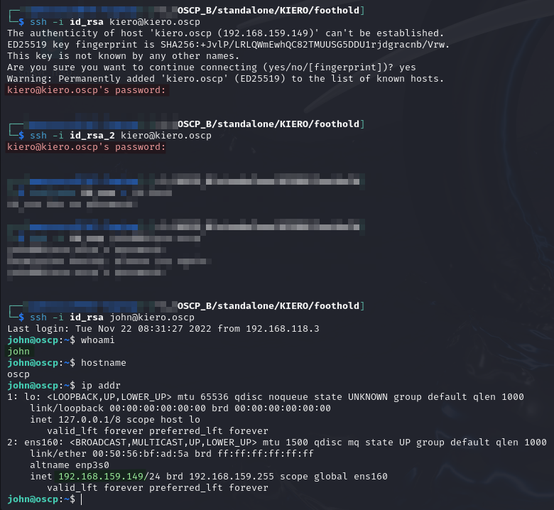
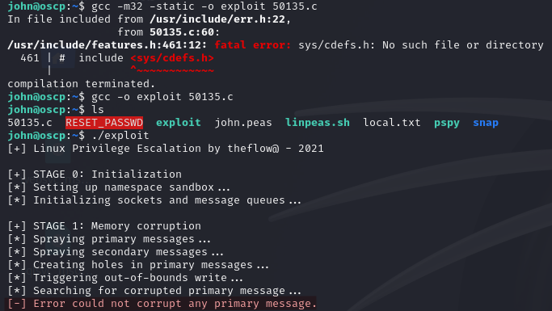
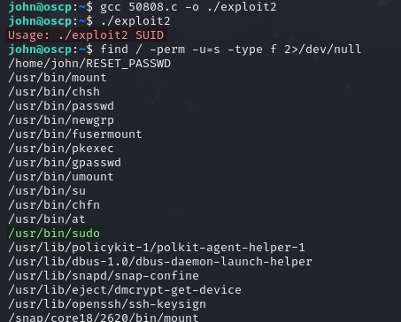
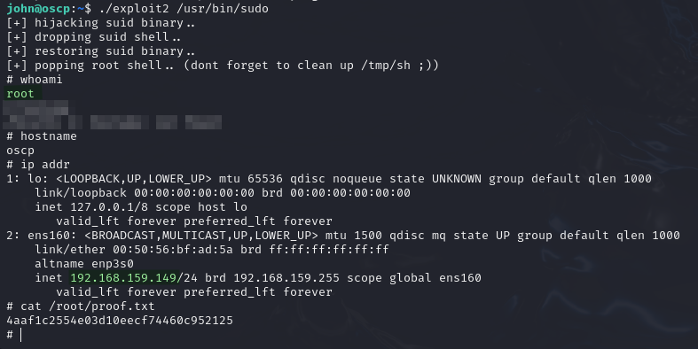

# KIERO

## Enumeration

```
Nmap scan report for kiero.oscp (192.168.235.149)
Host is up (0.052s latency).
Not shown: 65532 closed tcp ports (reset)
PORT   STATE SERVICE VERSION
21/tcp open  ftp     vsftpd 3.0.3
22/tcp open  ssh     OpenSSH 8.2p1 Ubuntu 4ubuntu0.5 (Ubuntu Linux; protocol 2.0)
| ssh-hostkey: 
|   3072 5c:5f:f1:bb:02:f9:14:7c:8e:38:32:2b:f4:bc:d0:8c (RSA)
|   256 18:e2:47:e1:c8:40:a1:d0:2c:a5:87:97:bd:01:12:27 (ECDSA)
|_  256 26:2d:98:d9:47:6d:22:5d:4a:14:7a:24:5c:98:a2:1d (ED25519)
80/tcp open  http    Apache httpd 2.4.41 ((Ubuntu))
|_http-title: Apache2 Ubuntu Default Page: It works
|_http-server-header: Apache/2.4.41 (Ubuntu)
No exact OS matches for host (If you know what OS is running on it, see https://nmap.org/submit/ ).
TCP/IP fingerprint:
OS:SCAN(V=7.94SVN%E=4%D=8/3%OT=21%CT=1%CU=43093%PV=Y%DS=4%DC=T%G=Y%TM=66AEC
OS:53A%P=x86_64-pc-linux-gnu)SEQ(SP=105%GCD=1%ISR=105%TI=Z%II=I%TS=A)OPS(O1
OS:=M551ST11NW7%O2=M551ST11NW7%O3=M551NNT11NW7%O4=M551ST11NW7%O5=M551ST11NW
OS:7%O6=M551ST11)WIN(W1=FE88%W2=FE88%W3=FE88%W4=FE88%W5=FE88%W6=FE88)ECN(R=
OS:Y%DF=Y%T=40%W=FAF0%O=M551NNSNW7%CC=Y%Q=)T1(R=Y%DF=Y%T=40%S=O%A=S+%F=AS%R
OS:D=0%Q=)T2(R=N)T3(R=N)T4(R=N)T5(R=Y%DF=Y%T=40%W=0%S=Z%A=S+%F=AR%O=%RD=0%Q
OS:=)T6(R=N)T7(R=N)U1(R=Y%DF=N%T=40%IPL=164%UN=0%RIPL=G%RID=G%RIPCK=G%RUCK=
OS:4D26%RUD=G)IE(R=Y%DFI=N%T=40%CD=S)

Network Distance: 4 hops
Service Info: OSs: Unix, Linux; CPE: cpe:/o:linux:linux_kernel

TRACEROUTE (using port 3306/tcp)
HOP RTT      ADDRESS
1   51.74 ms 192.168.45.1
2   51.70 ms 192.168.45.254
3   52.15 ms 192.168.251.1
4   52.30 ms kiero.oscp (192.168.235.149)
```

### Web Server (80)

The web server is just a default install of Apache. The version does not seem to have any known vulnerabilities.

### FTP

Not anonymously accessible.

### UDP Enumeration

At this point I was a bit stuck and ran a UDP Nmap scan. This revealed port 161 (SNMP was open).

### SNMP

I start with the basics:

```bash
snmpwalk -v2c -c public kiero.oscp
```

This returned a bunch of stuff but none of it seemed useful.

I then follow the techniques found [on HackTricks](https://book.hacktricks.xyz/network-services-pentesting/pentesting-snmp#enumerating-snmp):

```bash
snmpwalk -v2c -c public kiero.oscp NET-SNMP-EXTEND-MIB::nsExtendObjects
```

This reveals something potentially more helpful:

<figure><figcaption><p>SNMP</p></figcaption></figure>

The message indicates 2 potential usernames of `kiero` and `john` as well as mentioning that `kiero`'s password has been reset to the "default value." This seems like a promising path forward.

## Foothold

### Password Spray FTP

Considering what I just learned from SNMP, I decide to attempt to brute force the login for `kiero` or `john`. I add those 2 usernames to a `users.txt` file. I then take the passwords from Seclists default FTP passwords list and append the usernames kiero and john to cover the "default" being the same password and username. I then use `hydra`:

```bash
hydra -I -f -L users.txt -P foothold/passwords.txt kiero.oscp ftp
```

<figure><figcaption><p>Credentials discovered</p></figcaption></figure>

### FTP

I now use [`lftp`](https://lftp.yar.ru/) to access the share with the `kiero:kiero` credentials:

```
lftp -u kiero,kiero ftp://kiero.oscp
```

* Credentials can be provided with the `-u` flag in the form of `username,password` (`,password` is optional and the user will be prompted for one if not included)

When I list the files I find 2 files that could be SSH private keys. I grab both:

<figure><figcaption><p>Files grabbed with FTP</p></figcaption></figure>

### SSH

I assume the keys belong to `kiero` so I set their file permissions to `600` and attempt to sign in with them. Using either key I am prompted for `kiero`'s password meaning the key is not valid. I was about to try uploading my own key when I remembered there was also a `john` user. I decide to try the keys for him and the first one works:

```bash
ssh -i id_rsa john@kiero.oscp
```

<figure><figcaption><p>Using SSH keys</p></figcaption></figure>

User access achieved as `john`.

## Privilege Escalation

I started my enumeration with `linPEAS` and `pspy` but neither seemed to really turn anything up.

### Kernel Exploit

Ran `uname -a`:

<figure><figcaption><p>Linux distribution</p></figcaption></figure>

[Googled part of the result](https://www.google.com/search?client=firefox-b-1-e\&q=linux+5.9.0-050900-generic) and found a two Local Privilege Exploit PoCs.

#### 50135

I start with [EDB 50135](https://www.exploit-db.com/exploits/50135) which is supposed to be compiled on the victim and then run to gain an interactive `root` shell. I grab this exploit and copy it over to the machine:

```bash
scp -i id_rsa 50135.c john@kiero.oscp:~
```

Once it is there I follow the compilation instructions in the comment at the top. Unfortunately compilation fails. I try a simpler compilation which succeeds but the exploit does not work:

<figure><figcaption><p>Failed Exploit</p></figcaption></figure>

#### 50808

No problem, I have a backup in [EDB 50808](https://www.exploit-db.com/exploits/50808). This is also to be compiled on the victim. I do so successfully, compiling to an executable called `exploit2`:

```bash
gcc -o exploit2 50808.c
```

My first attempt at usage seems incorrect though. The error message makes me think it just needs to know the path to a SUID-enabled binary. I search the machine for some:

```bash
find / -perm -u=s -type f 2>/dev/null
```

<figure><figcaption><p>Exploit 2 first attempt</p></figcaption></figure>

I randomly choose `/usr/bin/sudo` and rerun the exploit. This time it works:

```bash
./exploit2 /usr/bin/sudo
```

<figure><figcaption><p>Root user access</p></figcaption></figure>

`root` access achieved.
