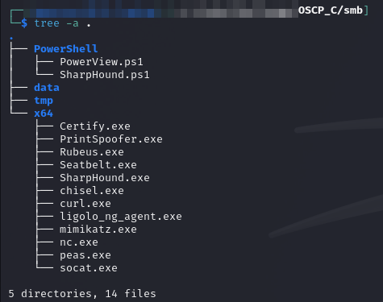

---
layout:
  title:
    visible: true
  description:
    visible: false
  tableOfContents:
    visible: true
  outline:
    visible: true
  pagination:
    visible: true
---

# Lab 6: OSCP C

Writeup for former exam OSCP C. The initial list of target machines is provided:

## Lab Setup

I set up a blank directory tree and get started with enumeration.

### SMB

For machines where it is usable I set up an SMB directory with the following structure:

<figure><figcaption><p>Structure of SMB directory tree</p></figcaption></figure>

I use it with Impacket's SMB server. Launching it from a shell session in that directory with the command:

```bash
impacket-smbserver -debug -smb2support tools $PWD
```
