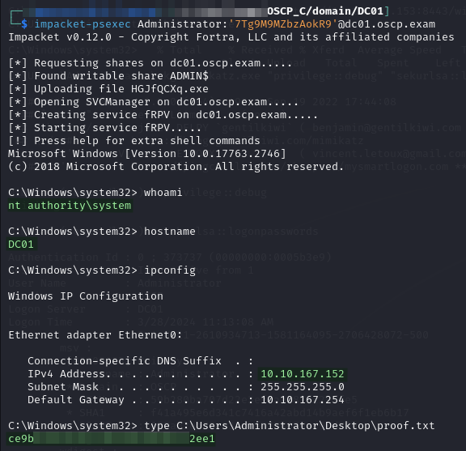

# DC01

## Enumeration

Output from Nmap TCP connect scan [run earlier](ms01.md#internal-network-enumeration):


```
Nmap scan report for dc01.oscp.exam (10.10.162.152)
Host is up (0.034s latency).
Not shown: 65517 filtered tcp ports (no-response)
PORT      STATE SERVICE       VERSION
53/tcp    open  domain        Simple DNS Plus
88/tcp    open  kerberos-sec  Microsoft Windows Kerberos (server time: 2024-09-10 02:49:23Z)
135/tcp   open  msrpc         Microsoft Windows RPC
139/tcp   open  netbios-ssn   Microsoft Windows netbios-ssn
389/tcp   open  ldap          Microsoft Windows Active Directory LDAP (Domain: oscp.exam0., Site: Default-First-Site-Name)
445/tcp   open  microsoft-ds?
464/tcp   open  kpasswd5?
593/tcp   open  ncacn_http    Microsoft Windows RPC over HTTP 1.0
636/tcp   open  tcpwrapped
3268/tcp  open  ldap          Microsoft Windows Active Directory LDAP (Domain: oscp.exam0., Site: Default-First-Site-Name)
3269/tcp  open  tcpwrapped
9389/tcp  open  mc-nmf        .NET Message Framing
49667/tcp open  msrpc         Microsoft Windows RPC
49675/tcp open  ncacn_http    Microsoft Windows RPC over HTTP 1.0
49676/tcp open  msrpc         Microsoft Windows RPC
49680/tcp open  msrpc         Microsoft Windows RPC
49708/tcp open  msrpc         Microsoft Windows RPC
63422/tcp open  msrpc         Microsoft Windows RPC
Warning: OSScan results may be unreliable because we could not find at least 1 open and 1 closed port
Device type: general purpose
Running (JUST GUESSING): IBM z/OS 1.11.X|2.1.X (85%)
OS CPE: cpe:/o:ibm:zos:1.11 cpe:/o:ibm:zos:2.1
Aggressive OS guesses: IBM z/OS 1.11 (85%), IBM z/OS 2.1 (85%)
No exact OS matches for host (test conditions non-ideal).
Service Info: Host: DC01; OS: Windows; CPE: cpe:/o:microsoft:windows

Host script results:
| smb2-time: 
|   date: 2024-09-10T02:52:02
|_  start_date: N/A
| smb2-security-mode: 
|   3:1:1: 
|_    Message signing enabled and required
|_nbstat: NetBIOS name: DC01, NetBIOS user: <unknown>, NetBIOS MAC: 00:50:56:bf:55:87 (VMware)
```


I do not do any direct enumeration on this machine other than the Nmap scan. I do use some of the services (LDAP and Kerberos mostly) in exploits on other machines.

## Foothold

Initial access is provided with the `OSCP\Administrator` account credentials [found on `MS02`](ms02.md#mimikatz):


```bash
impacket-psexec Administrator:'7Tg9M9MZbzAokR9'@dc01.oscp.exam
```


<figure><figcaption></figcaption></figure>

Privilege escalation and post-exploit are not necessary since the domain portion of the lab is now complete.
